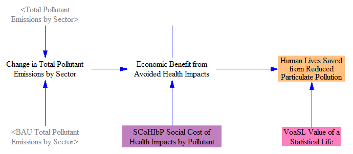
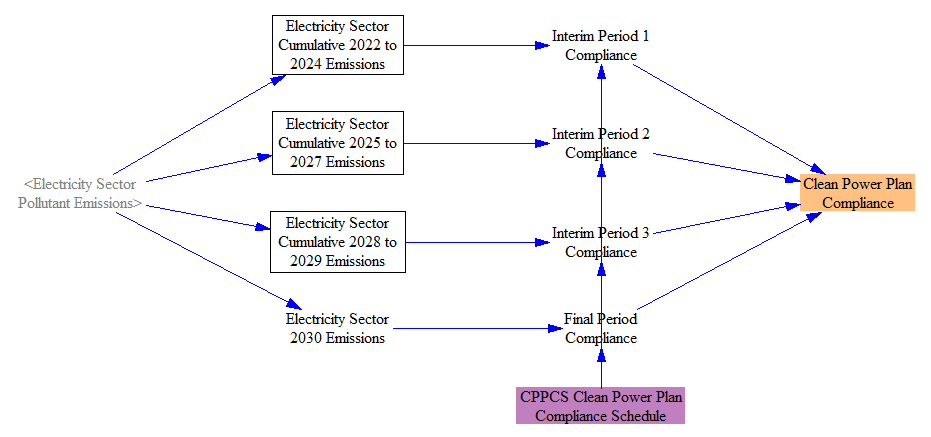

In addition to the totaled quantities available on the [Cumulators sheet](cumulators.html) and the [Cost Outputs sheet](cost-outputs.html), the Energy Policy Simulator (EPS) calculates numerous other outputs that are useful for understanding the full range of impacts of the modeled policy package.  A variety of these outputs are available on this sheet.

## Social Benefits

The model estimates monetized social benefits of two types: avoided climate damages and avoided mortality (early deaths) due to particulate air pollution.  On the climate side, we take the difference in CO2e emissions between the BAU and policy cases, and we multiply it by the Social Cost of Carbon, the U.S. government's projections of the value to society in avoiding a given quantity of CO2e emissions.  The structure is shown below:

To estimate benefits from reduced mortality, we begin by finding the difference between emissions (disaggregated by pollutant) between the policy and BAU cases.  We then multiply by a "Social Cost of Health Impacts by Pollutant," which is from input data.  The input data combine population-weighted exposure levels, an epidemiological concentration-response function, and a value of a statistical life (VSL) figure to determine the mortality-related cost of the different types of pollutants that contribute to particulate concentrations in the atmosphere.  We also use a VSL figure to display the particulate mortality benefits in the form of lives saved.  (This lives saved figure includes only avoided mortality from reduced parituclate pollution, not avoided mortality from reduced climate damages.)  The relevant structure appears in the following screenshot:

Finally, we sum the two types of social benefit, when represented in economic terms (rather than lives saved).  We also calculate the social benefit per unit emissions abatement caused by the policy package.  The structure is shown below:

## Energy-Related Emissions

Some users might want to know the amount of emissions from the production of energy (in any form, such as heat, electricity, light, or force).  All emissions in the Energy Policy Simulator (EPS) are "energy-related" except industrial sector process emissions and anthropogenic LULUCF emissions.  We include the effects of carbon sequestration, so sequestered CO2 is removed from the total emissions reported here.

We calculate energy-related emissions for both the BAU and policy cases.  From "Total Pollutant Emissions," we subtract anthropogenic LULUCF emissions and Industry sector process emissions.  We then convert this to CO2e using the user-specified GWP factor.  A screenshot of the structure for the policy case is shown below:

## Miscellaneous Additional Outputs

This section contains a variety of outputs that may be of use for scenario analysis.  These outputs need little calculation structure (or in some cases, they are simply shadow variables from elsewhere), so they do not merit their own sections on the "Additional Outputs" sheet.

Electricity capacity divided up by type (coal, wind, etc.) but not by plant quality level is provided here.  Similarly, we provide electricity generation (i.e. output) by type but grouped across quality levels:

We total up the amount of primary energy from non-fossil sources, and we also express this as a percentage of total primary energy:

We also report the fuel use for each fuel-using sector (transportation, electricity, buildings, industry, and district heat) by fuel:

There is also a "Zero Line for Graphs" variable in this section.  Its value is always zero.  It exists so that a line along the X-axis can be drawn on certain graphs in Vensim, which improves their appearance.  It has nothing to do with graphs that appear in the web application interface.

## Testing for Clean Power Plan Compliance

In the United States, the EPA released a "Clean Power Plan" that specifies particular emissions targets that must be met by the electricity sector.  The plan was released after the release of our BAU input data, and so compliance with the plan is not part of the BAU case.  This structure provides a simple, quick way to test whether a user-generated scenario (in the policy case) meets the Clean Power Plan emissions targets.

The plan has four periods during which targets are specified: cumulative emissions from 2022-2024, from 2025-2027, from 2028-2029, and 2030.  We sum up the electricity sector emissions from each of these periods and compare them with the targets, which are specified in the "Clean Power Plan Compliance Schedule" input variable, to determine whether the targets were met.  If all four targets are met, the "Clean Power Plan Compliance" variable has a value of 1 in 2030; otherwise, it has a value of zero in 2030.  The relevant structure is shown below:

