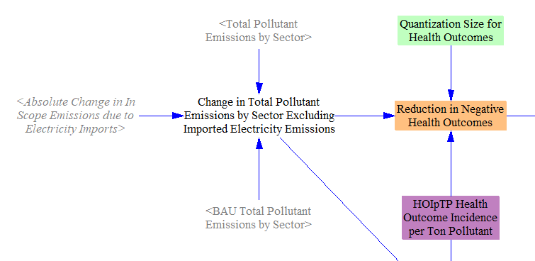
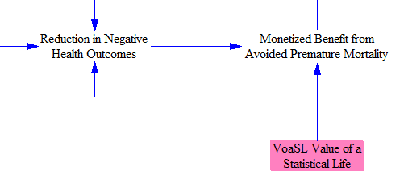
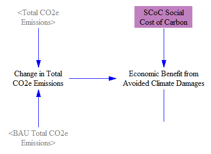
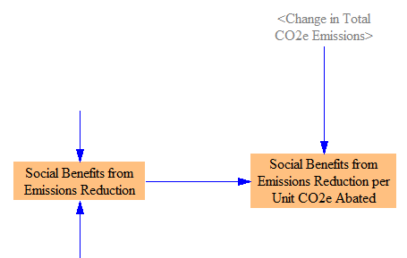
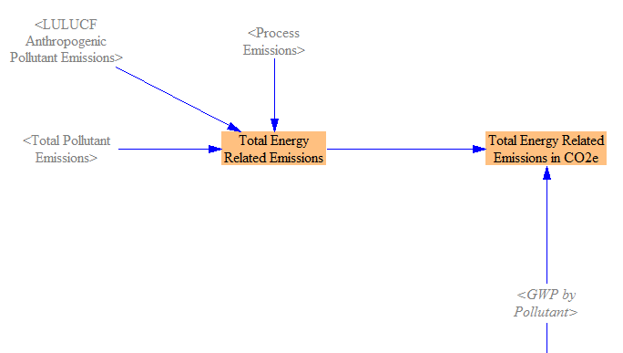
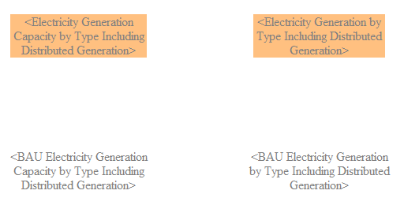
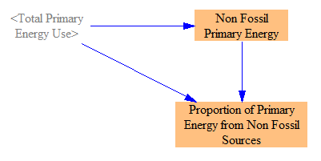
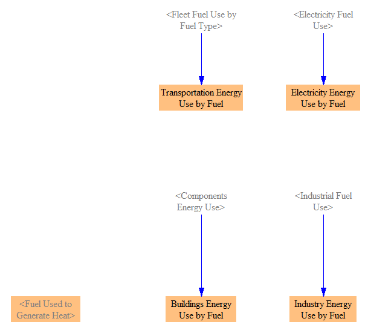
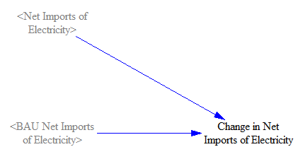

In addition to the totaled quantities available on the [Cross-Sector Totals sheet](cross-sector-totals.html) and the [Cost Outputs sheet](cost-outputs.html), the Energy Policy Simulator (EPS) calculates numerous other outputs that are useful for understanding the full range of impacts of the modeled policy package.  A variety of these outputs are available on this sheet.

## Public Health

The EPS calculates emissions reductions of 12 different pollutants, several of which have direct, negative impacts on human health, such as nitrogen oxides (NOX), sulfur oxides (SOX), and directly-emitted particulate matter (PM).  Most of the same policies that reduce greenhouse gas emissions also reduce emissions of these other pollutants ([carbon capture and sequestration](ccs.html) being the most important exception), so most policy packages that aim to mitigate climate change also have direct human health benefits.

Typically, to calculate the change in health outcomes due to a change in emissions, two intervening calculation steps are necessary:

1. Changes in pollutant emissions are entered into a gridded air quality model, such as [GEOS-Chem](http://acmg.seas.harvard.edu/geos/) or [CMAQ](https://www.epa.gov/cmaq), to determine the change in ground-level concentration of various pollutants throughout the modeled year.

2. Changes in ground-level concentration are fed into epidemiological concentration-response functions (CRFs), which relate the change in concentration to the change in a rate of a negative health outcome, such as premature mortality.  Multiplying by the business-as-usual rate of that negative health outcome gives the change caused by the policy package.

Though CRFs can be computed quickly, gridded air quality models are slow to run, so they cannot be directly integrated into a computer model that provides real-time interactivity and feedback, such as the EPS.  Fortunately, some organizations that use gridded air quality models, such as the U.S. Environmental Protection Agency, have computed and [published "reduced-form tools"](https://www.epa.gov/benmap/reduced-form-tools-calculating-pm25-benefits) that enable one to calculate the public health benefits of emissions reductions without running a gridded air quality model oneself.  These tools can produce results that are ["reasonably comparable to those derived from full-form models"](https://www.epa.gov/sites/production/files/2019-11/documents/rft_combined_report_10.31.19_final.pdf) and are the best available option for computing public health benefits in the EPS.

The EPS calculates the change in the following public health outcomes caused by the policy package:

- Premature mortality (i.e. deaths)
- Respiratory emergency room visits
- Acute bronchitis
- Lower respiratory symptoms
- Upper respiratory symptoms
- Minor restricted activity days
- Lost workdays
- Asthma exacerbation (asthma attacks)
- Cardiovascular hospital admissions
- Respiratory hospital admissions
- Nonfatal heart attacks

In the web interface, these are grouped into eight categories, while the full breakout of eleven categories is shown in Vensim.

Particulates are the primary cause of these negative health outcomes, including primary particulates (those directly emitted by combustion) and secondary particulates (those formed in the atmosphere by chemical reactions involving gaseous pollutants).  The health outomes simulated in the EPS are only due to particulates, not other pollutants (such as ozone), so the public health impacts estimates produced the EPS may be conservative.

### Model Structure

The total emissions of each pollutant in the BAU and policy cases are obtained from the [Cross-Sector Totals](cross-sector-totals.html) sheet, and we take the difference to find the change in pollutant emissions caused by the policy package.  We then multiply the change in emissions of each pollutant by a set of `Health Outcome Incidence per Ton Pollutant` multipliers, from the reduded-form tools discussed above.  Outcomes are quantized (rounded down) to the nearest whole number, such as 1 death or 1 lost workday.

In some cases, it is useful to be able to see public health benefits in currency units - e.g. for comparison with other costs or savings.  The EPS monetizes avoided premature mortality using a Value of a Statistical Life (VSL) figure, taken in as input data.  Only premature mortality, not other health outcomes, are monetized.  (Premature mortality often represents on the order of 97% of monetized benefits, due to the high value assigned to incidents of premature mortality and far smaller value assigned to other health impacts.)

## Avoided Climate Damages

The model also estimates monetized social benefits from avoided climate damages.  We take the difference in CO2e emissions between the BAU and policy cases, and we multiply it by the `Social Cost of Carbon`, a projection of the value to society in avoiding a given quantity of CO2e emissions.  The structure is shown below:

## Total Monetized Social Benefit

Finally, we sum the changes in monetized public health impacts (from particulates) and monetized climate damages to obtain a total social benefits from emissions reduction, when represented in economic terms (rather than negative outcomes avoided).  We also calculate the social benefit per unit emissions abatement caused by the policy package.  The structure is shown below:

## Energy-Related Emissions

Some users might want to know the amount of emissions from the production of energy (in any form, such as heat, electricity, light, or force).  All emissions in the Energy Policy Simulator (EPS) are "energy-related" except industrial sector process emissions and anthropogenic LULUCF emissions.  We include the effects of carbon sequestration, so sequestered CO2 is removed from the total emissions reported here.

We calculate energy-related emissions for both the BAU and policy cases.  From "Total Pollutant Emissions," we subtract anthropogenic LULUCF emissions and Industry sector process emissions.  We then convert this to CO2e using the user-specified GWP factor.  A screenshot of the structure for the policy case is shown below:

## Miscellaneous Additional Outputs

This section contains a variety of outputs that may be of use for scenario analysis.  These outputs need little calculation structure (or in some cases, they are simply shadow variables from elsewhere), so they do not merit their own sections on the "Additional Outputs" sheet.

Electricity capacity divided up by type (coal, wind, etc.) but not by plant quality level is provided here.  Similarly, we provide electricity generation (i.e. output) by type but grouped across quality levels:

We total up the amount of primary energy from non-fossil sources, and we also express this as a percentage of total primary energy:

We also report the fuel use for each fuel-using sector (transportation, electricity, buildings, industry, and district heat) by fuel:

We also calculate the change in net electricity imports, which is used in one output graph.

