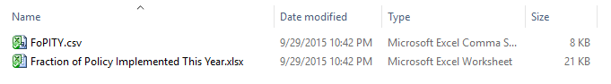
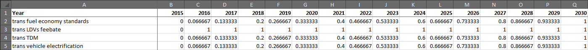
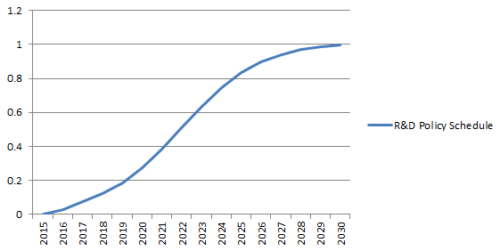

The model allows the user to define a "schedule" according to which a policy will be implemented.  This feature allows users to phase in policies in any years they prefer, and according to any shape curve (linear, sigmoidal, etc.).  Additionally, it allows users to model policies that expire- for instance, by enabling a policy for a number of years, then disabling it at a later year during the model run.  Like the model's input data, policy implementation schedules can be edited using a spreadsheet program such as Microsoft Excel or Open Office; a version of Vensim capable of editing models is not needed.

## The Implementation Schedule File

Inside the Energy Policy Simulator (EPS)'s folder, there is an "Input Data" folder (described on the [Included Input Data](input-data.html) help page).  Inside the InputData folder is the "plcy-schd" folder, which refers to the "Policy Implementation Schedule" sheet of the EPS.  On this sheet, there is only one input variable: "FoPITY Fraction of Policy Implemented This Year."  There is a corresponding "FoPITY" folder inside the "plcy-schd" folder.  This is where the policy schedule Excel spreadsheet and .csv file are located.  The contents of the FoPITY folder are shown in the following screenshot:

The "Fraction of Policy Implemented This Year.xlsx" file has two tabs: About and FoPITY.  The "About" tab provides some guidance on how to use the file to specify policy implementation schedules.  The "FoPITY" tab specifies the schedule for each policy.

## Default Schedules for Linear and for Immediate Policies

Here is a screenshot of the top several lines of the FoPITY tab, which specify the default implementation schedules for the four Transportation sector policies:

Each policy has values that range from zero to one.  A value of zero means that the policy is not enabled in that year.  A value of one means that the policy is implemented at the strength set by the user via the policy levers in the model.  In the default schedule, all four transportation sector policies are off in 2015.  Three of the policies begin phasing in linearly in 2016 and reach full strength in 2030.  For example, starting in 2016, newly sold cars must meet fuel economy standards that are slightly more aggressive in each year relative to the year before (on top of BAU fuel economy standards).  This continues until 2030, when these "additional" fuel economy standards reach the values specified by the model user.  In contrast, the feebate for LDVs is implemented at full strength in every year from 2016-2030.  This means that the government begins applying a tax to inefficient vehicles and a rebate to buyers of efficient vehicles in 2016, with the value of that tax and rebate already equal to the user's policy setting.  The government continues to apply this tax and rebate throughout the rest of the model run.  (This does not imply the same vehicles incur taxes or rebates in every year; the "pivot point" that determines which vehicles incur taxes or rebates is not constant.  However, the magnitude of the feebate, in dollars per (gallon per mile) above or below the pivot point, is constant from 2016-2030.)

## Default Schedules for R&D Policies

Instead of linear implementation, by default, the R&D policies are implemented along a segment of a sigmoidal (S-shaped) curve.  A graph near the bottom of the "FoPITY" tab shows the shape of this curve, as shown in this screenshot:

The default R&D policy schedule reflects the idea that additional investment in R&D achieves progress slowly at first, as staff and laboratories gear up, acquiring skills and knowledge.  Progress is faster in middle years, then slows down again as the easier technical questions are answered, leaving the more challenging technical problems to be solved.  The future progress of technological research cannot be known in advance, and the curve specified here is meant to be a reasonable example.  When specifying your own curve, it is not necessary that the entire S-shape be visible within the model run period of 2015-2030.  Since we are concerned with an *additional* R&D commitment, generally the curve should start relatively flat (as even a technology that is well along its own S-curve will nonetheless respond gradually to a change in its level of R&D investment).  However, there is less reason to believe that the inflection point for additional R&D commitment will necessarily be reached during the model run period: a curve that starts relatively flat and grows at an increasing rate through 2030 could be plausible for some technologies.

## Exporting a Changed Policy Implementation Schedule

It is generally best to make a copy of the "Fraction of Policy Implemented This Year" spreadsheet before changing the policy implementation schedule.  After you have adjusted the schedule, you must export the "FoPITY" tab of the spreadsheet in comma-separated values format (.csv) to a file named "FoPITY.csv" in the same folder.  This should replace the "FoPITY.csv" file included with the model distribution.

## Notes

In the default policy implementation schedule, policies are never weaker in a later year than they were in an earlier year: either they remain at full strength (a value of "1") throughout, or they linearly approach full strength in 2030.  However, there is nothing to stop a user from specifying a policy implementation schedule that reaches "1" and then declines.  For example, one could explore a scenario where a subsidy for electricity generated by solar PV starts high and declines over time, as the technology matures and less policy support is needed.  One could also explore a scenario where a policy becomes strong, then expires, abruptly returning to a value of zero.

When you specify a policy implementation schedule, you should ensure that it reaches a value of "1" in at least one year.  This is because "1" means the user's policy setting is fully implemented.  If you want the policy to be weaker, you should simply set a less-strong setting for the policy itself, rather than using an implementation schedule that never fully implements the policy.  To create a schedule that does not include a "1" value in any year can cause confusion, as a user wonders why the setting that he/she specified in the model using the policy levers is not reached in any year of the model run.

Similarly, you should never specify a value greater than "1" in the policy implementation schedule, because this violates the assumption that "1" means full implementation of the user's setting.  If you want the policy to be stronger, you should increase the strength of the policy setting, not implement more than 100% of the policy.

Lastly, you should never specify a negative number in the implementation schedule, because this will cause the policy to have the opposite of its intended effect and/or will cause the model to function improperly.