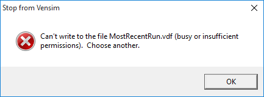

The Energy Policy Simulator (EPS) is distributed with three scripts written in the Python programming language.  The purpose of these scripts is to allow the model user to perform certain types of analysis or generate certain types of output that would be laborious to do manually.

## Scripts

Four scripts are included in the EPS model distribution:

* CreateContributionTestScript.py - This script helps you determine the contributions of individual policies or user-specified groups of policies to a policy package.  It is useful for generating wedge diagrams and policy cost curves.
* CreateDataLoggingScript.py - This script simply runs a series of scenarios, each specified by its own .cin file, and outputs the results.  It is useful if you have created a number of custom policy scenarios and wish to compare their performance with respect to particular output variables.
* CreatePermutationsScript.py - This script is used to test every possible permutation of a set of user-selected policy settings for a user-selected set of policies.  It is useful if you have a goal in mind, such as a carbon cap, and you wish to search for a policy package that achieves your goal while maximizing or minimizing some other variable, such as meeting the carbon cap at lowest cost.
* CreateCarbonCapToTaxScript.py - This script allows you to simulate a carbon or GHG cap-and-trade policy, either alone or in conjunction with complementary policies.

Also included in the EPS model is the file "OutputVarsToExport.lst".  This is a text file that includes the names of variables that the user wants the scripts to include in the results file (one variable name per line).  All three of the scripts rely on the OutputVarsToExport.lst file to know which variables to save.

## Required Software

Using the Python scripts requires software beyond that which is needed to simply run the EPS or edit its input data.  You must have a copy of Vensim DSS (the only tier of Vensim that supports scripting) and Python 3 installed on your system.  Although not required, a text editor designed for programmers and capable of color-coding Python syntax, such as Notepad++, is very helpful.

### Vensim DSS

Most features of the EPS can be used if you run the model in the free Vensim Model Reader (as discussed on the [Download and Installation Instructions](download.html) page.  However, you will need a copy of Vensim DSS to make use of the Python scripts included with the EPS.  Information on how to purchase Vensim DSS is available for Windows and Mac on [the official Vensim website](http://vensim.com/purchase/).  As of Oct 2, 2015, a commercial license costs $1995, a public research license costs $995, and an academic license costs $795.

If you already own Vensim DSS, please be sure that it is version 7.1 (released in July 2017) or later.  This is because the model relies on bug fixes that were implemented in Vensim v7.1.  If you own Vensim Pro or DSS with a current maintenance subscription, you can download an updated version from the [Vensim download center](https://www.vensim.com/php-bin/download.html).  If your maintenance subscription is not current, you may log in using your old license key and renew your subscription for a fraction of the price of buying a new Vensim DSS license.

### Python 3

Python 3 is a free and open source programming language.  You can download and install Python 3 on your system from the [official Python website](https://www.python.org/).  It is available for many operating systems, including Windows and Mac.

### Notepad++

Notepad++ is a free and open-source text editor for Windows.  Although it is not required to use the Python scripts, a text editor oriented toward programmers (and capable of color-coding Python syntax) is useful.  You may download it at the [official Notepad++ website](https://notepad-plus-plus.org/).  A good, free alternative for Mac users is [TextWrangler](http://www.barebones.com/products/textwrangler/).

## Python Scripts and Vensim Command Scripts

Python cannot interface with Vensim directly.  For scripting, Vensim only supports "Vensim Command Scripts," series of instructions written in Vensim's own scripting language.  This language is very simple and only allows the user to specify straightforward series of instructions, such as: load a model, adjust a variable setting, run the model, log the output data to a text file, etc.  It does not support common programming structures such as IF statements, FOR loops, etc.

These programming structures are necessary in order to perform the automated analysis we need.  Therefore, the Python scripts provided with the EPS are designed to write Vensim command scripts.

## Steps to Use Python Scripts

More detailed instructions about how to use each Python script are available in subsequent help pages.  However, the basic process is the same for all three Python scripts:

1. Open the Python script you wish to use in Notepad++.  Edit it to specify the parameters of the series of runs that you wish to perform.  Save and close the Python script.
2. Open the "OutputVarsToExport.lst" file in Notepad++ and edit it to include each of the variables that you wish to be included in the output file.  Include one variable name per line.  Variable names can be seen on all of the sheets that show functional parts of the EPS when the model is opened in Vensim.  You may wish to delete any variables that you will not need from this file, to avoid clutter in the output file.
3. Double-click the Python script to execute it.  It will produce a Vensim command script (with ".cmd" extension).
4. Open Vensim DSS.  Choose "File > Open Model."  From the drop-down menu above the "Open" and "Cancel" buttons, select "Command Scripts (*.cmd)".  Select the command script you just created and click "Open."
5. Wait for Vensim to complete the series of runs.  Results will be found in a tab-separated values file called "RunResults.tsv" inside the EPS model folder.

Note that you may wish to make a backup copy of any Python script that you edit and/or the OutputVarsToExport.lst file, so you can always roll back to the version that was distributed with the EPS.

## Incompatibility with Cloud-Based Sync Software (Fixed in EPS 2.0.0)

In EPS versions prior to 2.0.0, placing the EPS model folder in a location on your computer that is automatically synced to the cloud by services such as DropBox, Google Drive, SugarSync, etc. can result in problems during script execution.  Every time the model is run (several times per second), the computer writes a new output file named "MostRecentRun.vdf".  If that file exists (as it will for every run after the first run during a series of scripted runs), Vensim tries to overwrite it.  If that file is locked by the operating system because another program is accessing it, Vensim will not be able to overwrite it, and Vensim will pause the scripted series of runs and display the following error message:

If you click "OK" and provide a new name, Vensim will complete that run, but the script will look for the run under the name of the previous run ("MostRecentRun.vdf") and will add a second copy of the previous run's data to the RunResults.tsv file rather than including the results for the current run.  If you click "OK" and then click "cancel" on the next dialogue box rather than provide a new name, the current run will be skipped.  Either way, the run on which the error appeared will not be included in the RunResults.tsv file.  The only way to successfully perform a series of scripted runs is to ensure that this error does not appear in the first place.

To avoid the error, either temporarily pause your sync software, place the EPS model folder in a location that is not backed up by any file sync software, or make an exception for the EPS model folder in your sync program's settings.