## Change in Fuel Costs and Taxes

The following structure is used to calculate the change in amount spent on fuels, as well as how much of that change goes to fuel suppliers and how much goes to the government (as taxes):

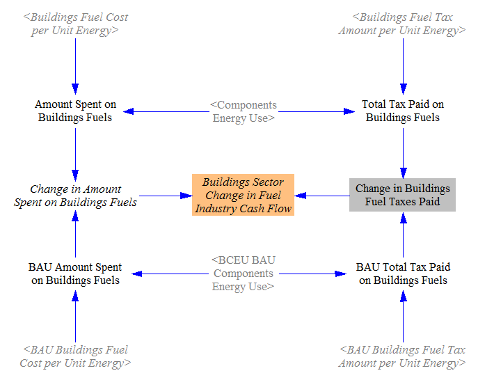

The total amount spent on fuels is calculated by multiplying the total energy use by building components (which is disaggregated by fuel) by the fuel cost per unit energy (for each fuel).  A similar calculation is performed to find the BAU equivalent.  The amount of this total that consists of taxes is determined by multiplying the quantity of energy used by the amount of fuel tax per unit energy.  Taking the difference between the policy and BAU values for taxes paid gives the change in fuel taxes paid in the buildings sector.  Taking the difference between the total amount spent on fuels in the BAU and policy cases gives the change in total amount spent on fuels.  We subtract out the difference in taxes to obtain the change in payments to the fuel industry (this is disaggregated by fuel, so the "fuel industry" impacts can be recategorized into more meaningful industry categories on the [Cross-Sector Totals](cross-sector-totals.html) page).

## Change in Building Component Costs and Taxes

In calculating the effect of policies on building component costs, we only consider components of the types tracked in the Energy Policy Simulator (EPS): heating systems, cooling and ventilation, envelope, lighting, appliances, and other energy-using components.  Certain policies, such as the carbon tax, may have a small effect on other components (say, cabinets or countertops) and on the cost of construction activities, but these impacts are not tracked by the model.

The amount spent on building components in each year of the model run in the BAU case is taken in as input data.  We first adjust this amount upward based on the accelerated retrofitting policy, which causes components to be bought more frequently than in the BAU case.  We convert the fraction of components replaced annually (the user's policy setting) to a percentage reduction in the lifetime of each building component type.  We then increase the amount spent on building components of these types accordingly (assuming steady state, so the lifetime reduction takes effect in accordance with the user's policy implementation schedule, rather than suddenly reducing the lifetime of all existing components by a fixed amount and causing an unrealistic, one-year surge in retirements).  This should be reasonably accurate for countries without much net growth of floorspace, but will overestimate the costs of retrofitting for countries with high rates of net floorspace growth.  The following screenshot shows the relevant structure:

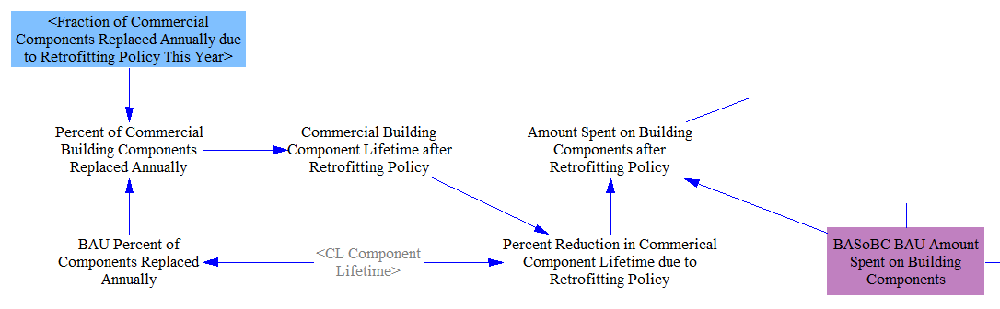

Next, the amount to be spent on BAU plus retrofitted building components is adjusted via three interactions:

* The building component R&D policy can reduce capital costs by a user-specified percentage.
* Various policies (described on the main [Buildings Sector page](buildings-sector-main.html)) affect the efficiency of new building components.  The percent change in energy use (for the same set of components) is combined with an elasticity of component price with respect to energy use to obtain a change in policy case component costs.
* The carbon tax can increase the cost of building components according to the amount of embedded carbon within those components (that is, emissions that occurred upstream in order to manufacture and transport the components, and whose costs may be passed on to purchasers).

The following screenshot shows all three interactions and the resulting Amount Spent on Building Components:

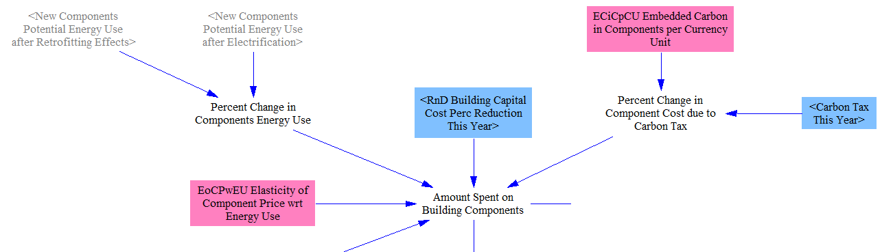

The taxes paid on building components in the BAU case and the policy case are determined from the total amount spent on building components and the sales tax rate.  Then, we find the difference between the two quantities of taxes paid on building components.  Finally, we take the difference between the two total amounts spent on building components and subtract the difference in taxes paid to find the change in amount paid to building component suppliers.  The relevant structure is shown below:

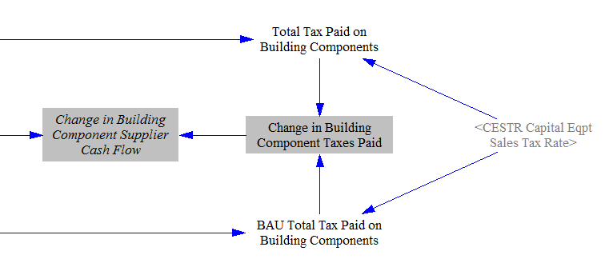

## Change in Distributed Solar Costs

Distributed solar PV costs are handled via the endogenous learning curve for solar PV technology, which is discussed in the [Electricity Sector](electricity-sector-main.html).  This means that their costs decline based on total solar PV deployment.  We begin with the cost of distributed solar per unit capacity in the start year of the model run and apply the result of the endogenous learning calculation to find the cost per unit capacity in the current year, for both BAU and policy cases.

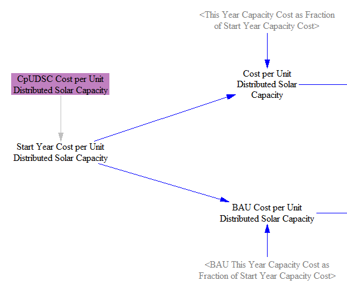

We multiply by the amount of distributed solar capacity added in the BAU case and in the policy case to find the total amount spent on distributed solar in the current year in each case.  We then take the difference to find the change in amount spent on distributed solar due to policies.

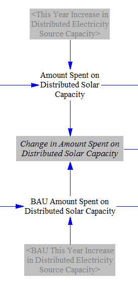

We multiply the amount spent by the tax rate to find the tax paid on distributed solar equipment in the BAU and policy cases, and we subtract these values to find the difference in taxes paid due to policy.  We subtract the difference in taxes paid from the difference in total amount paid to find the change in cash flow for distributed solar equipment suppliers.

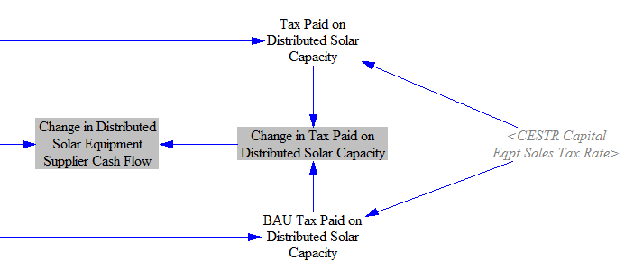

Separately, we calculate the amount spent on the subsidy for distributed solar equipment when that policy is enabled.  We multiply the increase in distributed solar capacity this year (not just the increase caused by the subsidy policy, but the total increase, as the subsidy is paid for all new distributed solar PV) by the cost per unit capacity and by the subsidy percentage to yield the total quantity of subsidy paid.

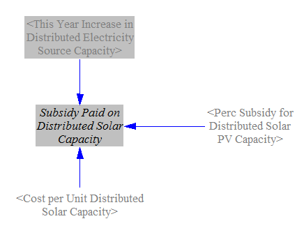

## Allocating Cash Flow Changes Among Entities

Finally, we have to determine which of the model's cash flow entities (government, industry, and consumers) pay or receive the change in cash flow from fuels and components in the buildings sector.  We begin by summing up the change in the amount spent on building components, the change in the amount spent on fuels used in buildings (including electricity), and the change in the amount spent on distributed solar systems, minus the subsidy, if any.  We divide up these expenditures among cash flow actors by the fraction of buildings owned by each actor.  The following screenshot shows the relevant structure:

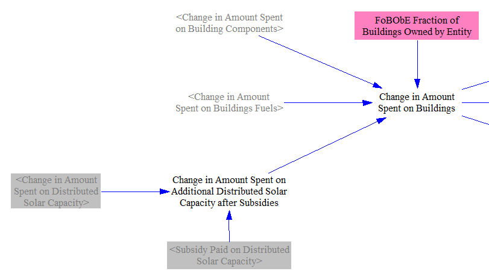

We sum up the change in taxes paid (on components, fuels, and distributed energy systems) and add it to government cash flow, while we subtract subsidy payments from government cash flow.  The other actors are straightforward: their cash flow changes are the opposite sign from the change in the amount spent.  The structure is shown below:

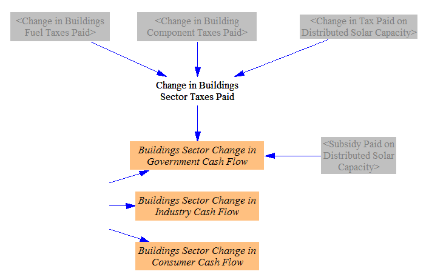

We also sum up the change in capital equipment supplier cash flows, which comes from changes in amounts spent on building components and on distributed energy systems.

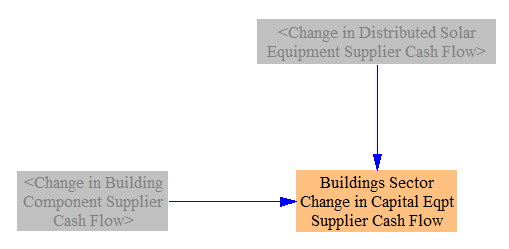