## General Notes

On this sheet, we calculate energy use and direct emissions from buildings and appliances.  Rather than consider number of "buildings," we break buildings down into six energy-using or energy-related components:

* heating
* cooling and ventilation
* envelope
* lighting
* appliances
* other energy-using components

Except for the "envelope" component, energy use is tracked on a BTU basis and is modified by various policies, such as efficiency standards, accelerated retrofitting, and component electrification (similar to vehicle electrification in the Transportation sector).  Envelope is handled as a multiplier that affects the energy use of the "heating" and "cooling and ventilation" components.  In the BAU case, this multiplier is 1.  It can be improved via policies, in the same ways in which policies can reduce the energy use of energy-using components.  After this process, the envelope number is multiplied by the "heating" and "cooling and ventilation" energy use figures to reduce their energy use, if there were any envelope improvements.  Thus, improvements for "heating" and "cooling and ventilation" components in this model refer specifically to the mechanical systems providing these services, and improvements resulting from improved insulation, windows, doors, etc. are handled via the envelope component.  Users should keep this in mind when setting policy levers for each component type.

Note that water heaters, which are categorized as part of a building's "heating" systems in some data sources, are treated as part of the "appliances" component category in this model because water heater energy use should not be affected by building envelope.

## Estimating BAU New Components Energy Use

Our source data include projections for energy use, disaggregated by fuel type and by component.  However, the source data do not specify what fraction of that energy use in each year is from new building components (i.e. those that entered service in the current model year, whether for use in new buildings or to replace old components in existing buildings).  Most of the policies in the Buildings Sector affect newly sold components, so it is necessary to estimate the fraction of energy use each year that is due to these components.  This estimate is handled via the following structure:

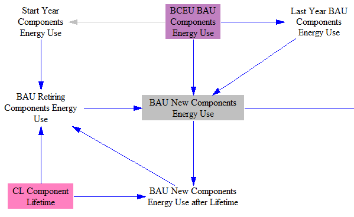

In each year, the new components' energy use is calculated by starting with total components' energy use, subtracting last year's components' energy use, and adding the energy use of components that retired.  Retiring components' energy use is calculated differently depending on whether a number of model years have elapsed that is greater than the lifetime of a given component type.  For example, appliances have a lifetime of 14 years in this model.  In each of the first 14 years of the model run, one fourteenth of the total energy use from appliances that existed in the model's start year is retired.  This assumes a linear distribution of component ages between zero and the component lifetime at the moment the model starts, and it assumes that efficiency of these components is roughly constant.  In reality, fewer components will exist near the higher end of the age range, but these will also tend to be less efficient than average, so these assumptions may compensate for one-another, and assuming an equal amount of energy use retiring each year between model start and the component lifetime may be reasonable.

After the model has run a number of years equal to the component lifetime, we no longer need to rely on an assumed linear age distribution of energy use because the model itself calculated the New Components Energy Use for that component type one lifetime ago.  The component energy use it added to the model at that time is retired after one lifetime.  For example, after the model has run for 14 years, it will retire the energy use of the appliances that were added to the model in the first year.

## Policy Effects

### Accelerated Retrofitting Policy

Next, the model implements the effects of the accelerated retrofitting policy, as shown in the following screenshot:

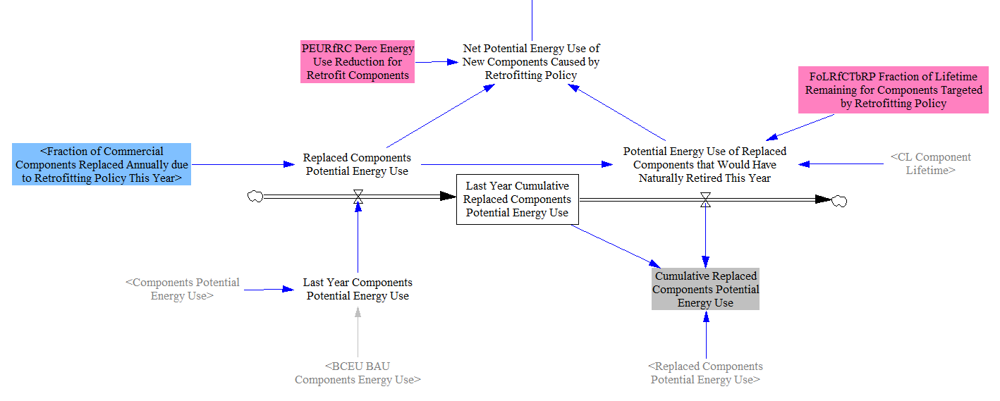

The model retires a certain quantity of component energy use in commercial buildings each year, based on the user's policy setting.  Counterintuitively, this quantity of energy is _added_ to the "Net Potential Energy Use of New Components Caused by Retrofitting Policy."  This addition represents the new components that replace the ones that were removed due to the retrofitting policy.  We reduce the quantity of energy added by the "Perc Energy Use Reduction for Retrofit Components," which represents the fact that even in the absence of other policies, newer components will have lower energy use than the components they replace, due to technological advancement in the BAU case.  (We use a fixed percentage to estimate this, since we don't have explicit rates of energy intensity improvement of building components in the BAU case through 2030.)

This energy is added "upstream" of the effects of the other policies that reduce or affect energy use (such as improved efficiency standards, etc.) so that those policies can affect not only the BAU new components' energy use, but also the energy use of new components purchased as a result of the accelerated retrofitting policy.  At the time when the components replaced by the early retrofitting policy would naturally have retired anyway, the BAU New Components data assumes replacements will be purchased, but it is not necessary, as they were replaced already.  Therefore, we have to subtract the potential energy use of the components purchased due to the retrofitting policy at the time when the replaced component would have retired.  The difference is in the "Net Potential Energy Use of New Components Caused by Retrofitting Policy" variable, which is added to "BAU New Components Energy Use" to find the total potential energy use of new components after retrofitting effects in each model year, as shown in the following screenshot.

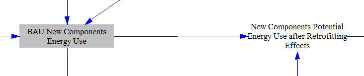

We also track the cumulative potential energy use of components that have been replaced due to the retrofitting policy (in "Replaced Components Potential Energy Use").  This contains the energy use of the components that exist in the BAU case but no longer exist in the policy case because of retrofitting.  (Again, we subtract out the energy use at the time the components would have been replaced in the BAU case.)  This potential energy use has to be subtracted from the potential energy use in the BAU case plus the cumulative difference due to our policies because these components do not exist in the current model year in the policy case, but they haven't yet retired out of the BAU input dataset.

Vensim doesn't update level variables with the current year's inflows and outflows- the current year's flows affect the level variable next year.  We want to adhere to the user-defined policy implementation schedule without introducing a one-year delay.  (If the user wanted a one-year delay, he/she would have put it into the policy implementation schedule.)  Accordingly, we manually add the current year's inflows and outflows to the cumulative total to obtain the "Cumulative Replaced Components Potential Energy Use" (and later in the Buildings Sector, the "Cumulative Potential Energy Difference Relative to BAU").  We do something similar with all other level variables in the Energy Policy Simulator (EPS).

### Efficiency Standards and R&D

The following structure implements the energy efficiency standards and energy efficiency R&D policies for building components:

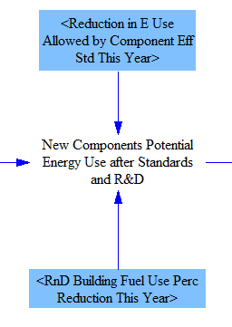

The implementation of these policies is straightforward, as the user settings of these policy levers explicitly define their effects.  We conservatively assume that newly sold building components just meet the reduction in energy use required by the standard.  The R&D policies are defined to be additional R&D beyond any that may be needed to satisfy requirements of other policies, such as R&D by building component manufacturers done in order to meet efficiency standards.

### Improved Labeling and Contractor Education and Training

The following structure implements two Boolean policies (i.e., policies that can only be set to "on" or "off" rather than set to a range of different values): improved device labeling and improved contractor education and training.

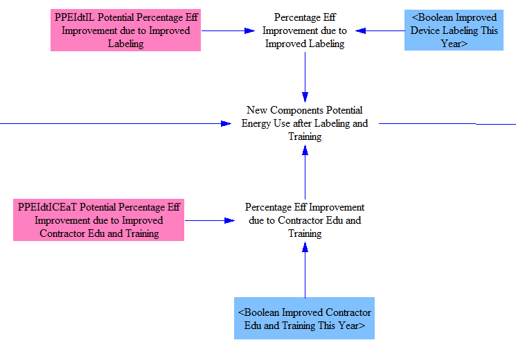

Energy efficiency labeling reduces the energy use of specific types of devices- appliances, heating equipment (i.e. central air furnace), and cooling / ventilation equipment (e.g. air conditioning units).  Contractor education and training improves the performance of building envelope components, reducing energy spent on heating and cooling.  In both cases, these are Boolean policies because specific labeling interventions and specific training programs were studied in our input data sources- it does not make sense to allow a user to implement a fraction of a labeling program or a fraction of a training program.

### Rebate Policy and Component Quality Levels

The EPS supports multiple quality levels for building components.  For the U.S. version of the simulator, there are only two quality levels: standard-compliant and rebate-qualifying.  The structure that handles these quality levels, as well as the rebate policy, is shown in the following screenshot:

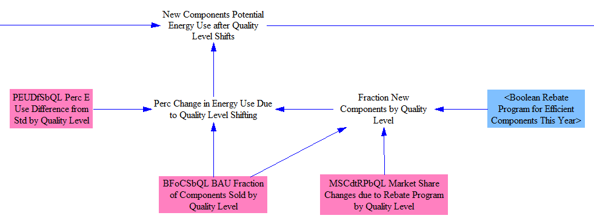

When the rebate policy is disabled, "Fraction New Components by Quality Level" and "BAU Fraction of Components Sold by Quality Level" are the same, so there is no "Perc Change in Energy Use Due to Quality Level Shifting."  When the rebate policy is enabled, specific market share changes by quality level occur, causing more components of higher quality levels and fewer components of low quality levels to be sold each year.  The differences in energy use (to provide the same building services) are taken in as input data and typically relate to how the quality levels were defined.  (In the U.S. dataset, we use standard-compliant components vs. Energy Star components to define our categories and set our energy use differences by quality level, due in part to the availability of data regarding Energy Star market shares, energy use, etc.)

The rebate program is a Boolean lever because only rebates of particular magnitudes have been studied in the literature.  Typical rebate values represented by this lever are $50-100 for a clothes washer and $25-50 for a dishwasher or refrigerator.

### Effect of Fuel Price on New Component Efficiency

Individuals may choose to buy more efficient components, and manufacturers may choose to offer more efficient components for sale, in response to higher fuel prices.  Conversely, if fuel becomes cheaper, components with lower efficiencies might be purchased.  The following structure handles this effect:

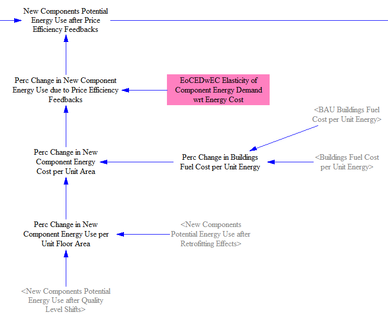

The energy use of new components (including BAU new components and new components added due to retrofitting) is compared with the energy use of that same set of components after application of those policies that reduce the energy use of new components (such as efficiency standards, contractor training, etc.) to determine the "Perc Change in New Component Energy Use per Unit Floor Area."  We don't actually work in terms of floor area- this term is simply a way to express the fact that the components being compared provide services to the same set of buildings in the BAU and non-BAU cases, and we're capturing specifically the policy-caused energy efficiency improvements.

In the next step, we combine this change in energy use with the difference in fuel cost (disaggregated by fuel), which may be driven by other policies (such as a carbon tax or fuel taxes), most of which are handled on the [Fuels page](fuels.html).  This gives us a percentage change in cost to provide services to a given building area, disaggregated by component and by fuel type.  We use an elasticity of new component energy demand with respect to energy cost to convert this into a percentage change in the energy efficiency of newly sold components.  This percentage change is multiplied by the total energy use from the most recent prior calculation ("New Components Potential Energy Use after Quality Level Shifts") to give the potential energy use after price-efficiency feedbacks.

### Electrification

A policy is available to shift newly sold components from non-electricity fuel types to electricity, as shown below:

The implementation of this policy is relatively straightforward, because the user directly specifies the percentage of non-electric components to be shifted to electricity.  The one complication is that we must make an adjustment to account for the fact that electricity is used more efficiently than other fuels on an energy unit basis (less heat losses, etc.).  The fuel used to generate the electricity, and associated efficiencies, are handled in the [Electricity Supply](electricity-sector-main.html) sector, not in the Buildings sector.  (We make a very similar adjustment in the [Transportation Sector](transportation-sector-main.html) when implementing the vehicle electrification policy.)

## Envelope Effects

At this stage, we are done applying policies and economic effects that alter the efficiency and fuel use of new building components.  The next step is to convert changes in envelope efficiency into changes in energy use, as envelope components do not themselves use energy.  As noted above, envelope is handled as a multiplier that started at "1" and was reduced to less than "1" if any policies improving the performance of envelope components were enabled.  We multiply the envelope multiplier by energy use from the "heating" and "cooling and ventilation" component types to reflect the increased performance they get from envelope improvements relative to the BAU case in the current model year.  This is done inside a single variable, as shown in this screenshot:

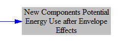

## Tracking Cumulative Potential Energy Use Differences

After accounting for policy effects and applying the envelope modifier, we track the cumulative difference in energy use due to our policy package. This accumulates year after year, as more new components (influenced by the policies) are sold and integrated into the building stock.  The following screenshot shows the relevant structure:

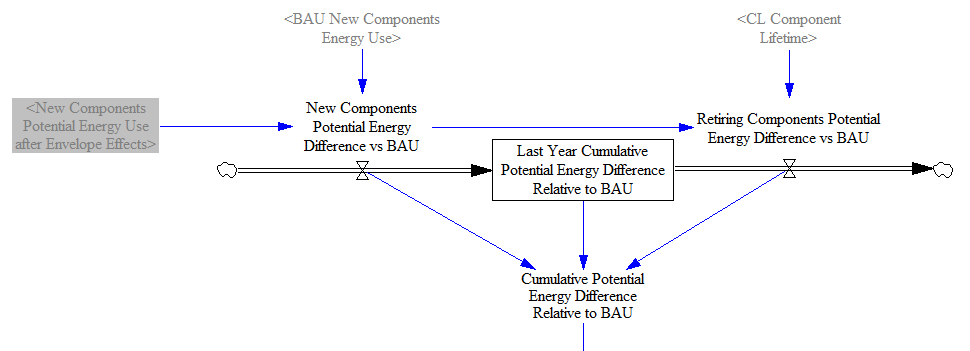

We add the difference between the newly sold components' energy use and its BAU equivalent to the cumulative total.  We retire these differences out of the cumulative total after one component lifetime (at which time, the components are replaced by still other components, which contribute their own differences to the cumulative total).

As noted above (in the section on the accelerated retrofitting policy), Vensim doesn't update level variables with the current year's inflows and outflows- those affect the level variable during the following year.  We don't use that convention in the EPS.  Rather, we want any delays to be instituted by the user using the policy implementation schedule, so we manually add the new and retiring cumulative changes to the "Last Year Cumulative Potential Energy Difference Relative to BAU" to get the current year's potential energy difference relative to BAU.

## Finding Components Energy Use

The next step is to find the total potential energy use.  We start with the components energy use in the BAU case and subtract out the energy use by components that were eliminated by the retrofitting policy.  (Their replacements are included in the New Components Energy Use, which contributes to the Cumulative Potential Energy Difference Relative to BAU.)  The following screenshot shows the relevant structure:

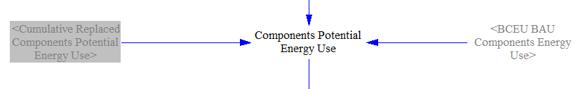

Finally, we consider building occupants' behavioral responses to higher or lower energy prices.  We first determine the change in cost of the fuel that would be needed to run all components at "potential" - that is, before the influence of behavioral response to prices.  (This refers to changes in how buildings and appliances are used, not changes in what products are purchased.  Price-based changes in what products are purchased are handled by a different section of this page, discussed above.)  This is challenging, because the component electrification policy shifted a certain amount of energy use between fuel types (and our elasticities for building service demand with respect to energy cost are disaggregated by fuel type).  If we simply compare the BAU and policy cases when the component electrification policy is enabled, it would appear that more electricity was required and less other fuels were required to provide the same services, when what actually happened is that the quantity of services provided by components that use each fuel type has changed.

Accordingly, we construct a "Hypothetical BAU" case that considers what the energy use of components would have been in the BAU case if only the component electrification policy were to act upon that case.  First, we apply the electrification policy to the BAU New Components Energy Use, as shown in the following screenshot:

Next, we apply envelope effects, and then we track the cumulative difference between the hypothetical BAU case and the actual BAU case, in a manner analogous to that which we did for the Policy case, as shown in the following screenshot:

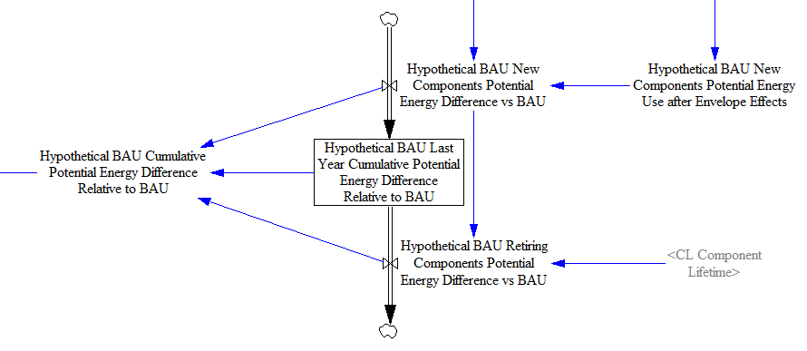

Next, we combine the cumulative difference of the hypothetical BAU case with the BAU Components Energy Use to find the energy use in the hypothetical BAU case.  We multiply this by the BAU cost of fuels in the buildings sector (by fuel) to get the amount spent on fuels in the hypothetical BAU case.  We also calculate the amount spent on fuels in the policy case by multiplying the fuel use in the policy case by the fuel costs in the buildings sector in the policy case.  The following screenshot shows this portion of the model:

We find the percentage change in fuel cost between these two cases.  Then we combine the percent change in energy cost of operating components with an "Elasticity of Building Service Demand wrt Energy Cost" to obtain a percentage change in energy use by building components due to price-demand feedbacks.  This is different from the similar elasticity above, which applied only to new components, because that elasticity affects which types of components were purchased and installed.  This elasticity affects all components (not just new components), and effects are recalculated each year based on energy cost per unit area- you do not "lock in" lower or higher energy use for the lifetime of a component that was just purchased.  See the next screenshot for the relevant structure:

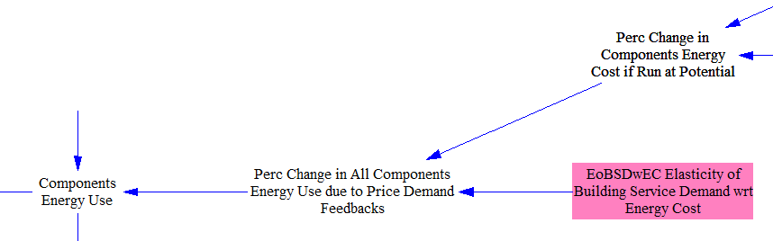

## Distributed Solar PV Calculations

The simulator factors in the amount of distributed electricity generation capacity (from a variety of sources on-site at buildings), the vast majority of which comes from solar PV panels.  It also includes two policies that allow the user to increase the amount of distributed solar PV capacity beyond the BAU case.

First, we calculate the increase in distributed capacity that happens in the BAU case by looking at the year-over-year change.  (We assume retirements of distributed capacity are not significant during the model run timeframe, as they are dominated by solar, which consists mostly of relatively recent equipment.)  The following screenshot shows this structure:

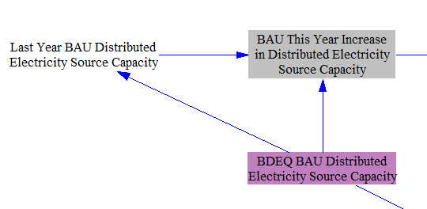

We calculate the effect of a subsidy for distributed solar capacity using an elasticity of distributed solar deployment with respect to subsidy price, which modifies the BAU increase in distributed solar capacity, as shown below:

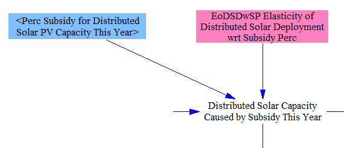

We sum up the total distributed solar capacity we have this year at this point (e.g. after the effects of the subsidy policy, but before we consider the distributed solar carve-out) by summing the BAU quantity, the total amount of distributed solar caused by policies (both the subsidy and the mandate) in past years, and the amount of distributed solar caused by the subsidy alone in the current year.  We will use this total to deteremine how much additional solar, if any, is required this year by the carve-out policy:

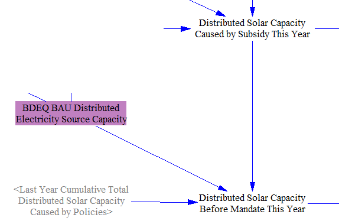

Next, we calculate the effects of the distributed solar carve-out policy.  We multiply the total electricity demand (with a one-year delay to avoid circularity) by the minimum allowable fraction of electricity to come from distributed solar PV to find the quantity of distributed solar PV output we require in the current year.  

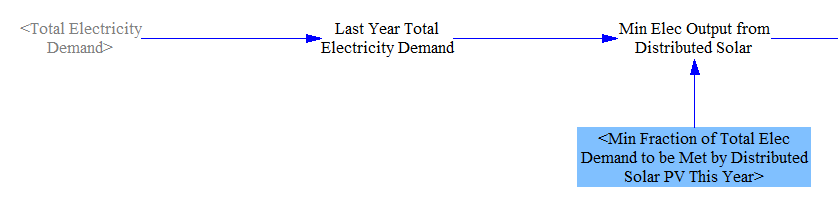

We convert this minimum output to capacity using a distributed solar capacity factor and find the minimum required distributed solar capacity.  We subtract the amount of distributed solar capacity we already have this year (including the effects of the subsidy), and the remainder is the distributed solar capacity deployed due to the carve-out.

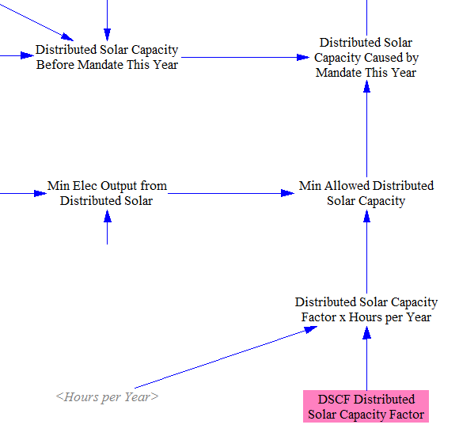

We calculate a cumulative total amount of solar PV deployed due to policies, which is the quantity we will convert to output and use for demand reduction in the Electricity Sector.  This is because our source for BAU electricity demand from buildings reflects net demand (demand for electricity from the grid, after any production from distributed sources in the BAU case).  Hence, only increases to output from distributed sources in the Policy case reduce the demand the Buildings Sector sends to the Electricity Sector.  (In this area, we also calculate the total increase in distributed solar capacity in the current year in the Policy case, which is used on the [Building Sector Cash Flow sheet](buildings-sector-cash.html).)  The following screenshot shows the calculation of cumulative total capacity caused by policies:

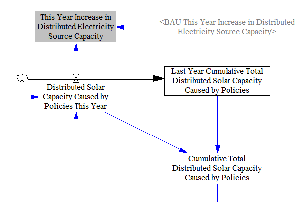

We sum the total capacity in the BAU case with the distributed solar PV capacity caused by policies to find the total distributed capacity (of each power source) in the policy case.  We subtract out the BAU electricity source capacity (of each source) and multiply by the distributed solar capacity factor to convert the change in capacity to a change in output.  Note that although these calculations could be simpler if we only wanted to obtain the change in output from distributed solar, we use the variables "Distributed Electricity Source Capacity" and "Change in Output from Distributed Sources" as outputs (e.g. on the "Web Application Support Variables" tab) and as inputs on the "Electricty Supply - Main" tab, so we need to calculate them explicitly, as shown below:

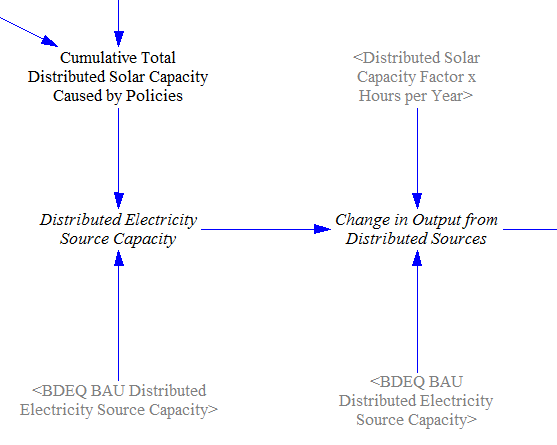

## Outputs

First, to get total electricity demand from the Buildings sector, we separate out electricity from other fuels and convert the units to MWh.  We subtract the change in output from distributed sources to find the net electricity demand from the Buildings sector, which will serve as one contributor to the demand seen by the [Electricity Sector](electricity-sector-main.html):

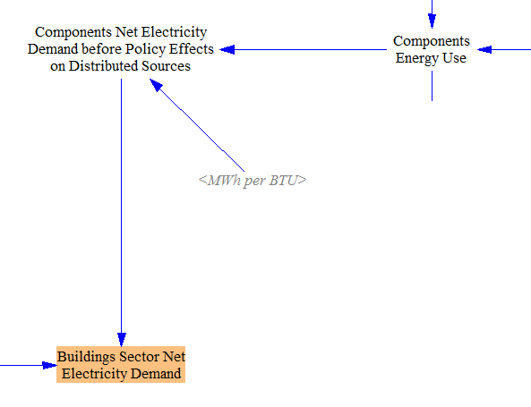

Lastly, we find the total energy use of non-electricity fuels in the Buildings Sector by adding the non-electricity energy use by building components to the fuel use from fuel-using distributed electricity sources.  We then multiply by the emissions indices for each pollutant and for each fuel type, to obtain the direct pollutant emissions from the buildings sector.  We also sum emissions across building types in a separate output variable, for ease of reporting total pollutants from this sector, when this is desired by the user.  These steps are shown in the following screenshot:

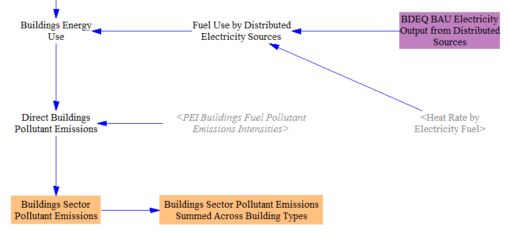
