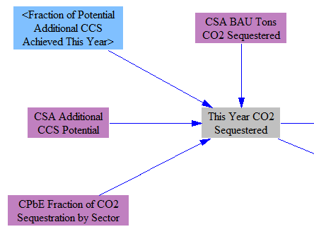
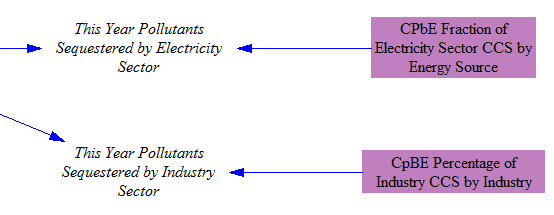
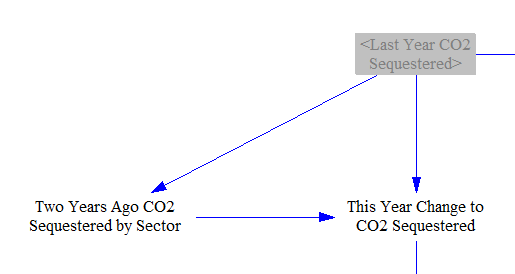

## General Notes

The carbon capture and sequestration (CCS) sheet handles various calculations relating to the quantity of CO2 sequestered, the amount of fuel burned to power this sequestration, the cost of the capital equipment needed to sequester this amount of carbon, and the O&M cost for this equipment.  All of these results are disaggregated between the electricity sector (where they are divided between coal, natural gas, and biomass plants) and the industry sector (where they are divided up by industry).  All of these results are then used on the sheets for the electricity and industry sectors in the model.  Final emissions and cash flow calculations are not conducted on the CCS sheet; its purpose is to do supporting calculations for the other sectors.  Italics, which are used in the model (in all sheets) to denote when a variable is going to or coming from a different sector of the model, are useful for seeing which variables are the results of the CCS sheet, which are used on other sheets.

## Calculations on the CCS Sheet

### Quantity of CO2 Sequestered

We begin by calculating the total quantity of CO2 sequestered in each year of the model run, divided between the electricity and industry sectors.  We take in both a BAU quantity of CO2 sequestered and an additional sequestration potential in each year through 2030.  A user-set policy lever specifies the fraction of the additional potential that is actually achieved.  The following screenshot shows the relevant structure:

Next, we divide up the quantity of sequestered CO2 between various industries (within the Industry sector) and between various power plant types (within the Electricity sector).  These divisions are based on input data, and the results are used in those sectors of the model.  The following screenshot shows the calculations:

### Capital and O&M Costs of CCS Equipment

We represent the amount of CCS equipment in terms of its sequestration capacity: that is, the amount of equipment necessary to sequester a particular mass of CO2 per year.  We do not have CCS equipment retirements, because the lifetime of CCS equipment is long (25-40 years) and any preexisting CCS equipment is relatively new, so retirements during the course of the model run are not significant.  Hence, the increase in amount sequestered in the current year is achieved through new CCS equipment capacity, enabling us to determine the amount of equipment deployed this year.  Accordingly, we first find the change in CO2 sequestered this year, as shown below:

The cost of that new equipment is based on an endogenous learning curve, so that it is cheaper the more CCS equipment has been deployed.  We use a percentage decline per doubling of capacity to determine the cost of CCS equipment in the current model year relative to the first year:

That is multiplied by the cost of CCS equipment in the first year to find the current year cost.  The user-specified R&D policy that reduces CCS equipment cost is also applied at this stage, as shown below:

We use input data on O&M costs per ton sequestered to calculate total spending on O&M of CCS equipment, as shown below:

### Fuel Used to Power the Sequestration Process

Lastly, we determine how much of which types of fuels are consumed to power the sequestration process.  First, we take the total amount of CO2 sequestered and multiply by the amount of energy needed to sequester one ton of CO2, adjusted by the user-selected setting for CCS fuel efficiency.  These data are already disaggregated by sector (Electricity and Industry).  The structure is shown below:

For the electricity sector, we refer to the same input data which provided the fraction of electric sector sequestration performed by each power source to determine the division of fuel used to power sequestration among these sources.  The sources are coal, natural gas, and biomass.  We assume that each type of plant uses the fuel type that it normally burns to power its CCS process (that is, a coal power plant will power the CCS process by burning coal, not by burning natural gas, using solar panels, etc.).  A screenshot showing the relevant structure appears below:

For the industry sector, we divide up the energy use by industry based on the same input data we used to divide up the quantity of CO2 sequestered by industry.  Unlike the electricity sector, each industry uses multiple fuel types, so we need to further disaggregate the energy use by fuel type.  We assume each industry uses fuel types to power CCS in proportion to its use of fuel types for other purposes.  We don't need to calculate the cost of the fuel here, as we do in the electricity sector, because we simply add fuel to power CCS to the fuel-use total in the Industry sector.  (This would be inelegant to do on the Electricity Sector sheet because there we use pollutant emissions intensities per MWh of power generated rather than per energy unit of fuel burned.)  The relevant structure appears below:

