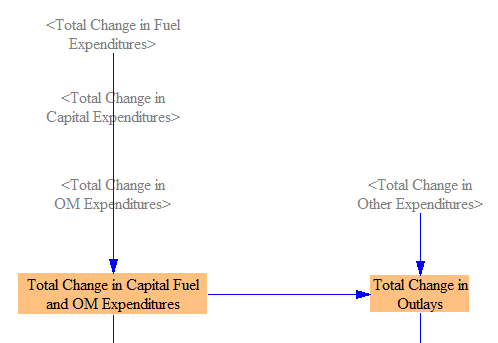
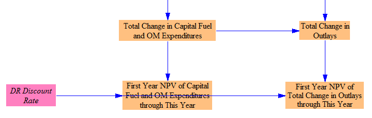
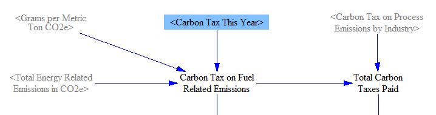
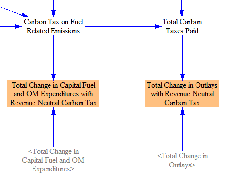

## Note on the Cost of a Policy Package

One of the most common outputs in which a user might be interested is the economic cost of a policy package.  However, "cost" can be defined in more than one reasonable way.  The cash flow changes that are totaled on the [Cumulators sheet](cumulators.htm) represent the direct (first-order) transfers of money from one entity in the model to another, as a result of the active policy package.  Since any money that is spent is received by someone else, the total of all these transfers sums to zero.  So, summing all cash flow changes is not a meaningful metric of policy cost.

We provide two different metrics for policy cost.  One is the "Total Change in Outlays."  This is similar to the sum of all cash flow changes, except we include only changes in amounts _paid_ and exclude changes in amounts _received_.  The changes in amounts paid can be positive or negative.  For example, if a policy causes consumers to buy less fuel, then consumers have a positive cash flow change (because they have saved money on fuel), and the "Total Change in Outlays" will be negative (because less money is being spent as a result of the policy package).  It does not matter that the fuel industry is receiving less money, because changes in receipts are excluded from the "Total Change in Outlays" metric.

The other policy cost metric we provide is "Total Change in Capital Fuel and OM Expenditures."  As is the case for the "Total Change in Outlays" metric, we exclude changes in receipts.  Additionally, we exclude all changes in spending that are not on capital, fuel, or operations and maintenance (OM).  The most important type of spending that is excluded by this definition is the payment of subsidies.  There are a couple other minor types of spending that are excluded as well, such as carbon tax payments on process emissions and payment of a carbon tax rebate (a reduction in carbon taxes paid) to reward sequestration of CO2.

Both of these cost metrics look at a subset of first-order (direct) cash flow changes caused by the policy package.  The model does not attempt to estimate higher-order impacts (for example, how government will spend increased tax revenues, and what will that do for the economy?), with one optional exception (the ability to assume carbon taxes are revenue-neutral), discussed below.  In general, modeling higher-order impacts does not pertain directly to the user's policy package and is not within the intended scope of the EPS.

In addition to the standard versions of these cost metrics (which make no assumption about how any revenues are used), the EPS includes variables that output these same two cost metrics, but which assume the carbon tax (if enabled by the user) is revenue-neutral.  These versions of the cost outputs assume carbon tax payments are offset by reductions in other tax payments, so we subtract them from the policy package cost.  This is an exception to the general principle in the EPS that we make no assumptions about higher-order effects or how money is used after changing hands due to user-selected policies.  We include this option for two reasons.  First, unlike other taxes (such as sales taxes on fuel or equipment), at least in the United States, much consideration of enacting carbon taxes has centered on making them revenue-neutral.  Second, carbon tax payments can dominate other contributors to policy package cost, due to the sheer quantity of fuel that is purchased to operate the economy.  (A carbon tax reduces fuel demand in accordance with various elasticities of demand, but these demand reductions are not enough to compensate for the higher cost of the fuel that is still sold.)  This can make policy packages appear expensive to novice model users (especially those who only interact with the model via the web application interface), as they may not understand that the reported cost metrics are merely first-order cash flows that do not indicate the overall effect on the economy or on any actor's welfare.  In the real world, government may use tax receipts in ways that boost the economy by more than one dollar per dollar in receipts (for example, by investing in energy efficiency programs or public transit systems), or alternatively, in ways that are less productive and deliver fewer than one dollar per dollar.  In this context, you might consider the revenue-neutral carbon tax to assume exactly one dollar of economic benefits per dollar received by the government.  If you wish to avoid this assumption and view outputs that deliver a consistent treatment of all cash flows, simply use the standard versions of the cost outputs.

Lastly, a user concerned with the cost of a policy package should also look at the outputs for monetized public health and climate benefits: namely, avoided mortality from reduced particulates and avoided climate damages.  (These are located on the on the [Additional Outputs sheet](additional-outputs.html).)  Monetized benefits tend to outweigh the direct cost of policy packages in most cases.

## Calculating Changes in Spending (Outlays)

The upper portion of the Cost Outputs sheet is laid out as a grid, with a column for each sector (Transportation, Electricity Supply, Buildings, Industry, District Heating, LULUCF, and Total) and a row for each of the main types of outlay (spending on Fuels, Capital, OM, and other spending).  Within each row, the changes in spending, whether positive or negative, are summed up across all sectors.  The result appears in the variable in the "Total" column.

When a sector does not contain a given type of spending (for example, there is no "OM" spending in the "District Heating" sector), that spot in the table contains no variable.  When a sector contains more than one variable that contributes to the same type of spending (for example, capital spending in the Electricity Sector can come from construction of power plants, batteries, or transmission lines), then these are totaled on this sheet.

One type of expense does not appear in the sector columns.  In the "Other" row, "Change in BAU Subsidy Payments for Thermal Fuels" appears in the "Total" column and contributes to the "Change in Other Expenditures" total.  This is because savings to government from reduction of BAU subsidies on thermal fuels are not calculated on a sector-specific basis.

## Useful Totals

First, we sum the changes in fuel, capital, and OM expenditures to find the "Total Change in Capital Fuel and OM Expenditures."  We add in the "Total Change in Other Expenditures" to find the "Total Change in Outlays."  The relevant structure is shown below:

We also show these totals as net present values (NPVs) in the first year of the model run, given the discount rate specified by the input data for this model version.  Vensim will report a value in every year for these NPV variables.  All of these annual values represent NPVs of the cash flow in the model's start year.  As the model run continues, more and more payments or savings are included in the NPV total.  As a reminder of this behavior, the variables are named "First Year NPV of [variable] through This Year."  The relevant structure is shown below:

## Carbon Taxes and Revenue-Neutral Carbon Tax Package Costs

The following structure is used to calculate the total quantity of carbon taxes paid:

We first calculate the carbon tax on fuel-related emissions by multiplying the carbon tax rate by the total quantity of emissions, in CO2e, from fuel combustion.  Next, we add in the quantity of carbon tax paid on industrial process emissions, which was calculated separately, on the [Industry - Cash Flow](industry-ag-cash.html) sheet.

Next, we create modified versions of our two main cost outputs (Total Change in Outlays and Total Change in Capital, Fuel, and Labor Expenses) by subtracting out the carbon tax revenues, as shown in the following model structure:

The full revenue from carbon taxes is subtracted from the Total Change in Outlays.  We do not subtract carbon taxes paid on process emissions from the Total Change in Capital Fuel and Labor Expenditures metric, because that cost metric didn't include carbon taxes paid on process emissions in the first place.