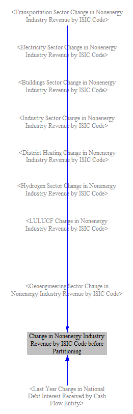
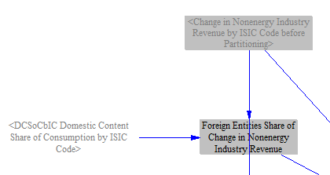
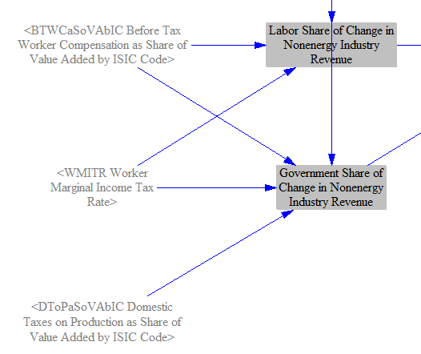
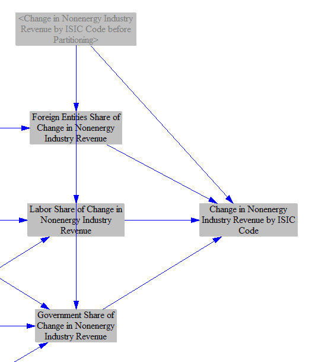
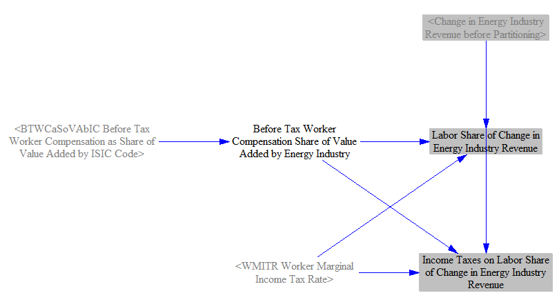
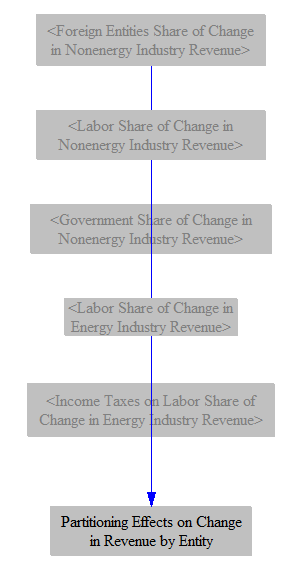

## General Notes

The Cross-Sector Totals sheet is where various quantities are totaled from the various model sectors, and certain modifications to cash flows are performed to prepare them for use in the [input-output (I/O) model](io-model.html) component of the EPS.  Totaled quantities include emissions (by pollutant and converted to CO2e), electricity demand, fuel use, and cash flows for the nine cash flow entities (government, non-energy industries, labor and consumers, foreign entities, and five energy suppliers).  Non-energy industry cash flows are further broken out into the ISIC codes (International System of Industrial Classification) used in the I/O model.  The totals on this sheet are not the only way in which cross-sector impacts are tallied.  For instance, expenditures broken down by type of expenditure are calculated on the [Cost Outputs sheet](cost-outputs.html).

## Pollutants and CO2e

The Energy Policy Simulator (EPS) totals the quantities of 12 pollutants emitted (or sequestered) from eight sectors: transportation, electricity, industry (including agriculture), buildings, district heat, hydrogen supply, LULUCF, and geoengineering.  Industry sector emissions here do **not** include leakage (induced emissions in other countries/regions); see the [Industry Sector page](industry-ag-main.html) for details about leakage.  Pollutants are simply summed, a quantization term is applied to avoid rounding error, then GWP values (using the user-selected GWP timeframe) are applied to convert them to CO2e.  The following screenshot shows the relevant structure:

## Electricity Demand

There are six sectors that can demand electricity: transportation, buildings, industry, hydrogen supply, district heat, and geoengineering.  The demand from these sectors is summed, and the sum is used as an input to the Electricity Sector of the model.  The following screenshot shows the relevant structure:

## Fuel Use and Primary Energy

We total fuel and primary energy use, which is primarily used in various outputs, though it also serves as an input to the calculations of fuel imports and exports on the [Fuels sheet](fuels.html).  First, we total all energy use by all sectors, and then we filter out non-primary fuels (such as electricity, district heat, and hydrogen, as well as the fuel-less electricity sources, such as hydro, wind, solar, and geothermal) to obtain Total Primary Fuel Use by Sector.  We sum across sectors to obtain Total Primary Fuel Use.  

Finally, we convert fuel use to total primary energy.  Since we're already working in energy units that are the same across fuels, our only task is to convert the electricity that was generated via renewables (including distributed RE resources) to primary energy.  This was done on the [Electricity Sector sheet](electricity-sector-main.html), so we take those  values and use them to fill in here for the renewable sources.  We continue to report no value for energy carriers (electricity and heat) to avoid double-counting in the primary energy total.  See the following screenshot for the structure:

## Changes in Cash Flows

The model tracks changes in cash flow for nine main actors (sometimes called "cash flow entities"): government, non-energy industries, labor and consumers, foreign entities, and five types of energy suppliers (electricity, coal, natural gas and petroleum, biomass and biofuel, and other).  Additionally, the model tracks cash flow impacts by ISIC code, which breaks apart the non-energy industries cash flow entity into 18 ISIC codes and also tracks an additional 18 ISIC codes, for a total of 36 ISIC codes.  The break-out of five types of energy supplier within the EPS is more detailed than the available data by ISIC code (which, for example, groups all fossil fuel extraction businesses together, not distingusihing coal from oil and gas), so we retain the five energy suppliers within the "cash flow entities" subscript, instead of simply relying entirely on ISIC codes to track cash flows for all industries.  The detailed break-outs by ISIC code and by cash flow entity allows the EPS to produce outputs that show how policy packages affect specific segments of the economy and society.

### Changes in Non-Energy Industry Cash Flows by ISIC Code

As the cash flow entities subscript is already sufficient to track the direct financial impacts of policies for all entities except for the detailed break-out of non-energy industries, at this stage, we primarily use ISIC codes to subdivide the cash flows assigned to the "non-energy industries" cash flow entity.  (Later, in the [input-output model](io-model.html), we will use some of the properties of the energy industry ISIC codes to estimate indirect impacts of changes in energy industry output.)

The first step is to total the change in non-energy industry expenditures by ISIC code.  This was calculated in varous sectors, and it is relatively straightforward, because (unlike changes in revenues), we don't need to separate out a share going to labor or tax payments - we only care about the total amount spent and the ISIC code doing the spending.  

Tracking the change in revenues by ISIC code and by cash flow entity is more complicated.  Revenue assignments to specific ISIC codes were already made in various sectors (transportation, buildings, etc.), but labor and tax shares of the assignments to non-energy industries were not separated out within the sectors.  We must do that here, in a process called "partitioning."  First, we total the changes in revenue by ISIC code prior to partitioning.

Next, we separate out the shares of the non-energy ISIC codes' revenue that goes to government, to labor, and to foreign entities.  The changes in revenues coming out of the various sectors assigned to non-energy ISIC codes reflect what is paid for each sort of thing is being bought (such as machinery, steel, etc.), not where the product comes from (within or outside the model boundaries - e.g. domestic or foreign) or how much of the money goes toward taxes and toward labor.

To calculate the share going to foreign entities, we use the domestic content share of consumption by ISIC code, which is taken in as input data and reflects the share of each good (or the parts of each good, for goods composed of a mixture of domestic and imported parts) produced domestically.  We make no distinction between payments to foreign companies, foreign labor, and foreign taxes - they all are lumped into the "foreign entities" bucket.

To calculate the share going to labor, we use input data that specifies the share of the value added by each industry that goes to worker compensation.  Value added reflects the increase in output and revenue of one industry relative to the cost of the inputs it purchases, such as a company that buys steel and manufactures machinery.  We need to take the labor share of value added, not the labor share of total output, because the labor share of producing the input materials, such as steel, is already accounted for when calculating the revenue impacts on the steel industry.  Thus, each industry makes a non-overlapping (non-double-counted) contribution to the change in revenue going to labor.  We subtract out personal/household income taxes on the change in payments going to labor at the marginal worker tax rate, because personal income taxes are not included in the I/O input data on taxes by ISIC code.

To calculate the share going to government, we use input data on the tax on production as a share of value added by ISIC code.  These tax rates don't include changes in tax revenues from personal income taxes of the workers in each industry, so we add these separately, taken out of the labor share, as noted above.

We subtract out the foreign, labor, and government shares of the change in non-energy industry revenue to find the total change in non-energy industry revenue that actually applies to each domestic industry.

Finally, we add the direct (first-order) changes in revenue and changes in expenses to obtain the direct changes in cash flow for each non-energy industry, broken out by ISIC code.  In other words, this is the direct impact of the user's selected policies on the cash available to each industry segment.  This is one of our important inputs to the I/O model.

### Changes in Energy Industry Cash Flows

We must also partition and sum changes in energy industry cash flows, but the process is somewhat simpler.  This is because we handle taxes on energy in each sector demanding that energy, and we separate out the foreign entities' share using calculations in the fuel imports and fuel exports section of the [Fuels sheet](fuels.html), a more complicated and accurate methodology than simply partitioning a foreign share by ISIC code.  The only partitioning we need to do for the energy industries on the Cross-Sector Totals sheet is to separate out the payments going to labor, and the income taxes on those labor payments, which go to government.

### Summing partitioning effects

In order to produce totals cleanly later in this sheet, we prepare by consolidating all the changes in revenue due to partitioning (as described in the sections above) into a single variable, subscripted by cash flow entity.  The effects on the non-energy industries cash flow entity are obtained by summing across ISIC codes, since our calculations above were broken out by ISIC code, and we must keep the "non-energy industries" cash flow entity in sync.  Other partitioning effects are already assigned to one of the nine cash flow entities, so summing them is straightforward.

### Summing Changes in Expenses and Revenues

The next step is to sum policy-driven changes in expenditures and revenues for each cash flow entity across all sectors and other model components that cause direct changes in expenditures and revenues.  Expenditures are divided into energy expenditures and non-energy expenditures in each model sector, so we total them separately here, so we can represent changes in these types of expenditures as separate lines on output graphs.  We apply a Quantization Size for Cash Flows to dampen rounding error.

Similarly, we sum changes in revenues for each cash flow entity across all sectors.  This includes the effect of the partitioning we completed in the steps above (in the gray box in the following screenshot).  The sum of all cash flow changes within the gray box (i.e. across the nine cash flow entities) is zero, because partitioning doesn't alter the total change in revenue - it simply reallocates some to labor, to government, and to foreign entities.

We know how much of the output of each energy industry and non-energy industry was purchased by "foreign entities," so we are able to subdivide the change in revenue by entity into change in export revenue and change in domestic revenue.  We break this out here to enable us to show this revenue breakdown in output graphs.

Our final step is to sum the changes in expenditures (energy and non-energy) and the changes in revenues for each cash flow entity to find the change in direct (first-order) cash flow for that entity.  In other words, this is the change in cash available to each entity directly caused by the policy package.  This is analogous to the sum of changes in expenditures and revenues by ISIC code calculated above, and it is one of our important inputs to the I/O model.

For the next steps in the calculation of financial policy impacts, see the documentation page on [the input-output model](io-model.html).
