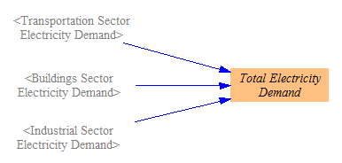
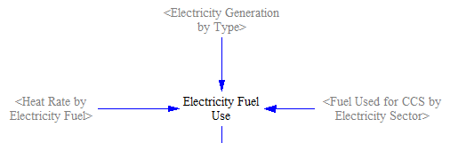
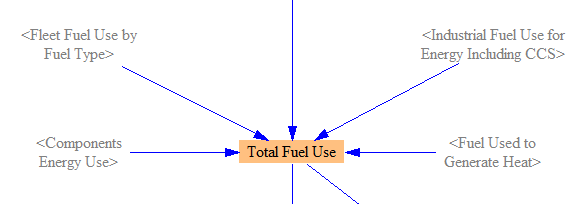
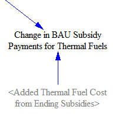
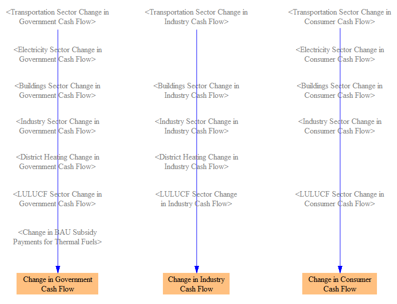
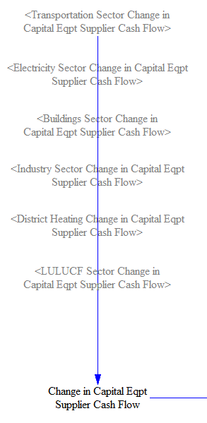
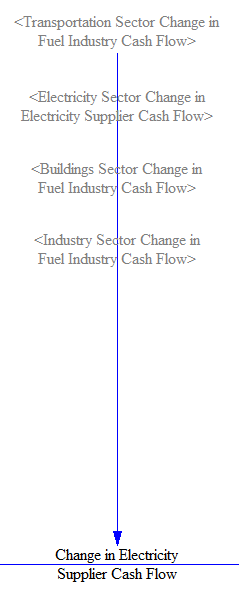
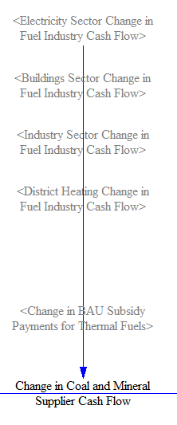
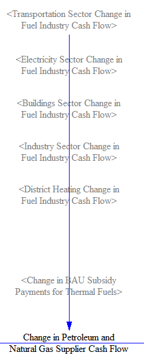
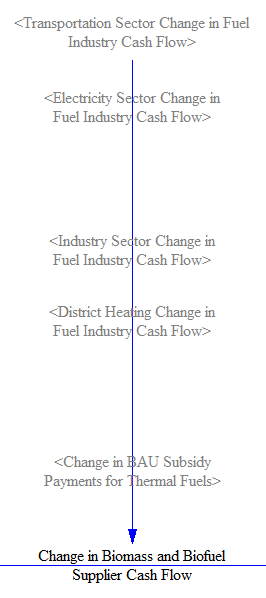

## General Notes

The Cumulators sheet is where various quantities are totaled from the various model sectors.  These include emissions (by pollutant and converted to CO2e), electricity demand, fuel use, cash flow for the three main actors in the model (government, industry, and consumers), and cash flow for various specially-broken-out industries.  These totals are relatively straightforward; many more outputs are available on the [Additional Outputs sheet](additional-outputs.html).

## Pollutants and CO2e

The Energy Policy Simulator (EPS) totals the quantities of 12 pollutants emitted (or sequestered) from six sectors: transportation, electricity, industry (including agriculture), buildings, district heat, and LULUCF.  Industry sector emissions here include foreign leakage; see the [Industry Sector page](industry-ag-main.html) for details about leakage.  Pollutants are simply summed, then GWP values (using the user-selected GWP timeframe) are applied to convert them to CO2e.  The following screenshot shows the relevant structure:

## Electricity Demand

There are only three sectors that demand electricity: transportation, buildings, and industry.  The demand from these sectors is summed, and the sum is used as an input to the Electricity Sector of the model.  The following screenshot shows the relevant structure:

## Fuel Use

Although we do not need to know total fuel use or total primary energy use elsewhere in the model, we nevertheless total these things here, since they may be of interest as outputs for analysis.  First, to calculate the quantity of fuel used in the electricity sector, we multiply the amount of electricity generated by each power plant type by the heat rate for that type to find total fuel consumption.  (These heat rates are zero for plants that do not consume fuel, so the product results in zero fuel use.)  We add in the fuel used to power the CCS process in the electricity sector.  The structure is shown in the following screenshot:

Next, we add this fuel use to the fuel use of the other sectors.  All of the other sectors include fuel use totals on their sheets, so we do not need to calculate any more sector-specific totals here.  Note that we are not adding up energy carrier totals (electricity and heat), as these were in part produced by other fuels, and we don't want to double-count.  The structure is shown below:

Finally, we convert fuel use to total primary energy.  Since we're already working in energy units that are the same across fuels, our only task is to convert the electricity that was generated via renewables to primary energy.  This was done on the [Electricity Sector sheet](electricity-sector-main.html), so we take those  values and use them to fill in here for the renewable sources.  We continue to report no value for energy carriers (electricity and heat) to avoid double-counting in the primary energy total.  See the following screenshot for the structure:

Additionally, we calculate the change in BAU subsidy payments that result from the ending of BAU subsidies on thermal fuels, which are not broken out on a sector-by-sector basis.  (Increased subsidies are done through sector-specific subsidy policies, and decreased subsidies for non-thermal energy sources like wind or solar are only applicable to the electric sector.)  The relevant structure is below:

## Changes in Cash Flow

The model tracks changes in cash flow for three main actors (sometimes called "cash flow entities" in the model): government, industry, and consumers.  The "industry" actor excludes most impacts on several specially broken-out industries, which are reported separately.  This is important because the effects of many policies are different on one or two industries than they are on industry as a whole.  For example, a policy that improves the efficiency of coal-burning industrial equipment saves money for "industry" (because they buy less coal) but reduces cash flow for "coal and mineral suppliers" (one of the specially broken-out industries).

Insofar as a specially broken-out industry is affected by policies in the same manner as other industries, the impacts on that industry are part of the impacts on the "industry" actor.  For example, insofar as coal and mineral suppliers burn coal for energy to power their operations, the effect of improving the energy efficiency of coal-burning industrial equipment is to reduce their fuel consumption and thus reduce their expenditures on fuel.  (As this example illustrates, in most cases, the effects of a policy package on a specially broken-out industry are dominated by the broken-out portion.)

To calculate the total cash flow change, we simply add changes from the transportation, electricity, buildings, industry, district heating, and land use, land use change, and forestry (LULUCF) sectors for each entity.  We also account for changes in BAU subsidy payments for thermal fuels by the government, which are not broken up on a sector-by-sector basis.  (The increased cost of those fuels to purchasers is handled in each sector and so does not need a separate entry here.)  The model structure that sums cash flow changes for the three main actors is shown in the following screenshot:

There are five specially broken-out industries: capital equipment suppliers, electricity suppliers, coal and mineral suppliers, petroleum and natural gas suppliers, and biomass and biofuel suppliers.  (They are defined in this way so as to match the way cash flows are calculated in the EPS.  One could say that "capital equipment suppliers" in fact represent more than one industry, such as appliance manufacturers and vehicle manufacturers.  The model does not divide up cash flows between sub-industries within the specially broken-out industries listed above.)

Capital equipment suppliers tend to have positive cash flow, as policies cause businesses to buy more efficient equipment or to buy equipment sooner than otherwise.  Every sector may contribute to capital equipment supplier cash flow.  The relevant structure is shown below:

Cash flow changes for electricity suppliers come from the transportation, electricity, buildings, and industry sectors.  In the three demand sectors, cash flow changes are due to selling more or less electricity.  In this context, electricity is treated as a "fuel," so the impacts on electricity suppliers come from the electricity subscript of the impacts on the "fuel industry."  In the electricity sector, there are many components to electricity suppliers' cash flow change, as detailed in the [Electricity Supply - Cash Flow](electricity-sector-cash.html) page.  See below for a screenshot of the structure:

Cash flow changes for coal and mineral suppliers come from each of the sectors that consume coal: electricity, buildings, industry, and district heat.  As in the case of other fuels, the impacts are taken from the relevant subscript (in this case, the "coal" subscript) of the impacts on the "fuel industry."  Cash flows can also be impacted by reduction of BAU coal subsidies.  The relevant structure is shown below:

Cash flow changes for petroleum and natural gas suppliers come from every sector that consumes fuel: transportation, electricity, buildings, industry, and district heat.  As in the case of other fuels, the impacts are taken from the relevant subscripts (in this case, the "natural gas," "petroleum gasoline," "petroleum diesel," and "jet fuel" subscripts) of the impacts on the "fuel industry."  Cash flows can also be impacted by reduction of BAU natural gas or petroleum fuel subsidies.  The relevant structure is shown below:

Cash flow changes for biomass and biofuel suppliers come from the transportation, electricity, industry, and district heat sectors.  As in the case of other fuels, the impacts are taken from the relevant subscripts (in this case, the "biomass," "biofuel gasoline," and "biofuel diesel" subscripts) of the impacts on the "fuel industry."  Cash flows can also be impacted by reduction of BAU biomass or biofuel subsidies.  The relevant structure is shown below:

We assign the cash flows to elements of the "Cash Flow Industries" subscript, so they can all be managed within a single variable.