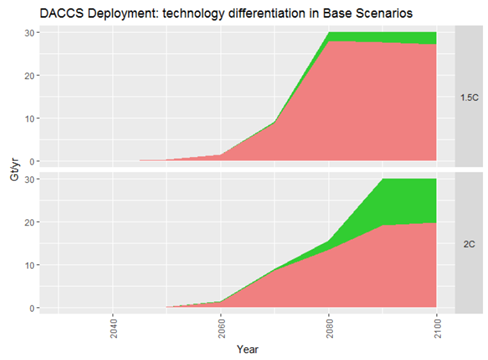
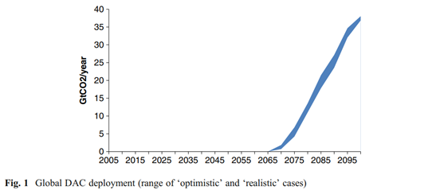
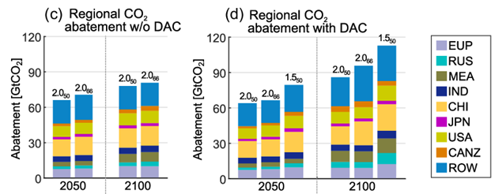

In the Energy Policy Simulator (EPS), Direct Air Capture (DAC) refers to the removal of carbon dioxide (CO2) from the atmosphere by technological means, such as by using machines containing hydroxide- or amine-based sorbents.  DAC does not refer to removing CO2 via afforestation, which is governed by a separate [afforestation and reforestation policy lever](afforestation-and-reforestation.html).  Nor does DAC refer to growing biomass, burning it for energy, and capturing and storing the resulting carbon (bioenergy + carbon capture and storage; BECCS), which is governed by the [CCS policy lever](carbon-capture-and-sequestration.html) and underlying input variables that specify the fuels used by power plants or industrial facilities.

## Policies to Support DAC

DAC involves significant energy inputs (for example, heat is used to regenerate the sorbent in hydroxide-based technologies), and the captured CO2 is unlikely to have significant economic value (since commercial demand for CO2 in products and for advanced oil recovery could be satisfied fully and more cheaply by CO2 captured from high-concentration exhaust streams).  Therefore, DAC is unlikely to be deployed at meaningful scale for economic reasons alone, and policy will need to be the primary driver of deployment.  Key policies to scale up DAC are:

* [Research and development support](research-and-development.html), as DAC is still an emerging technology and requires significant R&D to overcome technical barriers and drive down costs
* [A high carbon price](carbon-tax.html), which would pay DAC providers for the net carbon they remove from the atmosphere.  This would provide some financial incentive to engage in DAC.
* Direct governmental funding of DAC on a large scale, akin to wartime spending

## Required DAC Scale

A [2018 paper by Strefler et al.](https://iopscience.iop.org/article/10.1088/1748-9326/aab2ba/pdf) points out that DAC may now be required in order to limit global warming to 2 ºC:

> Only few of the 2 ºC scenarios in the AR5 database (IPCC 2015) derived solutions without CDR [carbon dioxide removal] because most models assessed the quick and deep emission reductions that would be necessary as technically infeasible.

Strefler et al. also indicate that DAC would need to be deployed at enormous scale to achieve a 2 ºC temperature target:

> Almost all of these scenarios rely heavily on large-scale carbon dioxide removal (CDR) on the order of several to several tens of Gt CO2 a−1 (Clarke et al 2014). For comparison, the current annual amount of CO2 used for enhanced oil recovery is 70 Mt CO2 (IEA 2014). Annual sequestration of 5 Gt CO2 would require a carbon capture and storage (CCS) industry of the size of today’s oil industry (IEA 2016). The dependency on CDR can only be expected to increase for 1.5 ºC scenarios (Rogeljet al 2015).

In other words, models that include DAC find that it would be needed on a scale that is at least as large as, and may be several times larger than, the entirety of today’s oil industry, to hit a 2 ºC (not a 1.5 ºC) target.  A statistic may help to [picture this in economic terms](https://www.investopedia.com/ask/answers/030915/what-percentage-global-economy-comprised-oil-gas-drilling-sector.asp):

> According to market research by IBISWorld, a leading business intelligence firm, the total revenues for the oil and gas drilling sector came to $2 trillion in 2017...  Since the 2017 estimates for worldwide gross domestic product range between $75 trillion and $87.5 trillion, the oil and gas drilling sector currently makes up something between 2% and 3% of the global economy.

It is difficult to envision DAC spending of one to several times the size of the oil industry, even with significant policy support.  Therefore, policymakers may achieve better results by emphasizing emissions reduction approaches that are more technologically mature and more likely to be deployed at large scale, such as renewable energy production, energy efficiency, industrial material efficiency, etc.

## DAC Modeling Approach in the EPS

DAC is an emerging technology, with large-scale use decades away, at a minimum.  Therefore, there is significant uncertainty in the timeframe and availability of DAC.

To estimate potential availability, the EPS uses a [2019 article by Realmonte et al.](https://www.nature.com/articles/s41467-019-10842-5), published in *Nature*.  This is one of the most recent studies on global DAC potential, and it has relatively aggressive deployment projections.  In the figures below from Realmonte et al., pink is hydroxide sorbent-based technology (the most mature DAC technology), while green is a newer, less mature amine-based technology.  The upper graph is the more aggressive 1.5 ºC scenario, while the lower graph is a less-aggressive 2.0 ºC scenario.  The 1.5 ºC scenario begins deployment after 2045 and the 2 ºC scenario begins after 2050.  The EPS uses the more aggressive 1.5 ºC scenario as its DAC deployment potential.  (This reflects deployment given a 100% setting of the DAC policy lever, not a prediction of what is likely to actually happen.)  Note that even using these aggressive assumptions, relatively little DAC is deployed during the model run, because the model run ends in 2050, and the vast majority of DAC deployment occurs later.

Other peer-reviewed studies suggest that it will take longer before DAC can be deployed at scale.  An [inter-model comparison](https://link.springer.com/article/10.1007/s10584-013-0714-7) done by Chen et al. (2013) and cited in the IPCC’s recent [Global Warming of 1.5 ºC](https://www.ipcc.ch/sr15/) report, doesn't find any DAC deployment until after 2065.

A graph from a [2017 paper by Marcucci et al.](https://link.springer.com/article/10.1007/s10584-017-2051-8), also cited in the IPCC's Global Warming of 1.5 ºC report, is shown below.  Each scenario is labeled with its associated global temperature increase (2.0 or 1.5 ºC), and the subscript is the likelihood of staying below that temperature (e.g. 50 for a 50% likelihood, 66 for a 66% likelihood).  These graphs depict abatement, so taller bars are better.  The bars encompass a variety of emissions-reducing technologies, excluding DAC (on the left) and including DAC (on the right).  In 2050, the bars that exist in the “w/o DAC” scenario (2.050 and 2.066) are slightly higher than those same bars in the scenario with DAC.  This means that abatement through 2050 is actually lower (worse) in the scenarios that include DAC, likely because the computer model allows more emissions earlier because DAC compensates for them later.  This implies that through 2050, DAC has no net CO2 benefits and may even be harmful, if countries fail to cut emissions now because they anticipate DAC’s future availability.

As Realmonte et al.'s 1.5 ºC scenario has an aggressive DAC deployment timeframe relative to other high-quality, peer-reviewed literature, we feel it is a reasonable choice to represent the upper bound of DAC potential in the EPS.  This can be revised in future EPS releases as more clarity on the progress and promise of DAC technologies becomes available.  (Also, any model user may explore scenarios with more or less aggressive DAC deployment by [downloading the model](download.html) and [editing the input data](input-data.html) in geoeng/DACD).
