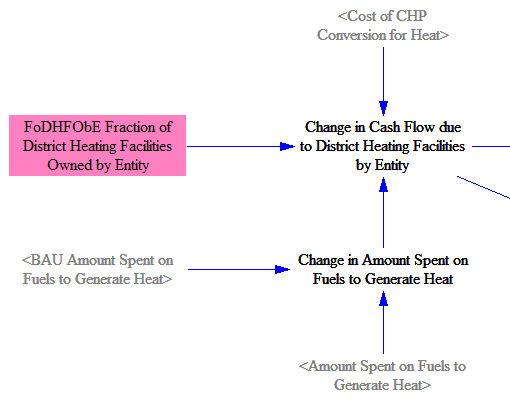

## General Notes

In the Energy Policy Simulator (EPS), "heat" is an energy carrier like electricity.  It is generated centrally by district heat plants (which may be CHP plants and also produce electricity), then distributed to buildings and facilities that use the heat.

"District heat" refers only to the heat that is generated centrally and piped to a building or industrial facility.  Heat that is generated and used on-site at an industrial facility is not "district heat" and is not included in the "heat" energy carrier total.  (Similarly, electricity that is generated and used on-site at an industrial facility is not included in the "electricity" total, as this total serves to inform the model how much demand the Electricity Supply sector must serve.)

In the U.S., district heat is a relatively minor part of the energy system.  It is only used by commercial buildings, not by residential buildings, nor industrial facilities.  However, the structure in this model section supports countries for which district heat plays a more important role (so the model can be more easily customized by swapping input data).

All calculations for district heating (Policy case, BAU case, and cash flow) are handled on one sheet in the Vensim model.  As is the case for other sectors, the documentation here only discusses the policy case and cash flow, not the BAU case.

## Emissions and Fuel Use

First, we find the total usage of the "heat" energy carrier by the Buildings and Industry sectors, as shown in the following screenshot:

Next, we determine the fraction of district heat that is provided by combined heat and power (CHP) plants.  We assume these plants would have been run anyway in order to provide electricity, and so, are handled by the Electricity Sector.  Accordingly, we wish to only consider heat provided by "dedicated facilities" (i.e. non-CHP plants) in this part of the model.  The user may use the district heat CHP conversion policy to specify what fraction of heat provided by non-CHP plants in the BAU case should instead be provided by CHP plants in the policy case, thus effectively removing those plants from consideration within the "District Heating" model sheet.  The following screenshot shows the relevant structure:

Next, we determine the amount of fuel burned in order to provide district heat by dedicated district heat facilities.  We consider the efficiency of conversion of the chemical energy in the fuel to usable district heat (including thermal losses in the heat distribution system) as well as the fraction of heat provided by different source fuels.  This allows us to calculate the amount of fuel used to generate district heat by dedicated facilities, as shown in the following screenshot:

Finally, we apply the emissions intensities by fuel to obtain emissions by pollutant.  We use industry-sector (rather than utility-sector) pollution emissions indices, because district heat plants are smaller than utility-scale electricity generating plants and may be more similar to major industrial facilities in terms of size.  The relevant structure is shown below:

## Changes in Cash Flow

### Cost of Shifting to CHP Facilities

The model estimates the cost associated with purchasing necessary equipment to provide a greater share of district heat from CHP facilities, as a result of the district heat CHP conversion policy.  To do this, we begin by taking the difference between the amount of heat provided by dedicated (non-CHP) facilities in the Policy and BAU cases.  For purposes of cost calculation, we subtract out the change in total heat use (due to efficiency or pricing policies in heat-demanding sectors) from the amount of heat shifted to CHP facilities.  This effectively assumes that reductions in heat use come from reduced usage of dedicated facilities, rather than reduced usage of heat from CHP facilities.  The relevant model structure is shown in the following screenshot:

The quantity calculated above refers to the total amount of heat shifted to CHP facilities in the policy case relative to the BAU case.  For purposes of knowing how much equipment needs to be purchased in the current model year, we need to know the amount of shifting from dedicated to CHP facilities that happened in the current year.  To do that, we subtract last year's total shifted quantity from this year's total shifted quantity, as shown in the following screenshot:

We use the implementation cost of the policy to increase usage of combined heat and power (CHP) in the [Industry Sector](industry-ag-main.html) to represent the cost of increasing the usage of CHP for provision of district heat, since CHP equipment prices specifically for district heat plants are not available (and might be largely the same as CHP equipment prices for industrial facilities).  We separate out the increase in taxes paid based on the capital equipment tax rate.  The change in spending, minus the change in taxes paid, is received by the "capital equipment suppliers" actor.  The following structure shows the relevant calculations:

### Cash Flow Changes due to Spending on Fuels and Fuel Taxes

In each of the BAU and policy cases, the amount of fuel consumed to generate district heat is multiplied by the cost per unit energy (by fuel) to determine the total amount spent of fuel.  The quantity of fuel consumed is multiplied by the amount of tax per unit energy to determine the quantity that was spent on taxes on the district heat fuels.  We take the difference in the quantity of taxes spent in the BAU and policy cases to find the change in taxes paid.  We take the difference in total amount spent on fuels, and we subtract the change in taxes paid, to find the change in amount of money going to the fuel industry (by fuel), which we reallocate into more meaningful Industry categories on the [Cumulators page](cumulators.html).  See the following screenshot for the relevant model structure:

### Allocated Cash Flow Changes by Actor

First, we determine the amount spent by actors who own district heating facilities (government and industry).  To do this, we find the total amount spent on fuels to generate heat, add the amount spent on equipment due to the CHP conversion policy, and divide up this total between government and industry based on the share of district heat facilities owned by government and by industry.  The structure that performs these calculations is shown below:

Finally, we break out the amount spent by industry and by government into separate variables, for clarity.  We add the tax revenue to government cash flow.  The relevant structure is shown below:

