## General Notes

In the Energy Policy Simulator (EPS), "heat" is an energy carrier like electricity.  It is generated centrally by district heat plants (which may be CHP plants and also produce electricity), then distributed to buildings and facilities that use the heat.

"District heat" refers only to the heat that is generated centrally and piped to a building or industrial facility.  Heat that is generated and used on-site at an industrial facility is not "district heat" and is not included in the "heat" energy carrier total.  (Similarly, electricity that is generated and used on-site at an industrial facility is not included in the "electricity" total, as this total serves to inform the model how much demand the Electricity Supply sector must serve.)

In the U.S., district heat is a relatively minor part of the energy system.  It is only used by commercial buildings, not by residential buildings, nor industrial facilities.  However, the structure in this model section supports countries for which district heat plays a more important role (so the model can be easily customized by swapping input data).

All calculations for district heating (policy case, BAU case, and cash flow) are handled on one sheet in the Vensim model.  As is the case for other sectors, the documentation here only discusses the policy case and cash flow, not the BAU case.

## Emissions and Fuel Use

First, we find the total usage of the "heat" energy carrier by the Buildings and Industry sectors.

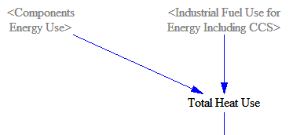

Next, we find the fraction of district heat that is generated from each fuel (e.g. coal, natural gas, etc.).  The BAU fractions are taken in as time-series input data, and the fractions in the policy case can be affect by the District Heat Fuel Shifting policy lever.  This lever allows the user to shift the fuel mix from the BAU case to whatever fractions are specified for the policy case in `RHFF Recipient Heat Fuel Fractions`.  The total heat use is then divided up by the fuels that provide that heat.

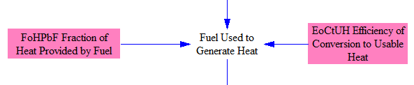

Next, we determine the fraction of district heat that is provided by combined heat and power (CHP) plants.  BAU data break out the CHP share of district heat by fuel, to allow for the circumstance where heat-providing CHP plants tend to more often burn one fuel type (such as natural gas), while dedicated heat plants tend to more often burn a different fuel type (such as coal).

We assume CHP plants would have been run irrespective of heat demand in order to provide electricity, and so, these plants should be included within the Electricity Sector.  To avoid double-counting these plants, we only consider heat provided by "dedicated facilities" (i.e. non-CHP plants) in the "District Heating" part of the model.

The user may use the district heat CHP conversion policy to specify what fraction of heat provided by non-CHP plants in the BAU case should instead be provided by CHP plants in the policy case, thus effectively removing those plants from consideration within the "District Heating" model sheet.

We remove the fraction of heat provided by CHP plants, to obtain the amount of heat provided by dedicated CHP facilities.

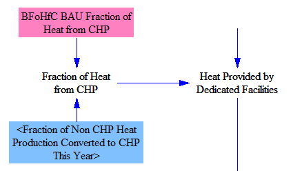

Some heat can be lost through the boiler walls, and in transmission and distribution systems (e.g. for hot water or steam), and there may be other inefficiencies in heat plants and distribution systems.  We calculate the amount of fuel that dedicated district heat facilities must burn in order to meet the heat demand, accounting for heat losses and inefficiencies.

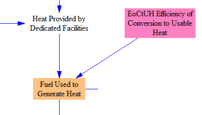

We separate out any electricity demand by district heat facilities, to include in the total electricity demand, which is calculated on the [Cross-Sector Totals](cross-sector-totals.html) sheet.

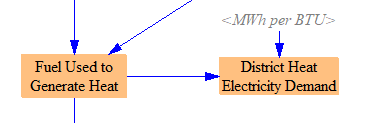

Finally, we apply the emissions intensities by fuel to obtain emissions by pollutant.  We use industry-sector (rather than utility-sector) pollution emissions indices, because district heat plants are smaller than utility-scale electricity generating plants and may be more similar to major industrial facilities in terms of size.  We also report a version of the emissions summed across fuels, so that total emissions of each pollutant from the District Heating sector can be more quickly assessed.

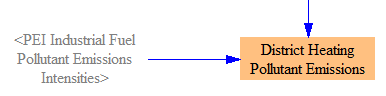

## Changes in Cash Flow

### Cost of Shifting to CHP Facilities

The model estimates the cost associated with purchasing necessary equipment to provide a greater share of district heat from CHP facilities, as a result of the district heat CHP conversion policy.  To do this, we begin by taking the difference between the amount of heat provided by dedicated (non-CHP) facilities in the Policy and BAU cases.  For purposes of cost calculation, we subtract out the change in total heat use (due to efficiency or pricing policies in heat-demanding sectors) from the amount of heat shifted to CHP facilities.  This effectively assumes that reductions in heat use come from reduced usage of dedicated facilities, rather than reduced usage of heat from CHP facilities.  The relevant model structure is shown in the following screenshot:

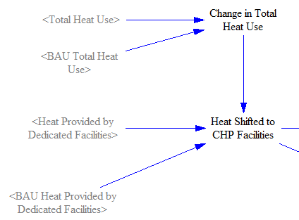

The quantity calculated above refers to the total amount of heat shifted to CHP facilities in the policy case relative to the BAU case.  For purposes of knowing how much equipment needs to be purchased in the current model year, we need to know the amount of shifting from dedicated to CHP facilities that happened in the current year.  To do that, we subtract last year's total shifted quantity from this year's total shifted quantity, as shown in the following screenshot:

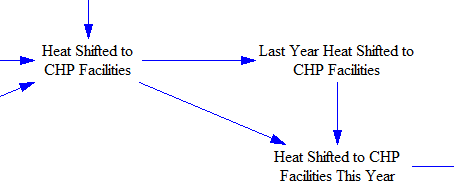

We use the implementation cost of the policy to increase usage of combined heat and power (CHP) in the [Industry Sector](industry-ag-main.html) to represent the cost of increasing the usage of CHP for provision of district heat, since CHP equipment prices specifically for district heat plants are not available (and might be largely the same as CHP equipment prices for industrial facilities).  The resulting change in spenrevenue ding is then assigned to ISIC 28 (Machinery and equipment not elsewhere classified), for use in the [Cross-Sector Totals](cross-sector-totals.html) sheet and, ultimately, in the [Input-Output model](io-model.html).

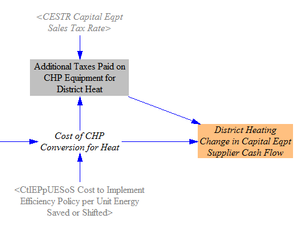

### Cash Flow Changes due to Spending on Fuels and Fuel Taxes

In each of the BAU and policy cases, the amount of fuel consumed to generate district heat is multiplied by the cost per unit energy (by fuel) to determine the total amount spent of fuel.  The quantity of fuel consumed is multiplied by the amount of tax per unit energy to determine the quantity that was spent on taxes on the district heat fuels.  We take the difference in the quantity of taxes spent in the BAU and policy cases to find the change in taxes paid.  We take the difference in total amount spent on fuels, and we subtract the change in taxes paid, to find the change in amount of money going to the fuel industry (by fuel).

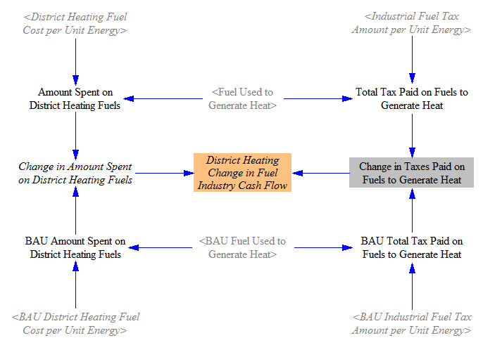

### Allocating Expenditures and Revenues

District heat facilities are part of the "other energy suppliers" cash flow entity, so we assign all expenditures on fuel and equipment by district heating facilities to this cash flow entity.  We also divide by the total quantity of heat generated to find the change in expenditures (positive or negative) per unit heat, which is used to adjust the price of heat on the [Fuels](fuels.html) sheet.

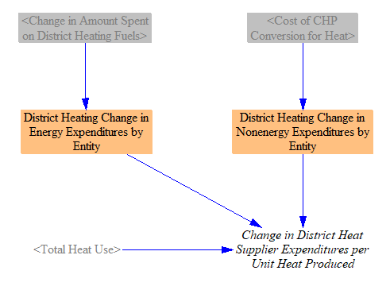

Changes in fuel tax revenues are allocated to the government.  Changes in revenues from equipment sales are allocated to the "non-energy industries" cash flow entity.  (They were already also allocated to the proper ISIC code for use in input-output calculations, as noted above.)  Changes in revenues from selling fuels are allocated to the corresponding fuel suppliers.

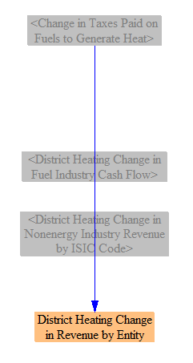
