The "Electricity Sector - Cash Flow" tab determines the policy impacts on cash flow for electricity suppliers, with cash flow changes from the following categories: operations and maintenance (O&M), fuel, generation construction, subsidies, batteries, transmission construction, and a rebate for sequestered CO2 if the carbon tax is enabled.  The sheet calculates the total change in electricity supplier cash flow per unit electricity produced, which is used to adjust the price of electricity on the "Fuels" sheet.  It also assigns the electricity sector cash flow changes to recipient actors.  The rest of this page will discuss each of these steps in more detail.

## Cost Components

### Change in O&M Costs

The model compares both fixed and variable O&M costs using the structure shown in the screenshot below:

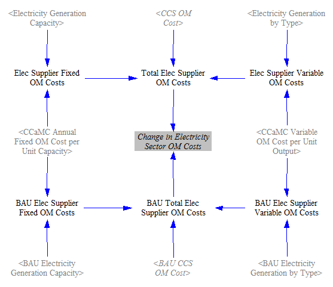

Neither "Annual Fixed O&M Cost per Unit Capacity" nor "Variable O&M Cost per Unit Output" can be affected by the policies chosen by the user.  Therefore, the only differences in O&M costs derive from different amounts of capacity of each power plant type, and different amounts of power generated by each power plant type, in the BAU and policy scenarios.  We take the quantities of capacity and generation straight from the "Electricity Sector - Main" and "Electricity Sector - BAU" pages.  We also add in the electricity sector CCS O&M cost (again, potentially different between the BAU and policy cases).  The actual value of CCS O&M cost, disaggregated by sector, is calculated on the [Carbon Capture & Sequestration](ccs.html) sheet.  Taking the difference between the sums of the BAU and policy O&M costs yields the overall change in O&M costs due to the policy package.

### Change in Fuel Costs

The following model structure calculates the change in cost, fuel industry cash flow, and taxes paid due to spending on fuels:

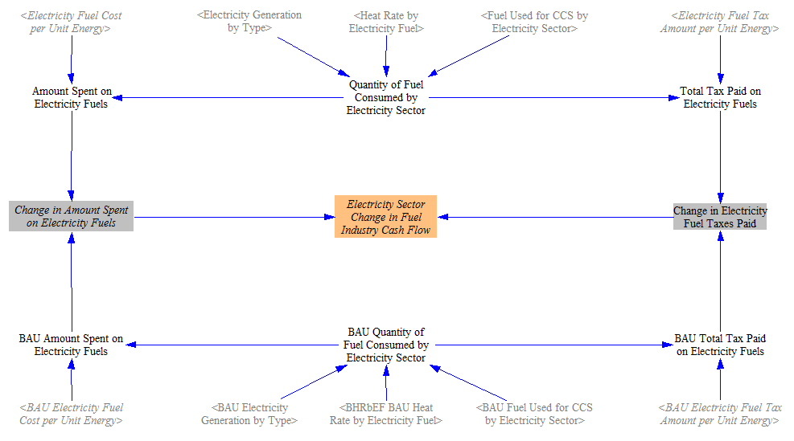

For each of the BAU and policy cases, we find the quantity of fuel consumed to supply electricity by multiplying the electric generation (by power plant type by quality level) and the heat rate (efficiency) of power plants.  We add in the fuel used to power the CCS process by the electricity sector- this quantity is calculated on the [Carbon Capture & Sequestration](ccs.html) sheet.

We find the total amount of money spent on electricity fuels (including taxes) by multiplying the amount of fuel consumed by the fuel cost per unit energy.  We find total taxes paid on fuels by multiplying the quantity of fuel consumed by the amount of fuel tax per unit energy.  The difference in amount paid between the BAU and policy cases gives the change in amount spent on electricity fuels, which we use (below) to help find the change in electricity supplier costs per unit energy.  The difference in amounts of taxes paid gives the change in taxes, which will be assigned to government.  Taking the difference in amount spent minus the difference in taxes paid yields the change in cash flow for the fuel industry (disaggregated by fuel, because we break down this industry into more meaningful industry categories on the [Cross-Sector Totals](cross-sector-totals.html) sheet).

### Change in Generation Construction Costs

The following model structure calculates the change in cost due to construction of electricity generating facilities:

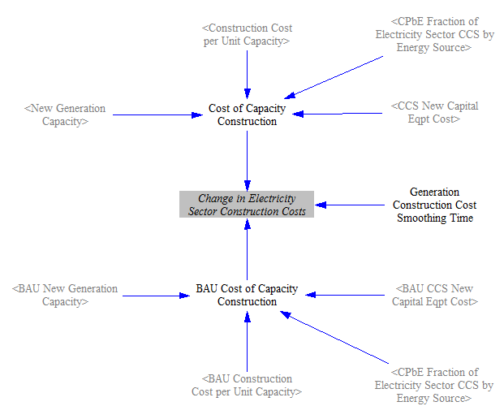

The construction cost per unit capacity is the same in the BAU and policy cases, so the main difference arises from different quantities and types of power plants being constructed in each scenario.  Additionally, if the carbon capture and sequestration (CCS) policy is activated, the policy case may involve the construction of a greater amount of CCS equipment.  The costs in each case are subtracted from each other, and a smoothing function in Vensim (set to a 5-year smoothing time) is used to even out unrealistic spikiness that comes from dramatically different amounts of capacity being built in adjacent years.  Five years was chosen as a compromise between more smoothing (a longer timeframe) and avoiding the average in of too many "zero" values from beyond the model run period (a shorter timeframe).

### Change in Subsidy Payments

The following structure handles differences in subsidy payments caused by the policy package:

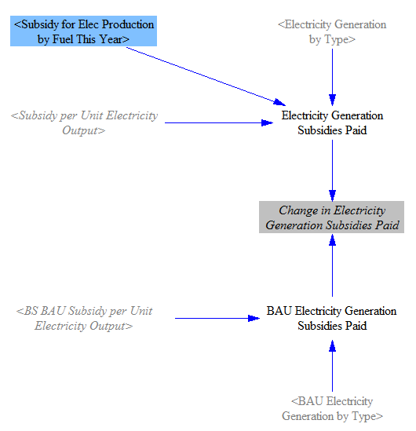

In the BAU case, BAU subsidies are applied to the BAU electricity generation by type.  In the policy case, changes in the BAU subsidies (which can be reduced by one policy lever) and new subsidies (which can be applied by a different policy lever) are added, and the sum is multiplied by the electricity generation by type.  As with other costs, we take the difference between the BAU and policy cases.

### Rebate for Sequestered CO2

In the event that the carbon tax policy is enabled, electricity suppliers receive some positive cash flow for sequestering CO2, as shown in the following structure:

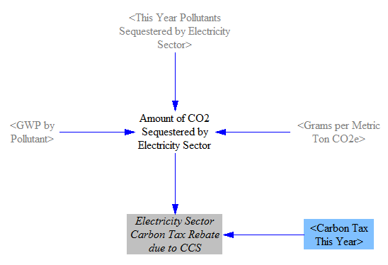

First, we convert the amount of CO2 sequestered in the Policy case from grams of pollutant to metric tons of CO2e.  (Although "This Year Pollutants Sequestered by Electricity Sector" is subscripted by pollutant, only CO2 has a non-zero value for its amount of sequestration.)  We multiply this by the carbon tax rate to determine the "rebate" received for sequestering the CO2.  In reality, electricity suppliers are likely to have to pay carbon taxes, so this "rebate" is merely a lowering of electricity suppliers' carbon tax bills, rather than a net payment of money from government to electricity suppliers.

Note that we don't subtract the amount of CO2 sequestered in the BAU case, because we are looking for the difference in rebate amount paid in each case, and the rebate amount paid in the BAU case is always zero (because there is no carbon tax in the BAU case).  Hence, the entire rebate paid on the policy side- the total amount of CO2 sequestered multiplied by the carbon tax rate- is the difference between the two cases.

### Change in Battery Costs

The model determines the change in expenditures due to the construction of chemical batteries.  Batteries are one of four technologies for which the model endogenously calculates cost declines based on total deployment.  The cost declines are based on the number of doublings of battery capacity relative to the start year, as shown in the following structure:

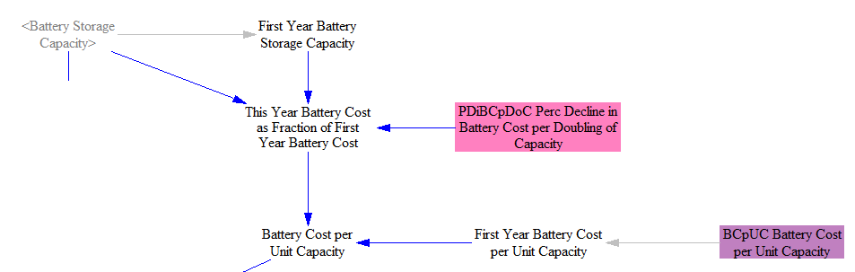

We find the difference in total capacity of deployed battery storage between the BAU and policy cases.  Then we compare this quantity to last year's quantity, to determine the amount of battery storage built this year.  This is multiplied by the cost of batteries per unit capacity, as calculated above.  The structure is as follows:

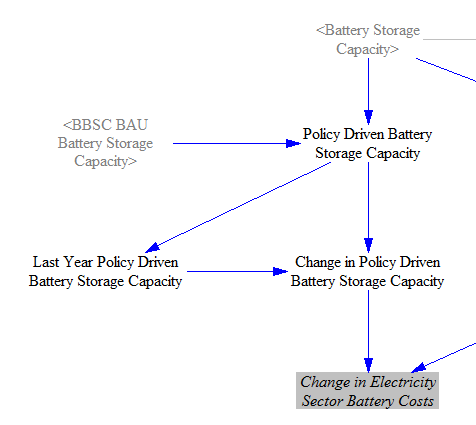

### Change in Transmission Costs

When the policy that increases transmission build-out is enabled, the following structure estimates the cash flow impacts:

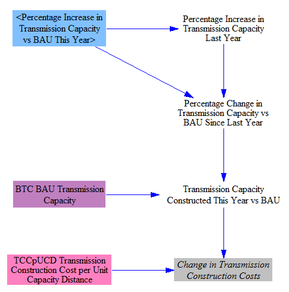

Each year, the percentage increase in transmission capacity relative to BAU is provided by the policy set by the model user.  The default implementation schedule for this policy is a linear increase, meaning that transmission additional to the BAU case is built at a linear rate, reaching the user-specified percentage increase in the end year.  We subtract the percentage increase in transmission capacity relative to BAU last year (for example, 20%) from the increase relative to BAU this year (for example, 25%) to find the incremental increase this year as a percent of BAU transmission capacity (5% in this case).  This incremental increase is multiplied by the BAU transmission capacity to find the quantity of transmission constructed this year (in MW*miles).  Note that BAU transmission capacity is not constant, so these are percentages of different BAU values (20% of last year's BAU quantity vs. 25% of this year's BAU quantity), so the amount of transmission built each year is not the same, even thought the policy is ramped in linearly.  However, BAU transmission growth is slow, so the amount of transmission built in each year in response to the policy is very nearly constant.  Lastly, we multiply the quantity of transmission built this year by the construction cost per unit capacity to obtain the change in construction costs.

### Change in Electricity Import and Export Costs

The model also calculates the amount spent on buying electricity (from beyond the borders of the modeled region) and selling electricity to entities outside the borders of that region.  For imports, we estimate the price of electricity as sold by entities beyond the model borders via the BAU cost of electricity for industry.  (We use a BAU value because policies within the modeled region should not affect prices from producers beyond the modeled region.  We use the cost to industry because industry is a large consumer, as is a neighboring region, and it avoids the problem of some regions attempting to keep electricity prices artificially low for individual building owners.)

We multiply the price of imported electricity by the amount imported in the BAU and Policy cases, then take the difference to find the change in amount spent on importing electricity:

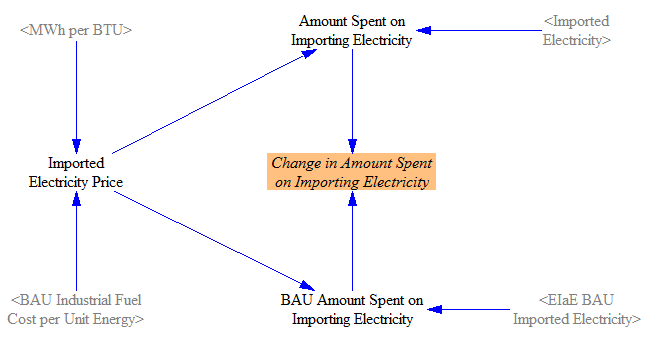

We perform a very similar calculation for electricity exports, but using the Policy case rather than BAU electricity price, since we're now considering electricity sourced from within the model borders, where policies are in effect:

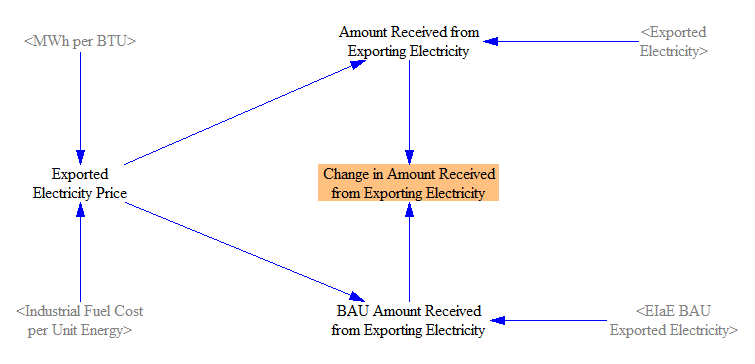

## Summing Cash Flow Changes for Electricity Suppliers

We use the following structure to total the cash flow impacts from all of the cost components discussed above:

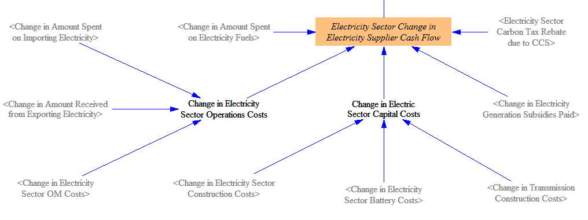

We simply add all of the changes in cost together.  Positive changes (increases) in fuel costs, O&M costs, construction costs, battery costs, and transmission costs all count as negative cash flow for electricity suppliers.  Positive changes in subsidies paid and carbon tax rebates due to CCS count as positive cash flow for electricity suppliers.  Note we here use the umbrella term "electricity suppliers" to refer to the entities that do all of these things: buy new power plants, buy fuel to operate the power plants, receive subsidies for generating electricity, pay for new transmission lines, etc.  In reality, different entities might handle some of these tasks (e.g. independent power producers might build and run plants, a distribution utility might build transmission lines, another company or even homeowners might provide battery services, etc.)  It should be understood that impacts on "electricity suppliers" affect any or all of these entities insofar as they are responsible for the activities whose cash flow impacts are calculated in the model.

We allow changes in cash flow for electricity suppliers to affect the market price of electricity.  The variable used to perform this adjustment is calculated using the following structure:

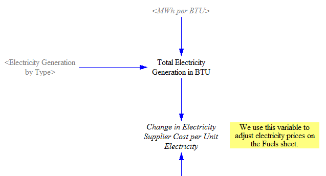

The actual adjustment of electricity prices is performed on the [Fuels sheet](fuels.html).  This assumes that increased costs are ultimately passed on to electricity consumers, as electricity sales are the ultimate source of funds for electricity suppliers.  If this effect is not desired, a user may enable the policy "Boolean Prevent Policies from Affecting Electricity Prices" on the "Policy Control Center" sheet.  This will disable this feedback loop and electricity prices will reflect BAU projections through 2030.  This might be most applicable if electricity prices are expected to be fixed irrespective of other regulatory initiatives (like a carbon tax, an RPS, etc.) and/or if the government is likely to absorb the cost to electricity suppliers for compliance with these policies, allowing electricity prices to remain the same.

## Assigning Cash Flows to Money Recipients

As with other sections of the model, changes in cash flow for one actor affect other actors.  The last section of this sheet calculates the impacts of cash flow changes for electricity suppliers on the actors they pay or who pay them.

The following structure deals with O&M costs, which happen to be the only type of electricity sector expense that is, in part, paid to consumers:

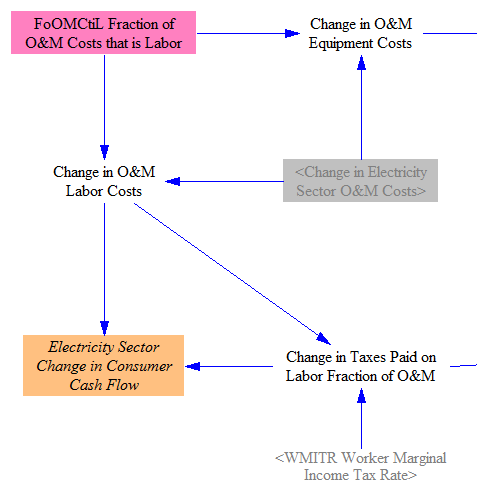

The total change in O&M costs is split between equipment and labor, according to the current division of O&M costs between these two uses.  The change in O&M labor costs goes to consumers, less the taxes paid on that incremental payment to labor, which is calculated based on the marginal worker income tax rate.  These taxes will go to the government.

Changes in equipment, including the equipment portion of O&M, are handled via the following structure:

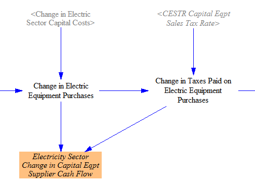

The change in capital costs (which consists of generation construction, battery, and transmission costs) are added to the equipment fraction of O&M to obtain a total "Change in Electric Equipment Purchases."  A fraction of this change is separated out for taxes, based on the capital equipment sales tax rate.  The remainder goes to capital equipment suppliers, which (like electricity suppliers) are one of the specially-broken-out industry categories in the Energy Policy Simulator (EPS).

This screenshot of the final piece shows the summation of all the cash flows affecting government: taxes on the labor fraction of O&M, taxes on equipment purchases, and taxes on electricity fuel purchases (calculated in the "Change in Fuel Costs" section above).  It also shows two quantities the government pays out: subsidies and a rebate for sequestering CO2 in the event of a carbont tax:

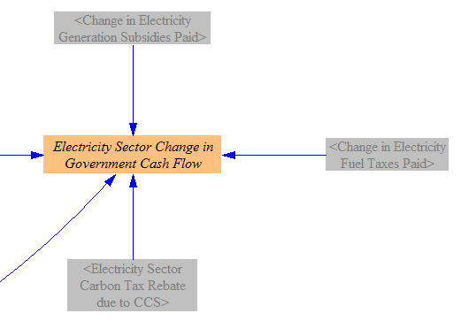
