## General Notes

In terms of structural complexity in Vensim, the Electricity Sector is the most complicated sector.  This is in large part because the nature of some of the policies we wish to represent (for example, pricing policies or a renewable portfolio standard) affect electricity suppliers' decisions about which power plant types to build, potentially resulting in dramatically different electricity sector structures depending on the user's chosen policy settings.  We are not simply changing the efficiency or the type of fuel consumed by an item (like a building component in the Buildings Sector), but substituting different generating technologies that have different properties (heat rates, fuel needs, flexibility needs) and may be dispatched differently based on the dispatch calculation section of the model.

As a result, we must construct our own BAU scenario, based on the decision-making logic in Vensim, rather than simply reading in projections of capacities or electricity output as input data.  Otherwise, when the policies are all disabled, the "policy case" in the model would not match the BAU case, because the "policy case" is still being assembled via our decision-making logic, even when no policies are turned on.

In general terms, the "Electricity Supply - Main" sheet examines how much power is needed, including transmission and distribution losses.  Then, it builds more power plants to supply that need (based on various factors such as the cost of building and operating different types of plants, as well as policies selected by the user).  The model ensures there is enough "flexibility" on the grid to support the wind and solar being built, or if flexibility-constrained, it will build something else instead.  It also checks to ensure there is enough peaking capacity to meet peak demand, and if not, it builds peaking power plants to meet that need.  Finally, it chooses what power plants to dispatch to meet the electricity demand, sums fuel use, and calculates pollutant emissions.  Each of these steps is explained in more detail below.

## Power Plant Types and Quality Levels

The model includes eight types of power plants: coal, natural gas, nuclear, hydroelectric, wind, solar PV, solar thermal, and biomass.

In order to represent differences in characteristics between plants of the same type (say, between an older and a newer coal plant), the model also uses the concept of "Power Plant Quality Levels."  Plants of different quality levels may have different properties, most importantly, different heat rates (i.e. fuel efficiencies).

We divide plants into three quality levels:

* preexisting retiring
* preexisting nonretiring
* newly built

The "preexisting retiring" quality level represents the average plant (of a given type) that exists at the start of the model run (in 2013) and is projected to retire by the end of the model run.  The "preexisting nonretiring" quality level represents the average plant (of a given type) that exists at the start of the model run and is not projected to retire by the end of the model run.  The "newly built" quality level represents the average plant that will be built during the model run.  All capacity in the model has one of these three quality levels.

(In the U.S. dataset, we only use the "preexisting retiring" quality level, and it includes all preexisting plants.  This is because we have found that, in practice, there is no meaningful correlation between the properties of a plant of a given type (e.g. the properties of a coal plant) and whether or not it retires during the model run.  There are too many ideosyncretic considerations, such as old plants that are grandfathered into more recent environmental regulations, differences between states that will or will not let utilities recover their costs for inefficient plants, etc.  We leave all three quality tiers available in the model, so that the option to divide preexisting plants into two quality tiers will be available for Energy Policy Simulator (EPS) versions that represent other countries.)

There are several reasons why we choose to represent quality levels based on the average plant of a given type that will retire, will not retire, or will be built during the model run, as opposed to, for example, basing our quality levels on particular technology types (such as subcritical, supercritical ultra-supercritical and circulating fluidized bed coal plants).  One is that we may use the same category definitions for all plant types, allowing more uniform equations and representation in Vensim.  A good example is that all power plants built during the run are of the "newly built" quality level, rather than needing decision logic for how much of each type of coal plant is built in each year.  (That type of calculation can be handled outside of Vensim, when determining the numerical properties of the "newly built" quality level for a given plant type.)  Another reason is to help keep the model simpler: using technology-based categories is unnecessary to achieve a good representation of the effects of policies on the power plant fleet, and excess complexity makes the model harder to learn and to use.  Third, quality tiers don't always map perfectly onto technologies- it's possible to create a better-performing or worse-performing plant that uses the same core technology.

## Capacity Construction

### Determining Energy Need

The sheet begins by taking in the total amount of electricity demanded by the other sectors of the model.  It applies a transmission and distribution loss percentage to determine the amount of electricity that needs to be generated and dispatched (e.g. for off-site use) by power plants.  The transmission and distribution losses are reduced via the associated policy lever.  The structure is shown in the following screenshot:

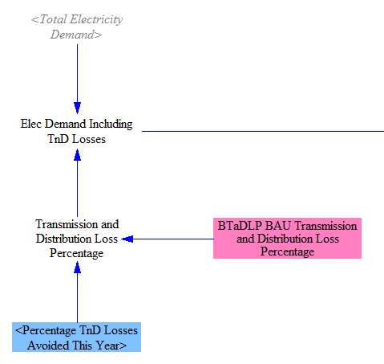

The model then adjusts the electricity demand to account for electricity imports and exports (both of which can be adjusted via policy levers).  Electricity imports and exports are not linked to the other policies in the electricity sector (e.g. if the user makes electricity very expensive by applying taxes, the model will not automatically increase imports).  They are simply read from BAU data and then modified by user-set policies, as shown in the following screenshot:

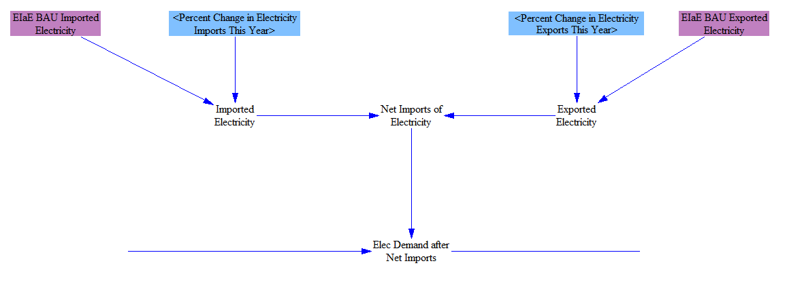

Next, the model determines what the "expected" capacity factor is of each different plant type and quality tier.  These are based on BAU input data, modified by the downtime reduction policy, which can be set separately by plant type and by quality tier by the user.  The simulator will also reduce the expected capacity factors of flexibility-demanding plant types (wind and solar PV) if they are exceeding the available flexibility point allotment.  This represents curtailment.  Curtaliment follows a smooth function that swiftly increases as the power plant type demands more than 100% of flexibility points.  The function is a polynomial defined with coefficients.  There is also a maximum possible reduction, to reflect the fact that these plants will still be able to be used for at least the peak hour or two each day.  This rarely comes into effect- it is most common if natural gas peakers that were providing needed flexibility retire, leaving the system in severe flexibility point deficit.  The following screenshot shows the structure for handling the calculation of expected capacity factors:

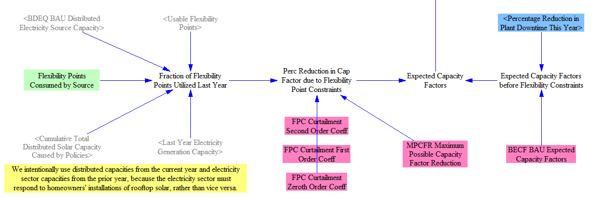

The model next determines the potential electricity output of the power plants that survive from the previous model year (i.e. the ones that have not retired).  As part of these calculations, we work with "Expected Capacity Factors," the capacity factors at which electricity suppliers desire to run each type of power plant.  Given the choice, an electricity supplier would sooner build a new nonpeaker power plant than attempt to rely on running a nonpeaker plant at greater than its Expected Capacity Factor.  (Peakers are handled somewhat differently, as discussed in the sections related to electricity dispatch calculations below.)  Therefore, expected electricity capacity factors are likely to be close to but not exactly the same as technical maximums.  We multiply the expected electricity capacity factors by hours per year, obtaining a multiplier that is used many times in the "Electricity Supply - Main" sheet to convert between capacity and potential electricity output.  (Actual output also factors into what is dispatched, which is addressed below.)

We subtract the amount of retiring potential electricity output from last year's potential output to determine the potential output that survives to the current year.  This is subtracted from the electricity demand that includes T&D losses to determine the new potential output needed this year, as shown in the following screenshot:

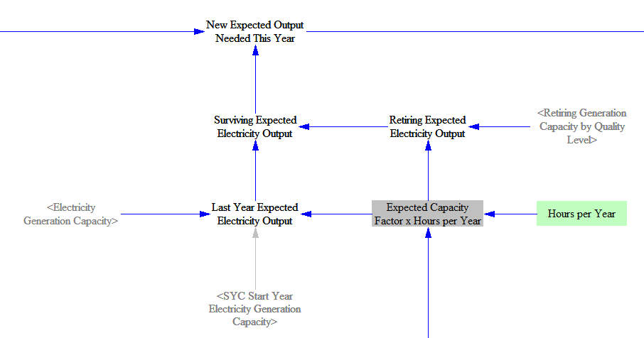

### Mandated Capacity Construction Policy

One of the electricity sector policies allows the user to specify a "mandated capacity construction schedule," or a particular quantity of capacity of each type of plant that is built in each year (set separately by year).  There can be a BAU and a non-BAU version of this schedule, to accommodate countries that have plans to produce particular amounts of capacity of particular types even in their BAU case, irrespective of economics.  (The BAU mandated capacity construction schedule for the U.S. is set to zero in every year.)  A policy lever (located on the "Policy Control Center" sheet) toggles between the BAU and non-BAU versions of the mandated capacity construction schedule.  The following structure applies the effects of the mandated capacity construction policy:

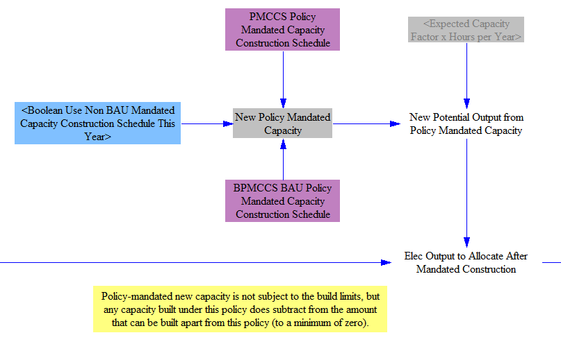

Finally, we convert from capacity to potential output using the target electricity capacity factors and determine the remaining amount of new potential output we need, after the mandated capacity construction policy.

### Renewable Portfolio Standard Policy

Next, the model determines what must be built to comply with the Renewable Portfolio Standard (RPS) policy.  Each type of power plant either  qualifies or does not qualify as contributing to the achievement of the RPS.  In the U.S., the RPS-compliant power plant types are non-hydro renewables.

Unlike all other policies in the Energy Policy Simulator (EPS), electricity suppliers are given foresight of the full schedule of RPS percentages for future years.  This allows them to intelligently build to meet a future RPS target, rather than encountering an unrealistic shock in the year when the target occurs (or the year when the target surpasses the percentage of qualfying renewables that already exist).

The calculation begins by determining the RPS percentage in each year of the model run, summing any BAU RPS values with any additional RPS specified by the model users.  (In the U.S. dataset, the BAU RPS is a generation-weighted average of state RPSes by year.)  This is shown in the following screenshot:

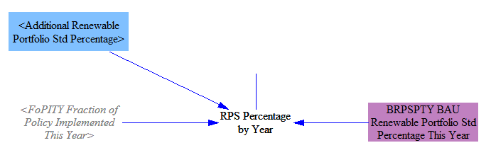

To minimize shocks, imagine that we draw lines between the percentage of RPS-qualifying sources that exist today and the RPS percentage in each future year.  We try to build to follow the steepest of these lines, which minimizes the steepness of the line that must be followed in any future year.  The relevant structure is shown below:

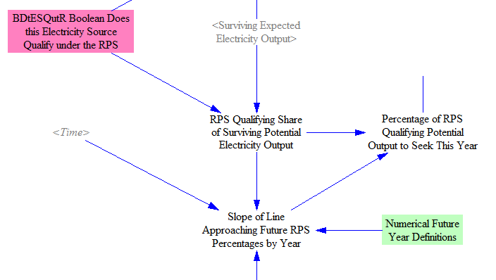

Next, we determine how much RPS-qualifying potential output we already have, both from that which survives from previous years and that which was mandated to be built this year by the mandated capacity construction policy.  We multiply the total demand (including T&D losses) by the "Percentage of RPS Qualifying Potential Output to Seek This Year."  If we already have enough RPS-qualifying potential output to reach this level, zero additional output is needed.  Otherwise, we need enough output to be built this year to provide the necessary fraction of the total demand from RPS-qualifying sources.  Note that this policy can cause power plants to be built even if there is enough non-RPS-qualifying potential output to meet that demand (for example, if we have nothing but coal plants, and a non-zero RPS setting, then some renewables would be built irrespective of the number of coal plants we have).  The relevant structure is below:

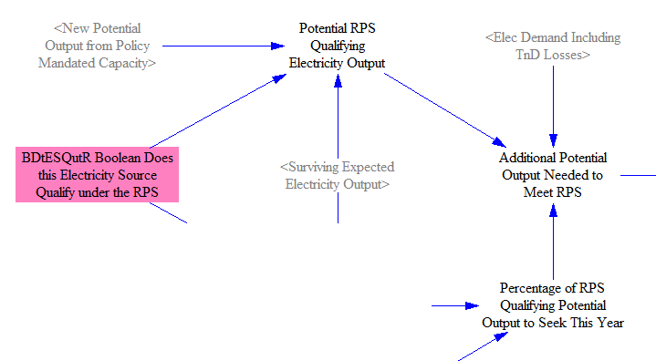

The next step is to allocate that new potential output among the different types of RPS-qualifying potential output that can be built.  The following screenshot shows the structure used to do this:

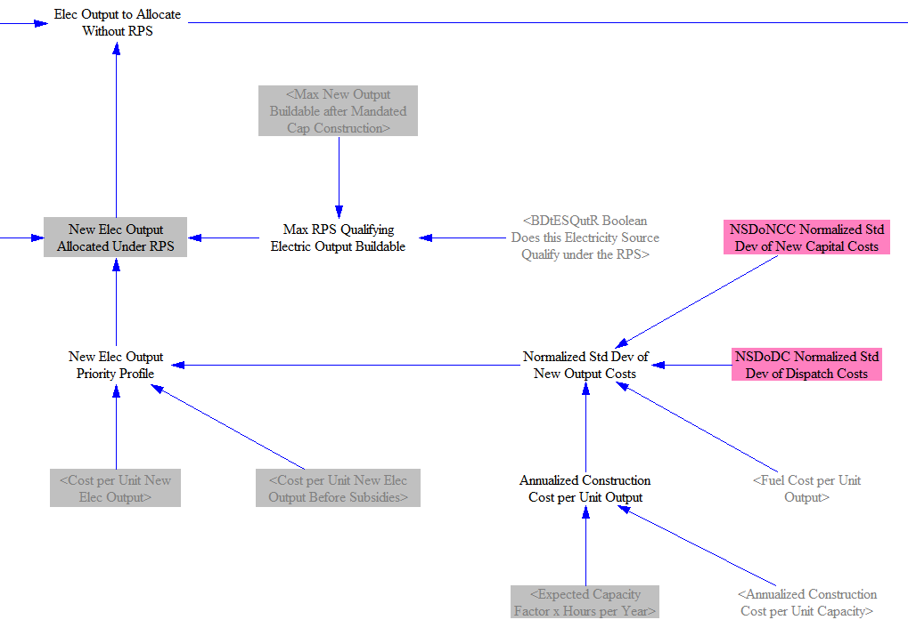

Note that although the variables in the diagram above refer to "output" rather than "potential output," all outputs at this stage in the calculation flow are "potential output" values.  Actual output values come after the dispatch calculations, below.

In order to perform an allocation in Vensim, using Vensim's ALLOCATE AVAILABLE function, we need to set up what is called a "Priority Profile."  This tells the model how to decide what to build.  We determine priority based on cost: the lowest-cost type of plant is built first, then the next-lowest cost, and so on.  However, each plant type does not have a single cost.  A plant type is represented by a normal distribution (a bell curve) of costs.  This reflects the fact that in the real world, conditions vary from project to project.  Some wind plants might be in windier areas than others.  Some coal plants might be located in places where it is more or less expensive to get regular coal shipments.  There can even be non-physical factors involved, such as differences in financing costs depending on project risk factors and borrower creditworthiness.  By representing each plant type's costs as a bell curve, we obtain much more realistic outputs than if we assumed the model built all of one plant type that it could before building any of the next-most-expensive plant type.

To define the bell curves for Vensim, we need to specify the curve's midpoint on the cost axis (the average cost of a plant type), the normalized standard deviation (the variability of costs for a given plant type, which reflects how different two projects building the same type of plant tend to be), and the volume under the curve (which reflects the maximum amount that could be feasibly built in a year, given limits on manufacturing capacity, the time of appropriately-skilled contractors, etc.).  The standard deviation and the costs are factored into the "Priority Profile" and the volume under the curve is factored into the allocation separately.  The allocation is actually performed in the "New Elec Output Allocated Under RPS" variable.  The following diagram is an illustration to help explain the allocation process in the model:

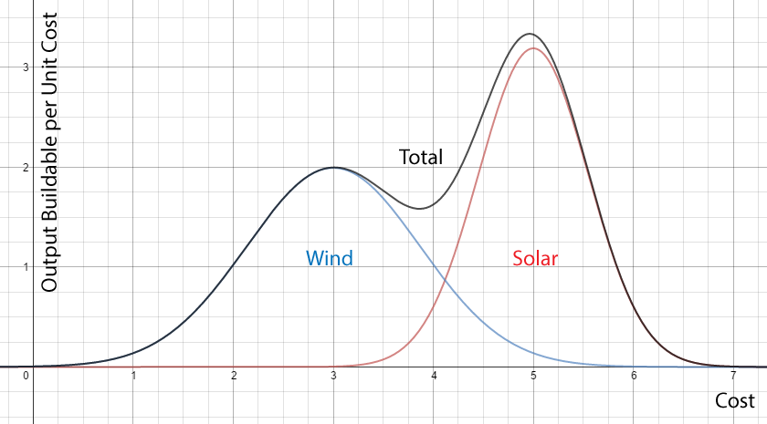

In this example, we only show two bell curves, though in the actual model, there is one bell curve during the RPS allocation for each of the RPS-qualifying plant types.  Each curve has its own unique midpoint on the cost axis (X-axis), its own standard deviation (curve width), and its own volume under the curve.  The Y-axis is the quantity of potential output that can be built at a given cost.  The volume inside these curves corresponds to a quantity of potential electrical output built: cost (X) multiplied by quantity per unit cost (Y).  We know the total amount of RPS-qualifying potential output we need to build, which is the volume under a portion of the black "Total" curve.  Accordingly, the model goes from left to right on the cost axis, filling in the volume under each individual plant type's bell curve, until a total amount of volume has been filled in equal to the quantity of RPS-qualifying potential output needed this year.  If this point is reached anywhere between the "3" and "6" numbers on the cost axis in the example diagram above, then a non-trivial amount of wind and a non-trivial amount of solar will be built, and neither wind nor solar will be built at the maximum possible rate this year.

Note that the model will not exceed the maximum amount of buildable output in the allocation function.  This means that if the model is in a state where the simulated year's level of deployment is so far behind the RPS in that year that even building all of the RPS-qualifying power types at the maximum possible rate cannot satisfy the RPS, then the RPS will not be met in that year.  In the example diagram above, this would correspond to needing so much RPS-qualifying output to be built in a single year that we reach the "7" number on the cost axis and still haven't encompassed enough volume under our curves.

Once we have allocated potential output under the RPS, the result is subtracted from the remaining potential output that still needs to be built after the mandated capacity construction policy, leaving the amount of demand that is still unmet after the RPS policy has been applied.

### Allocating Potential Output After the RPS

Following the RPS, if there is still unmet demand for potential output, we peform another allocation process to decide what else to build to satisfy the remaining demand.  This allocation works the same way as the allocation described above, except that all power plant types (not just RPS-qualifying types) are included, and the volumes under the curves of RPS-qualifying plant types are reduced by the amount of those types that was already built in the RPS compliance step.  The following screenshot shows the relevant structure:

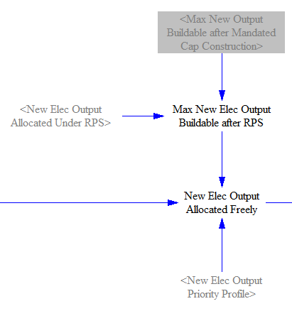

### Summing Up and Converting to Capacity

We sum up the potential output allocated under the RPS and the potential output allocated freely.  We convert this sum from potential output to capacity and add the capacity built under the mandated capacity construction policy to get the total amount of capacity built this year to meet energy need (as opposed to peaking need).  The following screenshot shows this process:

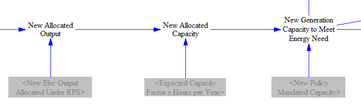

### Calculating New Peaker Capacity

After calculating the new capacity needed to meet energy need (e.g. to generate sufficient electricity to meet overall annual demand), we estimate the need for peaker capacity to meet peak demand.  We begin by estimating peak power demand, using a reserve margin (spare peaking capacity that utilities desire to possess beyond expected peak need) and peak demand.  Peak demand is estimated via a system load factor, which is the ratio of demand during an average hour to demand during the peak hour:

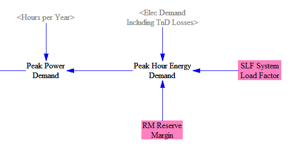

The model reduces the needed peak power demand by the amount of demand response capacity that exists on the system:

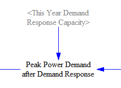

The simulator determines how much peaking capacity already exists on the system, using a set of peak time capacity factors (which are different and, generally, higher than the "expected" capacity factors that reflect the availability of each source over the course of the whole year).  This is subtracted from the total peak power demand (after demand response) to determine the unmet peak power demand:

Next, we use a set of Peak Time Capacity Factors to convert the peak power demand to be met into a desired amount of peaker capacity.  (In the case where more than one plant type is designated as a peaking plant type, we divide up the new peaker capacity to be built in proportion to the share of all peaking capacity represented by each specific type of peaker.)

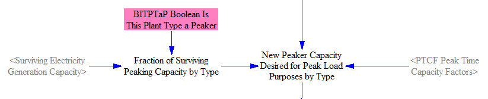

The model then determines how much of the desired peaker capacity actually gets built.  This will be the lower of the total desired quantity or the total amount buildable this year minus any that was already built this year as part of earlier calculation steps in the model (e.g. due to the mandated capacity construction policy, the RPS allocation, or the non-RPS allocation).  Then, any peaking capacity built this year is summed with capacity already built this year to meet energy need (e.g. from the earlier calculation steps) to find the total amount of generation capacity built this year.  These steps are shown in the screenshot below:

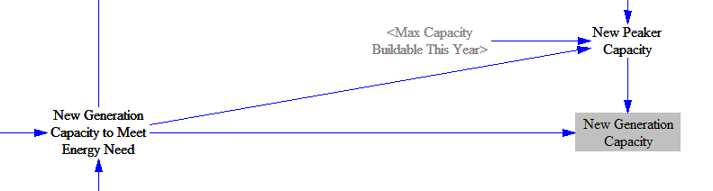

## Calculating Annualized Cost for New Output

The model includes calculations of cost to build and operate different types of power plants.  These costs are used in the allocation functions for construction of new capacity (described above) and in the dispatch calculations (described below).

### Fixed Costs per Unit Capacity

The model considers two types of fixed costs per unit capacity, construction costs and fixed operating and maintenance (O&M) costs.  For two plant types (wind and solar PV), the simulator features an endogenous learning curve, which calculates cost reductions relative to the base year based on total installed capacity.  The model determines the total capacity of these plant types (as of last year, i.e., before the model decides what to build in the current year) and determines how many doublings of capacity have occurred since the start year.  It then applies a percentage cost reduction based on the number of doublings of capacity, as shown below:

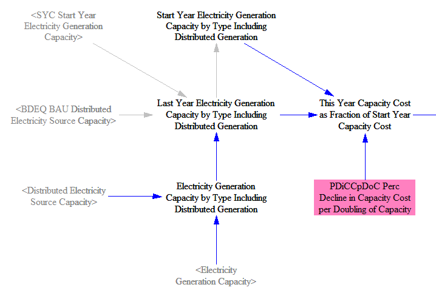

The cost reductions from endogenous learning are applied to the start year costs for wind and solar PV.  Other technologies also experience cost declines with time, but they are based on time-series data rather than installed capacity.  The effects of the user-set R&D lever are also taken into account at this stage, resulting in a total construction cost per unit capacity:

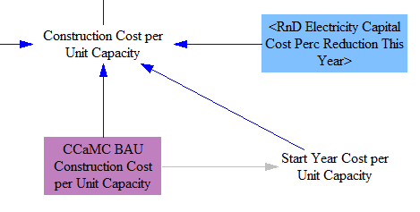

Since all other costs are annual, we annualize the construction cost to make it comparable.  We annualize the cost over the power plant's expected lifetime, applying a discount rate to account for the effect of time on the value of money.  (The model works in real dollars, so the discount rate does not need to account for inflation.)  The discount rate is taken in as input data and, like all input data, it can be edited by the model user.  After annualizing the construction cost, we add the fixed O&M cost, which is provided per unit capacity, to find the annual total fixed costs per unit capacity.

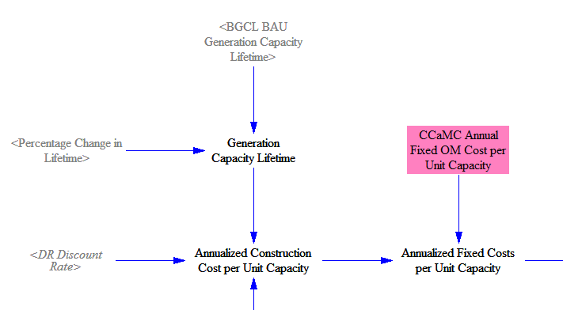

### Costs per Unit Output

The next portion of the model looks at the remaining costs of building and operating power plants and represents them per unit output, as shown in the following screenshot:

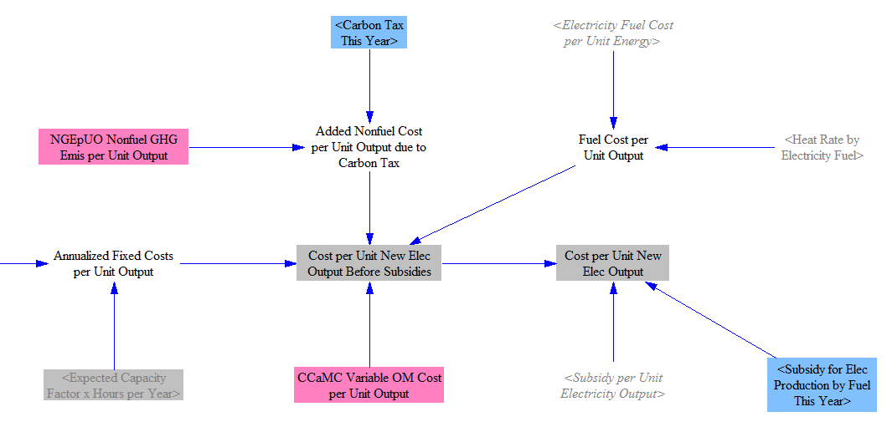

We add the following costs:

* Fixed costs per unit annual output (converted from fixed costs per unit capacity, found above)
* Variable O&M costs per unit output, which are taken in as input data
* Fuel cost per unit output, based on costs from the fuels page and the heat rates of the different power plant types (in this case, only looking at the "newly built" quality level, because this cost calculation supports the decision of what to build)
* Subsidies per unit output
* If the carbon tax policy is enabled, we add a certain amount of cost reflecting the "Nonfuel GHG Emis per Unit Output," or embedded carbon emissions in the equipment and building materials.  Although these emissions are associated with physical construction and therefore would seem to be most naturally related to unit capacity, the lifecycle analyses from which these data were obtained already converted them to a "per unit output" basis, so we use that directly.

We report the result both before and after subsidies, because the unsubsidized version must be used in the allocation functions, when converting normalized standard deviations of cost into standard deviations of cost.  This is because the normalization process in the cost source data only looks at the range of actual costs incurred, irrespective of whether subsidies later repaid the electricity suppliers.  For all other purposes in the model, we use the cost numbers that factor in subsidies.

## Tracking Capital Stock

In each model year, new power plants are built (unless there are enough surviving plants to meet demand) and old power plants are retired.  The means of determining how much of each type of plant is discussed above, so this section will mostly discuss retirements.  There are three retirement mechanisms: the natural retirement rate (which can be affected by the lifetime extension policy), retirements caused by the early retirement policy, and retirements caused when a power plant type becomes uneconomic to keep running.

The core tracking of capacity stock is handled with the structure in the following screenshot:

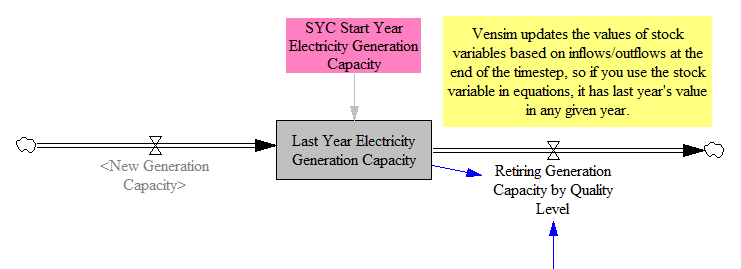

Electricity generation capacity is tracked using a stock variable.  Vensim processes inflows and outflows to/from stocks only after the relevant timestep has elapsed.  So in model year 2020, the stock variable has the value it had in year 2019 plus the inflows of 2019, minus the outflows of 2019.  To improve clarity about this process, the stock variable is named "Last Year Electricity Generation Capacity," and when the current year's capacity is needed in equations, the current year's inflow and outflow must be explicitly added or subtracted from the stock.  The "Start Year Electricity Generation Capacity" refers to the capacity in the year before the first calculated year of the model run.

Assigning retirements to quality levels is very simple.  If there are retirements of a given power plant type (such as coal), they will come out of the "preexisting retiring" quality level, unless there are not enough plants of that quality level left to retire.  After that, they come out of the "preexisting nonretiring" quality level, and if even that stock is exhausted, the retirements start coming out of the "newly built" quality level.  Remember that the nomenclature of the quality levels - "preexisting retiring" and "preexisting nonretiring" refers to the properties of the average plant of its type that will or will not retire during the model run in the BAU case.  By enabling certain policies, it is possible to retire plants of higher quality tiers.  This is normal model behavior.

The structure that handles normal (as opposed to "early") retirements is shown in the following screenshot:

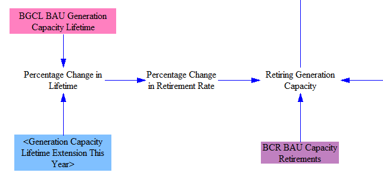

Our input data provide a particular amount of capacity of each type that is projected to retire in each year of the model run.  Since these data are not based on power plant lifetimes, we implement the lifetime extension policy as a change in the BAU retirement rate (i.e. retirements are reduced by the same percentage as that by which the lifetime of plants is being extended).  This representation can be thought of as what would happen if the system were to reach steady state.  If a lifetime extension policy were to be implemented suddenly, one would expect zero retirements of that power plant type for at least a number of years equal to the magnitude of the lifetime extension, followed by a resumption of retirements at the regular rate.  Eventually, the system would approach the steady state, as electricity suppliers begin planning and building plants when taking the longer lifetime into account.  The latter approach may be more realistic within the model's run period, but our input data make it questionable to model a "sudden" life extension policy, and representing the policy in the steady state manner may provide more of a sense of the policy's long-term effects.

Finally, we have two mechanisms that drive "early" retirement.  The first is economic: when the cost of electricity from one new plant type (that is, including annualized construction costs) is made higher than in the BAU case via the user's policy settings, some amount of additional retirement will occur, if it is a plant type susceptible to economically-incented retirement.  The second is the user-set early retirement policy.

For economic early retirement, for each of the BAU and Policy cases, we calculate the mean cost per unit electricity output from sources designated as significant enough to be factored into this mean.  We find the difference in cost between each plant type and the mean.  Then we look at whether this difference has grown (a plant type has become more expensive relative to its same-case mean) in the Policy case relative to the BAU case.  This process is shown in the following screenshot:

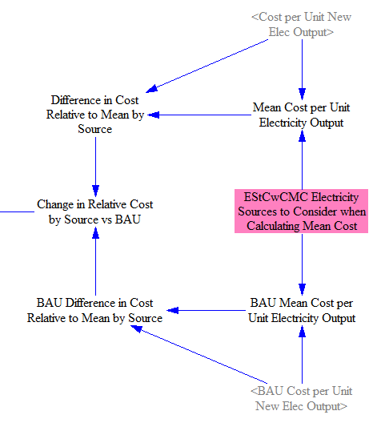

Next, we use a conversion factor to estimate potential early retirements based on the magnitude of the cost increase.  We limit retirements of a given type of plant to the total amount of capacity that existed last year of that type.  Only certain plant types are subject to cost-based early retirement.  Plant types whose costs are overwhelmingly in the construction phase (renewables and nuclear) are immune because, even if it became much cheaper to build other plant types, there is no reason to stop using existing plant types for which the high upfront costs were paid, when operating costs are minimal.  Peakers are immune because they do not compete on the basis of how cheaply they can provide energy, but rather based on the system services they provide, which is not what is being measured in this part of the model.  The following screenshot show the conversion from relative cost increases to potential capacity to be retired early:

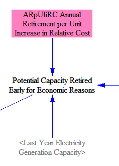

We limit the total allowable capacity to be retired early due to price increases to the total maximum buildable capacity of non-peaker plants that were made cheaper (relative to the mean price) in the Policy Case than they were in the BAU case.  This limit prevents unreasonably high retirement rates to be triggered if a single plant type (say, wind) becomes cheap, while all other plant types become more expensive.  If this limit is lower than the potential capacity to be retired early, we reduce the potential early retirements of each type of plant in proportion to that plant type's share of total potential early retirements until we reach the limit.  This is handled in the following structure:

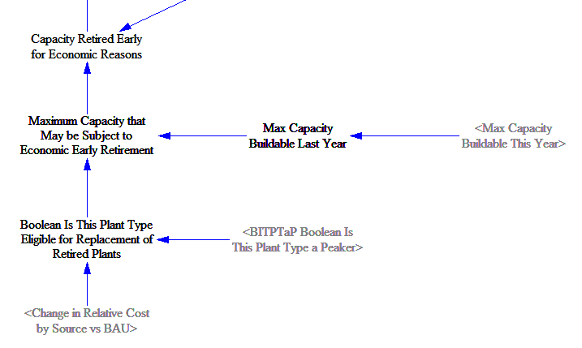

Finally, we add in any retirements specifically mandated by the user via the early retirement policy to find the total capacity retired early.

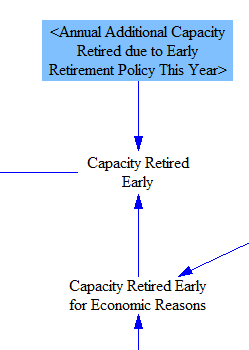

## Flexibility Points and Quantity of Buildable Capacity

Two of the power plant types in the model- solar PV and wind- are "variable" generation sources.  This is because their ability to generate power depends on the presence of wind and sunlight.  (While solar thermal also requires sunlight, its thermal inertia makes it less vulnerable to changes in sunlight levels, so we do not treat it as a variable source in terms of requiring flexibility support in this model.)  Certain technologies can provide flexibility services, such as energy storage systems, fast-ramping natural gas peaker plants, and the like.  These flexibility services make it easier to integrate more variable generation into the electric grid, because they can take up the slack in the event of a drop-off in sunlight or wind (and in the case of energy storage systems, they can absorb extra power during sunny or windy times to recharge themselves).

The Energy Policy Simulator (EPS) uses annual timesteps, whereas the timescale over which solar and wind variability happens is often an hour or less.  Therefore, we use an abstraction to capture the need for flexibility to support renewables deployment.  The model defines a synthetic unit called a "flexibility point."  One flexibility point is a quantity of flexibility on the electric grid that is able to support one megawatt (MW) of variable generation.  Flexibility points are based on capacty (MW) rather than electricity output (MWh) because the relevant factor is the extent to which flexibility can address large, relatively sudden power needs (demand spikes or temporary drops in generation from variable renewables), not the portion of the year during which flexibility providers will be called upon to deliver these services.  Therefore, the different capacity factors of different plant types or quality tiers does not influence their flexibility point requirements (as these things affect generation but not capacity).

We allow each flexibility point to support one MW of wind and one MW of solar PV, because wind and solar PV tend to need assistance at different times of the day.  (Solar PV needs support at night, and generally, wind needs support during the daytime.)  We use results of a modeling study that used a fine timescale and a detailed electricity supply, demand, and transmission model to estimate the number of flexibility points provided by a given quantity of each of several technology options.

### Sources of Flexibility Points

Peaker plants are one source of flexibility points.  The structure representing them is shown in the following screenshot:

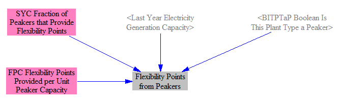

We find the available capacity of peaker plants.  Which types of plants count as peakers can vary based on model version (country or region represented), but often natural gas peakers and petroleum-fired power plants will qualify.  We convert peaker capacity to flexibility points based on the results of a separate modeling study, which we take in as input data.

Pumped hydro energy storage is the second source of flexibility points and uses the following structure:

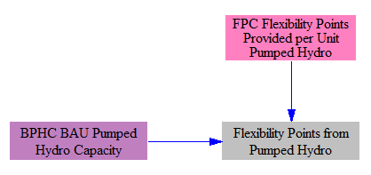

No policy affects the quantity of pumped hydro storage available.  We convert to flexibility points using a conversion factor that is in between those for two types of pumped hydro: pumped hydro that can only make two mode shifts (charging or discharging) per day and pumped hydro that can make many mode shifts per day.

The third source of flexibility points is battery energy storage, as shown in the following structure:

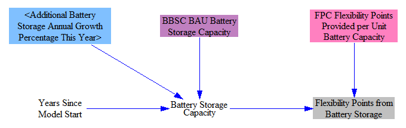

For cost purposes, the model assumes battery storage to consist entirley of chemical batteries, though it could also represent the flexibility benefits from similar technologies that make energy available on demand, such as compressed air or flywheels.  A policy allows the user to specify an annual growth rate above and beyond the BAU rate of non-hydro storage deployment.  As with other flexibility point-providing technologies, results of an electricity model are used to convert the quantity of storage into a number of flexibility points.

The next source of flexibility points is demand response, as shown in the following structure:

Demand Response refers to technologies or processes used to shift electricity demand to other times of the day, which can be used to lower peak demand and to assist with integration of variable renewables.  The demand response policy allows the user to specify a fraction of the additional demand response potential to be achieved, beyond BAU.  As with other flexibility point-providing technologies, results of an electricity model are used to convert the quantity of demand response into a number of flexibility points.

The last source of flexibility points is transmission capacity across the modeled region border (that is, into and out of the country, for a country-scale model).  Transmission within the modeled region is handled differently, as discussed in the next section.  Regions outside of the modeled region are assumed to have their own generation resouces and can provide energy at peak times or when there is a shortfall in variable generation, and so interconnecting with these areas provides flexibility that allows higher penetrations of variable renewables.  No policy in the model affects transmission across the modeled region border.  (The policy that promotes transmission refers to in-region transmission.)  The relevant structure is shown below:

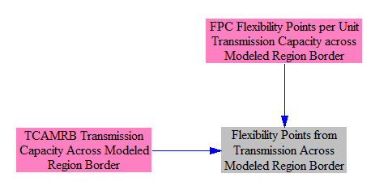

### Transmission

The EPS also includes the concept of electrical transmission capacity within the modeled region.  A source of flexibility points, such as an energy storage system, does no good if it is not connected to any variable generation.  Accordingly, transmission is used to link sources of flexibility points to the variable generation that needs flexibility support.  The following structure handles the interaction of transmission with flexibility points:

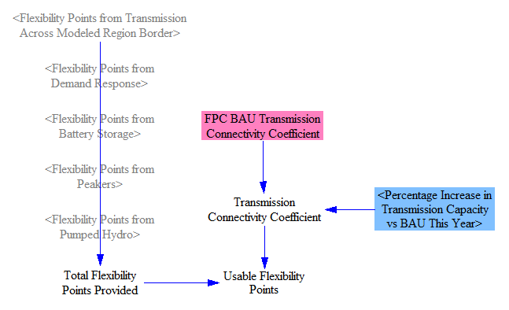

Since the EPS does not include geography of the modeled region, we use the concept of a "transmission connectivity coefficient" (TCC) to represent the level of connectivity between sources and sinks of flexibility points.  A TCC of "1" imples perfect connectivity of all sources and sinks of flexibility, as if any two points in the electric system were connected by unlimited transmission.  A TCC of "0" implies that no sources of flexibility points are connected to anything else.  All real-world electricity systems will have a TCC value between zero and one.

We estimate the existing system's TCC using the results of a major study by the National Renewable Energy Laboratory, which found the amount of transmission that would be needed to support a given amount of renewable capacity, given certain quantities of flexibility point-providing technologies (which we convert to flexibility points using the factors discussed above).  While this is not the only solution- it is possible to integrate just as many renewables with less transmission if more other things are built- it is the lowest-cost solution for renewables integration and therefore is the best choice for our BAU case.  A policy lever allows the user to increase transmission built-out by a percentage of BAU.  This only affects the TCC here, but on the [Electricity Supply - Cash Flow sheet](electricity-sector-cash.html), it is converted to units of physical transmission capacity, and from there, to costs.

Note that as power plants are built, we assume sufficient transmission is built alongside them to operate them in the same manner as existing plants in the BAU case.  For wind and solar PV, this means that the TCC remains unchanged as you build more wind and solar, rather than the TCC dropping (due to increased need for connectivity as there are more things to connect).  For other electricity sources, this simply means that they run at the expected capacity factors for their type and quality level, assuming they are dispatched via the dispatch calculations (discussed below).  In other words, as you build more plants, an amount of transmission necessary to maintain the same level of service enjoyed today is assumed to be built alongside, and this base level of additional transmission does not have its costs explicitly calculated and attributed to the policy package.  The transmission policy lever represents transmission build-out beyond this level, improving the service level of plants that require flexibility services.  The transmission built by this policy lever does have its costs attributed to the policy package.

### Maximum Buildable Capacity

Next, the model determines the maximum amount of capacity of each type that can be built in the current model year.  This is done in several steps.  The first step is to refer to a table of "lookups" that specify how much capacity can be built.  This allows, but does not require, the model to consider the quantity of a resource that has already been built when determining how much can be built in the current year.  Referring to the installed quantity is most relevant for newer technologies, like wind and solar PV, which are still in the process of scaling up.  Other methodologies are more appropriate for other technologies; these are handled inside the calculations that generate the Max Capacity Growth Lookup Table.  The structure is shown in the following screenshot:

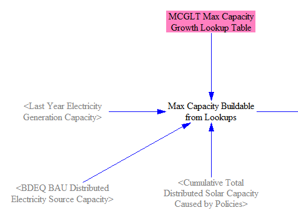

There is also maximum potential capacity of some sources, such as hydro and wind, that are location-dependent.  It is possible for a modeled region to exhaust all available sites for the construction of hydropower facilities, and to have powered or repowered all existing, suitable dams.  Depending on the region being modeled, it might also be possible to exhaust available sites for solar or wind power.  (In the U.S. model, the maximum potential capacities for all of the sources with such limits are so high as to have no effect on the model, irrespective of users' policy settings.  This may seem surprising in the case of hydro, since the U.S. has largely exhausted the good sites for large dams, particularly considering the environmental concerns that accompany building dams.  However, most of the additional potential hydro capacity in the U.S. comes from powering existing dams that are currently not equipped with power-generating equipment or improving the power-generating equipment on existing dams.  There are also some opportunities for very small-scale new hydro where there is no existing dam.  Taken together, these options are more than enough to allow for expansion of hydro through the end year of the model run at a rate greater than the rate actually predicted to happen in this model, even with substantial policy support.  The maximum potential capacities for the other relevant sources are even less likely to be reached.)  See the following structure for details:

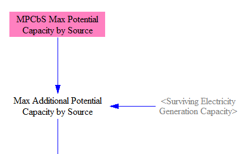

If more solar PV or wind is built than can be supported via flexibility points, the model begins curtailing power from these resources, and the expected capacity factors of new plants of those types are reduced accordingly.  Even so, due in part to the one-year delay before the curtailment is reflected in prices for newly built plants, or in cases of heavy subsidy of wind or solar PV, the model may sometimes try to build so much wind or solar PV that curtailment gets unreasonably high.  To avoid this problem, the model will not attempt to build wind or solar PV that would exceed the flexibility point limit by more than a certain percentage, set in the variable "FPC Target Maximum Fraction of Flexibility Points Used."  (This can be overridden by the mandated capacity construction policy, which is able to force particular types of plants to be built, even if there is not enough flexibility to allow them to actually be dispatched.)  The following structure implements this limit, which functions as a cap on capacity of flexibility-consuming resources that the model will choose to build on its own:

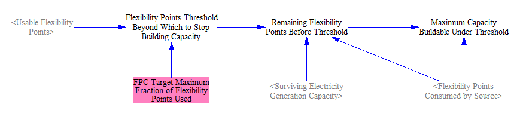

The lowest of these three caps determines the maximum capacity buildable this year.  (It is usually based on the maximum capacity buildable from lookups.)  Then, we determine how much capacity can still be built after the mandated capacity construction policy has taken effect, because we use this variable in our allocation calculations (described above).  The following screenshot shows the structure discussed in this paragraph:

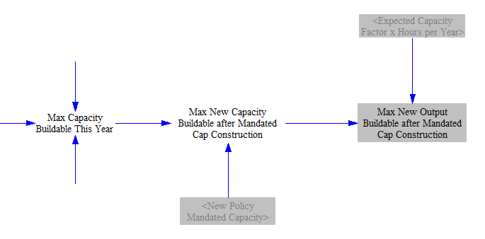

## Electricity Dispatch Mechanisms

The model includes two dispatch mechanisms: guranteed and least-cost.  Guaranteed dispatch is a versatile mechanism that allows the user to specify the priority ordering of different power plant types as well as what fraction of each type of plant is dispatched.  It can be used to represent environmentally-preferred dispatch, favoring coal plants that have preexisting contracts that guarantee them the ability to dispatch power, or anything in between.  Least-cost dispatch selects which plants run on the basis of lowest marginal cost.

### Guaranteed Dispatch Mechanism

The first part of the guaranteed dispatch mechanism simply calculates the total capacity available to be dispatched, summing the quantity that survived from the prior year with the quantity built in the current year:

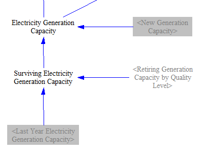

For non-peaker power plant types, we convert this capacity to potential electricity output using a set of "bid" capacity factors.  Plants either bid (offer to supply power) at their expected (annual average) capacity factors or at their peak time capacity factors, depending on whether they would be technically capable of running more than expected, if it delivered to them a positive return.  Renewables like wind and solar PV bid at their expected capacity factors, because creating electricity is free (no fuel cost), but how much they can supply is limited by the availability of sun and wind throughout the year.  Resources like coal and non-peaker natural gas bid at their peak time capacity factors, which are higher than their expected capacity factors (though still less than 1, because there are times when these plants are down for maintenance) and reflect how much power they would supply if it were needed to avoid a shortfall.  Since the model determines the need for new plants based on expected (not peak time) capacity factors, the model generally will not find itself in a situation where it has to rely heavily on running various plant types at capacity factors that significantly exceed the expected capacity factors, even when bid capacity factors are higher.  See the following screenshot for the relevant structure:

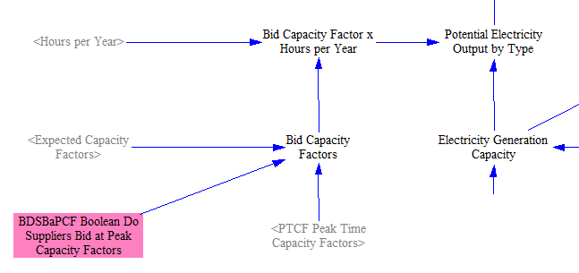

Peakers do not compete based on the affordability of their power, so a least-cost dispatch mechanism will choose not to dispatch peakers.  In the real world, peakers are in fact dispatched, primarily for their system regulation and flexibility benefits.  Therefore, the minimum possible dispatch of peakers is at their expected capacity factors.  (They can be dispatched more than this if required via the guaranteed dispatch percentages set by the user, but they are not dispatched as part of the least cost dispatch mechanism.)  This is handled in the following structure:

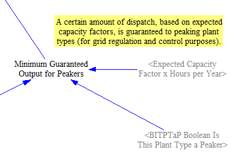

The model features both BAU and Policy case variables that govern guaranteed dispatch, so that the model can correctly handle countries that currently use systems other than least cost to dispatch power plants.  (The guaranteed dispatch quantity can be set to zero in the BAU case to simulate countries that dispatch non-peakers based solely on least cost.)

The user may specify a "Dispatch Priority by Electricity Source," which specifies the order in which plants should be dispatched.  For example, an environmentally preferred dispatch order might assign solar PV, solar thermal, and wind priority 1; biomass, hydro, and nuclear priority 2; natural gas priority 3; and coal priority 4.  The user may also specify a "Contracted Dispatch Percentage by Electricity Source," which specifies the fraction of the capacity of a given type that is subject to guaranteed dispatch.  (The remainder may be subject to least-cost dispatch later, if there is still unmet power demand after all contracts are satisfied.)  If a user wants to only use guaranteed dispatch, the percentage should be set to 100% for every power plant type.  A policy lever is used to toggle between the BAU and Policy case values for these variables, as shown in this screenshot:

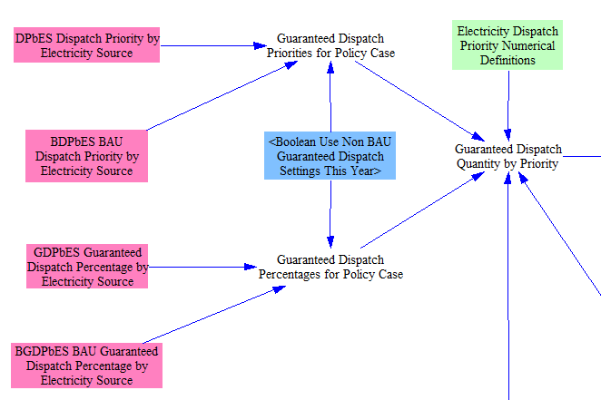

The model dispatches power sources with priority 1, up to the total quantity that is guaranteed.  Then it does the same for priority 2, priority 3, and so forth.  If all power demand is satisfied without fully dispatching the plants at a given priority level (say, level 3), then all of the priority 3 plants will be dispatched in proportion to their total capacity enough to meet demand, and no lower-priority plants will be dispatched.  If plants of all priority levels are dispatched enough to meet their contracts and there is still unmet demand, the remainder is satisfied via the least-cost dispatch mechanism.  The dispatch of different, guaranteed plants at different priority levels based on demand is shown in the following screenshot:

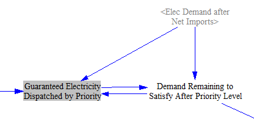

Note that the "Guaranteed Electricity Dispatched by Priority" and "Demand Remaining to Satisfy After Priority Level" variables in the screenshot above rely on mapping one subrange of the "Electricity Dispatch Priority" subscript to a different subrange of that same subscript, so as to cause Vensim to loop through each element of the "Electricity Dispatch Priority" subscript at each timestep.  This is an unusual but powerful way to use subscripts in Vensim.

### Least-Cost Dispatch Mechanism

First, we determine how much potential electricity output remains undispatched after the guaranteed dispatch process.  We exclude peakers, which are handled in the guaranteed dispatch mechanism.  The following screenshot shows the relevant structure:

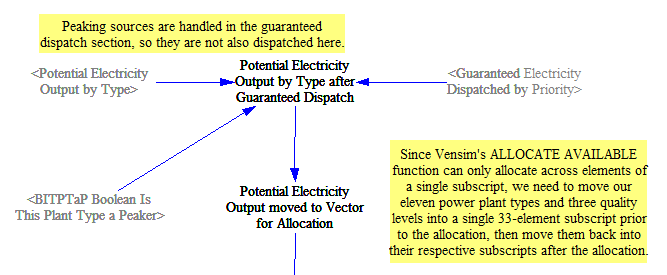

The only notable step in this process is the need to move all of the resulting values to a "vector" (a one-dimensional matrix) before using the values in the allocation function.  This is to work around a limitation in Vensim: the program is only able to perform allocation of a quantity into "buckets" defined by values of a single subscript.  However, our power plants are broken into buckets along two dimensions: power plant type (11 types) and quality level (3 quality levels).  The solution is to simply use a new, 33-element subscript (in the model called "Power Plant Type by Quality"), and load all of the values from our double-subscripted variable into the corresponding elements of the large, single subscript.

In setting up our priority profile (see the discussion of allocation above for a description of priority profiles), we must do something similar, as shown in the following screenshot:

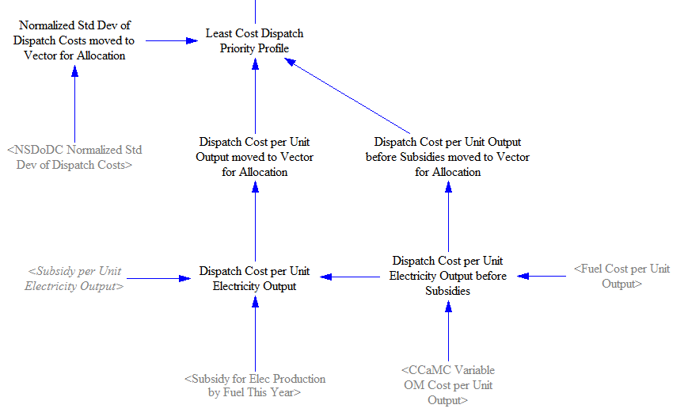

We find the cost per unit output (from fuel and variable O&M).  Then, we create a version that includes subsidies (for use determining the median dispatch cost, or midpoint of each bell curve) and a version that does not include subsidies (for converting from a normalized standard deviation to a standard deviation of each bell curve).  We move these values, as well as the standard deviation of dispatch costs, into 33-element vectors, so we can generate a 33-element vector Priority Profile, to use in the allocation operation.

We perform the allocation of remaining electricity demand on the vectorized quantities, then move them back into a two-subscript variable, "Electricity Dispatched by Least Cost," for use elsewhere in the model, as shown in the following screenshot.

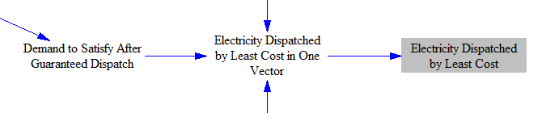

## Total Generation and Emissions

First, we sum the output from the two dispatch processes, as shown in the following screenshot:

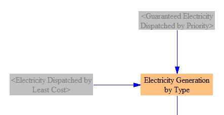

Next, we determine the pollutant emissions based on the generation by type and quality level, as shown in the following screenshot:

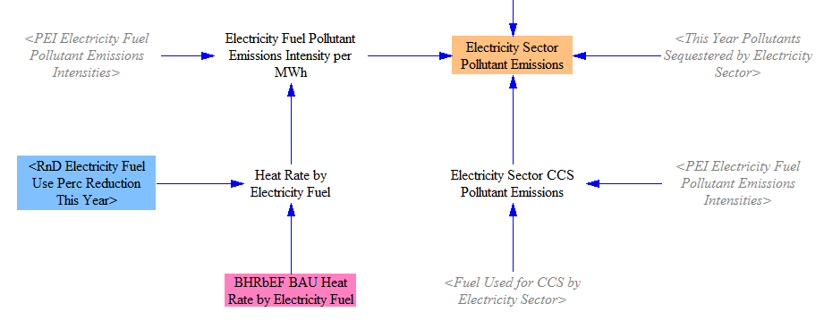

We use emissions indices (per unit energy in the fuel) and heat rates (energy units of fuel per MWh of electricity) to obtain pollutant emissions indices per MWh of electricity.  We also apply any carbon capture and sequestration that is performed by the electricity sector, reducing CO2 emissions but also increasing fuel consumption (to power the CCS process).  We apply the emissions indices per MWh to the total generation and add in the CCS effects to obtain an emissions total for the electricity sector by pollutant.

## Additional Electricity Outputs

This section includes a few calculated variables that may be of interest in evaluating the electricity sector's performance or characteristics.  Some of these values can be useful for debugging or evaluating the realism of the model's response to a given set of input data or policy settings.

We calculate the amount of curtailed electricity output (based on the reduction in expected capacity factors) from each source that requires flexibility points:

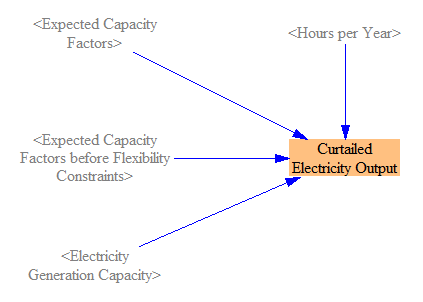

We report unmet electricity demand (if any), to make it easier to notice if there are any years with unmet demand.  Typically, there are not any such years.

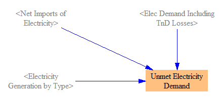

We determine the "achieved" capacity factors, which may differ from bid or expected capacity factors depending on the outcome of the dispatch calculations.  For ease of analysis, we also show the fraction of the expected capacity factors that were achieved:

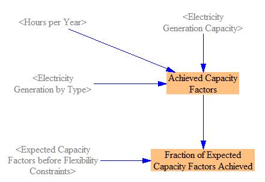

Primarily for purposes of analyzind model behavior, we report the fraction of buildable capacity of each type that was built in each year:

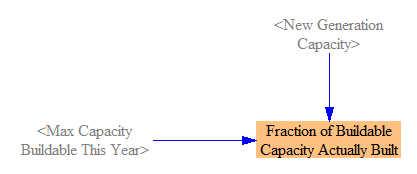

We report the percentage of electricity generated by each source (coal, natural gas, wind, etc.).  We also report "Renewable Electricity Generation Converted to Primary Energy."  This statistic is used in calculations of total primary energy, which are generally based on fuel consumption rather than electricity generation.  We include plant types that do not use fuel from the primary energy total with an "effective" heat rate (taken from the rate of coal plants) that makes them more comparable to other plant types in the primary energy calculation.  Primary energy is not used for any purpose in this model- it is simply reported.  This statistic may be of greater interest and use for non-U.S. countries.  It was originally added to accommodate the reporting requirements for a China version of this model.

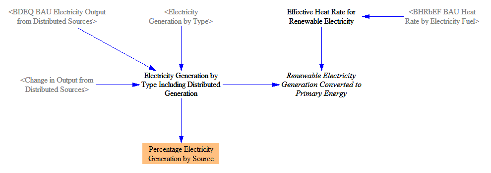
