## Defining Endogenous and Exogenous Learning

In the context of the Endogenous Learning sheet, the word "Learning" refers to research and development (R&D) progress that drives down the costs of certain types of technology.

Computer models can simulate learning in one of two ways: exogenous or endogenous.

- **Exogenous learning** takes data from outside of the simulation to determine the rate at which R&D progress occurs.  For example, the computer may take in (as input data) a schedule of prices of a particular type of technology, with lower and lower costs specified in each subsequent year.  Therefore, the price of this technology in the last year of the model run is known even without running the model.

- **Endogenous learning** calculates cost declines based on cumulative deployment of that technology up through each year of the model run.  The more widely that technology has been deployed, the lower the price gets.  This is typically specified as a percentage cost decline per doubling of cumulative deployment, to represent diminishing returns for each fixed quantity of technology deployed.  The theory behind endogenous learning is that cost declines do not come about simply because time has passed: cost declines are a consequence of scientists, engineers, and designers learning how to do things more cheaply as they deploy and optimize the technology, again and again, at larger scales.

## When to Use Each Type of Learning

Which type of learning is best to model a particular technology often comes down to the maturity level of that technology.

Exogenous learning is often the best choice for relatively mature technologies: those that have been in widespread commercial deployment for decades.  Examples include coal-fired power plants, natural gas furnaces in buildings, and gasoline-using internal combustion engine cars.  Such a large quantity of these technologies has been deployed to date that the increase in deployment over the course of the model run, as a percentage of the historical cumulative total deployment, is likely to be very small.  This may under-estimate the R&D advancement that is still possible for many mature technologies.  (For example, consider the substantial increases in gasoline-engine automobile fuel economy that have occurred in recent years in many countries.)  R&D advancement for mature technologies is not strongly linked to their deployment quantity, as people have already deployed so much of this technology that they've learned what they can from deploying it repeatedly and at scale.  A more important driver of advancement of mature technologies is the effort spent on optimizing them, sometimes using concepts or ideas from related fields of technology and engineering.  This effort can be spurred by policy, such as tightening fuel economy standards on vehicles, or a carbon tax.

Most technologies simulated in the EPS are mature technologies that utilize exogenous learning.

Endogenous learning is often the best choice for relatively newer technologies: those that have already achieved commercialization and are being sold in the market, but which have not been widely deployed for more than a decade or so.  Companies have not deployed these technologies frequently enough, at large enough scale, to have figured out all of the main cost-cutting and optimization techniques.  Deploying more of these technologies leads to discoveries and cost reductions.

The EPS uses endogenous learning for the following technologies:

- carbon capture and sequestration (CCS) equipment
- solar PV capacity (both utility-scale and distributed)
- onshore wind capacity
- offshore wind capacity
- batteries (including the batteries inside electric vehicles and grid batteries)

### Hard and Soft Costs

For solar and wind capacity, the endogenous learning is only applied to a portion of the costs, called the _hard costs_.  The remainder, _soft costs_, include the cost of things such as installation, supporting components such as frames/racks on which to mount solar panels, etc.  The soft costs of these technologies are handled via exogenous learning.

### Very New Technologies

Endogenous learning is not suitable for technologies that are too new (for instance, ones that haven't been commercialized yet).  These technologies may have a very small base of installed equipment (possibly even zero) from which to calculate doublings of the quantity of installed equipment.  This can lead to a large number of doublings of capacity in a very short time, as a technology moves from the laboratory bench to an early demonstration project or first commercial project, leading to unrealistically high predicted rates of cost declines.  Technologies in a laboratory are too new to follow predictable learning curves and should be modeled using exogenous learning (based on known costs from laboratory work and early demonstration deployments) until it has achieved enough of a foothold in the market to use as a meaningful base quantity from which doublings may be calculated.

There are ways around this issue, such as assuming a new technology will follow the same curve as an older, conceptually similar technology.  However, this approach can be inaccurate.

Some technologies the EPS models using exogenous learning because they are too new or too small-scale to use endogenous learning include:

- Direct air capture / geoenginerring equipment
- Hydrogen electrolyzers
- Hydrogen vehicles

## Relationship to EPS R&D Levers

The EPS includes a set of R&D levers that allow the user to increase the rate of technological advancement in his/her scenario relative to the BAU case.  The effect of these levers is additive to BAU learning, irrespective of whether the BAU learning was calculated exogenously or endogenously.

## Technology Deployment Outside the Modeled Region Affects Learning

In a world where technical knowledge is instantly shared and known globally, the total cumulative deployment of a technology worldwide would be the only driver of learning rate.  In a country where all knowledge is generated internally, and nothing is learned from the outside world, the deployment of the technology within the modeled region would be the only driver of learning rate.  The real world is situated between these two extremes.  Deployment of a technology outside the modeled region does influence the cost of the technology inside the modeled region, but not to the same extent as technology deployment within the modeled region.  We account for this using an input variable, `FoTOMRAEL Fraction of Technology Outside Modeled Region Affecting Endogenous Learning`, which is used to discount the effect of deployment outside the modeled region.

When modeling a country where little if any R&D work is done, and where industries tend to simply follow best practices developed abroad, `FoTOMRAEL` should be close to 1, indicating that global deployment, not local deployment, is the sole driver of learning in that region.  In contrast, when modeling a country that conducts a great deal of R&D and is on the cutting edge in developing novel best practices for manufacturing or product design, `FoTOMRAEL` should be smaller.

## Model Structural Components

In the EPS, actual costs paid for technology are calculated in the various sectors where that technology is purchased (e.g. industry, electricity, buildings, and transportation).  The role of the Endogenous Learning sheet is to calculate a ratio for each technology that uses endogenous learning specifying the cost of the technology in the current model year relative to the first simulated year.  These values are then used in other sectors.

### CCS

CCS deployment is measured in quantity of CO2 captured and stored annually, which correlates to the amount of operating CCS equipment.  We assume CCS equipment does not retire in meaningful quantities during the model run, so we can compare the amount of CO2 sequestered in each year with the amount sequested in the first year, without needing to do stock-and-flow tracking.

The CCS component begins with time-series input data specifying the quantity of CO2 sequestered globally, including within and outside of the modeled region.  The amount sequestered within the modeled region (from the EPS's [CCS sheet](ccs.html)) is subtracted to obtain the total outside the modeled region, and this is discounted by the `FoTOMRAEL Fraction of Technology Outside Modeled Region Affecting Endogenous Learning` (as described above).  This is time-series data, so we store and remember the total amount of capacity affecting learning that existed in the first year, to serve as our base from which doublings of deployed technology are calculated.

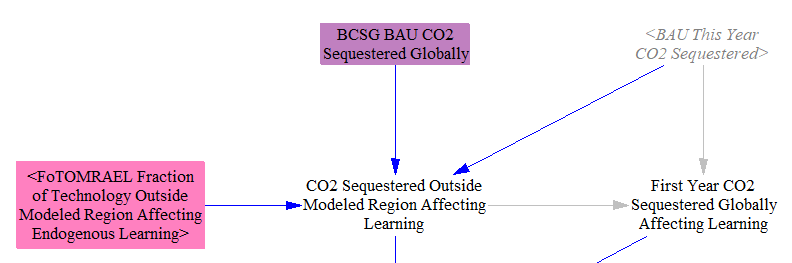

We compare the amount of CO2 sequested this year to the amount in the first year, calculating the number of doublings that have occurred.  The cost in the current year declines by the percentage decline per doubling of capacity specified in input data.

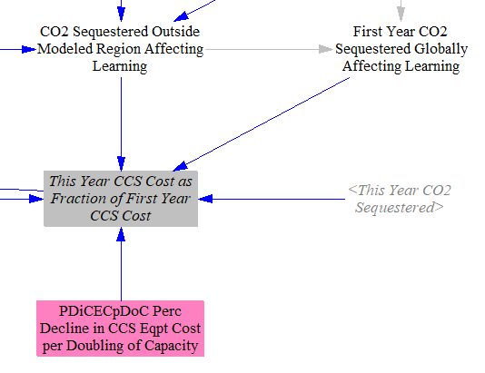

We compare this year's cost fraction to last year's fraction, and we use the higher of the two.  This prevents the cost of CCS from rising if the rate of CCS drops later in the model run.  (This can happen in strong decarbonization scenarios, where by the end of the model run, CO2 reductions from other policies have left too little CO2 emissions to capture to maintain a steady or increasing CCS rate.)  R&D progress only runs one way: the EPS assumes people do not forget techniques they have learned to reduce the cost of a technology, even if usage of that technology begins to decline.

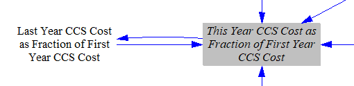

### Solar PV, Onshore Wind, and Offshore Wind

The calculations for electricity capacity types governed by endogenous learning (solar PV, onshore wind, and offshore wind) start out similarly to those for CCS.  We take in time-series input data on projected global deployments, and use `FoTOMRAEL` to limit the contribution of deployment outside the modeled region to learning calculations.  We store the first-year values to use as a baseline for doublings.

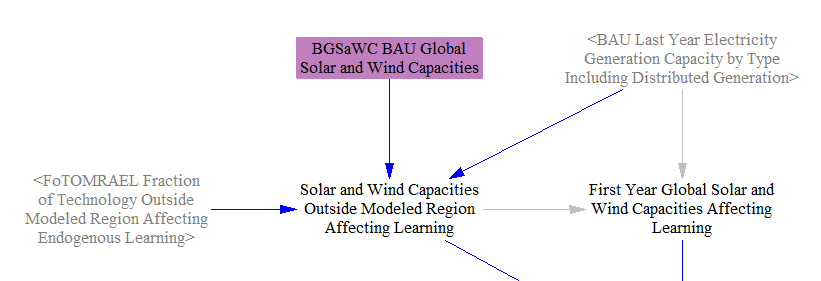

We sum utility-scale and distributed electricity capacity of each type.  (Distributed solar PV tends to be the only significant distributed capacity type here, given the rarity of small-scale wind / rooftop turbines.)  We delay the sum by one year to avoid circularity (because the cost of renewables factors into how much is built in the current year), using start year values to populate the "Last Year" variable with data from the year before the first simulated year, for use in the first simulated year.

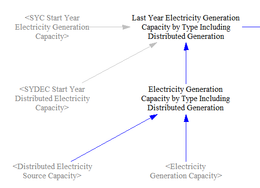

We compare the amount of capacity that exists in the current year (of each technology) to the amount that existed in the start year.  We calculate the number of doublings and apply the precentage decline in costs per doubling to find the ratio of current year costs to first year costs for each capacity type.  We assume there is no meaningful retirement of wind and solar in the model run, so we use current capacity as a cumulative total, without a stock-and-flow approach.

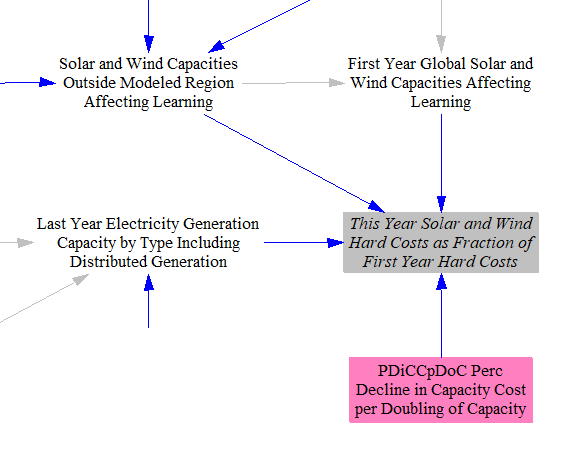

In the Electricity and Buildings sectors, this fraction is applied only to the hard costs associated with new capacity, while soft costs can decline according to an exogenous schedule, as noted above.

### Batteries

Endogenous learning for batteries is based on the sum of deployment of grid batteries (a minor contributor) and batteries inside electric vehicles (EVs), which make up the vast majority of deployed battery capacity.  We assume no meaningful retirement of grid batteries during the model run, so we calculate total deployment based on current-year capacity, converted from energy to power units.

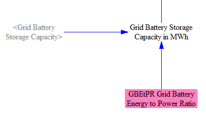

We cannot assume that no EVs retire during the model run, so we need to track cumulative deployed EV battery capacity using a stock-and-flow approach.  Since the technology selection of newly-purchased vehicles in the current model year depends on EV's prices, we need to introduce a one-timestep delay.  All stocks are only updated after non-stock variables, so we add the new vehicles from last year to the stock as well as to a total containing the cumulative vehicles deployed through last year, which includes the stock (all vehicled deployed up through two years ago) and last year's deployment.

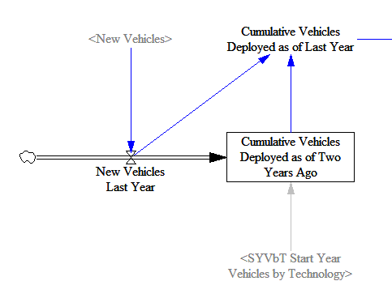

We convert the cumulative total deployed vehicles to cumulative deployed battery capacity, with different capacities assigned to different vehicle types (e.g. electric cars vs. electric buses, etc.) and to fully battery-electric vehicles vs. plug-in hybrid vehicles (which tend to have smaller batteries).

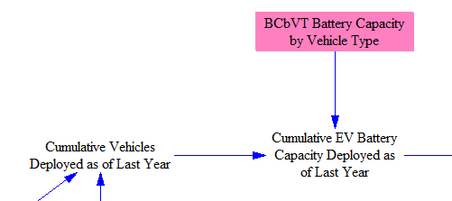

We sum EV and grid battery capacities to find the total cumulative battery capacity deployed to date.

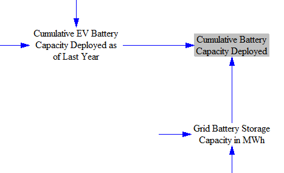

The next section is similar to the analogous sections in the CCS and electricity capacity calculations, discussed above.  We take in global battery deployment data, separate out a portion of out-of-region deployment that influences in-region learning, and save the first-year battery capacity as a baseline from which to calculate doublings.

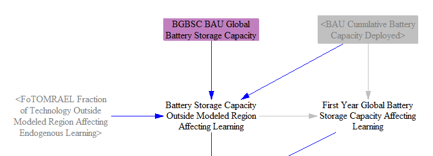

We compare the amount of battery capacity that exists in the current year to the amount that existed in the start year.  We calculate the number of doublings and apply the precentage decline in costs per doubling to find the ratio of current year costs to first year costs.

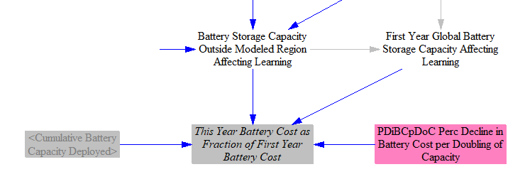

The resulting fraction is used to reduce the cost of EV batteries (but not other EV components) in the Transportation sector, and to reduce the cost of grid batteries in the Electricity sector.