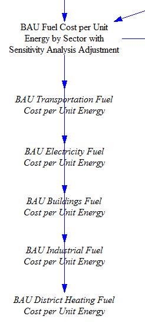
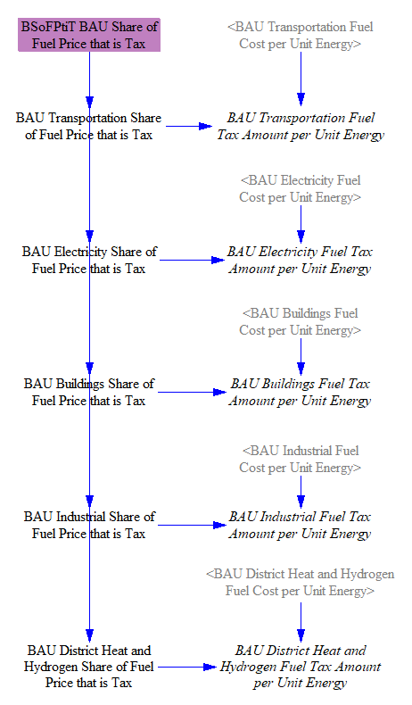
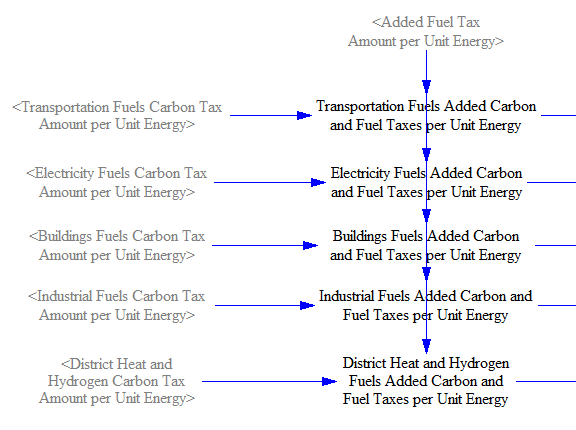
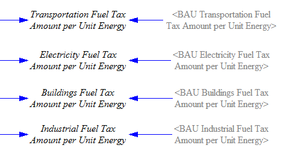

## Overview

The fuels sheet in the model is where certain properties of fuels are set, such as the costs and pollutant emissions intensities of different fuels in different sectors.  Additionally, changes in imports and exports of fuels to/from the modeled region, and associated cash flows, are calculated here (except for imported and exported electricity, which is handled in the [Electricity sector](electricity-sector-main.html)).  Cross-sector policies, such as the carbon tax, fuel taxes, reductions of BAU subsidies, fuel price deregulation, and policy-driven reductions in fuel exports are included on this sheet.

## Setting Pollutant Emissions Intensities

An emissions intensity is the quantity of a pollutant emitted per unit of fuel burned.  In the EPS, fuels are internally handled in energy units, such as BTUs, rather than mass or volume units (though the units may be converted to energy, mass, or volume as desired for use in the final output graphs).

We take in emissions intensity data for 11 different pollutants:
- CO2
- VOC
- CO
- NOX
- PM10
- PM25
- SOX
- BC
- OC
- CH4
- N2O
- We also track F-gas emissions, but F-gases aren't emitted as a byproduct of fuel combustion, so we don't need emissions intensity data for F-gases on the `Fuels` sheet.  F-gases are handled in the [Industry sector](industry-ag-main.html) as industrial process emissions.

Emissions intensities are disaggregated by sector, and by technology within each sector (such as vehicle type within the Transportation sector, or type of building component within the Buildings sector).  This disaggregation is important because the type of equipment burning a fuel can have a large effect on the intensity of pollutants generated by that fuel - for example, the degree to which combustion is complete or leaves soot in the exhaust, and the use or lack of post-combustion pollutant control technologies, can vary greatly by equipment type.

These are direct emissions intensities, not lifecycle.  Upstream emissions (e.g. from the manufacture and transport of various fuels) are be captured in the Industry and Transportation sectors respectively.

We also take in data on emissions intensity improvement rates, which can reflect improvements in combustion technology or post-combustion exhaust treatment technologies, to reduce the pollutants per unit energy of fuel burned.  For each of the four main sectors, the improvement rate is applied to the first year emissions intensities to find the emissions intensities in the current year.

We also load the CO2 emissions intensities from each fuel into the `All Fuels` subscript, to help us calculate the embedded CO2 in exported fuels (which are subscripted by `All Fuels`).  Unlike most pollutants, the CO2 intensity of a fuel does not very much depending on the technology burning the fuel, because (1) CO2 is not removed by post-combustion treatment technologies (except [carbon capture and sequestration](ccs.html), which is not relevant for calculating the CO2 content of exported fuels), and (2) the extent to which combustion is incomplete creates differences in CO2 emissions that are miniscule compared to the quantity of CO2 being emitted.

## BAU Fuel Costs

We take in BAU fuel costs as input data.  These are the final costs seen by the purchaser of the fuels (or electricity) in the business-as-usual (BAU) case, and thus must incorporate all BAU fuel taxes and subsidies, insofar as they influence consumer fuel prices.  Many of these subsidies may be upstream of the energy purchaser.  For example, subsidies for natural gas drilling or for utilities' wind electricity generation may influence the ultimate price of natural gas or electricity seen by purchasers.  BAU fuel costs vary by sector in many cases- for example, electricity is charged at a different rate for transportation, residential buildings, commercial buildings, and for industry.  (Residential buildings and commercial buildings are treated as separate sectors in this calculation, so they may be assigned different fuel prices.)

These costs are then transferred into a set of five variables, one for each fuel-using sector of the model: transportation, electricity, buildings, industry, and district heating and hydrogen.  We manually map these values onto variables for the different sectors because each sector uses its own fuel type subscript (e.g., `Transportation Fuel`, `Buildings Fuel`, etc.), and we must tell Vensim which fuels (which are members of the `All Fuels` subscript) correspond to those in each of the sector-specific fuel subscripts.

This is the problem that subranges in Vensim exist to solve, and at one time, we did implement all sector-specific fuel sets as subranges of the `All Fuels` subscript.  Unfortunately, we learned that Vensim's `ALLOCATE AVAILABLE` function, which is used a number of times in the EPS to make price-based decisions, is not compatible with allocating things across subranges; it can only allocate across elements of a single, complete subscript.  This limitation of the important `ALLOCATE AVAILABLE` function forces us to implement sector-specific fuel subscripts and manually map values, as shown in the structure below:

## Sensitivity Analysis Multiplier

When performing Monte Carlo sensitivity analysis runs, one of the most common input variables that users may want to vary is fuel price (for each fuel).  We begin with BAU fuel price data and multiply by a "Fuel Price Multiplier for Sensitivity Analysis Runs" (whose value is "1," and thus has no effect, outside of a sensitivity analysis run in which the user chooses to vary this multiplier).  The multiplier only applies to the "policy" case, not the "BAU" case, because many aspects of the EPS operate on the basis of change in price between the BAU and policy cases (such as elasticities of demand for various energy services), and the model would fail to capture the correct behavioral response to changes in fuel prices if the sensitivity variance were applied to both cases' prices.  The structure is shown below:

## Adjusting Fuel Cost due to Policies

### Energy Price Adjustment based on Energy Supplier Costs

The model supports altering the price of fuels based on model results, such as the expenses seen by fuel producers.  The only fuels for which the model alters the price in this way are the three energy carriers: electricity, district heat, and hydrogen.  This is because the EPS includes model sectors dedicated to [electricity](electricity-sector-main.html), [district heating](district-heating.html), and [hydrogen supply](hydrogen-supply.html), where the model specially calculates policy-driven changes in the costs seen by the suppliers of these energy carriers.  In contrast, the EPS does not havee similarly detailed models of the internal business processes of other fuel producers, such as oil and gas companies.  (Also, almost all electricity, district heat, and hydrogen are sold domestically, whereas many fuels have prices set on an international market, making the influence of users' policy settings on those prices less important.)

We take the change in costs faced by energy carrier suppliers (due to the user's policy package) per unit of energy carrier (electricity, district heat, or hydrogen) produced and delay it one year, to prevent circularity (where cost affects price and price affects cost, repeatedly, causing the model to produce incorrect values or an error).

In some regions, energy suppliers may not adjust their prices in response to changes in their costs, such as in countries where electricity prices are strictly regulated, and state-owned utilities may absorb increased costs rather than raise electric rates.  A control setting allows the person adapting the EPS to a particular country or region to specify whether the default behavior is to allow or disallow these energy suppliers from passing on policy-driven changes in their costs through increased (or decreased) prices.  A policy lever allows this behavior to be reversed, to enable policymakers to test what would hapen if they were to relax or institute fixed energy carrier pricing.  A price adjustment, if enabled, is then applied to the policy-case energy prices.

### Reduction of BAU Subsidies for Fuels

In many regions, subsidies affect fuel costs in the BAU case, and policymakers may be interested in the effects of withdrawing these subsidies.  Some subsidies are applied to thermal fuels per unit of fuel produced (say, a tax break for an extraction activity, such as drilling for oil or natural gas), while others are applied per unit of electricity produced by a fuel or energy source, and hence only apply to the Electricity sector.  The user can choose to reduce or eliminate subsidies on any fuel type (e.g. hard coal, natural gas, etc.) or electricity source (e.g. wind, solar PV, etc.), in any year or years according to the policy implementation schedule.  Reduction of subsidies on electric output is handled in the [Electricity sector](electricity-sector-main.html).  For fuels, the BAU prices include subsidies.  Therefore, removal of the subsidies will increase the fuel prices.  This increase is calculated by finding the policy-case subsidy value per unit energy by fuel (by reducing BAU subsidies by the percentage specified in the `Reduction in BAU Subsidies` policy lever), and taking the difference from the BAU subsidy values, to find the added cost per unit energy from withdrawing subsidies.  This value is then used to modify the policy case fuel prices.

### Fuel Price Deregulation

In some countries or regions, the prices that fuel producers may charge on the domestic market are capped at levels far below the prices that could be commanded on the international market.  This is particularly relevant in oil-exporting countries that wish to protect domestic industry and residents from high energy prices while maximizing earnings for exported oil.  The fuel price deregulation policy lever allows the user to partially or fully relax these domestic price caps, such that domestic fuel prices may approach or equal international market prices.  Since this is not a tax or a subsidy, it does not involve direct government payments to/from fuel producers.

### Additional Fuel Taxes

Next, we apply the additional fuel tax, if enabled by the user.  The user specifies this rate as a fraction of the BAU price, so we multiply by the BAU price to obtain the added amount of fuel tax per unit energy.  The added tax then is used to adjust the fuel price in the policy case.

### Carbon Tax

The carbon tax is based on the CO2 or CO2e intensity of different fuels (depending on whether the carbon tax is configured to apply to non-CO2 greenhouse gases), so we must begin by considering fuels' pollutant emissions intensities (on the right side of the Fuels sheet).

First, we establish the GWP timeframe used for the model.  We allow the user to select either 20-year or 100-year GWP values.  We default to 100-year GWP values, which are more commonly used in the literature.  We assume that if the user chooses to switch to 20-year GWP values, he/she will set other policy levers accordingly.  For example, the carbon tax operates per metric ton of CO2e, so if the user switches the GWP timeframe, he/she should keep this new timeframe in mind when choosing his/her preferred carbon tax rate.  (The choice of GWP timeframe does not affect the carbon tax if the carbon tax is configured to exclude non-CO2 GHGs.)

The GWP timeframe switch affects all model outputs and most internal calculations.  In some cases in the [Industry sector](industry-ag-main.html), we are converting CO2e values from a source document that uses 100-year GWP values; in those cases, we use the 100-year GWP values to do the conversion, irrespective of the user's setting.  Then, when doing final reporting, we convert back to CO2e using the user's GWP timeframe.

Unfortunately, the GWP value for the "F-gases" pollutant cannot be switched from 100-year to 20-year values.  This is because F gases are a large collection of different chemical species, and we only have data on their emissions in CO2e terms.  Without knowledge of the mixture's composition of different gases (by percentage) and their respective 20-year and 100-year GWP values, it is not possible to change the GWP timeframe for F gases.  Therefore, even when the user selects 20-year GWP values, F gases will still use their 100-year values, slightly underestimating total CO2e output.  (Many F-gases are very long-lived, which implies their 20-year and 100-year GWP values would not be too different, so the inability to use their 20-year GWP values ought not to introduce much error.)

The relevant structure is shown below:

We have a small, helper variable that sets whether the carbon tax is configured to apply to non-CO2 gases.  The default setting is based on a data-driven control setting, and this behavior can be reversed by the user in a policy scenario using the corresponding policy toggle lever.

We use the pollutant intensities we calculated above, excluding non-CO2 pollutants if the carbon tax policy is so configured, or else applying the user-selected GWP factor, to find the "taxable" CO2e emissions intensity of each fuel.  For each fuel burned in each sector (and sometimes by different types of technology or equipment within a sector, such as different vehicle types within the transportation sector), we have separate emissions indices.  Therefore, we multiply by our GWP values and obtain different sector-specific and sometimes technology-specific emissions indices by fuel by sector.

Next, we convert from grams of CO2e to metric tons of CO2e and apply the user-specified carbon tax rate to determine the amount of carbon tax per unit energy by fuel by sector (and sometimes by technology within a sector).  At this stage, we also separate out the rates for fuels burned in the industry sector, versus fuels burned in the distric heat and hydrogen supply sectors.  District heat and hydrogen supply can utilize the same fuels as industry, but users may wish to levy a different carbon tax rate on these sectors, hence the need to split them up here.

Fuel costs are already broken out by sector, but as noted above (under "BAU Fuel Costs"), they need to be mapped from the `All Fuels` subscript to sector-specific subscripts.  We perform this mapping in the same manner as we did for BAU fuel costs, and then we add in the quantity of carbon tax per unit energy to find the the total fuel cost per unit energy in the policy case.  The relevant structure is shown below:

## Calculating Fuel Tax Amounts per Unit Energy

We have already calculated the price of fuels (including taxes) in the BAU and policy cases.  However, for purposes of assigning cash flows to particular actors (government vs. fuel suppliers), it is important to know the portion of these prices that consists of taxes.

Our input data for the BAU case provides the share of the prices seen by consumers that consists of tax.  (The prices of fuels are reported in our input data as after-tax values.)  As discussed above, we map these shares to sector-specific fuel subscripts.  Then we multiply by the BAU cost of fuel in each sector to obtain the BAU amount of tax per unit energy.  (This quantity is a portion of the BAU price, not a quantity to be added to the BAU price.)

To calculate the same quantity in the policy case, we first sum the additional taxes as specified by the user: fuel taxes and carbon taxes.  We find a sector-specific (and sometimes technology-specific) quantity of added carbon and fuel taxes per unit energy.

Finally, we sum the added quantity of taxes per unit energy in the policy case with the quantity of taxes per unit energy in the BAU case to find the total quantity of taxes per unit energy in the policy case:

