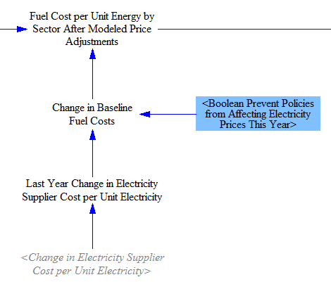
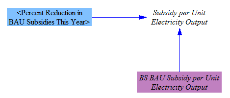

## General Notes

The fuels sheet in the model is where certain properties of fuels are set, such as the costs and pollutant emissions intensities of different fuels in different sectors.  Cross-sector policies, such as the carbon tax, fuel taxes, and a reduction in BAU subsidies are included on this sheet.

## Sensitivity Run Multiplier

When performing Monte Carlo sensitivity analysis runs, one of the most common input variables that users may want to vary is fuel price (for each fuel).  We begin with BAU fuel price data and multiply by a "Fuel Price Multiplier for Sensitivity Analysis Runs" (whose value is "1," and thus has no effect, outside of a sensitivity analysis run in which the user chooses to vary this multiplier).  The structure is shown below:

## BAU Fuel Costs

We take in BAU fuel costs as input data.  These costs incorporate BAU taxes and BAU subsidies (except for electricity, where only BAU taxes are incorporated, because BAU subsidies for electricity are handled via a different input variable).  BAU fuel costs vary by sector in many cases- for example, electricity is charged at a different rate for transportation, residential buildings, commercial buildings, and for industry.  These costs are then transferred into a set of five variables, one for each fuel-using sector of the model: transportation, electricity, buildings, industry, and district heating.  We manually map these values onto variables for the different sectors because each sector uses its own fuel type subscript (e.g., "Transportation Fuel," "Buildings Fuel," etc.), and we must tell Vensim which fuels (which are members of the "All Fuels" subscript) correspond to those in each of the sector-specific fuel subscripts.

This is the problem that subranges in Vensim exist to solve, and at one time, we did implement all sector-specific fuel sets as subranges of the "All Fuels" subscript.  Unfortunately, we learned that Vensim's ALLOCATE AVAILABLE function, which is used a number of times in the electricity sector to make price-based decisions, is not compatible with allocating things across subranges; it can only allocate across elements of a single, complete subscript.  This limitation of the important ALLOCATE AVAILABLE function forces us to implement sector-specific fuel subscripts and manually map values, as shown in the structure below:

## Adjusting Fuel Cost due to Policies

### Electricity Price Adjustment based on Electricity Supplier Costs

The model supports altering the price of fuels based on model results, such as the expenses seen by fuel producers.  The only fuel for which the model alters the price in this way is electricity, because one of the model sectors calculates policy-driven changes in the costs seen by electricity suppliers, whereas we do not have similarly detailed models of the internal business processes of other fuel producers.  (Also, almost all electricity is sold domestically, whereas most fuels have prices set on a global market, making the influence of users' policy settings on those prices questionable.)

We take the change in costs faced by electricity suppliers (due to the user's policy package) per unit electricity produced and delay it one year, to prevent circularity (where cost affects price and price affects cost, repeatedly, causing the model to produce incorrect values).  We include a policy lever that allows this effect to be disabled, so a model user can study what would happen with electricity prices fixed by regulators.  Unless that policy is enabled, the change in electricity supplier costs per unit electricity is used to approximate the change in electricity prices per unit electricity.  The relevant structure follows:

(We considered using the "Simultaneous" equation setting in Vensim to avoid the one-year delay in electricity supplier costs, but it is not possible to solve in this case, due to the very large number of variables in the model that are affected by electricity price.  Additionally, the simultaneous equation loop runs through several ALLOCATE AVAILABLE equations in the electricity sector, and those allocation functions do not work as part of a simultaneous equation loop.)

### Reduction of BAU Subsidies for Fuels

The last element that affects fuel cost in the policy case is a reduction in BAU subsidies.  Some subsidies are applied to thermal fuels per unit of fuel produced (say, a tax break for an extraction activity, such as drilling for oil or natural gas), while others are applied per unit of electricity produced by a fuel or energy source, and hence only apply to the Electricity sector.  The user can choose to reduce or eliminate subsidies on any fuel type or energy source (e.g. wind, solar, etc.), in any year or years according to the policy implementation schedule.  Reduction of subsidies on electric output is handled elsewhere on this sheet and is discussed below.  For fuels, the BAU prices include subsidies.  Therefore, removal of the subsidies will increase the fuel prices.  This increase is calculated based on the BAU subsidy values and the user-specified percentage reduction in subsidies, as shown below:

### Additional Fuel Taxes

Next, we apply the additional fuel tax, if enabled by the user.  The user specifies this rate as a fraction of the BAU price, so we multiply by the BAU price to obtain the added amount of fuel tax per unit energy, as follows:

### Pollutant Emissions Intensities

The carbon tax is based on the CO2e intensity of different fuels, so we must begin by considering fuels' pollutant emissions intensities (on the right side of the Fuels sheet).

First, we establish the GWP timeframe used for the model.  We allow the user to select either 20-year or 100-year GWP values.  We default to 100-year GWP values, which are more commonly used in the literature.  We assume that if the user chooses to switch to 20-year GWP values, he/she will set other policy levers accordingly.  For example, the carbon tax operates per metric ton of CO2e, so if the user switches the GWP timeframe, he/she should keep this new timeframe in mind when choosing his/her preferred carbon tax rate.

The GWP timeframe switch affects all model outputs and most internal calculations.  In some cases in the [Industry sector](industry-ag-main.html), we are converting CO2e values from a source document that uses 100-year GWP values; in those cases, we use the 100-year GWP values to do the conversion, irrespective of the user's setting.  Then, when doing final reporting, we convert back to CO2e using the user's GWP timeframe.

Unfortunately, the GWP value for the "F gases" pollutant cannot be switched from 100-year to 20-year values.  This is because F gases are a large collection of different chemical species, and we only have data on their emissions in CO2e terms.  Without knowledge of the mixture's composition of different gases (by percentage) and their respective 20-year and 100-year GWP values, it is not possible to change the GWP timeframe for F gases.  Therefore, even when the user selects 20-year GWP values, F gases will still use their 100-year values, slightly underestimating total CO2e output.  (Many F gases are very long-lived, which implies their 20-year and 100-year GWP values would not be too different, so the inability to use their 20-year GWP values ought not to introduce much error.)

The relevant structure is shown below:

We take in emissions intensities for 12 different pollutants, for different fuels burned by different sectors (and further disaggregated by different vehicle types within the transportation sector).  These are direct emissions intensities, not lifecycle.  Upstream emissions (e.g. from the manufacture or transport of various fuels) should be captured in the Industry (including Agriculture) and Transportation sectors respectively.

For each fuel burned in each sector (and sometimes by different types of technology or equipment within a sector, such as different vehicle types within the transportation sector), we have separate emissions indices.  Therefore, we multiply by our GWP values and obtain different sector-specific and sometimes technology-specific emissions indices by fuel by pollutant, as shown in the following structure:

Next, we convert from grams of CO2e to metric tons of CO2e and apply the user-specified carbon tax rate to determine the amount of carbon tax per unit energy by fuel by sector (and sometimes by technology within a sector), as shown below:

Fuel costs are already broken out by sector, but as noted above (under "BAU Fuel Costs"), they need to be mapped from the "All Fuels" subscript to sector-specific subscripts.  We perform this mapping in the same manner as we did for BAU fuel costs, and then we add in the quantity of carbon tax per unit energy to find the the total fuel cost per unit energy in the policy case.  The relevant structure is shown below:

## Calculating Fuel Tax Amounts per Unit Energy

We have already calculated the price of fuels (including taxes) in the BAU and policy cases.  However, for purposes of assigning cash flows to particular actors (government vs. fuel suppliers), it is important to know the portion of these prices that consists of taxes.

Our input data for the BAU case provides the share of the prices seen by consumers that consists of tax.  (The prices of fuels are reported in our input data as after-tax values.)  As discussed above, we map these shares to sector-specific fuel subscripts.  Then we multiply by the BAU cost of fuel in each sector to obtain the BAU amount of tax per unit energy.  (This quantity is a portion of the BAU price, not a quantity to be added to the BAU price.)  The relevant structure is shown below:

To calculate the same quantity in the policy case, we first sum the additional taxes as specified by the user: fuel taxes and carbon taxes.  We find a sector-specific (and sometimes technology-specific) quantity of added carbon and fuel taxes per unit energy, as shown below:

Finally, we sum the added quantity of taxes per unit energy in the policy case with the quantity of taxes per unit energy in the BAU case to find the total quantity of taxes per unit energy in the policy case:

## Reduction of BAU Subsidies for Electricity Output

In addition to BAU subsidies for fuel production, there exist BAU subsidies for electricity production from different sources (solar, wind, etc.).  These subsidies are handled on the [Electricity Sector sheet](electricity-sector-main.html), but we calculate the policy case subsidy value on this sheet because the input data for BAU subsidies relies on the same source as the input data for fuel-specific subsidies, and we need to keep input data organized and without duplication in different sub-folders within the model's "InputData" folder.  The BAU subsidies are simply reduced by the user-specified percentage (by electricity source) to obtain the subsidies in the policy case, as shown below:

