## Overview

The fuels sheet in the model is where certain properties of fuels are set, such as the costs and pollutant emissions intensities of different fuels in different sectors.  Additionally, changes in imports and exports of fuels to/from the modeled region and associated cash flows, as well as fuel production, are calculated here (except for electricity, which is handled in the [Electricity sector](electricity-sector-main.html)).  Cross-sector policies, such as the carbon tax, fuel taxes, reductions of BAU subsidies, fuel price deregulation, and policy-driven reductions in fuel exports are included on this sheet.

## BAU Fuel Price Input data

We take in BAU fuel costs as input data (in `BFPaT BAU Pretax Fuel Price by Sector`).  These are pre-tax prices, as BAU carbon taxes and other BAU taxes on fuel (e.g. sales taxes, value added taxes, excise taxes, etc.) are entered using other input variables.  On the other hand, these pre-tax fuel prices do include any BAU subsidies, insofar as they affect the price seen by fuel purchasers.  Most subsidies affecting fuel prices are applied upstream of the energy purchaser, such as subsidies for natural gas drilling or for utilities' wind electricity generation.

BAU fuel costs vary by sector in many cases- for example, electricity is charged at a different rate for transportation, residential buildings, commercial buildings, and for industry.  (Residential buildings and commercial buildings are treated as separate sectors in this calculation, so they may be assigned different fuel prices.)  Therefore, the input data may specify different prices for the same fuel in different sectors.  The relevant sectors are transportation, electricity, residential buildings, commercial buildings, industry, and district heating and hydrogen.

### Fuel Subscript Mapping

Even though BAU fuel prices and taxes are subscripted by fuel and by sector, they use the `All Fuels` subscript.  At times in the calculations below, we must map these values onto variables for the different sectors because each sector uses its own fuel type subscript (e.g., `Transportation Fuel`, `Buildings Fuel`, etc.), and we must tell Vensim which fuels (which are members of the `All Fuels` subscript) correspond to those in each of the sector-specific fuel subscripts.

This is the problem that subranges in Vensim exist to solve, and at one time, we did implement all sector-specific fuel sets as subranges of the `All Fuels` subscript.  Unfortunately, we learned that Vensim's `ALLOCATE AVAILABLE` function, which is used a number of times in the EPS to make price-based decisions, is not compatible with allocating things across subranges; it can only allocate across elements of a single, complete subscript.  This limitation of the important `ALLOCATE AVAILABLE` function forces us to implement sector-specific fuel subscripts and map values across subscripts.

# Fuel Emissions Intensities, Costs, and Taxes

## Setting Pollutant Emissions Intensities

An emissions intensity is the quantity of a pollutant emitted per unit of fuel burned.  In the EPS, fuels are internally handled in energy units, such as BTUs, rather than mass or volume units (though the units may be converted to energy, mass, or volume as desired for use in the final output graphs).

We take in emissions intensity data for 11 different pollutants:
- CO2
- VOC
- CO
- NOX
- PM10
- PM25
- SOX
- BC
- OC
- CH4
- N2O
- We also track F-gas emissions, but F-gases aren't emitted as a byproduct of fuel combustion, so we don't need emissions intensity data for F-gases on the `Fuels` sheet.  F-gases are handled in the [Industry sector](industry-ag-main.html) as industrial process emissions.

Emissions intensities are disaggregated by sector, and by technology within each sector (such as vehicle type within the Transportation sector, or type of building component within the Buildings sector).  This disaggregation is important because the type of equipment burning a fuel can have a large effect on the intensity of pollutants generated by that fuel - for example, the degree to which combustion is complete or leaves soot in the exhaust, and the use or lack of post-combustion pollutant control technologies, can vary greatly by equipment type.

These are direct emissions intensities, not lifecycle.  Upstream emissions (e.g. from the manufacture and transport of various fuels) are be captured in the Industry and Transportation sectors respectively.

We also take in data on emissions intensity improvement rates, which can reflect improvements in combustion technology or post-combustion exhaust treatment technologies, to reduce the pollutants per unit energy of fuel burned.  For each of the four main sectors, the improvement rate is applied to the first year emissions intensities to find the emissions intensities in the current year.

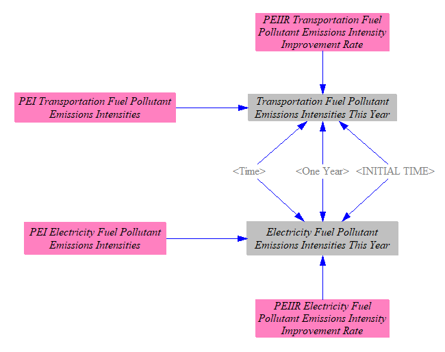

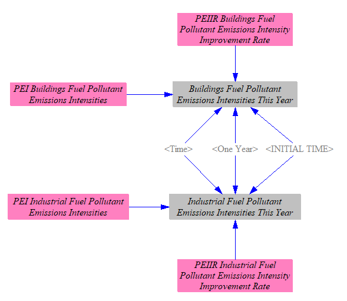

We also load the CO2 emissions intensities from each fuel into the `All Fuels` subscript, to help us calculate the embedded CO2 in exported fuels (which are subscripted by `All Fuels`).  Unlike most pollutants, the CO2 intensity of a fuel does not very much depending on the technology burning the fuel, because (1) CO2 is not removed by post-combustion treatment technologies (except [carbon capture and sequestration](ccs.html), which is not relevant for calculating the CO2 content of exported fuels), and (2) the extent to which combustion is incomplete creates differences in CO2 emissions that are miniscule compared to the quantity of CO2 being emitted.

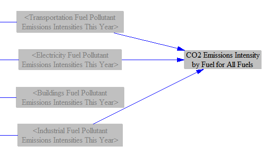

## Carbon Tax Amount per Unit Energy

The carbon tax is based on the CO2 or CO2e intensity of different fuels (depending on whether the carbon tax is configured to apply to non-CO2 greenhouse gases), so we must begin by considering fuels' pollutant emissions intensities.

First, we establish the GWP timeframe used for the model.  We allow the user to select either 20-year or 100-year GWP values.  We default to 100-year GWP values, which are more commonly used in the literature.  We assume that if the user chooses to switch to 20-year GWP values, he/she will set other policy levers accordingly.  For example, the carbon tax operates per metric ton of CO2e, so if the user switches the GWP timeframe, he/she should keep this new timeframe in mind when choosing his/her preferred carbon tax rate.  (The choice of GWP timeframe does not affect the carbon tax if the carbon tax is configured to exclude non-CO2 GHGs.)

The GWP timeframe switch affects all model outputs and most internal calculations.  In some cases in the [Industry sector](industry-ag-main.html), we are converting CO2e values from a source document that uses 100-year GWP values; in those cases, we use the 100-year GWP values to do the conversion, irrespective of the user's setting.  Then, when doing final reporting, we convert back to CO2e using the user's GWP timeframe.

Unfortunately, the GWP value for the "F-gases" pollutant cannot be switched from 100-year to 20-year values.  This is because F gases are a large collection of different chemical species, and we only have data on their emissions in CO2e terms.  Without knowledge of the mixture's composition of different gases (by percentage) and their respective 20-year and 100-year GWP values, it is not possible to change the GWP timeframe for F gases.  Therefore, even when the user selects 20-year GWP values, F gases will still use their 100-year values, slightly underestimating total CO2e output.  (Many F-gases are very long-lived, which implies their 20-year and 100-year GWP values would not be too different, so the inability to use their 20-year GWP values ought not to introduce much error.)

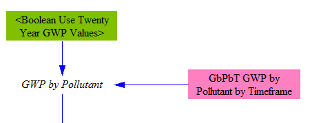

We have a small, helper variable that sets whether the carbon tax is configured to apply to non-CO2 gases.  The default setting is based on a data-driven control setting, and this behavior can be reversed by the user in a policy scenario using the corresponding policy toggle lever.

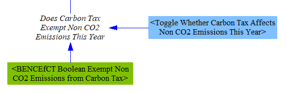

We use the pollutant intensities we calculated above, excluding non-CO2 pollutants if the carbon tax policy is so configured, or else applying the user-selected GWP factor, to find the "taxable" CO2e emissions intensity of each fuel.  For each fuel burned in each sector (and sometimes by different types of technology or equipment within a sector, such as different vehicle types within the transportation sector), we have separate emissions indices.  Therefore, we multiply by our GWP values and obtain different sector-specific and sometimes technology-specific emissions indices by fuel by sector.

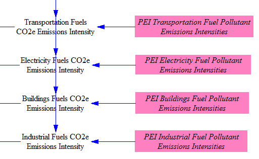

We calculate the total carbon tax rate by adding the BAU carbon tax rate (for regions with a BAU carbon tax) to any additional rate set by the user.

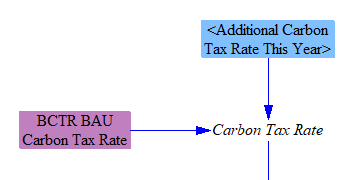

Next, we convert from grams of CO2e to metric tons of CO2e and apply the user-specified carbon tax rate to determine the amount of carbon tax per unit energy by fuel by sector (and sometimes by technology within a sector).  At this stage, we also separate out the rates for fuels burned in the industry sector, versus fuels burned in the distric heat and hydrogen supply sectors.  District heat and hydrogen supply can utilize the same fuels as industry, but users may wish to levy a different carbon tax rate on these sectors, hence the need to split them up here.

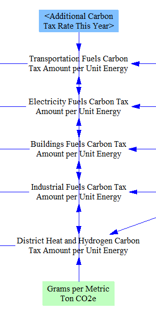

### Fuel Tax Amount per Unit Energy

In addition to carbon taxes, there are often exist fuel taxes, such as sales taxes, value added taxes, or excise taxes on fuels.  We need to calculate the amounts of these taxes per unit energy for each fuel.  First, we multiply any additional tax rate (set as a percentage of the BAU pretax fuel price) set by the user by the BAU pretax fuel price to find the incremental additional fuel tax amount per unit energy.  We add this to the BAU fuel tax amount per unit energy to find the policy case fuel tax amount per unit energy.

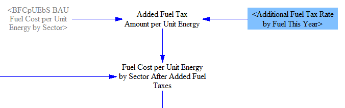

These costs are then transferred into a set of five variables, one for each fuel-using sector of the model, using those sectors' fuel subscripts.

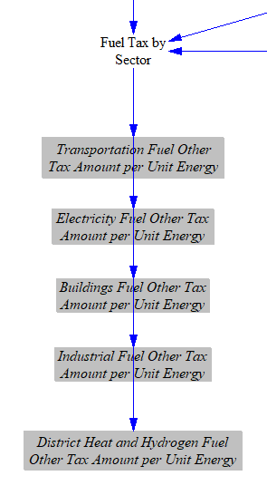

### Summing Carbon and Fuel Tax Amounts per Unit Energy

We have already calculated the carbon and fuel tax amounts per unit energy, by fuel, for each sector.  We now total these tax rates, so we can cleanly separate out the total amount of tax for each unit of fuel purchased, for use in the various fuel-using sectors of the EPS.  We do this in many 

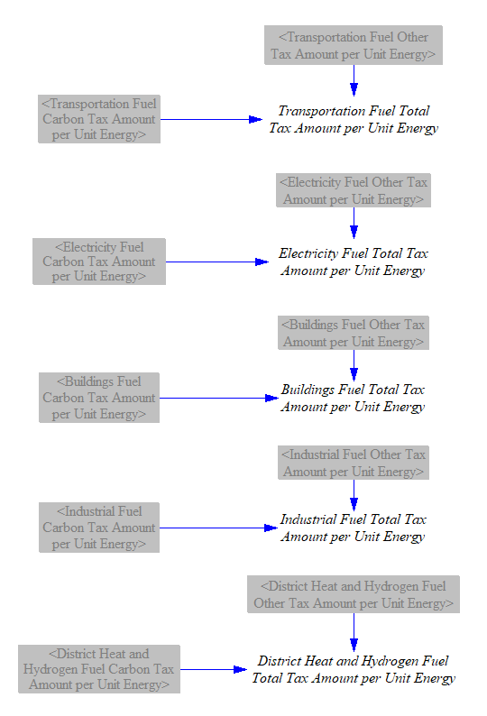

## Adjusting Fuel Cost due to Policies

### Sensitivity Analysis Multiplier

When performing Monte Carlo sensitivity analysis runs, one of the most common input variables that users may want to vary is fuel price (for each fuel).  We begin with BAU fuel price data and multiply by a "Fuel Price Multiplier for Sensitivity Analysis Runs" (whose value is "1," and thus has no effect, outside of a sensitivity analysis run in which the user chooses to vary this multiplier).  Although these fuel price changes are technically not a "policy" effect, the multiplier only applies to the "policy" case, not the "BAU" case, because many aspects of the EPS operate on the basis of change in price between the BAU and policy cases (such as elasticities of demand for various energy services), and the model would fail to capture the correct behavioral response to changes in fuel prices if the sensitivity variance were applied to both cases' prices.  The structure is shown below:

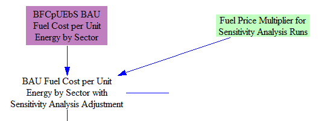

### Energy Price Adjustment based on Energy Supplier Costs

The model supports altering the price of fuels based on model results, such as the expenses seen by fuel producers.  The only fuels for which the model alters the price in this way are the three energy carriers: electricity, district heat, and hydrogen.  This is because the EPS includes model sectors dedicated to [electricity](electricity-sector-main.html), [district heating](district-heating.html), and [hydrogen supply](hydrogen-supply.html), where the model specially calculates policy-driven changes in the costs seen by the suppliers of these energy carriers.  In contrast, the EPS does not havee similarly detailed models of the internal business processes of other fuel producers, such as oil and gas companies.  (Also, almost all electricity, district heat, and hydrogen are sold domestically, whereas many fuels have prices set on an international market, making the influence of users' policy settings on those prices less important.)

We take the change in costs faced by energy carrier suppliers (due to the user's policy package) per unit of energy carrier (electricity, district heat, or hydrogen) produced and delay it one year, to prevent circularity (where cost affects price and price affects cost, repeatedly, causing the model to produce incorrect values or an error).

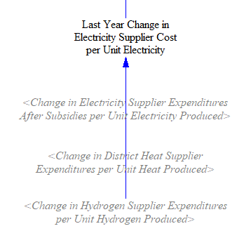

In some regions, energy suppliers may not adjust their prices in response to changes in their costs, such as in countries where electricity prices are strictly regulated, and state-owned utilities may absorb increased costs rather than raise electric rates.  A control setting allows the person adapting the EPS to a particular country or region to specify whether the default behavior is to allow or disallow these energy suppliers from passing on policy-driven changes in their costs through increased (or decreased) prices.  A policy lever allows this behavior to be reversed, to enable policymakers to test what would hapen if they were to relax or institute fixed energy carrier pricing.  A price adjustment, if enabled, is then applied to the policy-case energy prices.

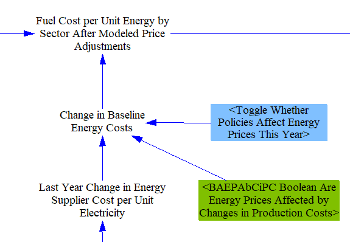

### Reduction of BAU Subsidies for Fuels

In many regions, subsidies affect fuel costs in the BAU case, and policymakers may be interested in the effects of withdrawing these subsidies.  Some subsidies are applied to thermal fuels per unit of fuel produced (say, a tax break for an extraction activity, such as drilling for oil or natural gas), while others are applied per unit of electricity produced by a fuel or energy source, and hence only apply to the Electricity sector.  The user can choose to reduce or eliminate subsidies on any fuel type (e.g. hard coal, natural gas, etc.) or electricity source (e.g. wind, solar PV, etc.), in any year or years according to the policy implementation schedule.  Reduction of subsidies on electric output is handled in the [Electricity sector](electricity-sector-main.html).  For fuels, the BAU prices include subsidies.  Therefore, removal of the subsidies will increase the fuel prices.  This increase is calculated by finding the policy-case subsidy value per unit energy by fuel (by reducing BAU subsidies by the percentage specified in the `Reduction in BAU Subsidies` policy lever), and taking the difference from the BAU subsidy values, to find the added cost per unit energy from withdrawing subsidies.  This value is then used to modify the policy case fuel prices.

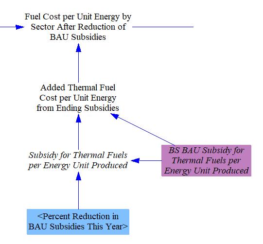

### Fuel Price Deregulation

In some countries or regions, the prices that fuel producers may charge on the domestic market are capped at levels far below the prices that could be commanded on the international market.  This is particularly relevant in oil-exporting countries that wish to protect domestic industry and residents from high energy prices while maximizing earnings for exported oil.  The fuel price deregulation policy lever allows the user to partially or fully relax these domestic price caps, such that domestic fuel prices may approach or equal international market prices.  Since this is not a tax or a subsidy, it does not involve direct government payments to/from fuel producers.

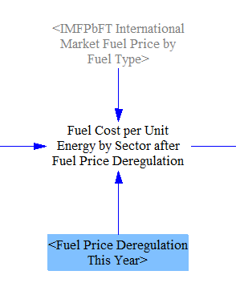

## After-Tax Fuel Prices

We sum the total fuel tax amount (which is already broken by fuel and by sector) with the policy-modified, pre-tax fuel price (in `Pretax Fuel Cost per Unit Energy by Sector after Fuel Price Deregulation`) to obtain the total cost per unit fuel for each sector.

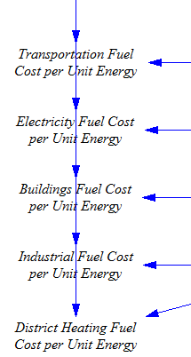

# Fuel Imports, Exports, and Production

The EPS calculates the quantities of each fuel that are imported into, exported from, and produced within the modeled region.  (Electricity imports, exports, and generation are handled in the [Electricity sector](electricity-sector-main.html), but are added to the totals on this sheet as one of the last steps in the calculation, as described below.)

## Import, Export, and Production Caps

The first step is to establish some caps on the amount by which fuel imports, exports, and production may increase (set separately for each fuel).  These caps constrain economically-driven behavior, and may reflect things such as a lack of export pipeline or tanker capacity for petroleum and natural gas, a lack of recoverable domestic resources constraining production of one or more fuel types, or an inability to increase imports more than a certain amount, again due to a lack of pipeline or shipping capacity, or other such factors.

First, the BAU fuel use quantities are adjusted, based on the control setting for "Exogenous GDP Adjustment."  This control setting is used to help model recessions or other exogenous reductions in energy demand and economic activity that are not reflected in the other input data variables, and has been used to represent the recession and stay-at-home orders associated with the 2020 COVID-19 pandemic.  While most of the effect of this control setting occurs in the various domestic sectors (Transportation, Industry, and Buildings especially), it also can affect fuel production, imports, and exports.

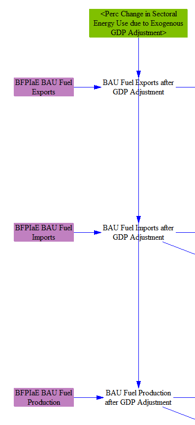

We use three time-series input data variables that specify the maximum allowable percentage increase in each of exports, imports, and production, subscripted by fuel type.  This gives us the maximum possible increase in absolute terms.  For imports and production, we also calculate the total cap, which is simply the BAU quantity plus the maximum possible increase, so we can use these variables later in the calculations on this sheet.

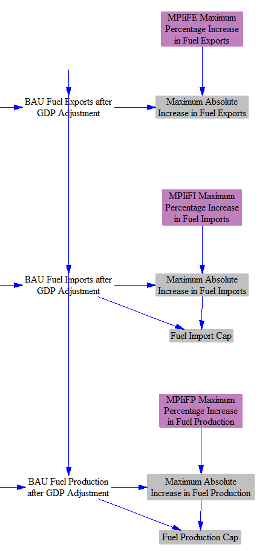

## Change in Fuel Exports

When the policy package changes domestic demand for a fuel (most commonly, reduces demand for fossil fuels), this can be accounted for by some combination of changes in exports, imports, and production.  In the case of a reduction in domestic fuel demand, producers may be able to increase their exports and thereby avoid cutting production by the full amount of lost, domestic demand.  Whether this is possible depends on the extent to which the modeled country has robust fuel export infrastructure, trading relationships, local laws (for instance, the U.S. banned petroleum exports from 1975 until 2015), etc.

To start this calculation, we find the change in total domestic fuel use caused by the policy package, by taking the difference between total fuel use in the BAU and Policy cases.  (Total fuel use is summed on the [Cross-Sector Totals](cross-sector-totals.html) sheet.)  The change in total fuel use already includes the change in crude oil use from changes in production of secondary petroleum products, due to the linkage between change in NGPS fuel production (calculated on this sheet) and change in production by the NGPS industry in the [Industry sector](industry-ag-main.html).  Quantization is used to dampen rounding error.

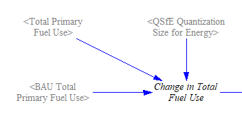

We take in input data specifying the degree to which changes in domestic fuel use are compensated for by changes in exports (e.g. domestic fuel reductions cause increased exports, and vice versa).  For a major petroleum-exporting country with a desire to sell as much fuel abroad as possible, the value for crude oil could be 1 (or close to it).  For a country that is a large, net importer of a fuel, that fuel should have a value of zero, or close to it.

The variable `PoFDCtAE Percentage of Fuel Demand Change that Alters Exports` is a two-dimensional matrix, subscripted by `Source Fuel` and `Target Fuel`.  This is important because secondary petroleum products (petroleum gasoline, petroleum diesel, jet fuel/kerosene, heavy or residual fuel oil, and LPG/propane/butane) are made from crude oil, and a change in domestic demand for one of these fuels may lead to a reduction in domestic refining activity and an increase in exports of crude oil, rather than an increase in exports of the refined fuel.  `PoFDCtAE` can apportion the reduction in demand for the `Source Fuel` among multiple `Target Fuel`s, to account for this.  All of the target fuels for any source fuel need not add to 1 (a 100% share), since less than all of the change in demand for that fuel may lead to a change in exports, but the sum of the target fuels for any source fuel should not exceed 1.  The variable `Change in Fuel Exports before Cap` sums across all `Source Fuel` types when evaluating the final change in exports of a `Target Fuel`, to capture the contributions from any/all source fuels.  (The Industry sector utilizes the change in production of refined fuels and correctly reduces refining activity to the extent that crude oil is exported in lieu of refined fuels.)

We also check to ensure that if exports are being reduced, they cannot be reduced below zero.  (We track imports separately, not in the form of negative exports.  This is crucial, since some countries both import and export the same fuel in the same year.)

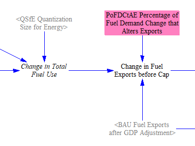

We ensure that the change in exports, if an increase, is not larger than the maximum allowed increase in fuel exports for each fuel.

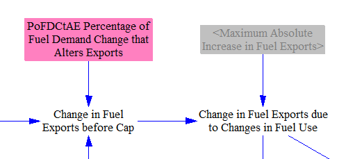

Next, we find the change in fuel exports caused by the Fuel Export Reduction policy lever, if it is enabled.  The base quantity from which the lever calculates is the BAU export quantity, plus any policy-driven change (i.e. the export reduction lever targets not only BAU exports but also exports induced by the other policies in the policy package).

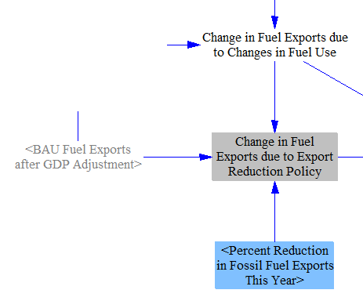

Finally, we sum the change in exports due to changes in domestic demand and the change in exports due to the export reduction policy to find the total change in fuel exports.  We ensure exports cannot go below zero by checking against the BAU level of exports.

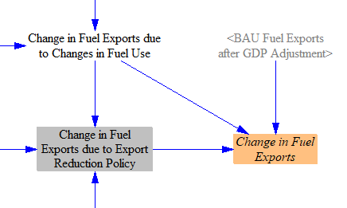

We need a helper variable to assist us in calculations in the next section (changes in production and imports).  We need to know the `Change in Crude Exports due to Changes in Secondary Petroleum Product Use`.  This change in crude oil exports is **already included** in the overall `Change in Fuel Exports` calculated above, so this helper variable is not additive (does not represent _additional_ crude oil exports).  It is calculated in a manner similar to `Change in Fuel Exports before Cap`, but only summing the effects of secondary petroleum products on crude oil.  Its use will be explaned in the next section, below.

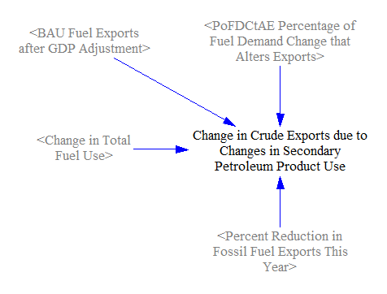

## Components of Changes in Fuel Production and Imports

Our next task is to calculate the change in fuel production and fuel imports.  We begin by calculating a number of components, which we will add up to find the final changes in fuel production and imports.  Much of the complexity of the logic here pertains to the import and production caps, and what to do if one or both of these caps is exceeded (e.g. domestic demand for a fuel grows so much that the import and production caps cannot both be obeyed).

We begin by finding the change in domestic fuel use that must be accounted for by changes in production and imports.  Generally, this is simply the change in demand that hasn't already been accounted for via change in fuel exports, discussed above.  Howerver, there are two important notes:

- Any reduced exports specifically caused by the export reduction come out of domestic production, not imports.  This is because most of a fuel that is exported is produced domestically, not imported and then simply exported again, so reducing exports will tend to overwhelmingly target domestic production, not imports.  (Changing crude oil to a refined fuel counts as domestic production of the refined fuel type.)

- Changes in crude exports due to changes in secondary production are not apportioned into changes in crude production or crude imports, because the crude that was formerly being used to make secondary products is now being exported instead.  Therefore, we subtract out any change in crude exports due to changes in secondary production.  (This is the reason why we needed to calculate the helper variable `Change in Crude Exports due to Changes in Secondary Petroleum Product Use`, discussed above.)

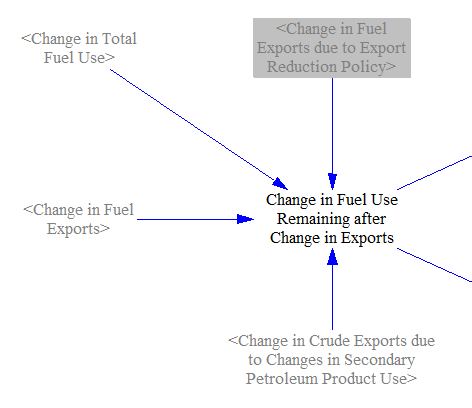

We apportion change in fuel use into change in production and change in imports by the relative importance of these two modes for each fuel.  For example, if a fuel is 100% imported in the BAU case, then 100% of the remaining change in demand for that fuel will come out of imports.  If a fuel is 50% imported and 50% produced domestically, then half of the remaining change in demand for that fuel will come out of imports and half out of domestic production.

For this apportionment, we must use BAU production and imports, not policy case versions of these variables, to avoid oscillation that occurs when apportioning reductions in production/imports.  Reductions in one mode (such as imports) decrease the importance of that mode, causing the other mode (i.e. production) to receive a larger share of the reduction the following year, which causes the first mode to get the larger share in the year after that, and so on.

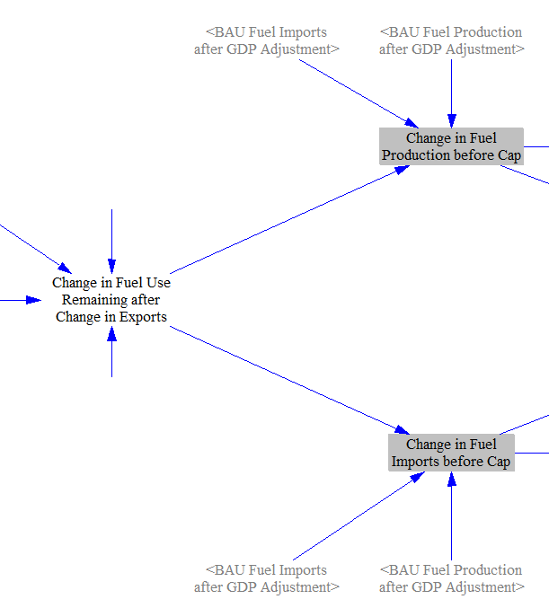

The remaining change in fuel use must be accounted for through changes in imports or production - fuel cannot appear out of nowhere to meet domestic demand, nor can imported or produced fuel vanish into nowhere.  Therefore, we must include model structure to handle the case where one or both caps has been set so low that the calculated change in imports or production would exceed the cap.

First, we handle the case where only one cap is exceeded.  If production would exceed production cap and there is room under the import cap, shift as much production to imports as we need in order to fully account for the excess production, or until the import cap is reached, whichever happens first.  Vice versa if imports would exceed the import cap and there is room under the production cap.

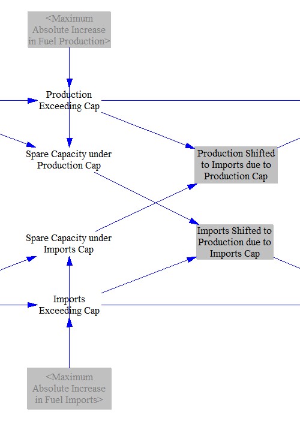

If the change in fuel demand is large enough to exceed both the production and import caps, then there will be non-zero values in one or both of the variables `Production Exceeding Both Caps` and `Imports Exceeding Both Caps`.  We sum them to get the total excess change in fuel demand that cannot be accomodated under either cap.

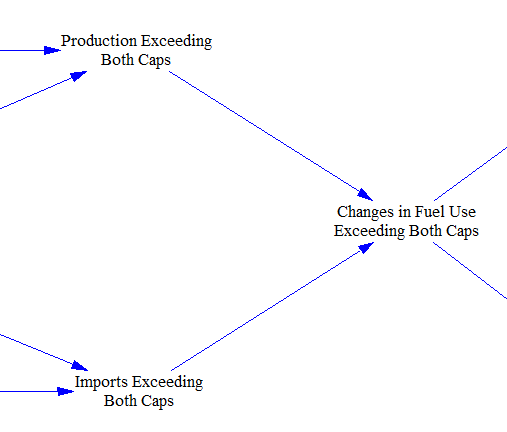

If both the production and import caps are exceeded, we allocate the excess change in fuel use to production and imports, exceeding both caps proportionately to the cap sizes.

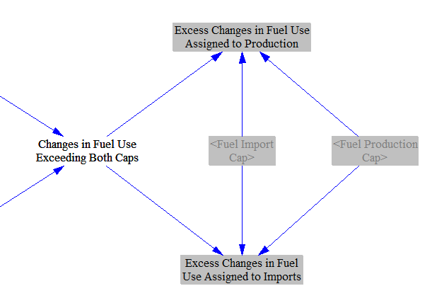

We now have all of the components we need to calculate the change in fuel imports and change in fuel production.

## Fuel Production and Fuel Imports

To find the change in fuel production, we add up the previously-calculated quantities:

- The change in fuel exports due to the export reduction policy
- The lower of:
  - The change in production caused by domestic demand
  - The production cap
- Imports shifted to production due to exceeding the imports cap
- Changes in fuel use that exceed both caps assigned to production

We also check against BAU production (after GDP adjustment) to ensure the value cannot become negative.  We then add the change in production to BAU production to find the policy case fuel production.

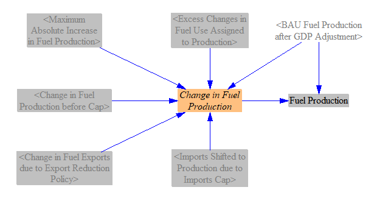

The change in imports is calculated analogously, except the export reduction policy plays no role, as all reduced imports come out of domestic production (for reasons explained above).

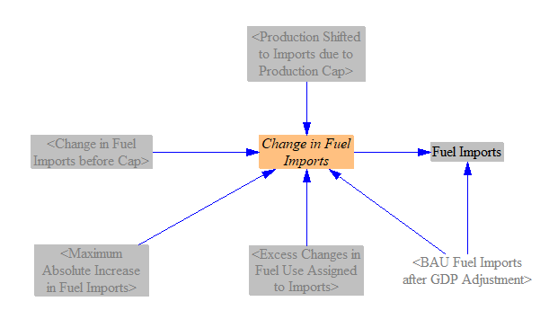

## Fuel Exports and Import/Export Cash Flows

We calculate the policy case fuel exports, which is simply the BAU fuel exports (after GDP adjustment), plus the previously-calculated change in fuel exports.

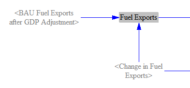

We multiply fuel exports by a time-series input variable, `IMFPbFT International Market Fuel Price by Fuel Type`, that specifies the price that is commanded by each fuel when sold abroad (e.g. on the international market).  It is important to use a different set of prices here than those used for domestic consumers (specified in `BFCpUEbS BAU Fuel Cost per Unit Energy by Sector`), since fuel-exporting countries may charge more to foreign buyers than to their own households and businesses.  This gives us total fuel export revenues, which we use to populate an output graph.  We also multiply the change in exports by the international market price, to get the change in fuel export revenues caused by the policy package.

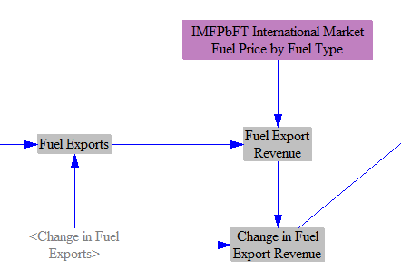

Finally, we handle export taxes on fuels.  Export duties [were common in the 1700s, but are seldom used today](https://www.britannica.com/topic/tariff#ref592273) (as their costs typically are borne by the domestic producer, who receives the international market price minus the export tax, making their goods less competitive relative to foreign competitors).  However, a few resource-rich countries use export duties to raise government revenue, and the EPS supports this calculation.  Export revenues are allocated between government and domestic fuel suppliers.

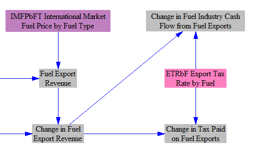

We also calculate the amount spent on fuel imports, with fuel purchased at the international market price.  If fuel industries are selling more fuel, they get added revenue for those sales in the fuel-using model sectors (e.g. Transportation, Buildings, Industry, etc.).  This calculation is the cost to the fuel suppliers to acquire the fuel, if they purchase it from abroad.

Sales or excise taxes on fuel are assumed to apply both to domestically-produced and imported fuels, and are handled in the demand sectors.  (The EPS does not currently support import duties that are on top of and additional to sales/excise taxes applied to both domestically-produced and imported fuels.)

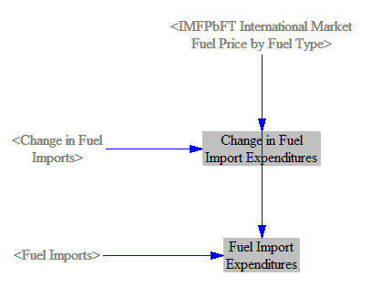

## Embedded CO2 in Exported Fuels

We calculate the CO2 content embedded in exported fuels, to provide data for an output graph.  The CO2-intensity of each fuel (calculated earlier on this sheet, and described above) is multiplied by the quantity of exported fuel to find the total embedded CO2.  We similarly calculate the change in embedded CO2 due to the policy package.  These metrics help identify the extent to which a policy package may be moving fuel emissions overseas rather than eliminating those emissions, particularly in fuel-producing countries.

## Adding Electricity Imports and Exports

We wish to produce variables using the `All Fuels` subscript that contain import, export, and production data for all fuels, including energy carriers (electricity, district heat, and hydrogen), to facilitate creating output graphs.  Therefore, we have a structure whose entire purpose is to add electricity imports and exports, and the changes in these quantities, into the "electricity" subscript element in the variables totaling energy exports, change in energy exports, energy export revenue, and change in energy export revenue.  We add electricity, district heat, and hydrogen to the similar variables, energy production and change in energy production.  (The EPS assumes there is no international market for district heat or hydrogen, given the difficulties in storing and transporting these energy sources for long periods of time and over long distances.)  We also use quantization at this stage to dampen rounding error.

The structure in this secton is relatively straightforward, so screenshots are omitted.

## Change in Fuel Subsidy Payments

The fuels sheet is also where we total the change in government fuel subsidies.  We multiply fuel production, calculated above, by the subsidy amount per unit energy produced (after modification, if any, by the BAU subsidy reduction policy lever) to find the total subsidy payment for each fuel type.  We take the difference between the BAU and policy case versions of this total to find the change caused by the policy package.

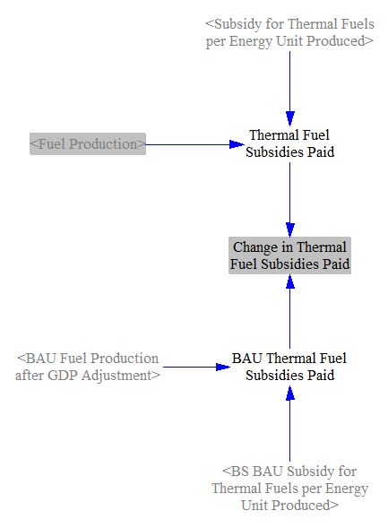

## Allocating Changes in Expenditures and Revenues

As we have changes in cash flows calculated on the Fuels sheet (largely pertaining to fuel imports and exports), we need a structure to assign these changes to specific cash flow entities, in a way similar to these assignments on the "Cash Flow" sheets of the various sectors in the EPS (Transportation, Industry, etc.)  These changes then feed into totals on the [Cross-Sector Totals](cross-sector-totals.html) sheet and into the [Input-Ouput model](io-model.html).

Changes in fuel subsidies paid are allocated to the government, while changes in expenditures to import fuels are assigned to the corresponding fuel suppliers by fuel type.  (Domestic fuel suppliers include both producers and importers of a fuel - that is, a domestic company that supplies a fuel is a fuel supplier, whether it purchased that fuel from abroad or produced it themselves.)

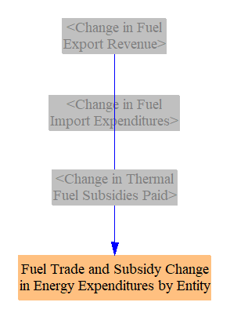

Changes in export tax revenues are assigned to government.  Proceeds from exporting fuel (selling fuel abroad) are assigned to the corresponding fuel suppliers by fuel type.

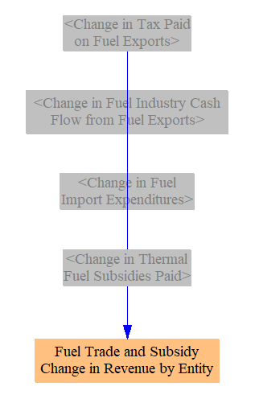
