## General Notes

The Hydrogen Supply sector is one of three sectors in the Energy Policy Simulator (EPS) that produce an energy carrier used by other sectors.  The other two energy carrier supply sectors are [Electricity](electricity-sector-main.html) and [District Heating](district-heating.html).  All three energy carrier supply sectors produce a quantity of energy (hydrogen, electricity, or district heat) determined by the demand for these energy carriers in all of the sectors of the EPS, with the largest demand coming from the [Transportation](transportation-sector-main.html), [Buildings](buildings-sector-main.html), and [Industry](industry-ag-main.html) sectors.

(Secondary petroleum products can be produced in the [Industry](industry-ag-main.html) sector and used in various sectors, but this production is not wholly based on domestic demand, given international markets and [fuel imports/exports](fuels.html), so the term "energy carriers" in the EPS only refers to electricity, district heat, and hydrogen.)

All calculations for hydrogen supply (Policy case, BAU case, and cash flow) are handled on one sheet in the Vensim model.  As is the case for other sectors, the documentation here only discusses the policy case and cash flow, not the BAU case.

## Hydrogen Production Pathways

Hydrogen, H2, is a colorless, flammable gas that produces water vapor (H2O) when it burns.  As hydrogen combustion doesn't have any direct carbon dioxide (CO2) emissions, the contribution of hydrogen to global warming depends on the manner in which the hydrogen was produced.

Today, [according to the Internaitonal Energy Agency](https://webstore.iea.org/download/direct/2803), roughly 75% of the world's hydrogen is produced from natural gas, and 23% is produced from coal (with most coal-based hydrogen production occurring in China).  Most of the remaining 2% is produced as a byproduct of chlor-alkali electrolysis in the production of chlorine and caustic soda.  Less than 0.1% of global hydrogen comes from water electrolysis - that is, using electricity to split water into H2 and O2 gases.  Producing hydrogen using zero-carbon electricity, or another zero-carbon pathway, is necessary for hydrogen to be a key technology that supports net zero emissions economy-wide.

The EPS has been designed to model up to five different hydrogen production pathways, and to allow these pathways to be customizable, to support different novel hydrogen technologies.  By default, the five modeled pathways are:

- electrolysis
- natural gas reforming
- coal gasification
- biomass gasification
- thermochemical water splitting

([Thermochemical water splitting](https://www.energy.gov/eere/fuelcells/hydrogen-production-thermochemical-water-splitting) is a proposed technology that uses high-temperature heat from solar thermal plants or nuclear reactors instead of an electrical current to split water into H2 and O2.)

New pathways can be substituted for one or more of these five pathways by altering the input data in these variables:

- `hydgn/HPEbP` Hydrogen Production Efficiency by Pathway
- `hydgn/HPtFM` Hydrogen Pathway to Fuel Mappings
- `hydgn/HPEC` Hydrogen Production Equipment CapEx
- `hydgn/HPEC` Hydrogen Production Equipment OpEx

This allows a model user to customize which types of fuels supply the energy for the hydrogen production process, as well as the efficiency of the process.  For more details, see the page on [Remapping Subscript Elements](remapping.html).

Note that the hydrogen supply sector represents _dedicated_ hydrogen production, not hydrogen produced as a byproduct of industrial operations aiming at producing a different product, so we don't include byproduct hydrogen from the production of chlorine and caustic soda in this sector of the model.

Also note that the "electrolysis" pathway draws its electricity from the grid - it does not assume dedicated renewable energy or other facilities are supplying the hydrogen producer.  Therefore, decarbonizing the modeled region's electricity supply using policy levers that affect the [Electricity Sector](electricity-sector-main.html) is necessary to achieve zero-carbon hydrogen production via the "electrolysis" pathway.

## Hydrogen Production Energy Use and Emissions

Five EPS sectors can demand hydrogen as a fuel: transportation, buildings, industry, district heat, and geoengineering.  (This only includes hydrogen purchased from hydrogen suppliers, not hydrogen produced and consumed within the same industrial facility.)  Hydrogen demand from these sectors is summed.  Then, the hydrogen to be produced is apportioned between the various production pathways based on shares taken in as time-series input data (allowing for a gradual shift between pathways in the BAU case).

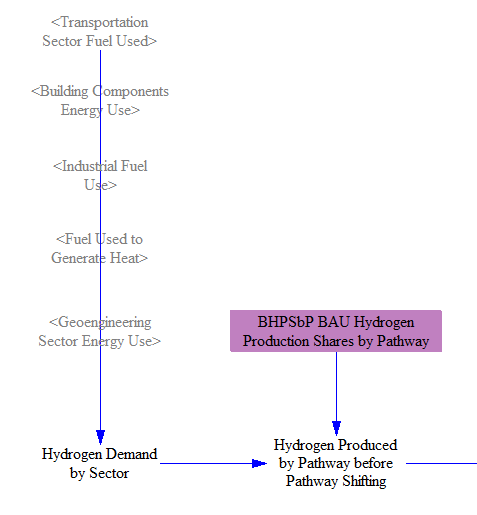

In the policy case, the Hydrogen Production Pathway Shifting policy allows the user to specify a shift from the BAU set of production pathways to any other apportionment of production amongst the various pathways.  The recipient (non-BAU) pathways are specified in input variable `hydgn/RHPF` and the extent to which the shift occurs is controlled by the policy lever and associated policy implementation schedule. 

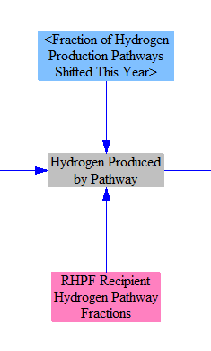

To calculate fuel use, we multiply the quantity of hydrogen produced via each pathway by an efficiency that indicates how much fuel or electricity is used per unit of hydrogen produced.  We work with efficiencies rather than a strict chemical relationship between the moledules (e.g. one molecule CO2 produced per CH4 converted to hydrogen) to capture the energy requirements of the transformation, which is an endothermic reaction.

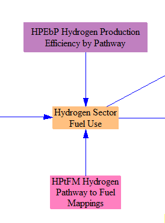

Finally, we multiply by pollutant emissions intensities to obtain the total, direct pollutant emissions from hydrogen production, and we also convert to units of CO2e using global warming potentials (GWP).  We use the same pollutant emissions intensities (mass of pollutant per energy unit of a given type of fuel burned) from the industry sector, as hydrogen production uses industrial equipment.  Additionally, we total the electricity use by the hydrogen supply sector, which is fed into the total electricity use on the [Cross-Sector Totals](cross-sector-totals.html) sheet.

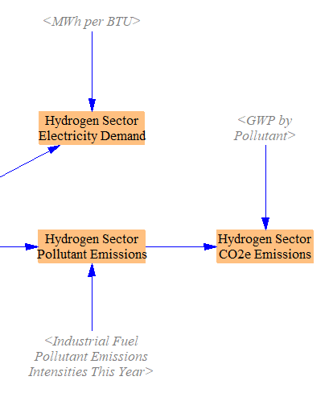

## Demand-Responsive Electricity Capacity for Electrolyzers

It [has been proposed](https://www.energy.gov/sites/prod/files/2017/06/f34/fcto_may_2017_h2_scale_wkshp_hovsapian.pdf) that hydrogen production from electrolysis can help balance (provide flexibility to) the electricity grid, by running when electricity demand is low and pausing when electricity demand is high.  The EPS simulates this by taking the "excess" hydrogen production capacity - e.g. how much more hydrogen-making equipment exists than the amount of equipment that would be required to produce a particular quantity of hydrogen per year, if the equipment were run constantly at full design capacity, 24 hours per day, 365 days per year (in `hydgn/HPPECbP`).  On its own, core (non-excess) capacity cannot contribute to providing flexibility, because it must run in order to generate enough hydrogen to meet the annual hydrogen demand.  Excess capacity can kick in at times of low electricity demand to reduce the need to run some of the core capacity during high-electricity-demand times.  Therefore, the amount of excess capacity is the amount by which the peak electricity demand can be reduced while maintaining the same annual hydrogen production rate.  We convert from excess hydrogen production capacity to electricity capacity using data indicating the electricity capacity that would be required to produce a particular quantity of hydrogen per year (in `hydgn/EHPpUC`).  The resulting "Demand Responsive Capacity for Electrolyzers" provides flexibility points to the [Electricity Sector](electricity-sector-main.html).

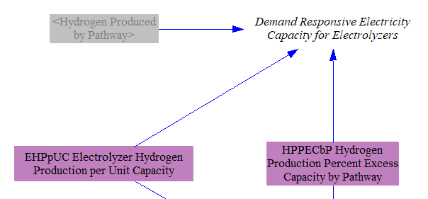

## Capital Expenditures

To determine the cost of capital equipment for hydrogen production, we first calculate the year-over-year change in annual hydrogen output from each production pathway.

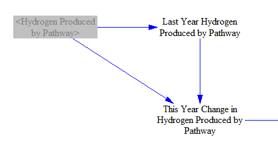

We multiply the increase in hydrogen demand by the percent of excess capacity required (which provides grid flexibility, as noted above) and by the cost per unit of equipment (measured in currency units per unit annual hydrogen production capacity).  This provides the amount spent that year to buy new equipment to meet the new, incremental demand for hydrogen in that year.

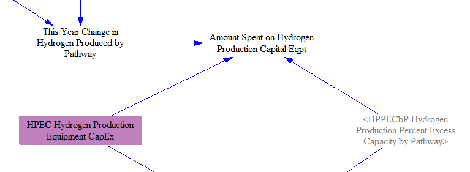

Finally, we take the difference between the BAU and Policy case versions of this variable to find the policy-driven change in capital equipment expenditures.

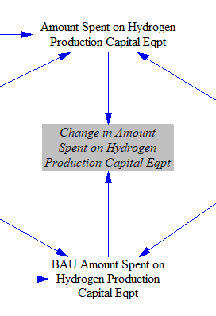

## Non-Fuel Operational Expenditures

Non-fuel expenditures to run hydrogen supply operations (e.g. labor, maintenance, replacement parts, etc.) is calculated by first increasing the total hydrogen production by the share of excess capacity (since this capacity also needs to be maintained), and then multiplying by a variable that indicates the amount spent on non-fuel operational expenses per unit annual hydrogen production capacity.

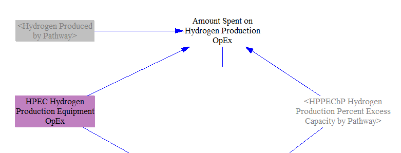

The difference between the BAU and Policy case versions of this variable gives us the policy-driven change in operational expenditures.

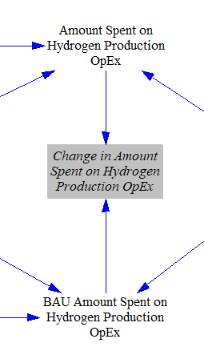

## Fuel Expenditures

In order to calculate the change in fuel (including electricity) expenditures, we first multiply fuel use by the cost per unit fuel to find the total amount spent on fuels by the hydrogen supply sector.

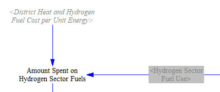

We multiply the quantity of fuel used by the fuel tax amount per unit fuel sold to find the total taxes paid on hydrogen sector fuels.

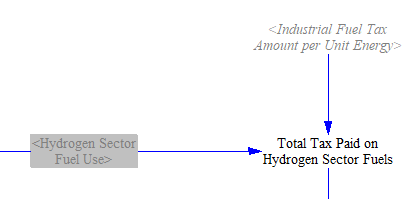

We take the difference between the BAU and Policy cases to find the change in amount spent on fuels, and the change in taxes resulting from the sale of hydrogen sector fuels.  Finally, we subtract the change in taxes from the change in amount spent to find the cash flow impacts for the fuel-supplying entities.

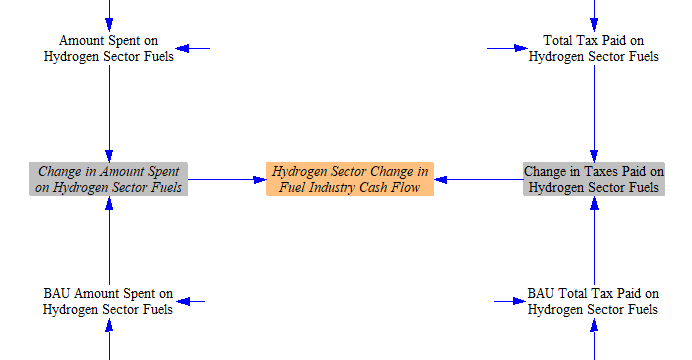

## Allocating Changes in Expenditures

Hydrogen suppliers are part of "other energy suppliers," one of the nine "cash flow entities" tracked in the EPS (separately from the 36 ISIC codes used in the [input-output model](io-model.html) and for revenue allocation in each sector).  Therefore, allocating expenditures is very straightforward.  All hydrogen supply expenditures, whether for fuel, capital, or operational expenditures, are allocated to the "other energy suppliers" cash flow entity.  (Expenditures to buy hydrogen fuel are included in the sectors that demand hydrogen, such as industry or transportation, not in the hydrogen supply sector.)

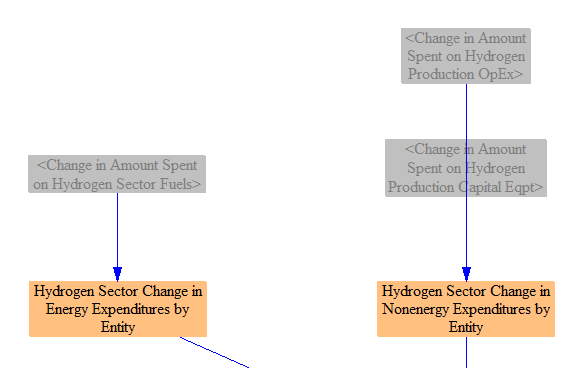

We also calculate the change in expenditures per unit of hydrogen produced.  This value is used on the [Fuels sheet](fuels.html) to adjust the BAU price of hydrogen to reflect policy-driven changes in the cost to produce hydrogen.  This may include price reductions (such as if endogenous learning drives down hydrogen production cost) or, more commonly, price increases (if the pathway shifting lever shifts production from a lower-cost pathway to a higher-cost pathway).  (This feedback loop can be disabled using the "Toggle Whether Policies Affect Energy Prices" policy lever on the "Policy Control Center" sheet.)

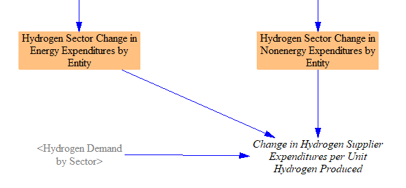

## Allocating Changes in Revenues

Revenues going to non-energy industries are allocated to some of the 36 ISIC codes tracked in the model.  (For more detail on ISIC codes, see the documentation page on the [input-output model](io-model.html).)  The shares for labor and for government (i.e. taxes) are separated out later, on the [Cross-Sector Totals sheet](cross-sector-totals.html).  Changes in capital expenditures are allocated to ISIC 28 (Machinery and equipment not elsewhere classified), while changes in non-fuel operational expenditures are allocated to ISIC 31T33 (Other manufacturing; repair and installation of machinery and equipment).

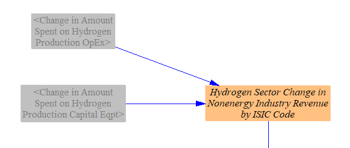

Remaining changes in revenues are allocated to the correct cash flow entities.  Taxes on fuels go to the government.  Changes in after-tax revenue for each fuel-supplying industry are assigned to the correct energy supplier cash flow entity.  The change in non-energy industry revenue by ISIC code is assigned to the "non-energy industries" cash flow entity, as this entity is always kept in sync with the corresponding values broken out by ISIC code.

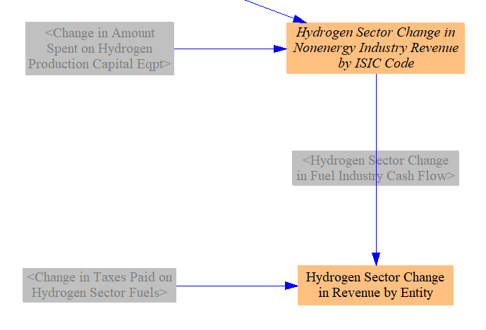

The changes in expenditures and revenues are then summed with those from other sectors on the [Cross-Sector Totals](cross-sector-totals.html) sheet.