## General Notes

The cash flow calculations for the Industry sector are more complicated than the cash flow calculations for any other sector.  This is in large part because the Industry sector includes two types of emissions (energy-related emissions and process emissions), with different policies that address each type, as well as being one of two sectors that uses carbon capture and sequestration (CCS).  The calculations include the following contributors to the cash flow totals:

* Cash flow impacts of implementing process emissions policies
* Cash flow changes from carbon tax on process emissions
* Cash flow impacts of implementing efficiency policies
* Cash flow changes from fuel use and taxes affecting fuel
* CCS-related cash flow changes

We sum up cash flow impacts on the fuel industry (by fuel), industrial equipment suppliers, government, other industries, and consumers.

Note that although we adjust industrial production upward or downward in response to policy-driven changes in fuel cost and a carbon tax (as described on the [main Industry page](industry-ag-main.html)), we do not consider this adjustment in the cash flow impacts section.  This is because the model only estimates direct costs and savings from policy implementation, not second-order or higher-order impacts on the economy.  A reduction in output would reduce not only revenues but also expenses, so detailed knowledge of the internal business processes and supply chains of each industry would be necessary to understand the net impact on its cash flow.  Additionally, it is unknown if a reduction in, say, iron and steel production would be accompanied by an increase in revenue of non-industrial sectors.  (Historically, the U.S. economy has continued to grow even as much manufacturing has moved overseas, as workers and capital investment have shifted into other sectors, such as services.)  Therefore, it is unclear whether the change in GDP would be positive or negative.  The Energy Policy Simulator (EPS) avoids speculating on any of these effects and confines its analysis to the direct cost of implementing policies, resulting fuel savings, etc.

## Cash Flow Impacts of Implementing Process Emissions Policies

We begin by taking the change in process emissions we found on the "Industry - Main" sheet and converting it to CO2e.  We use 100-year global warming potential (GWP) values, rather than the user-selected 20-year or 100-year GWP values, because we must use the same timeframe as the EPA source document that provides marginal abatement cost curves, which we use later in the calculation process to convert these changes in CO2e into changes in cash flow.  The following screenshot shows the structure that converts change in process emissions to CO2e:

Next, we assign all of those emissions reductions to different cost tiers.  Our source document provides marginal abatement curves, which specify a quantity of CO2e emissions that can be abated at each of a variety of price points (ranging from negative $50 per ton to positive $100 per ton in $1 increments, then up to $1000 per ton in $50 increments, and up to $100,000 per ton in even larger increments).  We assume the lowest-cost abatement opportunities are done first.  So if the user-specified policy settings cause 10 tons to be abated, the model will assign as many of those tons to the negative $50 cost tier as possible, then to the negative $49 cost tier, and so on, until all of the abatement has been assigned to a cost tier.  The structure of the model that accomplishes this is shown in the following screenshot:

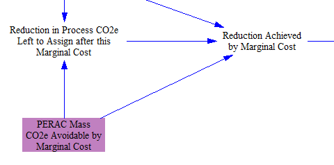

Note that the two calculated (non-input) variables in the screenshot above rely on mapping one subrange of the "Marginal Abatement Cost" subscript to a different subrange of that same subscript, so as to cause Vensim to loop through each element of the "Marginal Abatement Cost" subscript at each timestep.  This is an unusual but powerful way to use subscripts in Vensim.

Next, we multiply the number of tons abated at each marginal cost level by the cost definition for that tier.  If for a given policy, the funds go to industry (e.g. buying equipment) rather than consumers (e.g. training or hiring workers), we then apply the effects of the user-specified R&D capital cost reduction policy.  This gives us the change in cash flow for Industry due to process emission policies, as shown in the following screenshot:

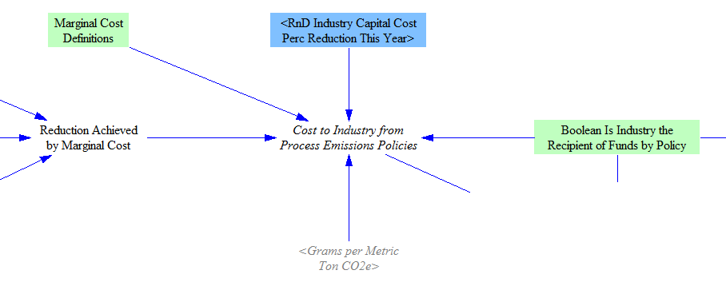

Finally, we assign cash flows to recipients.  First, we calculate the total amount spent on capital equipment due to process emissions policies, because this value is used in the [Cost Outputs sheet](cost-outputs.html).  This is shown in the following screenshot:

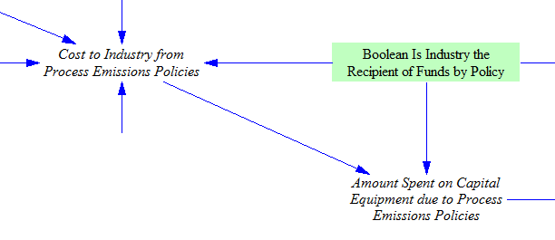

We calculate the total change in taxes paid by applying the correct tax rate (either the sales tax rate on equipment sales or the marginal income tax rate on payments to workers) to determine the share of the change in cash flow that goes to government as taxes.  The remainder is assigned to "industrial equipment suppliers" or "consumers," again depending on whether the primary expenditure of funds for a given policy goes toward buying equipment or toward paying workers.  "Industry" is the payer.  We break out the amount spent on labor due to process emissions policies, because this value is used on the [Cost Outputs sheet](cost-outputs.html).  The following screenshot shows the structure that performs these assignments:

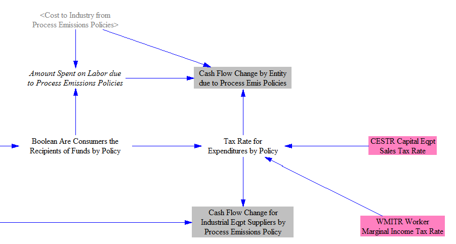

## Cash Flow Impacts of Implementing Efficiency Policies

We begin this calculation by determining the additional, incremental change in fuel use (that is, between the policy and BAU cases) in the current year of the model run relative to the prior year.  This incremental difference indicates how much additional equipment was needed in the current year, since equipment that enabled fuel savings in past years is still in operation and still provides fuel savings in the current year.  The following structure shows this calculation:

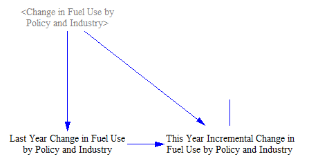

Next, we use input data that provide the cost to implement different efficiency policies per unit of energy saved annually (or, in the case of the fuel switching policy, per unit energy shifted from coal to natural gas annually).  These factors are multiplied with our incremental fuel savings (from the previous calculation) to determine the current year payments to implement efficiency policies (at more stringent levels than the prior year), as shown in the following structure:

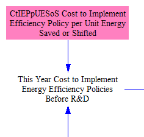

Next, we reduce the cost of equipment purchased due to the policies based on the user's setting for the R&D-driven industrial equipment capital cost reduction policy (by industry).  We only reduce the cost for policies where the main expense for compliance is to buy equipment, rather than to pay workers.  The following screenshot shows the relevant structure:

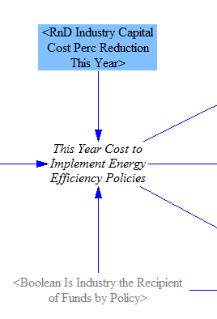

The "Industry" actor pays the full cost of implementing efficiency policies.  Consumers receive the amount spent on policies that primarily involve paying workers rather than purchasing equipment, minus the taxes on that cash flow.  Industrial equipment suppliers receive the amount spent on policies that primarily involve purchasing equipment, minus the taxes on that cash flow.  Government receives the amount spent on taxes.  We break out the amounts spent on labor and on capital equipment due to efficiency policies, as these values are used on the [Cost Outputs sheet](cost-outputs.html).  The following screenshot shows the structure where these cash flow assignments are made:

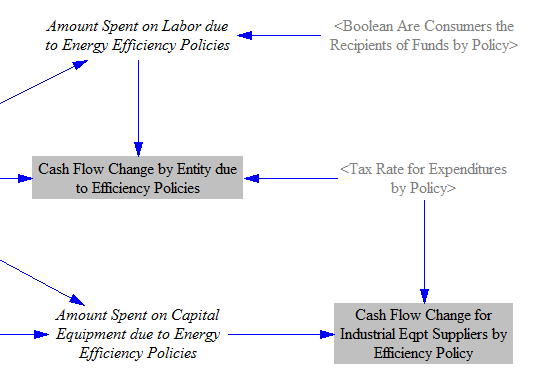

## Cash Flow Impacts from Fuel Use and Taxes Affecting Fuel

Efficiency policies in the Industry sector affect the quantity of fuel used, and cross-sector policies such as the carbon tax and fuel taxes can affect the cost per unit fuel.  To account for these changes, the fuel used by the Industry sector in the BAU and policy cases (including fuel used to power the CCS process) is multiplied by the fuel cost (disaggregated by fuel) in each case to obtain the total amount spent in each case.  We take the difference to find the change in the amount spent.  The following screenshot shows the relevant portion of the model:

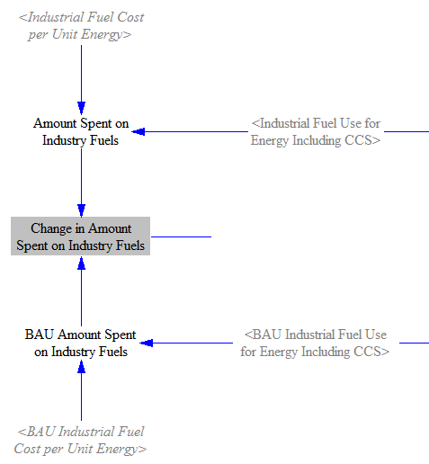

Next, we multiply the amount of fuel consumed in each scenario by amount of fuel tax per unit energy (by fuel) in that scenario to obtain the total taxes paid.  We take the difference in taxes paid between the two scenarios to find the change in taxes paid, and we subtract the change in taxes paid from the change in total fuel spending to find the change in the amount of money going to the fuel industry.  Changes in cash flow for the "fuel industry" are disaggregated by fuel, which allows us to reassign these cash flows to more meaningful industry categories on the [Cross-Sector Totals sheet](cross-sector-totals.html).  The following screenshot shows the relevant model structure:

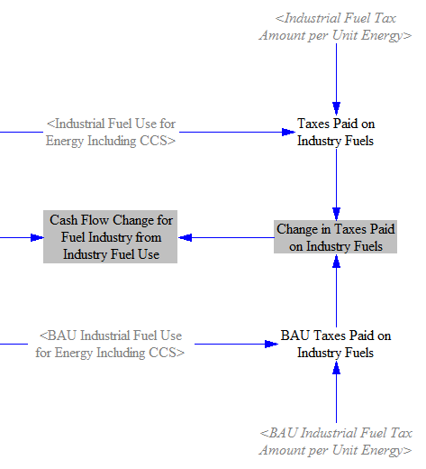

## Cash Flow Changes from Carbon Tax on Process Emissions

If the user has enabled the carbon tax policy, process emissions (which were previously untaxed) now incur payments.  The following screenshot shows the relevant structure:

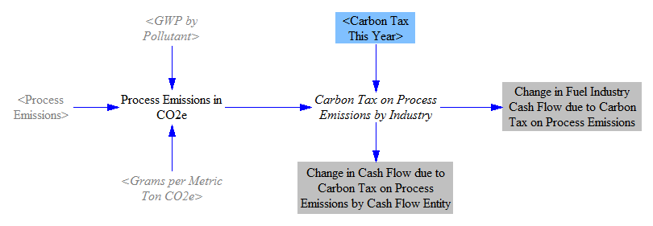

Process emissions are converted to CO2e, and the tax rate is applied to determine the amount of carbon tax (by industry).  These amounts of money are paid by industry to government.  (Specifically, we assign cost impacts on the mining industry to coal suppliers within the "fuel industry" and cost impacts on the natural gas and petroleum systems industry to natural gas and petroleum suppliers within the "fuel industry."  Cost impacts on other industries- iron and steel, chemicals, waste management, etc.- are assigned to the "Industry" actor in the model.)

Note that we use the user-selected GWP timeframe here, under the assumption that when the user sets the carbon tax rate (in $/metric ton CO2e), he/she is setting that rate with his/her chosen GWP timeframe in mind.

## CCS-Related Cash Flow Impacts

The change in Industry sector cash flow related to CCS has three components: differences in CCS capital equipment costs, O&M payments, and carbon tax reductions for sequestered CO2.

To calculate the change in CCS capital equipment costs, we take the difference in amount spent on CCS capital equipment in the BAU and policy cases.  We then use the capital equipment sales tax rate to assign the tax receipts to government, while the change in costs is borne by the "Industry" actor.  The following screenshot shows the relevant structure:

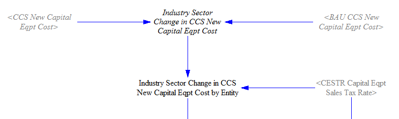

The change in O&M costs is handled similarly.  We find the difference in CCS O&M costs between the BAU and policy cases.  Then we divide up the change in cash flow by actor.  Consumers get the portion of the O&M expenses that consists of labor payments, minus the fraction that goes to income tax, based on the marginal worker income tax rate.  The remainder is equipment and is assigned to the industrial equipment suppliers (shown below), minus sales taxes, which are based on the capital equipment sales tax rate.  Government gets all tax receipts.  The "Industry" actor pays the difference in CCS O&M costs.  The following structure shows the determination of change in CCS O&M costs by entity:

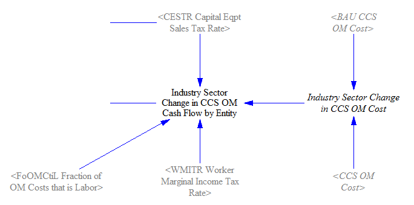

The change in cash flow for industrial equipment suppliers is the total spent on new CCS equipment and on the equipment portion of O&M expenses, minus the taxes on each, as shown in the following screenshot:

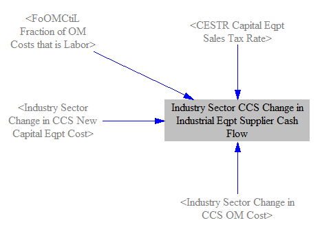

Finally, we take the difference in CO2 sequestered in the BAU and policy cases, convert from grams of pollutant to grams of CO2e (which does not change the number, because CO2 is the only pollutant that can be sequestered, and it has a GWP of 1), and convert to metric tons of CO2e.  This yields the change in CO2 sequestered by Industry.  We apply the carbon tax rate to find the total value of the sequestered CO2, and then we credit this value to the "Industry" actor, while reducing cash flow for Government by an equal amount.  The relevant structure is shown in the following screenshot:

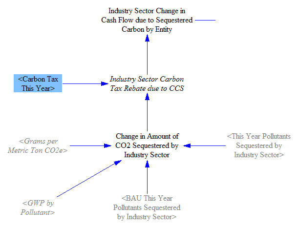

These three sources of change in cash flows (new capital equipment cost, O&M cost, and carbon tax rebate for sequestered CO2) are then summed to find the CCS-related change in cash flows for government, industry, and consumers.

## Summing Up Changes in Cash Flows

The Industry sector has so many sources of change in cash flows that we devote some space in the model simply to summing them up.

First, we sum the three sources of cash flow changes for industrial equipment suppliers (changes in equipment sold relating to process emissions policies, efficiency policies, and CCS), as shown in the following screenshot:

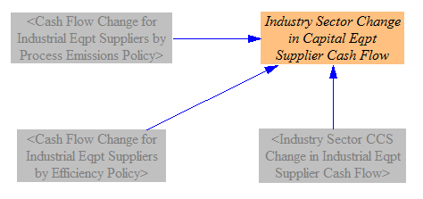

Next, we sum the two sources of cash flow changes for the fuel industry (changes related to fuel use and changes related to carbon tax on process emissions that are specifically from fuel industries), as shown in the following screenshot:

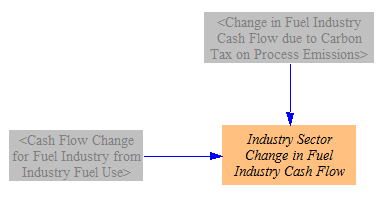

Finally, we sum all sources of cash flow change for the three main actors: government, industry, and consumers.  There are five sources of cash flow change: spending due to process emissions policies, the carbon tax on process emissions, spending due to efficiency policies, spending on fuel, and spending on CCS (equipment, O&M, and carbon tax rebate for sequestered CO2).  Consumers only need to add three of these sources of change, because they are not involved in cash flow changes related to carbon tax on process emissions or related to fuel spending.  The relevant model structure is shown below:

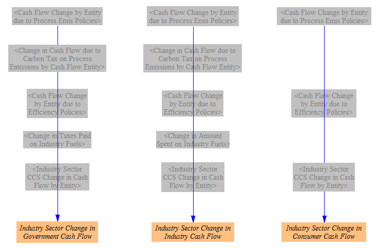
