## General Notes

### Included Industries

In the Energy Policy Simulator (EPS), the Industry Sector tracks emissions from the following specific industries or industry categories:

* cement and other carbonates
* natural gas and petroleum systems
* iron and steel
* chemicals
* mining
* waste management
* agriculture
* other industries

Note that agriculture is treated as a specific industry.  Agriculture is distinct from land use, land use change, and forestry, which is handled on its own [LULUCF Sector](lulucf.html) page.

### Types of Emissions

Two types of emissions are tracked in the Industry Sector: energy-related emissions and process emissions.  Energy-related emissions are similar to emissions from other sectors in the model; they come from the combustion of fuel to generate energy that is used to provide specific services (in this case, to manufacture industrial products).  It does not matter if the fuel is combusted to create usable heat, on-site electricity, or some other form of energy: this is considered fuel use by industry.  This means that the electricity use by industry shown in the EPS refers to electricity obtained from the grid, not electricity generated on-site using fuels, waste heat, or other means.

Process emissions refer to the emissions of any of the twelve tracked pollutants that occur as a result of industry operations and which were not related to the combustion of fuel for energy.  For example, when limestone is chemically broken down as part of the cement-manufacturing process, the CO2 that is released is an example of process emissions.  Similarly, when methane leaks from wells or pipes, the leaked methane is process emissions.  Sometimes a high-GWP gas is itself an industrial product, such as various HFCs that are used as solvents, fire suppressants, refrigerants, and propellants; these also count as process emissions.

### Foreign Leakage

The EPS considers policies only on a national scale.  Typically, a unilateral policy that lowers emissions from industry will lead to an increase in emissions in other nations.  This can happen because some companies move their operations overseas, or because companies that are already overseas scale up production (to export to the modeled country- in this case, to the U.S.) and domestic manufacturers reduce production.

In certain cases, leakage can be negative- that is, a reduction in emissions from the modeled country also leads to a reduction of emissions from other countries.  This is most likely to happen if the modeled country (the U.S., in this case) is a major player in setting the market price for a globally traded commodity.  When policies within the U.S. cause the U.S. to reduce production, the global price for the good increases due to the reduction in supply.  As a result of the higher prices, consumers in other countries reduce demand for the product.  In the case of the U.S., production of coal, oil, and gas all have negative leakage rates, whereas nearly all other products have positive leakage rates.

Emissions due to leakage are estimated by the model but are not added to total emissions, since that total is meant to reflect only emissions from the modeled country.

## Process Emissions

### Policies

All policies affecting process emissions are represented as a fraction of the total potential abatement from that policy that is achieved (based on the user's policy setting and policy implementation schedule), so they are all handled via a similar calculation flow, as shown in the following screenshot:

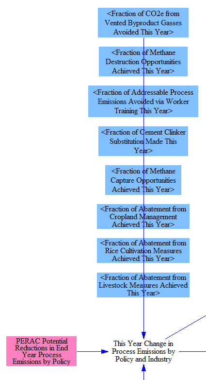

Each policy setting at its current year value is multiplied by the total potential reduction in the end year to obtain the current year's reductions due to that policy (in CO2e).  Emissions reductions are disaggregated by industry and by policy.  Our source for potential percentage reductions achievable in the end year did not include process CO2 emissions, which is relevant to the cement industry, so we need a small, additional calculation to establish the potential of the cement clinker substitution policy, as shown below:

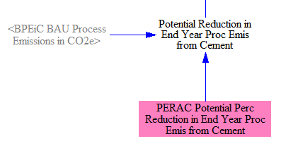

### Disaggregation by Pollutant

Next, we need to disaggregate changes in process emissions by pollutant.  This is handled via the structure in the following screenshot:

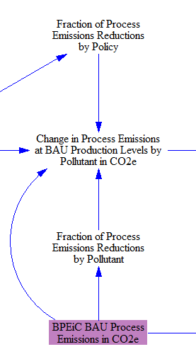

Our source for process emissions is broken out by pollutant, but our source for the reductions achieved via policies provides data in units of CO2e.  Accordingly, we assume process emissions reductions are from gases in proportion to the amount those gases contribute to each industry's total process emissions, excluding CO2.  (We exclude CO2 because all policy-driven reductions of process emissions come from non-CO2 gases, except in the cement industry, for which we use a different source to calculate CO2 abatement potential, 100% of which is ascribed to the cement clinker substitution policy.)

We calculate the fraction of process emissions reductions attributable to each policy for each industry so that we can perform a double-check when calculating the change in process emissions at BAU production levels, to ensure that reductions do not exceed total process emissions (of a given pollutant for a given industry), which can happen if BPEiC and PERAC use different data sources.

### Calculation of Process Emissions

Finally, we calculate total process emissions using the following structure:

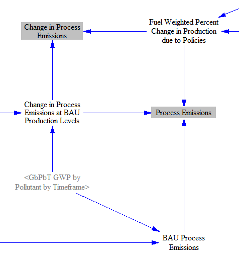

First, we use global warming potential (GWP) factors to convert BAU Process Emissions in CO2e to BAU process emissions in units of each specific pollutant.  We do the same with the policy-driven change in process emissions.  (Here, we use the 100-year GWP timeframe, rather than the user-selected GWP timeframe, because the EPA source used 100-year GWP values when converting to CO2e, and we are simply undoing their conversion.)

Finally, we apply the fuel-weighted percent change in production due to policies (the calculation of which is explained below) to adjust both the process emissions and the change in process emissions to reflect increases or decreases in industry production levels.  The "Process Emissions" variable is used later on this sheet as a component of total Industry sector emissions, while the "Change in Process Emissions" variable is used on the [Industry - Cash Flow sheet](industry-ag-cash.html).

## Policies Affecting Fuel Use

The Industry Sector policies that do not affect process emissions instead affect fuel use, either by reducing fuel use or by changing the type of fuel that is consumed.  Some cross-sector policies, such as the carbon tax and fuel taxes, can also play a role.

The early retirement policy causes older, less efficient industrial facilities to retire before their normal lifetimes are exhausted.  It does not affect production, which means that either new, efficient facilities are opened to replace them, or production levels are scaled up at existing facilities.  The policy is implemented as a fraction of potential fuel use reduction achieved.  The following screenshot shows the relevant structure:

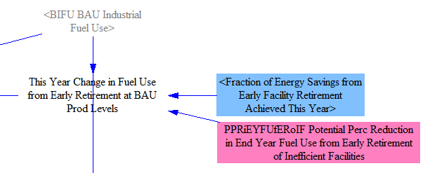

The next policy represents measures taken to improve the design of industrial facilities as integrated systems, and to ensure all of the components of those systems work well together, and the flows between them are well-handled.  This is distinct from any improvements to the components themselves (like motors, pumps, etc.), which is covered by the efficiency standards policy (discussed below).  The policy is implemented as a fraction of potential fuel use reduction achieved.  The following screenshot shows the relevant structure:

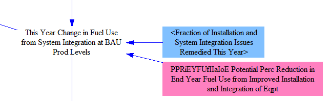

The next policy causes the adoption of more cogeneration and waste heat recovery than in the BAU case.  Cogeneration refers to facilities creating both electricity and useful heat from the same process, while waste heat recovery refers to facilities making use of heat generated by various processes (such as the heat in an exhaust stream) to serve a useful purpose, such as to create electricity.  In either case, it reduces the amount of fuel or grid-source electricity needed by industrial facilities.  The policy is implemented as a fraction of potential fuel use reduction achieved.  The following screenshot shows the relevant structure:

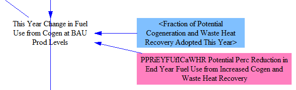

The industrial equipment efficiency standards policy specifies a required reduction in fuel use (relative to BAU) that will be mandated by standards for energy-using industrial components, such as motors, pumps, boilers, etc.  This policy refers to the components that are assembled together as part of industrial facilities; efficiency improvements from improved installation practices or the proper integration and coordination of different components are handled by the installation and system integration policy (discussed above).  Standards do not require facilities to retire early, mandate the use of cogeneration or waste heat recovery, or specify which fuel must be used, so the efficiency standards policy effects are non-overlapping with other industrial fuel use policies.  The user specifies the percentage fuel use reduction required by the standards, so no input variable is necessary to convert a user setting into an energy usage value.  The structure for the standards policy is shown in the following screenshot:

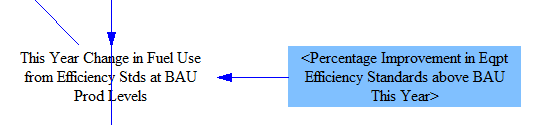

The fuel switching policies cause a portion of the coal or natural gas used by industrial facilities to be swapped out in favor of one or more different fuel sources, as specified in the "Recipient Industrial Fuel Fractions" variable.  Different combinations of recipient fuels may be defined for each source fuel.  For example, coal facilities may switch to natural gas, while natural gas facilities may switch to electricity.  The conversion is done on the basis of energy content in the fuel, so when electricity is a recipient fuel type, an efficiency adjustment is applied to account for the greater efficiency with which electricity is used relative to thermal fuels.  The following screenshot shows the structure for the fuel switching policies:

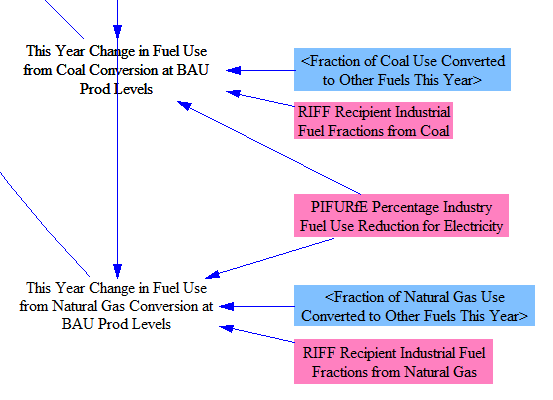

The R&D policy reduces fuel use by a user-specified percentage.  As with other R&D policies, this policy represents additional R&D, beyond any that is required to comply with other policies, such as fuel efficiency standards.  Structurally, this policy is applied and added to a variable that specifies all of the percentage changes in fuel use by policy (at BAU production levels, as we have not yet adjusted industrial production up or down in response to fuel cost changes and the carbon tax).  The following screenshot shows the relevant structure:

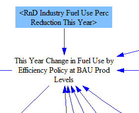

## Changes in Industrial Production Levels

The model allows policies to influence the level of industrial production via two mechanisms: changing the cost of fuel, and applying a carbon tax, which can affect production independently of the carbon tax's effects on the cost of fuel by changing the cost of other inputs to production (due to their embedded carbon content).  The following screenshot shows the relevant structure:

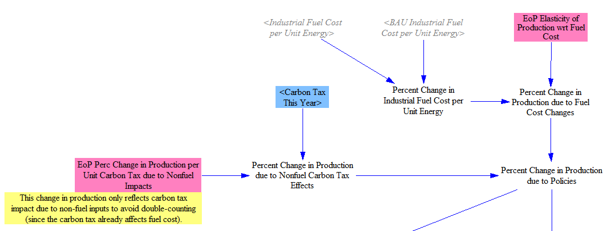

To find the fuel price-driven component of change in industrial production levels, we take the difference in fuel costs (by fuel) between the BAU and policy cases.  We multiply this by an elasticity of production by industry with respect to fuel costs by fuel to find "Percent Change in Production due to Fuel Cost Changes."  The carbon tax works similarly: we multiply the carbon tax rate by an elasticity of production per unit carbon tax due specifically to non-fuel inputs.  (The carbon tax's effect on fuel prices is already factored into the fuel price-driven adjustment.)  We use a source for the effect of a carbon tax on overall production levels by industry and multiply by the fraction of inputs that are not fuel, on a dollar basis.  We combine these two effects (change in production due to fuel cost changes and due to nonfuel carbon tax effects) to obtain a final "Percent Change in Production due to Policies."  This percentage change in production affects both fuel use and process emissions.

## Totaling Fuel Use and Emissions

### Fuel Use for Energy Purposes

Our data source on industrial fuel use includes fuel used for non-energy purposes, and any emissions that result from those uses are already accounted for in our BAU Process Emissions input data.  Accordingly, we need to remove them from the industrial fuel use total before we convert fuel use to emissions.  We do this in the structure shown in the following screenshot:

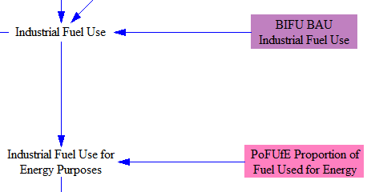

Next, we add the fuel used to power the carbon capture and sequestration (CCS) process, as shown in the following screenshot:

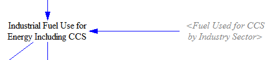

This gives us the total industrial fuel use for energy, including fuels used for CCS.

### Electricity Demand

From the total industrial fuel use for energy, we separate out the electricity demand and convert it to MWh.  This refers to the electricity drawn from the grid- electricity that is generated and consumed on-site is not tracked as part of the "electricity" total because it does not require more power to be generated by the electricity sector.  The following structure shows the reporting of electricity use:

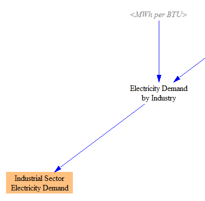

### Total Emissions from Industry (not including leakage)

Next, we convert fuel use to emissions using the emissions intensities from the [Fuels sheet](fuels.html).  We then add process emissions and subtract the quantity of CO2 that is sequestered via CCS to give us total emissions from industry in the modeled nation, as shown in the following structure:

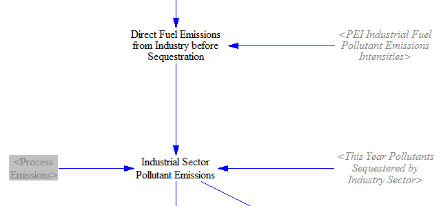

### Foreign Leakage

The model calculates foreign leakage (emissions induced in foreign countries in response to unilateral implementation of policies in the model) via the following structure:

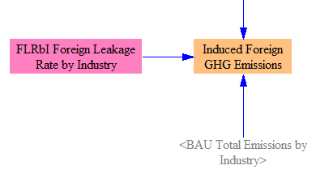

The difference between BAU and policy case emissions by industry are multiplied by the foreign leakage rate (by industry) to obtain the total induced foreign emissions.  These emissions are not added into the totals for the modeled country or region- they are simply reported here.  More information about the calculation of foreign leakage appears above on this page, under the "General Notes" header.

### Industry Sector CO2e Emissions

The model converts Industry sector emissions to units of CO2e using GWP values, as shown in the following screenshot:

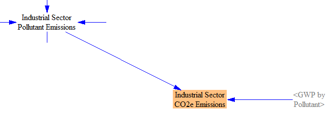