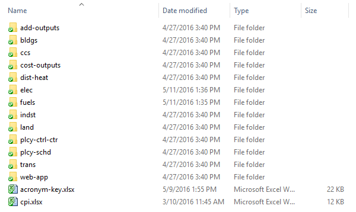
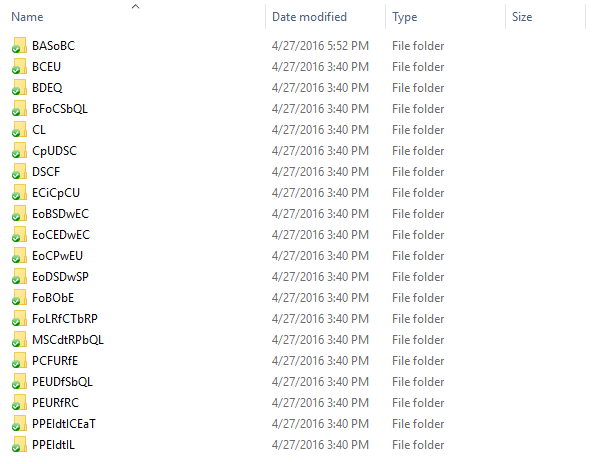
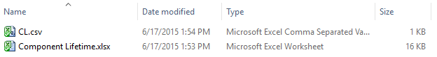
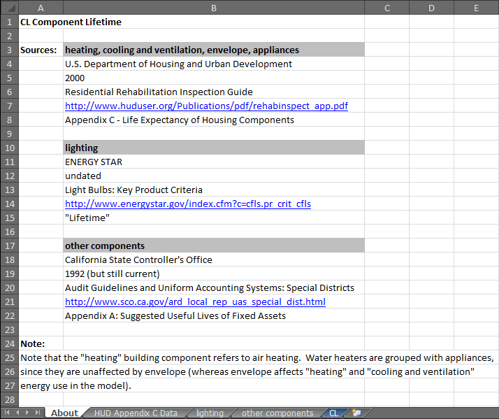
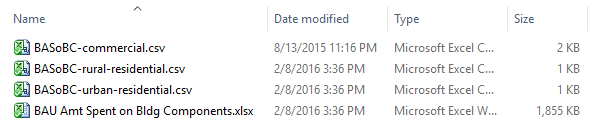
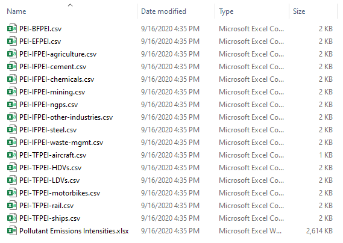

The Energy Policy Simulator (EPS) is distributed with a set of input data representing the modeled country or region.  For instance, the U.S. EPS contains a dataset representing the United States.  The same core model code (in the `EPS.mdl` and `EPS.vpmx` files) is compatible with multiple different regions - the way the EPS is adapted to different geographies is by updating the input data (and the file `WebAppData.xlsx`) to reflect the new region.

There are differences in input data needs (e.g. which variables exist, or how they are subscripted) between different versions of the core model code (such as EPS 2.1.1 and EPS 3.0.0), but two geographic regions using the same core EPS version contain the same set of input data variables.

This page describes the format and organization of the input data.  It also provides guidance that will be useful for a user seeking to swap a single input data value (for example, to provide an updated U.S. value) or to swap most or all of the input data (for example, to cause the model to represent a different country).

## Input Data is Separate from the Model File

The EPS has been designed to read all of its input data from comma-separated values (`.csv`) text files every time the model is run.  Separating the input data from the model itself allows the input data to be viewed and edited using a spreadsheet program.  This has two key advantages:

* Input data can be edited without the need to own a paid version of Vensim, the program used to develop the Energy Policy Simulator.  Vensim Model Reader, which cannot edit the model file, is satisfactory for users who want to examine the model, run the model, and even edit its input data.

* Input data sets may be developed that represent different countries.  They can all be compatible with the same, country-neutral version of the model executable (`.mdl` or `.vpmx` files).  This means that bug fixes and new features can be implemented in a single place, and they will be available to all country-specific versions of the model that are subsequently built or that are updated to the latest core model platform.

## Input Data Organization

### Folders

Inside the downloadable model distribution, there is an "InputData" folder.  The contents of the InputData folder will be similar to that shown in the following screenshot:

Most input data are organized into folders, each of which corresponds to one or more sheets of the Vensim model.  For example, the "add-outputs" folder contains input data for variables that are used on the "Additional Outputs" sheet in Vensim, and the "bldgs" folder contains input data for variables that are used on any of the "Buildings - Main," "Buildings - BAU," or "Buildings - Cash Flow" sheets in Vensim.  (The location of a variable in Vensim refers not to the location of any references to that variable, called "shadow variables" in Vensim, but to the primary (non-shadow) instance of the variable.  All input data variables in the EPS only have one such non-shadow instance.)

Inside each folder that corresponds to one or more sheets in Vensim are folders for particular variables, or in some cases, a handful of variables that rely on the same data sources as each other.  These folders are named via acronyms for the variables' full names or, in the case of multi-variable folders, acronyms for a term that encompasses the variables contained in that folder.  For example, here is a screenshot of the contents of the "bldgs" folder:

The use of acronyms is necessary because of limitations in the Windows OS on file path lengths.

If a user is looking at a variable with the EPS open in Vensim, it is possible to quickly locate this variable in the InputData folder because every input data variable in Vensim has a name that begins with the acronym used to name its folder inside the InputData folder.  So, if a user is looking at a variable in Vensim, he/she can simply navigate to the folder that corresponds to the sheet he/she is viewing (for example, "bldgs" for the "Buildings - Main" sheet), and then open the folder whose name is the acronym that prefixes the variable he/she is examining in Vensim (for example, the "CL" folder for the "CL Component Lifetime" variable).

There also exist several files at the root of the InputData folder:

* `acronym-key.xlsx` contains a listing of all of the acronyms used to name the folders for each data variable.  In cases when a data folder contains more than one variable, the acronym key also lists all of the variables contained within that folder.  The key may be helpful in locating a particular variable of interest within the InputData folder.  As noted above, it is not necessary to use the acronym key if one is already viewing a variable in Vensim.  The key provides an alternative way to locate variables and might be particularly useful for users who want to find a variable without opening the model in Vensim.  `acronym-key.xlsx` includes suggested guidance on which variables are of high or low priority to update if creating a version of the EPS for a new country or region.

* `cpi.xlsx` refers to "consumer price index."  This file provides source information and data used to convert the currency year of the dollars used in various input files to 2012 dollars.  It is located in the root of the InputData folder because many input data variables required conversion of their currency years, and it is more efficient to include CPI source information and data in one place, rather than to include copies of it inside the folder for each variable that required currency year conversion.

* `CSV Export Tool.xlsm` is an Excel spreadsheet containing Visual Basic scripts.  It allows you to efficiently generate or re-generate the Vensim-readable `.csv` files from the Excel data files for any or all of the input variables.

* `output_shares_by_industry.xlsx` contains data used for dividing up certain cash flows between different entities in the model.  Like `cpi.xlsx`, it is used in more than one variable spanning multiple sectors, so we put the data and source information in one place here.

* `version.txt` contains the core version number of the EPS release.  This information is also displayed inside the model itself (`EPS.mdl` and `EPS.vpmx` on the "Structural Overview" sheet.)

### Excel and .csv Files

Most acronym folders correspond to a single variable.  These folders will usually contain one Microsoft Excel file and one or more `.csv` format files.  For example, here is a screenshot of the contents of the "CL" folder (inside the "bldgs" folder):

The Excel file serves several functions: it provides source information for this variable, shows any calculations that were performed to obtain the values required by the model based on the informaiton in the sources, and formats the data correctly for input to the model.  One or more of the tabs in each Excel file is designed to be exported in `.csv` format to generate the accompanying `.csv` file(s) in that variable's folder.  When seeking to change the input data for the model, one should always change the Excel file and re-export the relevant tab(s) to `.csv` format.  One should never edit the `.csv` file directly, as it is too easy to make a mistake or misunderstand what is involved in a given variable without looking at the actual data source(s) and calculations(s) used to create the `.csv` file in the first place.

The first tab of the Excel file for each variable is generally named "About" and provides bibliographic information about the source(s) used to populate that variable.  Sometimes, there are also notes on the "About" tab that explain assumptions, categorization choices, or calculation procedures used on other tabs of the spreadsheet.  The actual data and calculations appear on gray-colored tabs that follow the "About" tab.  Tabs with final data that have been formatted to be exported in `.csv` format are colored dark blue (with white lettering) and have the same name as the `.csv` file they are designed to generate, minus the file extension.  (This is the filename that the Vensim model expects when looking for input data at runtime.)  For example, here is a screenshot showing the first tab of the `Component Lifetime.xlsx` spreadsheet, which includes bibliographic info, a clarificatory note, and the other tabs below:

Frequently, a folder will include one Excel file and multiple `.csv` files.  Each `.csv` file normally corresponds to a subscript or combination of subscripts.  Multiple `.csv` files are needed whenever all of the necessary input data cannot be accommodated in a single, two-dimensional table.  This most frequently happens for time-series data, where time occupies one axis of each table, values of one subscript occupy the second axis, and values of a second subscript define the different `.csv` files.  For example, the `BASoBC` (BAU Amount Spent on Building Components) folder contains `.csv` files where one axis is time, one axis is the type of component (heating, cooling and ventilation, etc.), and files are defined by building type (commercial, rural residential, and urban residential).  Tables defined by values of a subscript begin with the variable's acronym followed by a hyphen and then that table's subscript value.  Here is a screenshot of the contents of the BASoBC folder:

Sometimes an acronym folder will contain more than one variable from the EPS model.  This typically is done when more than one variable in the EPS relies on the same data source (usually a data table), while differing in the necessary calculations and use of other data sources.  Creating copies of a data table that is used by multiple EPS variables would make the model harder to update, because if the source data for that table were to change, it would need to be updated in several different Excel spreadsheets in the InputData folder.  A better solution is to allow multiple variables to be contained within a single Excel file and draw from the same data table, but to produce different `.csv` files for use in the model.  In this case, the acronym for the folder is a term that encompasses the different variables the folder contains, rather than the first initials of a particular variable.  As an example, here is a screenshot of the contents of the `PEI` (Pollutant Emissions Intensities) folder, inside the `fuels` folder:

In this case, .csv files begin with the acronym for the enclosing folder (`PEI`), followed by the acronym for the particular variable for which they supply data (`BFPEI`, `EFPEI`, `IFPEI`, or `TFPEI`).  For variables with different `.csv` files for different subscripts, this is followed by the values of the subscript that define each table (`agriculture`, `cement`, etc.).  Hyphens are used as separators.

A few variables use calculated outputs or intermediate calculation steps from other variables as their inputs, but are not produced by the same Excel file, usually to limit the amount of complexity in any single Excel file.  These instances are noted in the `acronym-key.xlsx` file, in the "Relies on variable" column.  For example, in the Transportation sector, `SDoVPbT` (Standard Deviation of Vehicle Prices by Technology) relies on `BNVP` (BAU New Vehicle Price).

## Working Units and Output Units

The units used by the EPS when outputing results can be customized using the conversion factors in the variables inside the `web-app` folder.  For example, financial results could be output in 2019 U.S. dollars, 2015 Chinese yuan, or any other currency.  The same is true for other types of outputs, such as units of energy or mass of pollutants.

Internally, the EPS standardizes on specific "working units" that are used throughout its calculations.  Input data from various reports or databases needs to be adjusted to use the working units on the blue tabs that are exported to `.csv` format.

For more information on working units and output units, see the [Notes on Unit Conversion](unit-conversion.html) section of the documentation.

## Input Data Contents

Due to the wide range of sectors covered by the EPS, a great diversity of different data sources are required.  However, some generalizations can be made:

* All source data are carefully cited.  Citations appear on the "About" tab of each input variable's Excel file.  Author, year, title, URL, and a specific page/table/paragraph reference are provided whenever they are available.  The aim is to make it easy to understand where the data were obtained, so users can decide if the data are suitable for their particular purposes, and they can more easily replace the data if desired.

* The model only utilizes publicly available data.

* The vast majority of the data are from sources that do not cost money to access, such as government statistical publications, open-access academic journals, and reports published by NGOs or other organizations.  A few variables rely on data from published articles in paid-access academic journals.  In these cases, the journal publisher charges a small fee to access the article.  (This fee can sometimes be avoided by using a public or university library that has a subscription to the relevant journal.)

* For time-series input data, values for each year of the model run are used.  Sometimes interpolation or extrapolation is necessary, if the source does not provide annual values for all of these years.  For time-invariant input data, we use whichever source is most reliable or best suited to the model's needs, often preferring studies that were conducted more recently.

## Input Data Sources

Due to the large number of data sources (often several for a single variable), there is no centralized list of all data sources used in the model.  All data sources are carefully documented in the Excel files for their associated variables, as described above.  However, for the U.S. version, some of the major sources include:

* The U.S. Energy Information Administration, particularly for BAU fuel use data in many sectors
* The U.S. Environmental Protection Agency, especially pertaining to industrial process emissions
* Argonne National Laboratory, for pollutant emissions intensities
* The U.S. Forest Service, for data pertaining to land use and forestry
* The U.S. Bureau of Transportation Statistics, for data pertaining to travel demand and vehicle properties
* The OECD, for input-output tables and related macroeconomic variables