## I/O Model Capabilities

Prior to version 3.0.0, the Energy Policy Simulator (EPS) only calculated the direct (first-order) cash flow effects of the policy package: namely, which entities spent more or less money and which entities received more or less money, due to changes in prices or quantity of fuel, equipment, or labor purchased, or taxes and subsidies.  This allowed a user to get a sense of the direct "costs" or "savings" of a policy package, but it could not calculate outputs such as the change in GDP, jobs (employment), or employee compensation, as those metrics strongly depend on how the recipients of first-order cash flow changes use those dollars (or how they make up the shortfall if their cash flow is reduced).

In the 3.0.0 release, a macroeconomic input-output (I/O) model was added as a fully integrated component of the EPS.  The I/O model adds the capability to estimate a modeled policy package's impacts on:
- GDP (total, and value added disaggregated by industry)
- Jobs (total, and disaggregated by industry)
- Employee Compensation (total, average compensation per employee, disaggregated by industry, and disaggregated by union vs. non-union jobs)

The EPS now captures how money is re-spent (by government, by households, and by each industry), capturing indirect and induced economic activity caused by the policy package.  New feedback loops from the I/O model into the main energy-demanding sectors (Transportation, Buildings, and Industry) now allow the EPS to calculate the energy use and emissions associated with indirect and induced economic activity.  Prior to 3.0.0, only direct changes in economic activity caused by the policy package were captured.

A new policy lever allows the user to adjust the way in which government re-spends changes in its revenue.  This allows for simulation of policies such as revenue-neutral carbon pricing, enabling model users to specify how revenues are rebated (e.g. reductions in payroll taxes, in corporate income taxes, in individual income taxes, direct "climate dividend" payments to households, etc.), or enables government to spend the money on products from specific ISIC codes (e.g. to represent things such as infrastructure construction).  In policy packages that reduce government cash flow, the new policy allows the user to specify how government will make up the shortfall.

## Economic Categories and Data

The I/O model breaks the economy down into [International Standard Industrial Classification (ISIC) codes (Rev. 4)](https://unstats.un.org/unsd/publication/seriesM/seriesm_4rev4e.pdf), a classification system for economic activity developed and maintained by the United Nations Statistics Division.  Input-output tables specify which ISIC codes (e.g. industries) supply the inputs for each other industry, and which entities buy the outputs of each industry.  Other tables, also divided up by ISIC code, specify the total jobs, value added, employee compensation, and economic output of each ISIC code.  By default, the EPS draws these data from the OECD Statistical Database, where the OECD has freely released their [input-output data](https://stats.oecd.org/Index.aspx?DataSetCode=IOTSI4_2018) and [associated employment-related data](https://stats.oecd.org/Index.aspx?DataSetCode=TIM_2019_MAIN) for over 60 countries and regions.  For citations to specific tables within the OECD database, [download the EPS](download.html) and look at the first tab of the Excel file for the variable in which you are interested.  EPS adaptations for regions not in the OECD database will use other sources of I/O data, reformatted to fit the ISIC code categories used by the OECD.

The OECD's data uses 36 ISIC code categories, which is generally sufficient for the EPS.  However, the OECD lacks sufficient granularity for energy-supplying industries.  Therefore, the EPS maintains its pre-3.0 break-out of energy suppliers (electricity suppliers, coal suppliers, natural gas and petroleum suppliers, biomass and biofuel suppliers, and other energy suppliers), and calculates impacts for these energy-supplying industries.  Similarly, the EPS uses its more sophisticated [fuel import and fuel export calculations](fuels.html) to determine the cash flows associated with fuel imports and exports, instead of using the OECD data.  The more sophisticated handling of energy products and energy industries is the main reason that non-energy industries and energy industries are treated differently on the "Cash Flow" sheet for each sector of the model, as well as on the [Cross-Sector Totals](cross-sector-totals.html) sheet.

## Direct, Indirect, and Induced Economic Impacts

In this document, the effects of the policy package on key economic metrics (e.g. jobs, GDP, employee compensation) are sometimes described as "direct," "indirect," and "induced" impacts.  The EPS captures all three types of impacts.  It can be helpful to have an understanding of the differences between these types of impact.  Consider a hypothetical policy whose effect is to cause the auto manufacturing industry to grow (to increase its output).

- **Direct** economic impacts are those within the affected business itself, caused by the policy or project.  For example, if the policy causes the auto manufacturing industry to hire more workers, those added jobs are a direct impact of the policy.

- **Indirect** economic impacts are those within suppliers of the affected industry.  For example, if the growth of the auto industry causes the auto manufacturers to buy more steel, and steel-making companies hire more workers in response, the added jobs at steel-making companies are an indirect impact of the policy.

- **Induced** economic impacts are those caused by respending of money paid to workers or government as a result of the growth of the affected industry.  For example, the new workers at the auto- and steel-making companies will spend their wages on various items, such as restaurants and leisure travel.  The resulting job growth in the restaruant industry or in the leisure travel industry are an induced impact.  Similarly, if the growth of the auto industry increases government tax revenue (for instance, from workers' income taxes or sales taxes on the additional vehicles sold), and government spends the money on building new highways, added jobs at highway construction companies are an induced impact.

## Note on Policy Effects on Jobs When at Full Employment

As money can be respent with ever-increasing rapidity (more passes per time period), there is effectively no hard limit to how much policy may increase value added or employee compensation.  In contrast, the supply of workers is not infinite.  At times when there is non-trivial unemployment, it is fair to assume that policy effects to boost employment will draw unemployed people into the workforce (if not directly, then because the unemployed people can occupy positions vacated by workers who take the newly-created jobs).  Hence, in most situations, policy-driven job gains can be treated as additive to BAU jobs.

However, at times when the economy is at full employment (e.g. unemployment is extremely low, and the labor force participation rate is very high), jobs added by a policy may take workers from other businesses, who may in turn take workers from other businesses, etc., failing to draw more people into the workforce, due to the lack of non-employed people interested in and able to work.  Even in this situation, creating new jobs can be beneficial because it may increase overall job quality.  (If the new jobs were not more attractive than at least some existing jobs, no workers would switch to the new jobs.)  But the gain in total number of workers will be dampened.

The jobs calculations in the EPS assume the economy is not at full employment, so newly created jobs are additive.

## Credit for I/O Calculation Approach

The I/O model within the EPS follows generally-accepted I/O modeling principles pioneered by Nobel Prize-winning economist [Wassily Leontief](https://en.wikipedia.org/wiki/Wassily_Leontief) and refined by others.

We gratefully acknowledge the invaluable contributions of the [American Council for an Energy-Efficient Economy](https://www.aceee.org/) (ACEEE), [Jim Barrett](https://www.barretteconomics.com/), and [Skip Laitner](https://www.linkedin.com/in/skip-laitner-746b124/) for their guidance and advice in implementing the I/O model within the EPS, and for allowing us to learn from the [DEEPER I/O model](https://www.aceee.org/files/pdf/fact-sheet/DEEPER_Methodology.pdf), originally created by Skip Laitner.

## I/O Calculation Approach

A detailed, illustrated walkthrough of the calculation approach appears below.  Note that inputs to the I/O model pertaining to the direct impacts of the user's chosen policies come from the [Cross-Sector Totals sheet](cross-sector-totals.html), so if you have interest in how these inputs are obtained, you may wish to review that documentation page before proceeding. 

## Government Revenue Reallocation Policy

One of the key inputs to the I/O model is the change in cash flow for each ISIC code and each tracked cash flow entity.  (There are nine cash flow entities: government, non-energy industries, labor and consumers, foreign entities, and the five energy suppliers listed above.)  These totals are calculated on the [Cross-Sector Totals sheet](cross-sector-totals.html), but they may be modified by the policy lever that reallocates policy-driven changes in government revenue.

By default, government revenue is spent (sent to various ISIC codes) in accordinace with the existing (BAU) government budget allocations.  This might represent the government using additional revenue to do more of whatever it already does (or doing less of those things, in response to a drop in government revenue).  However, this policy enables the user to specify any set of recipients of additional government revenue (or payers who make up a shortfall in government revenue), from any of the tracked entities or ISIC codes in the EPS.  For example, this policy can be used to represent revenue-neutral carbon pricing, and allow the user to decide precisely _how_ the pricing is to be revenue-neutral: e.g. by reducing taxes on businesses, reducing taxes on households or providing a climate dividend, etc.  It also can represent government spending more on the products of specific ISIC codes, such as building materials for infrastructure projects.  It cannot allocate revenue more finely than the available 9 cash flow entities and 36 ISIC codes, so it cannot be used to (for example) specify the government uses revenue exclusively to buy solar panels.  (However, when a subsidy policy is available in the EPS, you can use that subsidy policy lever, which will reduce government cash flow by the amount of subsidy paid, which has the same effect as directing the government to spend more of its revenue on the subsidized activity.  Subsidy policies are available for a few things, including specific electricity generation technologies and electric vehicles.)

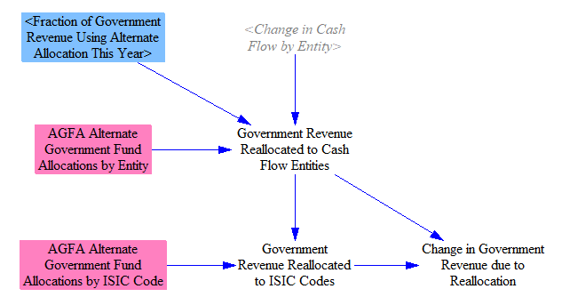

The three variables "Government Revenue Reallocated to Cash Flow Entities," "Government Revenue Reallocated to ISIC Codes," and "Change in Government Revenue due to Reallocation" sum to zero (if the government revenue reallocated to the "non-energy industries" cash flow entity is disregarded, since this entity is itself represented by the broken-out ISIC codes).

## Calculating Change in Domestic Output by ISIC Code

For the next step, we calculate the policy-driven change in output for each cash flow entity and each ISIC code tracked in the EPS.  For government, by default, we assume increases in revenue are spent in proportion to how the existing government budget is spent, as defined in variable GEbIC Government Expenditures by ISIC code.  This is modified by the government revenue reallocation policy, if it is enabled.  For example, in a policy package that increases government revenue, the reallocation policy may reduce the amount of government revenue allocated to ISIC codes (by redirecting some to households), and/or it may change the proportions of cash received by ISIC codes (for instance, by reducing payroll taxes paid by all industries).

Change in households' cash flow are allocated to ISIC codes in the same proportions as existing household expenditures.  The change in households' cash flow includes any cash received from the government revenue reallocation policy.

Policy-driven changes in industries' revenues and expenditures have already been assigned to ISIC codes in the various sectors elsewhere in the EPS and summed on the [Cross-Sector Totals](cross-sector-totals.html) sheet.  Here, we do these things:
- We add in any change in government revenue that was reallocated to ISIC codes using the government revenue reallocation policy.
- We assign changes in cash flow for the five energy suppliers to the (more aggregated) ISIC codes for energy.  This is because we are about to use these data in the I/O model, which contains data for all ISIC codes but not for the energy supplying industries that we track separately.  (Direct cash flow impacts on the waste management industry are grouped with certain energy industries in one ISIC code category.)  We use weighted average output of different energy ISIC codes to help us assign cash flow impacts on broken-out energy suppliers to more aggregated energy ISIC codes.

We also separately calculate the share of non-energy industries' output by ISIC code, which helps us make certain assignments of cash flows to ISIC codes in the various EPS sectors.

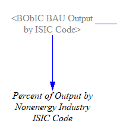

Next, we remove the "foreign content share" (the fraction of the spending on each ISIC code that is supplied by foreign entities - i.e. imports) from the total.  This is only done for the domestic version of these outputs.  The EPS also calculates a rough, global (domestic + foreign) version, as described below, where the foreign content share is not excluded.

In this place in the model, we only need to limit the foreign content share from government respending and household respending.  The foreign content share of industries' output has already been separated out (for energy industries, in the fuel import/export code on the [Fuels](fuels.html) sheet, and for other industries, on the [Cross-Sector Totals](cross-sector-totals.html) sheet).  Any government revenue that was reallocated to specific ISIC codes (rather than being spent by government on products and services) is assumed to have been reallocated only to domestic businesses within those ISIC codes, so no foreign share is removed from these reallocations.

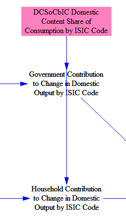

Finally, we sum the government, household, and industry contributions to change in output by ISIC code.  Changes in the cash flow assigned to "foreign entities" due to the policy package are assumed not to influence the extent to which foreign entities buy goods or services from the modeled region, as (1) these changes in cash flow are divided up among many foreign countries/regions and are likely to be very small next to the total size of the economies of these regions, and (2) foreign economies are likely to spend the vast majority of their cash on their own domestically-produced goods and services, and on imports from countries other than the modeled country.

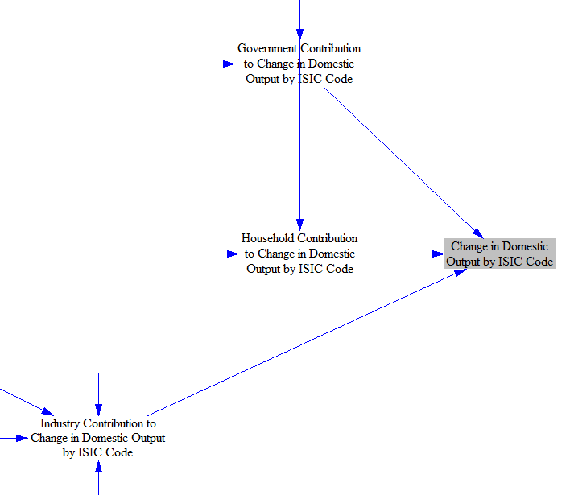

## Calculating Change in Jobs, GDP, and Employee Compensation

This section is the heart of the I/O model.

We begin by taking in data on total output, jobs (employment), value added, and employee compensation for each ISIC code.  These data are freely available for over 60 countries and regions from OECD databases, described in the "Economic Categories and Data" section above.

Some details about these three metrics:

- Jobs includes all employed people working within an ISIC code, including self-employed people, such as sole proprietors.

- Value added is a metric of the amount of additional value an industry contributes to its outputs, relative to what it paid for its inputs.  For example, if a company purchases raw steel for $10 and sells an item made of steel for $15, the value added is $5.  Value added funds business operations unrelated to purchasing inputs, such as a business paying its own workers, paying taxes it owes, investing in expanding the business, and producing profit for the business owners.  The value of the inputs was already captured in the "upstream" industry that produced those inputs (and industries still farther upstream - for instance, a maker of raw steel may purchase iron ore as an input).  Value added, summed across the entire economy, is one way to calculate GDP without double-counting.  (Summing the output of all industries would obtain a result that is too high due to a large amount of double-counting.)

- Employee compensation includes not just salary, but also bonuses, employer-paid benefits, employer contributions to retirement plans, etc.

We divide each of the three key metrics (jobs, value added, and employee compensation) by output to obtain "within industry" jobs, value added, or employee compensation per unit of output that ISIC code generates.  This provides a measure of direct (first-order) job intensity, value added intensity, and employee compensation intensity of each ISIC code.

The next step converts these direct intensities into final intensities that include direct, indirect, and induced effects.  Each "within industry" intensity is multiplied by the Domestic Leontief Inverse Matrix (DLIM) for the modeled region.  DLIM is obtained from the same OECD database as other I/O data, described above, and can be caluclated from a standard input-output table (using the procedure described on the "About" tab of the io-model/DLIM Excel file).  However, we do not need to calculate our own DLIM table, since it was available pre-calculated by the OECD.

In order to understand this step, it is crucial to understand what a Leontief Reverse Matrix is.  A screenshot of the upper left portion of the OECD's DLIM file for the United States (showing the first six ISIC code categories) appears below.  Please refer to it while reading the following explanation.

A Leontief Inverse Matrix provides a set of multipliers that illustrate how spending by each ISIC code in the economy affects each other ISIC code, as well as how it affects itself, after all respending effects are accounted for.  (Recall that each ISIC code contains many businesses, which may produce different products, so long as those products fall within the same ISIC code.)  The same industries appear in the rows and the columns (i.e. the matrix is square).

If a policy intervention increases (or decreases) the jobs, value added, or employee compensation of an ISIC code in a row by 1 unit, the resulting effect on all industries is shown in each column of that row.  The initial 1 unit is included for the industry in the current row, and then indirect effects account for the values in all other columns, as well as the amount exceeding 1 in that industry's own column.

For example, the "Agricluture" row in the table above has a 1.18 value in the "Agriculture" column (cell C9).  This means that if policies directly generate 100 jobs in agriculture, the ultimate effect will be to generate 118 agricultural jobs, because 18 more jobs are needed to supply the inputs for the 100 new agricultural jobs (such as growing feed crops for animals).  In the "Agriculture" row, the "Mining and extraction of energy producing products" column (cell D9) has an extremely low value (0.001) because the mining industry does not buy agricultural products, so inputs from agriculture are not needed for the mining industry to generate value.  In contrast, the column for the "Food products, beverages, and tobacco" industry (cell G9) has a value of 0.288, which is a very high multiplier.  This is because the agriculture industry is a very important supplier to the food, beverage, and tobacco industry, so growth of agriculture tends to accompany growth in the food and beverage industry.

If you read down a column, you see the amount of input from the industry in each row needed to produce 1 unit of value for the industry in the column.  For example, in the row for "Mining and extraction of energy producing products," the column for "Agriculture" (cell C10) has a value of 0.02, which is 20 times higher than the value in the agriculture row for the mining industry (cell D9).  This is because energy is an input to agriculture, so roughly 2 energy extraction jobs are needed to supply every 100 agriculture jobs.

If you multiply a one-dimentional "demand matrix" (a vector) of values by the Leontief Inverse Matrix, you obtain the amount of output from each industry required to meet that demand.  For example, if there is an external demand for $1000 worth of value from every industry, the DLIM multiplied by a vector with $1000 for each industry would provide the change in output produced by each industry to meet that demand.  The change in external demand (output) can be the result of a policy package, as calculated earlier.

That would be the classical way to use DLIM for output analysis.  However, we don't want to multiply the DLIM by quantities of output change directly.  This is because we aren't interested in the final change in _output_ of each industry.  We want to know the final change in _jobs_, _value added_, and _employee compensation_ for each industry.  (The difference between output and value added was explained above.)  Therefore, we must convert the multipliers obtained from the DLIM for output to produce results for jobs, value added and industry.  Therefore, we multiply by the within-industry jobs, value added, and employee compensation intensities to obtain a trio of DLIM-like variables that convert changes in output to changes in jobs, value added, and employee compensation, rather than remaining in units of output.  This trio is called the "Requirements" variables, as they specify the number of jobs, value added, or employee compensation that was "required" (i.e. created) to bring about a known change in output.

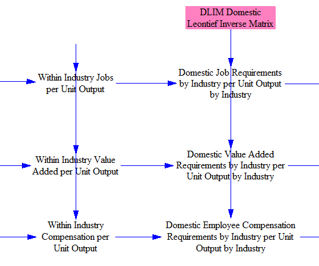

Now that we have constructed out trio of DLIM-like "requirements" variables, we can multiply the policy-driven change in output by ISIC code (a vector calculated earlier) by each requirements variable, to obtain the number of jobs, amount of value added, and amount of employee compensation that the policy package brought about in the course of creating the known change in output for each ISIC code.

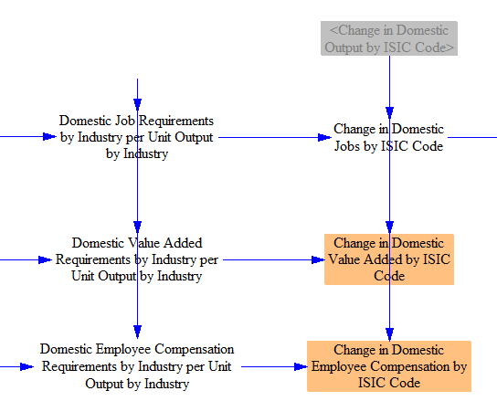

The EPS works in inflation-adjusted currency units.  That's fine for value added and employee compensation, as these are amounts of money.  However, jobs have been converted from money using the "within industry" job intensities per unit output, which are based on a single historical year from our I/O input data.  In reality, labor productivity tends to increase over time, so more currency units of value can be generated by fewer workers.  Therefore, predictions of future jobs that are derived from output (in currency units) need to be discounted by the anticipated productivity gains through that year.  We take in an input variable containing anticipated annual productivity gains by ISIC code for future years and discount job creation (or losses) by these values.  (We also apply a quantization factor at this stage, to ensure our outputs are an even multiple of 1 job.)

We now have our final predicted changes in jobs, value added, and employee compensation.  (A change in value added is the same as a change in GDP, since the sum of value added across all entities in society equals GDP.)  However, to calculate absolute values of these metrics in the policy case, we have to account for growth of jobs, GDP, and employee compensation in the BAU case, which is discussed below.

## Obtaining Time-Series Values for Jobs, GDP, and Employee Compensation

The approach above allows us to calculate time-series data for the effects of the policy package on jobs, GDP, and employee compensation.  However, our BAU data for total quantity of jobs, GDP, and employee compensation is based on a static, historical year from the I/O input data.  (No public, projected future time-series data for jobs, value added, employee compensation, and output, all disaggregated by ISIC code, are available, as far as we are aware.)  We generally don't need time-series BAU quantities if we are only interested in showing policy impacts (in absolute numbers of currency units or jobs) in output graphs.  However, we do need BAU quantities to obtain certain derived output metrics, specifically:

- Percentage change in GDP (as opposed to change in absolute dollars)

- Change in compensation per employee (the absolute changes in number of employees and amount of compensation paid isn't sufficient to find the change in average compensation per employee)

- Energy use or emissions outputs in units of intensity per unit GDP

Therefore, we must calculate our own time-series BAU values of all three key metrics.

The calculation structure we use is identical for each of the three metrics (jobs, GDP, and employee compensation), so we will only walk through one of them here.  The other two are obtained the same way.  We will use GDP as our example.

First, we take in a future projected BAU GDP time series that is not divided up by ISIC code (e.g. we don't know each ISIC code's contribution to GDP in the BAU case).  We add the policy-driven change in GDP (summed across ISIC codes) to find the policy case GDP.

Next, we apportion all of the value added by ISIC code, using the (static) BAU data, and adding in the policy-driven changes.  This gives us a rough sense of how value added is distributed by ISIC code in the policy case, assuming the BAU distribution remains relatively constant over the model run.  (This assumption may be the best we can do unless/until future projected value added data disaggregated by ISIC code become available.)

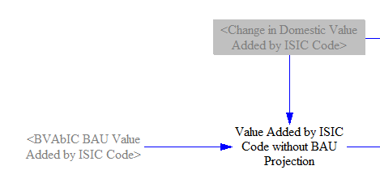

Finally, we apportion our policy case GDP (which includes time-series BAU GDP growth) by the ratios of value added by ISIC code.

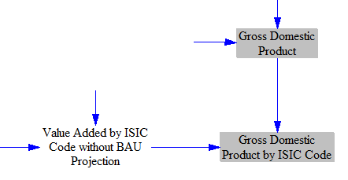

We perform the same approach for apportionment of time-series GDP to ISIC codes in the BAU case, which does not include any policy effects on value added:

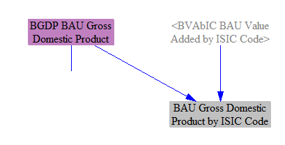

## Percent Changes in GDP

We calculate the policy-driven percentage change in GDP in two ways.

First, we divide up the total percentage points of change in GDP by the ISIC codes contributing to it.  This allows us to preserve the magnitude of our total change in GDP, express it as a percentage change, and apportion that percentage change to the ISIC codes that contributed to it.  The resulting output graph is extremely similar to the "change in GDP" output graph, but with the units of percentage points rather than currency units.  This helps to put GDP changes in context, since a model user may not intuitively know how large the projected future-year GDP for the modeled region is.

Second, we calculate the percentage change in the absolute size of each ISIC code's contribution to GDP.  This is a good metric for the policy-driven percent growth or shrinkage of each ISIC code.  It cannot be summed across ISIC codes to obtain overall percent change in GDP because ISIC codes have varying sizes.

## Outputs in Intensity per Unit GDP

Some countries or regions set emissions or energy use goals in terms of intensity per unit GDP rather than establishing absolute energy use or emissions targets.  We calculate three X-per-unit-GDP metrics, so we can calculate and graph performance of the policy package against these metrics.

We simply divide each of: total CO2e emissions, energy-related CO2 emissions, and total primary energy use by GDP.

## Compensation per Employee

Using the time-series values for number of jobs and for compensation by ISIC code calculated above, we calculate the change in average compensation by employee two ways: separately by ISIC code, and overall across the economy.

Calculating change in compensation per employee separately by ISIC code illustrates how policies change the compensation of the average employee within a particular ISIC code, but it fails to capture whether more or fewer workers are within that ISIC code (e.g. it fails to capture workers shifting between ISIC codes, such as workers in a low-paid industry getting jobs in a higher-paying industry, or vice versa).  Therefore, it is not a good metric of a policy package's overall benefits (or drawbacks) in terms of employee compensation.

Calculating average change in employee compensation for all workers, without disaggregating by ISIC code, is the better metric of how a policy affects overall employee welfare, since it captures both changes in payments within each ISIC code, as well as movement of workers between ISIC codes.

The policy case and BAU case values are calculated using the same methodology, so only policy case values will be shown here.

First, we divide total employee compensation (by ISIC code) by the number of employees (by ISIC code) to obtain average employee compensation by ISIC code.

We weight the average compensation per employee in each ISIC code by the number of employees in that ISIC code to obtain a weighted average compensation per employee across the economy.

We calculate the BAU equivalents of these values, and then we take the difference between the BAU and Policy cases to obtain the change caused by the policy package.

## Union Representation

To calculate the change in union-represented jobs and non-union-represented jobs, we take in input data for the percentage of jobs within each ISIC code that are represented by unions.  (We currently use time-invariant union representation shares using the latest available data, though using future projected time series data may be possible in a future EPS release, if reliable projections of future changes in union representation share by ISIC code are available.)  We multiply the new jobs in each ISIC code by that ISIC code's union representation share to find the total change in union-represented jobs.  The remainder are non-union-represented jobs.

## Calculations to Support Feedback Loops

In addition to producing outputs on policy package impacts on jobs, GDP, and employee compensation, the I/O model also calculates the indirect and induced output produced by different ISIC codes.  Just like output directly caused by the policy package, indirect and induced output is also associated with energy use and emissions.  In order to capture the energy use and emissions effects, we need to feed the indirect and induced activity back into the main demand sectors of the EPS (Transportation, Buildings, and Industry), to affect the demand for energy-using services and industrial products.  Therefore, in the I/O model sheet, we must calculate multipliers to be used within those sectors.  As the I/O model operates in terms of ISIC codes, the multipliers must be for each ISIC code, and we map these onto specific energy-using services or industries in the other sectors of the EPS.

To avoid double-counting the direct impacts of the policy package (which are already included in the other sectors of the EPS), we must filter them out, and produce multipliers that reflect only the indirect and induced effects.  (The difference between direct, indirect, and induced effects is described above, near the beginning of this document.)  Accordingly, we need to calculate some alternate versions of variables calculated above, including only indirect and induced impacts.

First, we calculate an alternate version of the Domestic Leontief Inverse Matrix (DLIM).  We subtract the identity matrix (a matrix containing 1s along the diagonal, for matching ISIC codes, and 0s elsewhere) from DLIM to remove the initial output unit (job or currency unit) assigned to an ISIC code.  This leaves only the multipliers across all ISIC codes that reflect the indirect and induced activity from adding a unit of output to a given ISIC code.  (Refer to the discussion of the Leontief Inverse Matrix above for a more thorough explanation of how this matrix works, which will clarify why subtracting the identity matrix removes direct effects.)

We use the modified DLIM to obtain a special version of the value added "requirements" variable that excludes direct impacts.  (We do not need special versions of the jobs or employee compensation "requirements" variables, because the feedback loops that affect energy service demand are based on changes in output.)

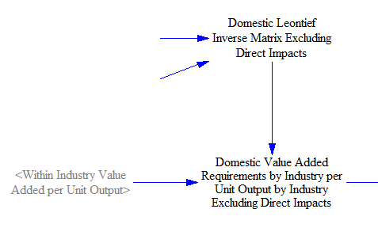

We multiply this modified value added "requirements" variable by the industry contribution to the change in output by ISIC code to obtain part of the change in output by ISIC code - the part from industry contribution.  The industry contribution includes all of the direct effects of the policy package, since by definition, _government and household respending produce induced effects, not direct effects_.

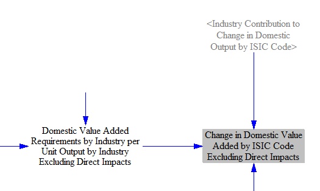

Since government and household respending already contain no contribution from direct effects, we must use the ordinary version of the domestic value added "requirements" variable (discussed above), not the modified version we just made that removes direct impacts.

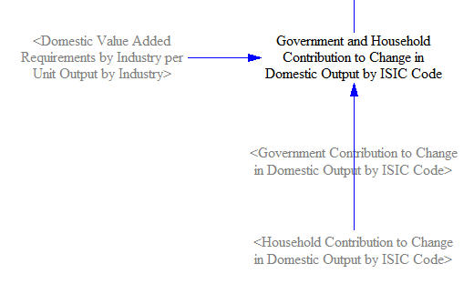

The government and household contributions to value added are then added to the industry contribution to find the total change in value added, excluding direct effects.

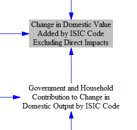

Next, we add the policy contributions to value added, excluding direct impacts, to the BAU time-series GDP, to get a special version of the "policy case" GDP, disaggregated by ISIC code, that includes only the additions to GDP from the indirect and induced impacts of the policy package.  We follow the same methodology as described above for caluclating the policy case GDP disaggregated by ISIC code.

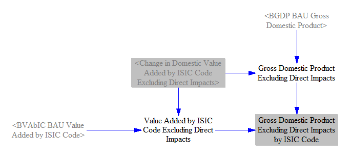

Finally, we take the percent change in contribution to GDP separately for each ISIC code, comparing our special policy case GDP to the BAU GDP calculated earlier.  This is the key result for how much the induced and indirect effects of the policy package change output by industry, which we need for our feedback loops.

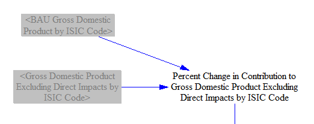

Lastly, we must introduce a one-timestep delay to avoid circularity in the calculations (as indirect and induced effects on industries will affect their cash flows, which in turn feed into the I/O model).

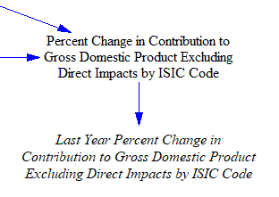

This variable is used in the Transportation, Buildings, and Industry sectors to adjust the energy services or industrial products demand to account for the indirect and induced economic effects of the policy package.