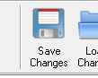
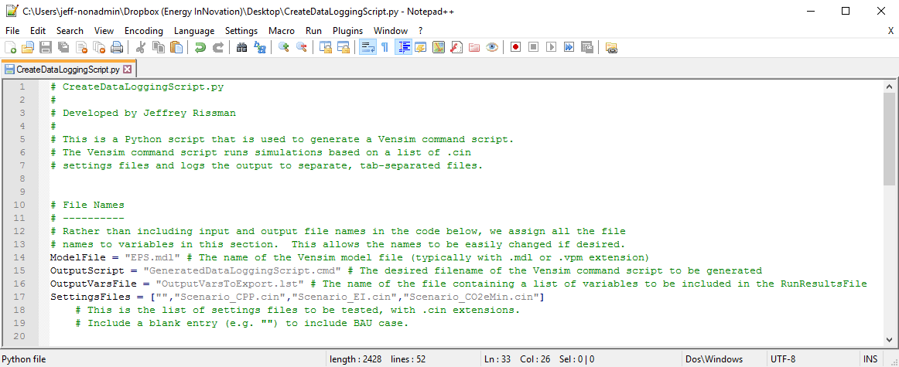
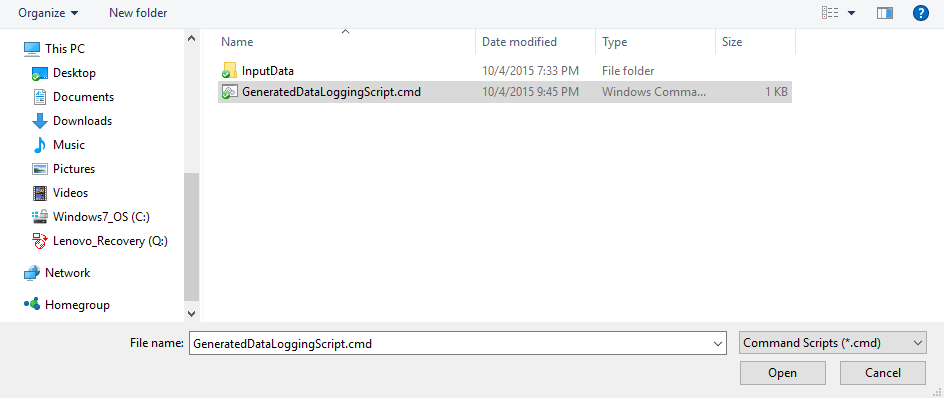

The Energy Policy Simulator (EPS) includes a Python script, `CreateDataLoggingScript.py`, that makes it quick and easy to output a specific set of variables from one or more scenarios.  Each scenario you wish to use with this script, except the Business as Usual (BAU) scenario, must have its own scenario definition file (a text file with a `.cin` extension).  (Though the BAU scenario has a `.cin` file in EPS versions 3.0.0 and later, the BAU scenario's `.cin` file is not used by the Data Logging Script.)

## Saving .cin Files with Policy Settings

After you have set policy levers (most easily done in SyntheSim mode, as described in the [Running the Model and Setting Policy Levers](running-the-model.html) section, you can also save your scenario settings to a `.cin` file.  While in SyntheSim mode, after changing some policy levers, click the "Save Changes" button near the upper left of the screen.

You then specify a name for the new `.cin` file that will be created.  The `.cin` file is a text file that specifies the values of any variables that you have changed from their default values (typically, any policies you have enabled).  If you are using a custom policy implementation schedule, the `.cin` file will also specify the number of the policy implementation schedule you are using.

Saving `.cin` files is useful because they take up very little disk space and can quickly be used to re-run the model with a particular group of settings, so that output data can be re-generated.

If you make many scenarios, you may acquire a large collection of `.cin` files.  You might wish to compare specific output data between these scenarios (for example, to find the one that has the lowest emissions).  Without a script, you would need to load each scenario one-at-a-time and note the amount of emissions.  The Data Logging Script allows you to quickly compile a list containing the values of the output variables of your choice for each scenario you specify.

## Using the Data Logging Script when Calibrating a New EPS Deployment

The Data Logging Script is also useful when calibrating a new EPS deployment.  This process often involves comparing EPS outputs to other data sources (such as published reports or other models' outputs) using a spreadsheet, then reviewing and possibly adjusting the EPS's input data to fix any problems that might have been discovered, and updating the comparison spreadsheet.  The Data Logging Script can generate a list of variables from the EPS to be compared to other sources.  Paste the output from the Data Logging script in a dedicated spreadsheet tab and refer to it via formulas on other tabs when making comparisons.  When it is time to update the EPS data in the comparison spreadsheet, simply re-run the Data Loggging script and paste the output over the old values in the corresponding tab in the comparison spreadsheet.

## Editing the Data Logging Script

Several scenarios defined by `.cin` files are included in the model distribution.  By default, the data logging script is configured to use these scenarios.  We will use them in the following example.

First, ensure that your `OuputVarsToExport.lst` file is properly configured, as described in [Selecting Output Variables for a Python Script](selecting-output-variables.html).

Next, open the `CreateDataLoggingScript.py` file in a text editor such as _Visual Studio Code_.  The first 22 lines are shown in the following screenshot:

The only line that you are likely to wish to edit is line 19, which includes a list of the scenario files (`.cin` files) that should be run.  By default, the script will run the BAU case (the entry with two adjacent double-quote marks, which needs no associated `.cin` file) and each of the included scenarios: the NDC Scenario and the Net Zero Emissions scenario.  You may remove any of these scenarios from the list, and you may add an unlimited number of your own scenarios to the list.  Each scenario must be the complete filename of the `.cin` file that defines the scenario.  Like the examples provided, the scenario filename should be within the square brackets, surrounded by double quotes, and separated from the other filenames via a comma.

Save and close the `GenerateDataLoggingScript.py` file when you are done.

## Running the Data Logging Script

Run the `GenerateDataLoggingScript.py` file in Python 3.  (If the `.py` file extension is associated with Python 3, you can simply double-click the file to do this.)  Python creates a new file in the EPS model folder called `GeneratedDataLoggingScript.cmd`.  This is a Vensim command script.

Open Vensim DSS.  From the "File" menu, choose "Open Model..."  In the "Name of Model to Open" dialogue box, you will see a drop-down menu in the lower right corner, just above the "Open" and "Cancel" buttons.  That menu starts with "Vensim Models" selected.  Change the setting to `Command Scripts (*.cmd)`.  (If you do not see this option in your drop-down menu, then you are running a version of Vensim other than Vensim DSS.  See the page on [Automated Analysis with Python Scripts](automated-analysis.html) for details on software requirements.)  The following screenshot shows Vensim's "Open" dialogue box under Windows 10:

Click the "Open" button.  Vensim performs one run for each entry in the list of .cin files specified in the Python script.  If you kept the blank entry in the list, one run will also be done for the BAU case.  For each model run, Vensim produces one data file (with `.vdfx` extension) and one text results file (with `.tsv` extension).  Each file will be named after the scenario that generated it.  (For example, the output files from the simulation based on the `Scenario_NDC.cin` file will be named `Scenario_NDC.vdfx` and `Scenario_NDC.tsv`.)  Output files for a BAU run (not based on a .cin file) will be named `NoSettings.vdfx` and `NoSettings.tsv`.

The `.tsv` files are tab-separated values and can be opened in Microsoft Excel or another spreadsheet program, where the value of each variable specified in the `OuputVarsToExport.lst` file will be included for each year of the model run.  The `.vdfx` files are Vensim data files.  They can be safely deleted if you are only interested in the output for the variables specified in `OutputVarsToExport.lst` (which are included in the tab-separated values file).
