## General Notes

The Land Use, Land Use Change, and Forestry (LULUCF) sheet in the Energy Policy Simulator (EPS) handles pollutant emissions and sequestration from land uses, primarily related to forests, including forest set-asides, afforestation/reforestation, avoided deforestation, and forest management.  Emissions from agricultural operations are handled in the [Industry sector](industry-ag-main.html), where Agriculture is considered an industry, and emissions from agriculture (such as methane from enteric fermentation and rice cultivation) are considered process emissions.  However, conversion of land from forest to cropland or vice versa is handled in the LULUCF sector.

The LULUCF sector is constructed to be relatively flexible because different countries have very different land use challenges.  For example, in the U.S., there is no net deforestation, and most existing forests are well-managed.  In other countries, deforestation is a major problem.  Therefore, most policies are set up to achieve a user-specified potential amount of annual sequestration (or in the case of forest set-asides, potential amount of one-time abatement).

The model groups reforestation (planting forests on land that is not forest, but was forest prior to human influence) and afforestation (planting forest on land that was not deforested by humans, but is climatologically able to support a forest).  This is because the actions involved in reforestation and afforestation, as well as the resulting sequestration, are similar and can be handled by the same model structure.

## Determining Change in Emissions

Change in emissions can be driven by each of three LULUCF policies: afforestation/reforestation, forest set-asides, and improved forest management.

### Afforestation/Reforestation

For the afforestation/reforestation policy, we take in from input data the possible "incremental increase in CO2 reduction" from afforestation/reforestation each year.  This represents converting a particular amount of land to forest (as much as possible in a single year).  Planted forest then causes CO2 sequestration every subsequent year of the model run.  (Forests slow down and eventually stop sequestering carbon as they reach maturity.  This process generally takes more than 100 years.  It is reasonable to assume sequestration proceeds at a linear rate on any given land area of planted forest throughout the duration of the model run- through 2030.)  The user uses the afforestation/reforestation policy lever to specify the fraction of this incremental annual abatement (fraction of land area converted) each year.  The relevant structure is shown below:

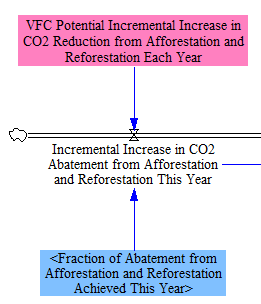

As the land area converted to forest accumulates over the model run, we track the growing annual sequestration quantity in a level variable, "Last Year CO2 Abatement from Afforestation and Reforestation."  Vensim adds the current year's inflows and subtracts the current year's outflows to level variables in the following year, whereas in the EPS, we wish for policies to strictly follow the user's specified Policy Implementation Schedule (without a year of delay).  Accordingly, we sum the inflow with the level variable's total (from all prior years) to obtain the reduction in CO2 from afforestation/reforestation in the current year, as shown below:

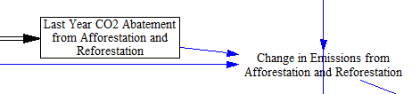

### Forest Set-Asides

The forest set-asides policy reduces timber harvesting by setting aside a portion of the forest land that is regularly harvested for timber in the BAU case, such that timber is never harvested from this land in the policy case.  It achieves a particular CO2 abatement in each year based on how much forest was not cut down that year due to the policy.  The policy assumes the forest will not be cut down later: the affected land areas will remain forest throughout the rest of the model run.  The model only gives credit (change in CO2 emissions) in the one year when a given area of forest would otherwise have been cut down.  (That is, even though that area of forest continues to not be cut down, year after year, the model only counts the CO2 reductions from that area of forest in the first year when it was not cut down and otherwise would have been cut down.)  The model assumes the immediate release of all CO2 from trees that are cut down, even though some of that carbon may remain locked inside the dead wood (e.g. in paper, buildings, furniture, etc.) for a number of years.

The policy implementation is straightforward.  A potential quantity of annual CO2 emissions abatable through forest set-asides is taken in as input data, and the user specifies the fraction of that abatement achieved via the policy lever setting, as shown below:

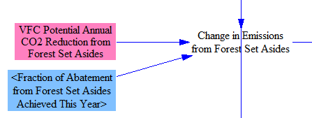

This can be thought of as converting a given area of "regularly-harvested forest" to "never-harvested forest."  Although the LULUCF sector does not consider leakage (as the Industry sector does), a strong setting for this policy would imply greatly reduced U.S. timber harvesting, which might cause more importation of timber and/or more substitution of other materials for wood in buildings and consumer products.

### Improved Forest Management

Improved forest management refers to practices that aim to improve the carbon sequestration of forests.  These management practices may include addition of tree species that do not compete with one-another and grow quickly, fertilization, controlled burning, and thinning.  The annual abatement potential from improved forest management is taken in as input data, and the user-specified policy setting indicates how much of that potential is achieved.  The following screenshot shows the relevant structure:

### Avoided Deforestation

Avoided deforestation represents actions taken to prevent forest from being converted into other land types, such as cropland or pastureland.  This may involve prohibiting logging (as in forest set-asides), but the difference is that forest set-asides protect forest that would not have been converted to a different land type, whereas avoiding deforestation protects forest that would have been converted to a different land type.  As with forest set-asides, the model gives credit for avoiding the carbon emissions that would be associated with removing the forest from the land, but does not give ongoing credit for continued sequestration by that forest (assuming it was not already in carbon balance) because such sequestration is not anthropogenic.  The following screenshot shows the relevant model structure:

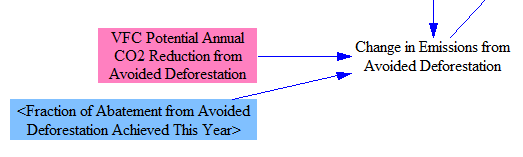

### Rebound GHG Emissions

All policies that increase the amount of CO2 sequestered in forests have a slight rebound in emissions of methane and N2O.  This is primarily because forest fires will release a greater quantity of CH4 and N2O when they have more fuel to combust, but also because decomposition in forest soils will release more GHGs.  (Forest fires will also release more CO2 if more CO2 is sequestered in forests, but we are looking at net flows, and the net effect of these LULUCF policies on CO2 is to increase sequestration, while the net effect of the policies is to increase N2O and CH4 emissions.)  In CO2e terms, on a 100-year GWP timeframe, the increase in CH4 and N2O offsets only about 2% of the net sequestration of CO2, so the rebound is very minor.  Nonetheless, we account for it as a matter of completeness.  The relevant structure is shown below:

### Summing Up Emissions

We take the BAU anthropogenic (human-caused) CO2 emissions as input data and estimate the associated CH4 and N2O emissions.  Then we add the changes in emissions due to all of the policies to find the total quantity of anthropogenic LULUCF emissions in the policy case, as shown below:

## Lost Land Value

In other sectors in the EPS, we consider cash flows caused by the policies enabled by the user: that is, actual payments of money from one actor to another.  In the LULUCF sector, some of the important financial impacts pertain to the value of land, but do not cause specific changes in cash flows, at least until the land is sold (which is not within the model scope, and which may never happen for many government-owned forests).  Accordingly, we include a calculation of "lost land value" that is separate from the "cash flow" calculations for the LULUCF sector.

Improved forest management is not assumed to affect the value of forest land.  The afforestation/reforestation policy reduces land value by converting land from its current use (such as cropland, pasture, or rangeland) to non-harvested forest.  We take the difference in land values of these types (using a weighted average of reforestable/afforestable land types) and normalize the lost land value per unit incremental increase in emissions abatement (since we work in this unit on the emissions side, rather than in acres of forest).  The relevant model structure is shown below:

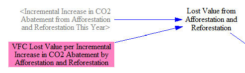

As noted above, for the U.S., the forest set-asides policy represents a reduction in timber harvesting by converting land from regularly-harvested to never-harvested forest.  The lost land value from forest set-asides is not related to the loss of revenue from any particular timber harvest.  Rather, we consider the difference in land value between these two types of forest.  This should, in theory, capture the total change in economic value from permanently removing a section of forest from timber harvesting rotation.  This is handled in the following model structure:

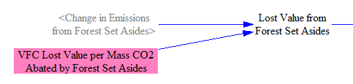

Avoiding deforestation prevents land from being converted from forest (assumed to be non-harvested forest) to other land types.  The effect on land values is similar to that caused by Afforestation/Reforestation and is handled by the structure below:

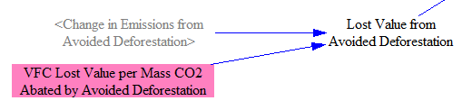

Finally, we simply sum these sources of change in land value to find the total loss in land value from LULUCF policies.

## Cash Flow Impacts

Forest set-asides (conversion of regularly-harvested forest to never-harvested forest) involve simply refraining from taking action, so we consider it to have no direct cash flow impacts.  (It saves some money that would have been spent on timber harvesting operations, but it has second-order impacts that reduce revenue for timber producers.  We don't track second-order impacts in the model, and it would be misleading to report that reducing timber harvesting saves money for timber producers.)  Instead, we handle the economic effects of forest set-asides in the "Lost Land Value" section above.  The other two policies: afforestation/reforestation and improved forest management, do involve payments from one model actor to another, and these changes in cash flow are tracked in this part of the model.

Afforestation/Reforestation has two sources of cash flow impacts: one-time costs and ongoing costs.  The one-time ("this year") impacts refer to the costs of actually converting the other land types to forest.  This involves purchasing young trees and engaging in tree planting operations, etc.  These costs occur in each year in which some amount of land is afforested/reforested and are handled via the following structure:

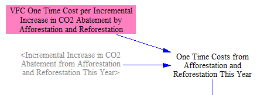

Ongoing cash flow impacts refer to maintenance costs of forests planted due to the afforestation/reforestation policy.  This is similar to the costs associated with the "improved forest management" policy, but the costs are higher, because planted forest requires more maintenance than preexisting forest (at least for a while, covering the duration of the model run).  The maintenance costs associated with the planted forests are handled via the following structure:

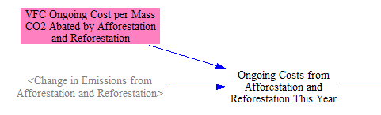

Finally, we include the cash flow impacts of forest maintenance activities for preexisting forest.  This is handled in a similar way to the cash flow impact of managing planted forest, but costs are lower per acre.  As with other variables in this model sector, we work in units of annual CO2 abatement rather than acres.  The following screenshot shows the relevant structure:

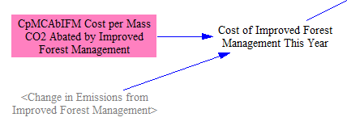

We sum the total expenses paid due to these three policies (forest set-asides, reforestation/afforestation, and improved forest management), then divide them up between the three main actors (government, industry, and consumers) based on the total fraction of forest in the country that is owned by each of these actors.  This is handled in the following structure:

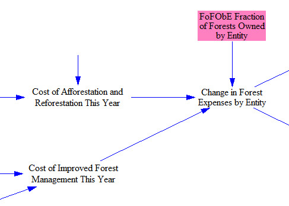

Next, we divide expenses up into equipment (capital) and labor.  These will be divided between consumers and industry, depending on how much is spent on labor (e.g. workers to plant trees) and how much is spent on equipment and supplies (young trees, fertilizer, tools, etc.).  Each of these totals are used in the [Cost Outputs sheet](cost-outputs.html).  This is handled in the following structure:

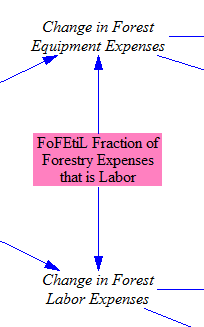

We use the tax rate on capital equipment to calculate the taxes paid on forestry equiment expenses and the resulting change for capital equipment suppliers:

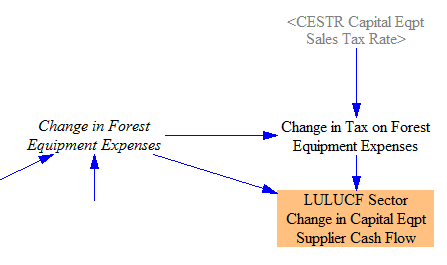

We use the marginal tax rate on labor to calculate the taxes paid on forestry labor expenses and the resulting change in revenue received by labor (consumers):

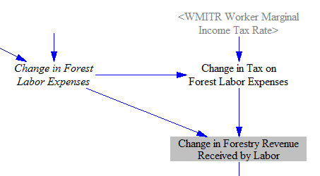

Finally, we sum the changes in cash flow due to expenses and due to receipts from those expenses by actor, as well as tax receipts for the government, obtaining the total change in cash flow by actor:

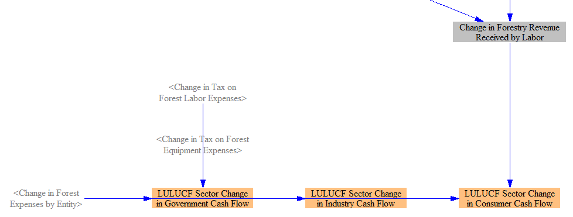