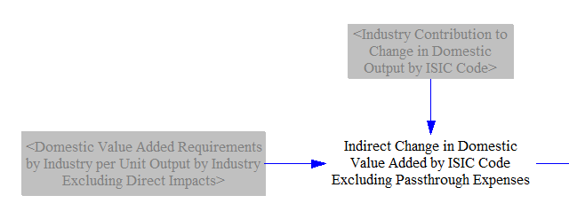
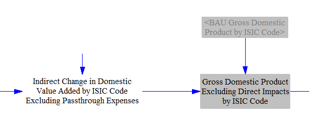
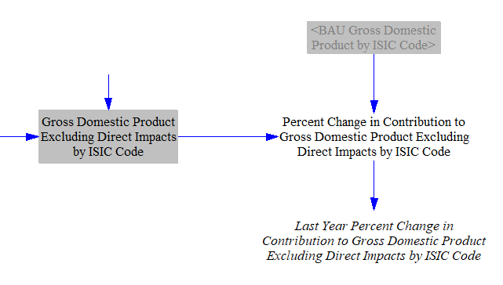
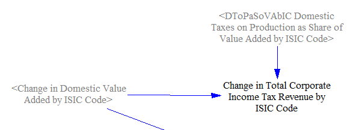
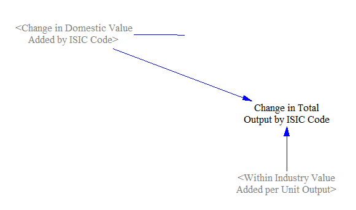
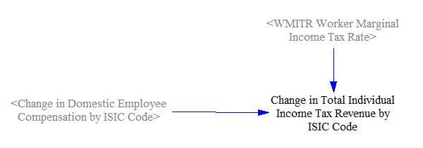
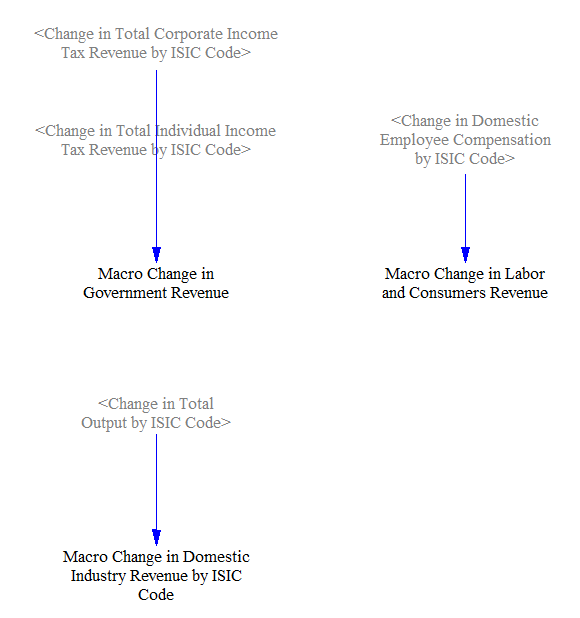
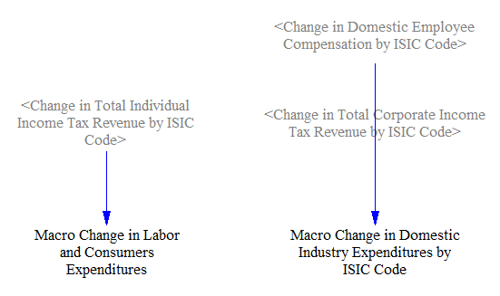
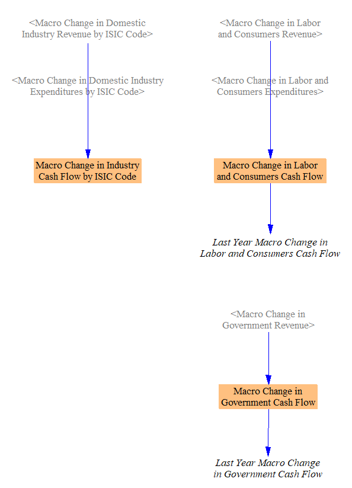

## Connection to Input-Output Model

The Macroeconomic Feedbacks sheet uses results of the [input-output model](io-model.html) to adjust energy service demand for indirect economic activity, and to account for indirect effects on government and household cash flows.  It is recommended you read the [documentation page on the input-output model](io-model.html) before reading this page, as these feedbacks are an extension of the I/O model.  This page will assume you are familiar with the information discussed on the I/O model doc page.

## Energy Service Demand Feedbacks

In addition to producing outputs on policy package impacts on jobs, GDP, and employee compensation, the I/O model also calculates the indirect and induced changes in output (value added) produced by different ISIC codes.  Just like changes in output directly caused by the policy package, indirect and induced changes in output are also associated with changes in energy use and emissions.  In order to capture the energy use and emissions effects, we need to feed the indirect and induced activity back into the main demand sectors of the EPS (Transportation, Buildings, and Industry), to affect the demand for energy-using services and industrial products.  Therefore, in this sheet, we calculate multipliers to be used within those sectors.  As the I/O model operates in terms of ISIC codes, the multipliers must be for each ISIC code, and we map these onto specific energy-using services or industries in the other sectors of the EPS.

We already have calculated indirect effects on value added in the [I/O model](io-model.html), but industry passthrough expenditures were added to the change in industrial output used to calculate these effects, to capture the full value added (which includes changes in tax payments and worker compensation).  However, the passthrough costs do not alter production levels, so they do not alter energy use or emissions.  Accordingly, we must re-calculate the indirect value added, using the same methodology as in the I/O model, but without adding the change in passthrough costs into the change in output during the calculation.

We add the calculated, indirect change in value added to BAU GDP by ISIC code to find a special version of the policy case GDP by ISIC code that reflects only indirect impacts of the policy package, not direct nor induced effects.  It also excludes the effects of passthrough costs, as noted above.

Finally, we find the percent difference between this calculated GDP (which includes indirect policy impacts) and BAU GDP, to find the precentage increase or decreate in output for each ISIC code.  We then must introduce a one-timestep delay to avoid circularity in the calculations (as indirect effects on industries will affect their cash flows, which in turn feed into the I/O model).

This variable is used in the Transportation, Buildings, and Industry sectors to adjust the energy services or industrial products demand to account for the indirect economic effects of the policy package.

## Cash Flow Feedbacks

Policy packages can have direct effects on the cash flow of each entity tracked in the model.  For example, households or government can save money if they spend less on energy as a result of energy efficiency standards, or they could spend more money on fuel in response to a carbon tax.  These direct effects on the cash flows of government and households were already accounted for in the variable `Direct Change in Cash Flow by Entity`, which is used as an input to the IO model.

However, the policy package's effects on industries will also have effects on government and household cash flow.  For instance, if an industry grows (has higher output) in response to the policy package, it will pay more in taxes and will employ more workers, sending cash to government and to labor and consumers ("labor and consumers" is synonymous with "housholds" in the EPS).  The labor and consumers receiving more compensation will also send some of this money to the government in the form of income taxes.

We cannot remove these cash flows from the increase in output of each ISIC code upstream of the I/O model, because the I/O model expects to receive the total change in output for each ISIC Code, even if some of that increased output will ultimately be paid by companies to their workers or to the government.

Additionally, the direct changes in industrial output are just that: direct changes.  They don't account for indirect or induced activity, such as increases in jobs or wages at companies that supply the industries whose output is growing as a direct result of the policy package.  It is only downstream of the I/O model that we have calculated quantities for indirect and induced effects.

Therefore, we must now calculate the share of the change in industry output that is going to government and to labor and consumers, and feed these changes back into the top of the I/O model, to capture the whole scope of impacts on government and household cash flow.

### Data from I/O Model

We begin with the change in domestic value added caused by the policy package, and we use input data (from the same I/O input dataset, by default from the OECD) to separate out the share of this incremental value added that is going to tax.  We take this to include all taxes paid by corporations, such as corporate income tax and the share of payroll taxes (such as Social Security and Medicare taxes in the U.S.) whose burden is ultimately borne by corporations (see [tax incidence](https://www.investopedia.com/terms/t/tax_incidence.asp)).  Also, although in theory sales taxes are meant to exempt intermediate goods and services, and only apply to the full value of the product at the point of retail sale, [in practice some intermediate goods are subject to sales tax](https://www.cost.org/globalassets/cost/state-tax-resources-pdf-pages/cost-studies-articles-reports/1903-3073001_cost-ey-sales-tax-on-business-inputs-study_final-5-16.pdf), and hence, some portion of the value in final products is double-taxed.  (The situation is somewhat different in countries with a value-added tax; VAT.  There, producers pay a tax on the value added by the company that provided its input materials, with taxes assessed at each step in the chain from raw material to finished product.)  Irrespective of the form of the taxes, all taxes borne by corporations should be included in the input variable `DToPaSoVAbIC Domestic Taxes on Production as Share of Value Added by ISIC Code`.

Assuming the correct input data have been provided, it is straightforward to multiply the policy-driven change in value added by `DToPaSoVAbIC` to find the change in taxes paid by corporations.

We also use the change in value added, along with the value added "intensity" variable from the I/O model, to find the total change in output.  This is not needed for calculating the change in government or household cash flow, but it is useful in a check on the [debugging assistance](debugging-assistance.html) sheet, and for completeness of tracking all relevant cash flows.

We also apply a marginal income tax rate to the change in employee compensation, to estimate the share of that increased employee compensation that goes to government as a result of individual (non-corporate) income taxes.

### Macro Revenue and Macro Expenditure Changes

In this section, we sum up the components from the Macroeconomic Feedbacks sheet that contribute to revenue change for each of government, labor/consumers, and each industry ISIC code.

We do the same for macroeconomic expenditure changes.  Nothing in this section changes government expenditures - the only relevant cash flows in this section are businesses' payments to workers and tax payments to government, and workers' tax payments to government.

Finally, we calculate the changes in cash flow to be used in the feedback loops by subtracting the change in expenditures from the change in revenues for each entity.  We don't actually need the change in industry cash flow by ISIC code, as industry contribution to change in output in the I/O model is based on change in revenue, not change in cash flow, but we calculate it here for completeness.  The values for government and for labor and consumers are used in the I/O model, so we introduce a one-timestep delay to avoid circularity.

