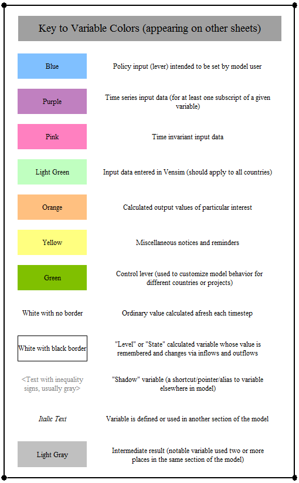

Each of the pages in the "Model Component Descriptions" section explains the overall architecture and approach used by a given portion of the model.  For the four largest sectors (Transportation, Electricity, Buildings, and Industry), the "Main" and "Cash Flow" sheets are described on separate pages.  The "BAU" sheets are not described here, because they are copies of the "Main" sheets with all policies removed.  (BAU sheets reference as many variables as possible from the "Main" sheets, to avoid redundant calculation and reduce visual clutter.)  Generally, the online documentation describes calculations within part of the model in the order they occur, which is often roughly left-to-right, then top-to-bottom, on each sheet in Vensim.

Many screenshots of model structure are used in these sections.  A key to the meaning of the variables' background colors exists in the model, on the "Structural Overview" tab.  It is useful to know the meanings of the colors when reading the model component descriptions in the documentation.  Here is a screenshot of the key:

