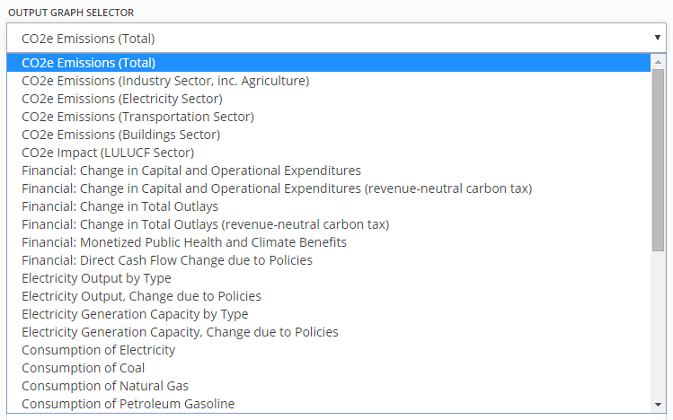

## A Tour of the Web Interface

This video provides a thorough introduction to how to perform analysis with the Energy Policy Simulator using its user-friendly, yet powerful, web interface.  It shows how to build policy packages, to customize a policy’s implementation schedule, to select from 80 different output graphs, to compare multiple scenarios, and more.

<iframe width="1000" height="562" src="https://www.youtube.com/embed/7guMn2dhuGA" frameborder="0" allow="autoplay; encrypted-media" allowfullscreen></iframe>

## Online vs. Offline Model Versions

There are two ways you can use the Energy Policy Simulator (EPS).  You may either [install the required software and download the model](download.html) to your own computer, or you can use the model via a web application interface on this site.  This tutorial page discusses how to use the model via the web application interface.  The online interface is powerful, user-friendly, and does not require you to install any software.  However, the downloadable model offers considerably greater analysis capabilities.  We recommend you get started by using the web interface, and if you require more advanced features (such as reporting outputs from additional variables, changing policy implementation schedules, performing batches of hundreds or thousands of runs via a script, or performing Monte Carlo sensitivity analyses), you may migrate to the downloadable version.

## Landing Page

When you first navigate to the [Energy Policy Solutions website](https://energypolicy.solutions), you will be on the landing page.  The page features a small amount of introductory text and three buttons: "Enter Simulator," "Learn more," and "Sign in."  "Learn more" and "Sign in" are located in the upper right corner, and "Enter Simulator" is located underneath the introductory text on the left.

Clicking the "Learn more" button opens a web page to the documentation index.  From there, you can access this tutorial page for the online model, the Guide to Smart Policy Design, and many pages of technical documentation about the model.

Clicking the "Sign in" button will take you to a page where you can sign into the Energy Policy Simulator.  This is only useful if you have previously used the simulator and created an account, in which you have saved your custom scenarios.  If you did not previously create an account, there is no reason to sign in at this time.

Clicking the "Enter Simulator" button, just below the introductory text, will take you to the web interface of the EPS.

## Quick Start Walkthrough

If this is your first time accessing the EPS web interface in this web browser, you will be presented with the "Quick Start" walkthrough.  This is a brief overview of key user interface (UI) elements.  The "Quick Start" walkthrough is a series of four boxes, each of which highlights a feature of the UI.  The rest of the UI is grayed out, to focus attention on the part mentioned in the Quick Start box.  You can click "Next" to move to the next Quick Start box or "Skip tutorial" to end the Quick Start walkthrough.  Here is a screenshot of the first Quick Start box, which points out the row of buttons along the top of the screen:

The remaining three Quick Start boxes highlight the policy scenario selector, the policy menu, and the output graph selector.  These features are all described in this tutorial (below).

If you wish to re-play the Quick Start walkthrough in the future using the same web browser, you may do so by using an "incognito" or "private" browsing window, which causes the simulator to believe this is your first visit to the site using this browser.

## Output Graph and Output Graph Selector

On the right-hand side of the window are a drop-down menu and a graph, as shown in the following screenshot:

This is the area where the results of the policy packages you design will appear.  By default, the graph is set to display "CO2e Emissions (Total)," which is the total greenhouse gas emissions from the United States in units of million metric tons of CO2e-equivalent.  The model begins by showing two scenarios: the "Business as Usual" scenario and the "New Scenario" that we are now in the process of designing.  The "Business as Usual" scenario projects the emissions from the U.S. in future years assuming that no new policies, beyond those already on the books, are enacted.  Since we have not yet enabled any policies, our "New Scenario" is identical to the "Business as Usual" scenario.  This means the graphed lines start out precisely on top of one-another, so they appear as if they are one scenario, though the "Business as Usual" scenario is actually hidden behind the line for the "New Scenario."

The graph also shows the U.S. 2025 emissions target, which was submitted to the U.N. Framework Convention on Climate Change as the United States' Intended Nationally Determined Contribution (INDC) in 2015.  This provides a reference point as well as a goal that users might try to hit as they design policy packages.

The drop-down menu is the Output Graph Selector.  It allows you to choose from many different output variables that may be displayed in the graph.  The following screenshot shows the Output Graph Selector menu expanded:

At any given time, there is always an "active scenario," which is the scenario that you are in the process of editing.  "New Scenario" is currently the active scenario.  There will be zero or more additional scenarios also displayed on the output graph.  (How to enable or disable the display of additional scenarios is discussed below, in the "Comparisons Pane" section.)

Most output graph types, including "CO2e Emissions (Total)," show only a single variable.  These single-variable graphs can display a number of scenarios simultaneously.  Each one forms its own line on the graph.

There are also several output graph types that include multiple variables.  For example, "Electricity Output by Type" is a stacked area graph, including areas for electricity generation from various power plant types (coal, natural gas, nuclear, etc.).  Here is a screenshot of the "Electricity Output by Type" graph:

It is not possible to show multiple scenarios on this graph at once, because each scenario requires its own set of stacked areas.  Therefore, when you choose a multi-variable graph from the Output Graph Selector, the data depicted will be from the active scenario.  If you wish to see a multi-variable graph for a different scenario, you must change which scenario is the active scenario, as discussed below (in the "Policy Scenario Selector" section).

## Policy Scenario Selector

The Policy Scenario Selector is a drop-down menu near the upper left corner of the screen, above the list of different sectors.  When using the EPS via the online interface, there is always an active scenario, and its name is displayed in this drop-down menu.  The active scenario is the one that will be edited if you adjust any of the policy levers (as discussed below).  When you first start using the EPS, the active scenario will be "New Scenario," and it will not have any policies enabled, so it will be identical to the included "Business as Usual" scenario.

The "Business as Usual" scenario is one of several "Reference Scenarios" that are built into the simulator.  Each reference scenario includes a specific set of policies that you may use either as a point of comparison for your own scenarios (see the "Comparisons Pane" section below) or as a starting point when designing your own policy package.  The following screenshot shows the Policy Scenario Selector menu expanded, for a user who has not yet saved any custom scenarios:

The included Reference Scenarios are:

* Business as Usual (no policies enabled in the simulator; includes the effects of policies already enacted, except for policies enacted too recently to be included in the input data set)
* Energy Innovation Recommended (a recommended package designed by Energy Innovation LLC that achieves the United States' 2025 emissions target while saving money)
* Clean Power Plan (a set of policies that allow the U.S. to achieve the emissions targets specified in the Clean Power Plan while saving money)
* CO2e Minimizing (a scenario that minimizes CO2e emissions within the bounds of what can be set via the policy levers available in the web application interface for the simulator)

You can expand the Policy Scenario Selector and choose one of the Reference Scenarios, or any scenario you have previously created and saved, to make it the active scenario.  It will be added to the graph and the policy settings for that scenario will appear in the "Policy Settings" box below.  If you have made any edits to the active scenario and have not saved your changes (discussed below), you will be asked if you wish to save discard your changes before switching to a different active scenario.  (Only the active scenario may have unsaved changes.)

## Policy Levers

Below the Output Graph Selector is a set of expandable menus titled with the names of various sectors ("Transportation," "Electricity," etc.) as well as "Cross-Sector" and "R&D."  These are categories used to sort the policy levers available in the simulator.  You may click on any category name to expand it, showing a list of policies (or in the case of R&D, two sub-categories, which may be expanded to show a list of policies).  For example, clicking on the "Cross-Sector" category reveals the list of cross-sector policies modeled in the EPS, as shown in the following screenshot:

Some policies only possess a single lever.  For example, the "Carbon Tax" policy only appears once in the policy list, because a single lever applies the carbon tax to all sectors and fuels.  Other policies are broken down into multiple levers, if they can be set separately for different fuel or technology types.  For example, the "End Existing Subsidies" policy can be applied to some, all, or none of various fuels and electricity sources, such as coal, natural gas, wind, solar PV, etc.  Similarly, the "Fuel Taxes" policy can be applied separately to different fuel types.  Breaking down some policy levers by fuel or technology types provides increased flexibility and enables users to design policy packages that reflect their views and priorities.

If you click on the Carbon Tax entry in the policies menu, the policy pane for the Carbon Tax appears.  The following screenshot shows this pane:

At the top of the pane is the name of the policy.  Below that is a slider that allows you to set the carbon tax to any value you desire between $0 and $100 per metric ton of CO2-equivalent.  The minimum and maximum bounds appear at each end of the slider, the selected value appears above the slider in the middle, and the units for that value appear below the slider in the middle.

As soon as you move the slider and release the mouse button, the new setting for the policy will be applied.  The server re-runs the model and updates the graph on the right.  The graph is animated: you can watch the line for the active scenario (or all the lines or areas in a multi-variable graph) move from their old positions to their new positions.  Depending on your internet connection and load on the server, there may be a slight delay between when you release the mouse button and when you see the graph animate.  Note that sometimes a policy change will have no visible effect on the graph, depending on which policy you are changing, how much you are changing that policy, and which graph you are viewing.

Below the slider is a short description of the policy.  Every policy in the model includes a short description, to help inform users who may be unfamiliar with a given policy.

Below the policy description is a small amount of text describing the policy implementation schedule.  Not all policies are implemented at the user's specified setting in the first year of the model run.  Many policies are phased in gradually, which reflects a more realistic view of how these policies would likely come into force.  The "Implementation Schedule" text reveals that the carbon tax is phased in linearly from 2016 to 2030.  This is a period of fifteen years.  Therefore, if you set the carbon tax slider to $45, this means that the carbon tax rate in 2016 is $3 per metric ton, in 2017 is $6 per metric ton, and so on, until it reaches $45 per metric ton in 2030.

In the [downloadable version](download.html) of the model, policy implementation schedules are fully customizable by the model user.  In the online web interface, the user cannot change the default implementation schedule for each policy.

Below the implementation schedule is a small amount of guidance text that aims to help the user decide what might be a reasonable value for the policy lever.  For example, a user who is unfamiliar with a carbon tax may not have any sense of what constitutes a low, medium, or high value.  Accordingly, the guidance text strives to provide a reference point that may help a user decide what numerical setting might be in line with his/her policy preferences.  For example, the guidance text for the carbon tax policy mentions that the United States Government's Social Cost of Carbon estimates for the year 2030 range from $17 to $79 per ton.

Next there are two links, "How to design this policy well" and "How the model handles this policy."  The first of these links opens this policy's page from the [Policy Design Guide](https://energypolicy.solutions/docs/policy-design-index.html), a set of short documents that provide advice on how to effectively implement each policy in the model.  The second of these links opens a page from the model documentation, where the structure related to the implementation of that policy is discussed.

Finally, there is an "OK" button to dismiss the Policy Pane.  If your screen is not very tall, it is possible that the "OK" button may be off the bottom of the screen.  You can scroll the policy pane to bring the button into view.

If you change one or more policy settings for the active scenario, the name of the active scenario in the Policy Scenario Selector will be followed by the words "(unsaved changes)," as shown in the following screenshot:

If you are logged in, you can save this scenario to your personal collection of policy scenarios using the Save Scenario button (discussed below).  If you are not logged in and you attempt to save your scenario, you will be prompted to either sign in or to register for an account.  (Since scenarios are saved on the server, you must have an account to which your custom scenario may be saved.)

## Policy Settings

In the lower left area of the screen, below the menus of policy levers, is the Policy Settings box.  All of the policy settings for the active scenario are listed in this box.  This helps you keep track of the policies that you have added to your policy package and lets you see the contents of a policy package at a glance.  If the active scenario has too many policy settings to all be visible in this box, you can scroll the box to bring the rest into view.

For example, using the Policy Scenario Selector (discussed above), choose the Clean Power Plan policy package.  The policy settings that compose that package appear in the Policy List box, as shown in the following screenshot:

## Button Bar

The button bar is a blue strip that runs across the top of the window.  This section will include a picture of each element in the button bar followed by an explanation of what it does.

### Scenario Management Buttons

The first six buttons in the button bar provide various functions to manage scenarios (save, rename, delete, etc.).

The New Scenario button will create a new scenario with no policies enabled, just like the one that exists when you start the simulator for the first time.  The newly created scenario will be selected as the active scenario.  If you have an active scenario with unsaved changes, you will be prompted about whether to discard these changes before creating the new scenario.

The Save Scenario button will allow you to save your scenario to your account on the Energy Policy Solutions server.  If you are not logged into an account, you will be prompted to sign in or to register an account before you may save your scenario.

If this is the first time you are saving this scenario, you will be prompted to enter a name for the scenario, as shown in the following screenshot:

You may not choose any of the following names (not case sensitive), as these are reserved names for built-in scenarios:

* Business as Usual
* Energy Innovation Recommended
* Clean Power Plan
* CO2e Minimizing
* New Scenario
* Shared Scenario

When you save a scenario for the first time, the "New Scenario" name in the graph key will be replaced with the name you choose, and the saved scenario will be assigned a new line color.

If you choose the same name as a custom scenario that you previously saved, the simulator will ask whether you wish to replace the previously-saved custom scenario with this scenario.

If you have previously saved this scenario under a custom name, and you have since made changes (so the Policy Scenario Selector reads "Your Scenario Name (unsaved changes)", then clicking the Save Scenario button will simply update that scenario without changing the name, removing the "(unsaved changes)" note from the Policy Scenario Selector.

The Save As button will save a copy of the active scenario under a new name.  As in the case of the Save Scenario button, you cannot choose any of the built-in scenario names.  If you choose the same name as a custom scenario you have previously saved, the simulator will ask you whether you wish to overwrite that scenario.

The Rename button will change the name of the current scenario, if it is a user-created scenario that you previously saved.  (The Rename button will generate an error message if you attempt to rename a scenario with one of the built-in names.)  You cannot rename a scenario to any of the built-in names, nor to a name already used by a custom scenario.  (If you wish to replace a different custom scenario with the current custom scenario, you may either use "Save As" and overwrite it, or you may delete the other custom scenario, then rename this scenario to the name formerly used by the deleted scenario.)

The Revert button will change the policy settings of the active scenario back to the values they had at the last time it was saved (or shared, in the case of a scenario accessed via a URL, as described in the "Sharing Scenarios" section).  If the active scenario is a New Scenario that has never been saved, the Revert button will remove all policy settings from the scenario.  The simulator will always prompt you to confirm that you really wish to revert before doing so.

The Delete Scenario button deletes the active scenario from your account on the Energy Policy Solutions server.  You may not delete a scenario with one of the built-in names.  (Reference scenarios may not be deleted.  "New Scenario" or "Shared Scenario" are names for temporary scenarios you just created or received via URL, and they will not persist after you sign out unless you save the scenario under a custom name.)

### Downloading Data

Clicking on the Download button will cause a .zip file to be downloaded to your computer.  The .zip file will contain two or three comma-separated values (.csv) files.  One file specifies the names of the policies that are enabled in the active scenario and their numerical settings.  Another file provides the numerical values for the data shown on the currently-displayed output graph for the active scenario.

If you are currently displaying two output graphs (see the "Multiple Graph Display" section below for details), there will be a third comma-separated values file inside the .zip file containing the data shown on the additional output graph.

The Download button is useful if you have developed a scenario and wish to work with the output data in a spreadsheet program, to perform analysis or to create a graph with customized colors or other stylistic elements.

### Sharing Scenarios

The Share button opens the email sharing pane.  This pane allows you to share the active scenario with friends, coworkers, or others.  A screenshot of this pane appears below:

Enter your name in the top box.  In the second box, enter a list of email addresses (separated by commas) that you wish to receive the scenario.  Remember to include your own email address if you would like a copy of the message.  Finally, in the third box, you may enter additional text that you would like to appear in the email- for example, you might explain the goal of your scenario.  Click "Send" to send the email(s).

The email will include a special link that encodes the active scenario's policy settings into a URL.  When the recipient clicks the link, he/she will be taken to the Energy Policy Simulator, and all of the policy settings for the shared scenario will be set automatically.  The scenario will be named "Shared Scenario."  Then, your recipient may view the scenario, may edit it, and may save it to his/her own account under a custom name.

If you wish to share a scenario on a social media platform, simply use the Share button to send an email to yourself.  Then, copy the URL from that email and paste it into the social media platform of your choice.

### Multiple Graph Display

The Show Two Graphs / Show One Graph buttons toggle the output graph display between showing one large graph and two smaller graphs, stacked vertically.  When you click the Show Two Graphs button, a second graph with its own Output Graph Selector appears below the graph you were already viewing.  In the button bar, the Show Two Graphs button changes to the Show One Graph button.  Click this button to remove the lower graph.

### Comparisons Pane

The Comparisons button opens the Comparisons pane, where you may select scenarios or targets to compare against the active scenario on the output graph.  The following screenshot shows the comparisons pane:

The Comparisons Pane lists the active scenario, any previously saved custom scenarios, the built-in Reference scenarios, and the announced U.S. 2025 emissions target.  Each of these elements has a check box next to it.  Generally, items that are checked are displayed on the output graph, while items that are not checked are hidden from the output graph.

The active scenario is always checked and is always shown on the output graph.  You are not able to clear the check box for the active scenario.  If you wish to remove it from the graph, first make a different scenario active.

If you are showing a multi-variable graph (such as "Electricity Output by Type"), only one scenario can be shown on the graph at a time.  The scenario shown on a multi-variable graph is always the active scenario.

The U.S. 2025 emissions target can only be shown on the "CO2e Emissions (Total)" graph because the target pertains to total CO2e emissions from the United States.  If a different output graph is selected, the 2025 emissions target checkbox will be clear, and you will not be able to check the box.

When many scenarios are displayed, it can sometimes be confusing which scenario is the active scenario.  Remember that the name of the active scenario will always be displayed in the Policy Scenario Selector.

### Help

The Help button opens the Energy Policy Simulator documentation index page in a new browser tab.  From this page, you can access a great deal of information about all aspects of the Energy Policy Simulator, including this tutorial.

### Account

If you are not signed in, clicking the Account button will display a small pop-up box with "Sign in," "Register," and "Cancel" buttons.  The "Sign in" and "Register" buttons will take you to the log-in page and the account registration page, respectively, while the "Cancel" button will close the small pop-up box.

Click "Register" if you wish to create an account.  This will take you to a page where you can fill in your name, organization, email address, and password, as shown below:

If you have already registered an account, click the "Sign in" button.  This will take you to a page that prompts you to fill in your email address and the password you created for your account, as shown below:

After you sign in, you will be taken to the simulator.  Your previously saved scenarios will be available in the Policy Scenario Selector and in the Comparisons pane.

If you are currently signed in, clicking the Account button will display a small pop-up box that informs you of the account under which you are currently signed-in and contains "Sign out" and "Cancel" buttons.

### Logos

Clicking on the "Policy Solutions" logo on the left side of the header bar will open a browser tab showing the landing page for the Energy Policy Solutions project.

Clicking on the "Powered by Energy Innovation" logo on the right side of the header bar will open a browser tab showing the home page of Energy Innovation: Policy and Technology LLC, the company that developed the Energy Policy Simulator.

## Ideas for User Goals

The Energy Policy Simulator does not define a specific goal that users should be striving to achieve through their policy packages.  Nonetheless, even after learning how to operate the web application interface, some users may not know exactly how they wish to use it.  Therefore, we provide some ideas for goals that might be of interest to users:

* You may try to design a policy package that achieves the U.S. 2025 emissions target, either using your favorite policies or low-cost policies.
* You may look through the policies and enable your favorites at levels that seem wise to you.  Once your package has been fully constructed, you check several output variables to see how it performs (for example, in terms of emissions reductions, capital and operational costs/savings, electricity generation by type, etc.).
* You may choose a goal you care about, such as minimizing fine particulate (PM2.5) emissions or maximizing the amount of installed wind generation capacity.  You then switch to the relevant output graph and try to design a policy package that achieves your chosen goal.
* You may look for policies that have interesting, non-linear interactions.  For example, policies that promote wind generation become less effective if the electric grid becomes flexibility-constrained, so a policy like increased electrical transmission capacity (which provides flexibility) has different effects depending on whether or not there are other policies enabled that drive wind capacity growth.
* You may construct a policy package and then get a sense of the relative contribution of each policy in that package to an output variable of interest by turning off each policy, one-at-a-time (and re-enabling it afterward), and observing the change when the package is missing each policy in turn.  (This can be done in an automated way using a Python script included in the [downloadable version](download.html) of the model.)