This web page contains tutorials for how to use the Energy Policy Simulator (EPS) via its user-friendly, yet powerful, web interface.  Tutorials are available in two formats: a video tutorial, and a tutorial using text and screenshots.

# Web Interface Video Tutorial

This video (#2 in the [EPS Video Series](video-series.html)) provides an introduction to how to perform analysis with the EPS.  It shows how to build policy packages, to customize a policy’s implementation schedule, to select different output graphs, to compare multiple scenarios, and more.  ([EPS version 1.4.1](version-history.html) was current when this video was made.)

<iframe width="1000" height="562" src="https://www.youtube.com/embed/7guMn2dhuGA" frameborder="0" allow="autoplay; encrypted-media" allowfullscreen></iframe>

# Web Interface Text-Based Tutorial

## Online vs. Offline Model Versions

There are two ways you can use the EPS.  You may either [install the required software and download the model](download.html) to your own computer, or you can use the model via a web application interface on this site.  This tutorial page discusses how to use the model via the web application interface.  The web interface is powerful, user-friendly, and does not require you to install any software.  However, the downloadable model offers some additional features.  We recommend you get started by using the web interface, and if you require advanced features (such as reporting outputs from variables not shown in the web interface, editing the model's input data, performing batches of runs via a script, performing Monte Carlo sensitivity analyses, etc.), you may migrate to the downloadable version.

## Global and Regional Landing Pages

The Energy Policy Solutions project, Energy Innovation's effort to produce objective tools and resources on effective energy policy design, has a [global landing page](https://www.energypolicy.solutions) containing links to all regional EPS deployments.  EPS deployments exist for a growing number of countries, states/provinces, cities, and other geographic areas.

Each regional EPS deployment also has its own landing page.  For example, the U.S. (national) EPS simulator's landing page is [here](https://us.energypolicy.solutions).

Each regional EPS landing page features a small amount of introductory text and several buttons: 

- `Change region` opens a small pop-up that allows you to jump directly to the EPS deployment for a different geographic region.

- `Learn more` opens a web page to the documentation for that region.  In order to avoid repeating identical content, the full EPS documentation only exists on the U.S. EPS region's website.  Other regions' documentation pages include notes specific to that region and, usually, a download link for that region's simulator.  They link users to the full documentation on the U.S. site if they have questions about how to use the tool or how it works.

- `Sign in` will take you to a page where you can sign into the Energy Policy Simulator.  You also have the option to register an account.  An EPS account is not necessary to use the tool.  You only need an account if you wish to save your user-created policy scenarios on the server.

- A **language toggle button** is available for certain EPS deployments, such as the [Canada EPS](https://canada.energypolicy.solutions) and [Saudi Arabia EPS](https://saudiarabia.energypolicy.solutions).  This button switches that region's landing page, documentation pages, and EPS web interface between English and that region's alternative language (e.g. Frech for Canada, Arabic for Saudi Arabia, etc.).

- `Enter Simulator`, located just below the introductory text, will take you to that EPS region's web interface.

## Quick Start Walkthrough

If this is your first time accessing a region's web interface in this web browser, you will be presented with the "Quick Start" walkthrough.  This is a brief overview of key user interface (UI) elements.  The "Quick Start" walkthrough is a series of boxes, each of which highlights a feature of the UI.  The rest of the UI is grayed out, to focus attention on the part mentioned in the Quick Start box.  You can click "Next" to move to the next Quick Start box or "Skip tutorial" to end the Quick Start walkthrough.  Here is a screenshot of the first Quick Start box, which points out the row of buttons along the top of the screen:

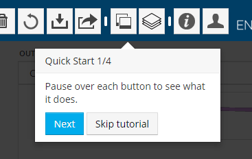

The following three Quick Start boxes highlight the policy scenario selector, the policy menu, and the output graph selector.  These features are all described in this tutorial (below).

If you wish to re-play the Quick Start walkthrough in the future using the same web browser, you may do so by using an "incognito" or "private" browsing window, which causes the simulator to believe this is your first visit to the site.

## Output Graph and Output Graph Selector

On the right-hand side of the window are two drop-down menus and a graph, as shown in the following screenshot:

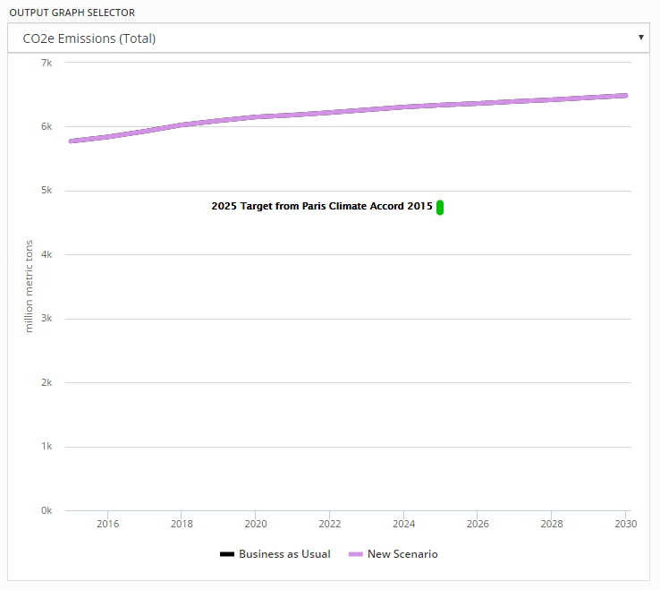

The two drop-down menus are the "Output Graph Selector."  The left-hand menu indicates the graph category, and the right-hand menu indicates the specific graph being shown.  When you first load the simulator, the graph category is set to "Emissions: CO2e" and the specific graph is "Total (includes land use)."  This graph shows the total greenhouse gas emissions from the United States in units of million metric tons of CO2e-equivalent.  See the following page for a [full list of graphs available in the web interface](web-interface-graphs.html).

The graph below the drop-down menus is where the results of policy packages are displayed.  The model begins by showing two scenarios: the "Business as Usual" scenario and the "New Scenario" that we are now in the process of designing.  The "Business as Usual" scenario projects the emissions from the U.S. in future years assuming that no new policies, beyond those already on the books, are enacted.  Since we have not yet enabled any policies, our "New Scenario" is identical to the "Business as Usual" scenario.  This means the graphed lines start out precisely on top of one-another, so they appear as if they are one scenario, though the "Business as Usual" scenario is actually hidden behind the line for the "New Scenario."  Both scenarios appear in the key below the graph.

The graph also shows the U.S. 2025 emissions target, which was submitted to the U.N. Framework Convention on Climate Change as the [United States' Intended Nationally Determined Contribution (INDC)](https://www4.unfccc.int/sites/ndcstaging/PublishedDocuments/United%20States%20of%20America%20First/U.S.A.%20First%20NDC%20Submission.pdf) in 2015.  This provides a reference point as well as a goal that users might try to hit as they design policy packages.

## Single and Multi-Variable Graphs

At any given time, there is always an "active scenario," which is the scenario that you are in the process of editing.  "New Scenario" is currently the active scenario.  There is currently one other scenario, `Business as Usual`, also displayed on the output graph.

Some output graph types, including the graph of total CO2e emissions, show only a single variable.  These single-variable graphs can display a number of scenarios simultaneously.  Each one forms its own line on the graph.  (How to enable or disable the display of additional scenarios is discussed in the "Comparisons Pane" section below.)

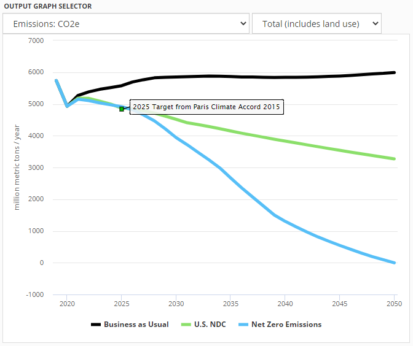

There are also many output graphs that show multiple variables from the same scenario.  For example, in the `Electricity Generation, Capacity, and Demand` category, `Generation` is a stacked area graph, including data series for electricity generation from various power plant types (coal, nuclear, hydro, etc.).

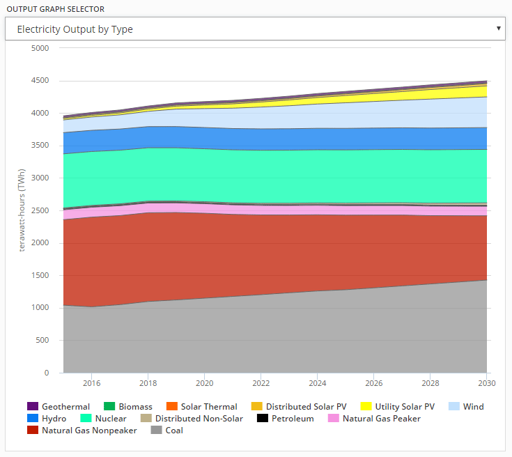

It is not possible to show multiple scenarios on this graph at once, because each scenario requires its own set of stacked areas.  Therefore, when you choose a multi-variable graph from the Output Graph Selector, the data depicted will be from the active scenario.  If you wish to see a multi-variable graph for a different scenario, you must change which scenario is the active scenario, as discussed below (in the "Policy Scenario Selector" section).

## Policy Scenario Selector

The Policy Scenario Selector is a drop-down menu near the upper left corner of the screen, above the list of different sectors.  When using the EPS via the online interface, there is always an active scenario, and its name is displayed in this drop-down menu.  The active scenario is the one that will be edited if you adjust any of the policy levers (as discussed below).  When you first start using the EPS, the active scenario will be "New Scenario," and it will not have any policies enabled, so it will be identical to the included "Business as Usual" scenario.

The "Business as Usual" scenario is one of several "Reference Scenarios" that are built into the simulator.  Each reference scenario includes a specific set of policies that you may use either as a point of comparison for your own scenarios (see the "Comparisons Pane" section below) or as a starting point when designing your own policy package.  The following screenshot shows the Policy Scenario Selector menu expanded, for a user who has not yet saved any custom scenarios:

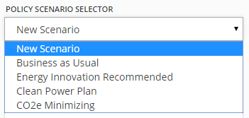

The included Reference Scenarios in the U.S. EPS version 3.0.0 are:

- `Business as Usual` - no policies are enabled in the simulator; includes the effects of policies already enacted, except for policies enacted too recently to be included in the input data set

* `NDC` - a recommended package designed by Energy Innovation LLC that achieves the United States' 2025 emissions target while saving money

* `Net Zero Emissions` - a scenario that achieves net zero GHG emissions by 2050 (that is, subtracting from human-caused GHG emissions any human-caused atmospheric CO2 removal due to [land use and forestry](lulucf.html) and [geoengineering](geoengineering.html))

You can expand the Policy Scenario Selector and choose one of the Reference Scenarios, or any scenario you have previously created and saved, to make it the active scenario.  It will be added to the graph and the policy settings for that scenario will appear in the "Policy Settings" box below.  If you have made any edits to the active scenario and have not saved your changes (discussed below), you will be asked if you wish to save discard your changes before switching to a different active scenario.  (Only the active scenario may have unsaved changes.)

## Wedge Diagrams and Cost Curves

When the active scenario contains multiple policies, two special graph types become available.  **Wedge Diagrams** break apart a policy package to show how each policy contributes to an outcome.  For example, here is the wedge diagram showing how each policy within the `NDC` scenario contributes to GHG reductions:

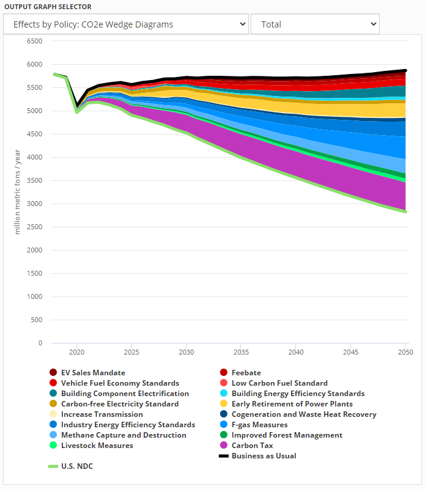

**Cost Curve** charts show the abatement and cost-effectiveness of each policy, represented as a box.  The width of the box is annual average abatement, and the height of the box is the cost (positive) or savings (negative) per ton of CO2e emissions avoided.

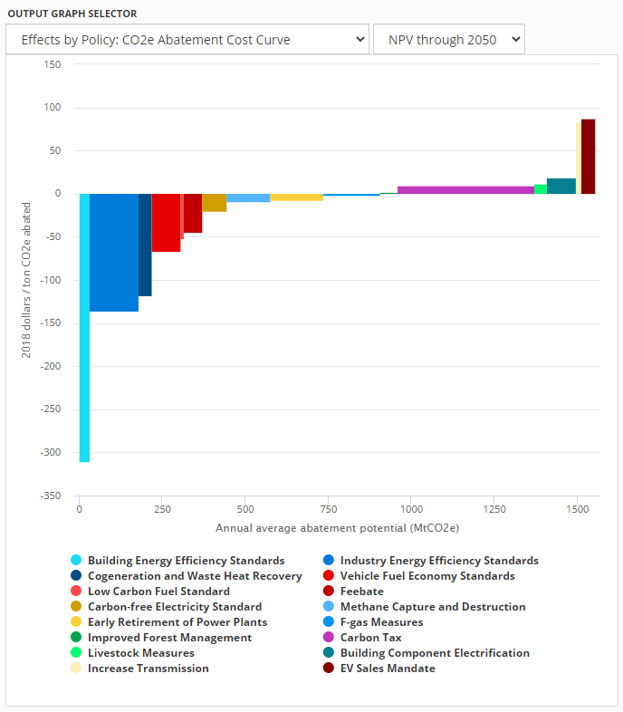

## Policy Levers and Control Settings

Below the Output Graph Selector is a set of expandable menus titled with the names of various sectors ("Transportation," "Electricity," etc.) as well as other categories, such as "Cross-Sector" and "Research and Development."  These categories are used to sort the policy and control setting levers available in the simulator.

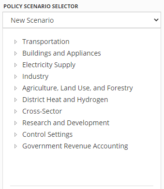

You may click on any category name to expand it, showing a list of policies or settings.  For example, clicking on the "Cross-Sector" category reveals the list of cross-sector policies modeled in the EPS.

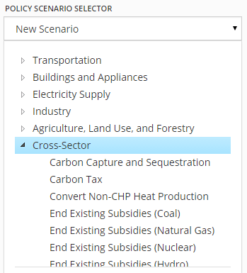

Some policies only possess a single lever.  Other policies are broken down into multiple levers, if they can be set separately for different things, such as different sectors, fuels, technology types, etc.  For example, the "End Existing Subsidies" policy can be applied to some, all, or none of various fuels and electricity sources that are subsidized in the BAU case, such as coal, natural gas, solar, petroleum, etc.  Similarly, the "Fuel Taxes" policy can be applied separately to different fuel types.  Breaking down some policy levers by fuel or technology types provides increased flexibility and enables users to design policy packages that reflect their views and priorities.

The Carbon Tax policy can be set separately for different sectors.  If you click on the Carbon Tax entry in the policies menu, it expands to show the list of sectors.

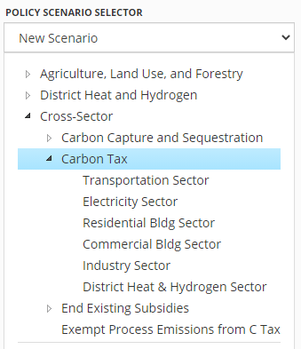

If you click on one of these sectors, such as "Electricity Sector," the policy pane for the Carbon Tax appears.  The following screenshot shows this pane:

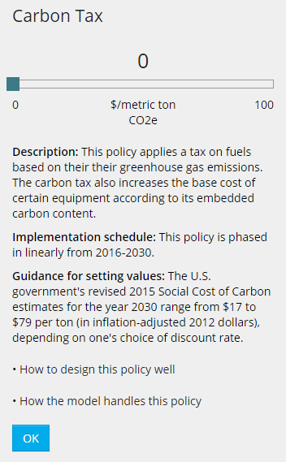

At the top of the pane is the name of the policy and the sector to which the policy is being applied.  Below that is a slider that allows you to set the carbon tax to any value you desire between $0 and $300 per metric ton of CO2-equivalent.  The minimum and maximum bounds appear at each end of the slider, the selected value appears above the slider in the middle, and the units for that value appear below the slider in the middle.

As soon as you move the slider and release the mouse button, the new setting for the policy will be applied.  The server runs the model and updates the graph on the right.  The graph is animated: you can watch the line for the active scenario (or all the lines or areas in a multi-variable graph) move from their old positions to their new positions.  Depending on your internet connection and load on the server, there may be a slight delay between when you release the mouse button and when you see the graph animate.  Note that sometimes a policy change will have no visible effect on the graph, depending on which policy you are changing, how much you are changing that policy, and which graph you are viewing.

Below the slider is a short description of the policy.  Every policy in the model includes a short description, to help inform users who may be unfamiliar with a given policy.

Below the description is a small amount of guidance text that aims to help the user decide what might be a reasonable value for the policy lever.  For example, a user who is unfamiliar with a carbon tax may not have any sense of what constitutes a low, medium, or high value.  Accordingly, the guidance text strives to provide a reference point that may help a user decide what numerical setting might be in line with his/her policy preferences.  For example, the guidance text for the carbon tax policy mentions that the United States Government's Social Cost of Carbon estimates for the year 2050 range from $32 to $115 per ton.

Next there are three links:

- `Customize implementation schedule` lets you change the rate at which the policy phases in (or out) over the model run.  A description of how to use this feature appears below.

- `How to design this policy well` opens this policy's page from the [Policy Design Guide](https://energypolicy.solutions/docs/policy-design-index.html), a set of short documents that provide advice on how to effectively implement each policy in the model.

- `How the model handles this policy` opens a page from the model documentation where the structure related to the implementation of that policy is discussed.

Finally, there is an `OK` button to dismiss the Policy Pane.  If your screen is not very tall, it is possible that the `OK` button may be off the bottom of the screen.  You can scroll the policy pane to bring the button into view.

## Customizing Policy Implementation Schedules

If you click on the `Customize implementation schedule` link in a policy pane, the pane changes to display the schedule editor.

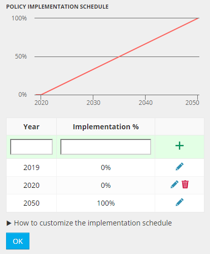

The small graph on the top previews the schedule.  By default, many policies are set to phase in linearly over the whole model run.  This means that the policy only reaches the setting you specified using the policy lever in 2050, and it has a value half that large halfway through the model run.

To adjust a policy’s implementation schedule, enter pairs of numbers in the grid below the schedule preview graph. The implementation percentage is the fraction of your policy setting in effect in that year. Values for years that you do not specify will be linearly interpolated automatically. For example, if you want a policy to begin in 2025, gradually become stronger until 2040, and remain constant thereafter, you would enter (2019,0%) (2025,0%) (2040,100%) (2050,100%). For Boolean (on/off) policies, enter 0% (off) or 100% (on).

You can edit existing data points in the schedule grid, you can add points by entering them in the green row at the top, and you can remove points (except the points for the first year and the last year) by using the red trash bin icon.

When you are done building your custom implementation schedule, click `OK`.  The model will run with your new schedule applied.

## Government Revenue Accounting levers

There exist a set of "Government Revenue Accounting" levers.  These are not policies.  Rather, they set the way in which government spends increased revenue or makes up for decreased revenue as a result of particular policies.  For a full discussion of these levers, see the documentation page on the Energy Policy Simulator's built-in [Input-Output model](io-model.html).

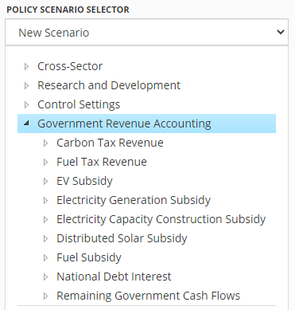

## Unsaved Changes

If you change one or more policy settings for the active scenario, the name of the active scenario in the Policy Scenario Selector will be followed by the words "(unsaved changes)."

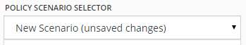

If you are logged in, you can save this scenario to your personal collection of policy scenarios using the Save Scenario button (discussed below).  If you are not logged in and you attempt to save your scenario, you will be prompted to either sign in or to register for an account.  (Since scenarios are saved on the server, you must have an account to which your custom scenario may be saved.)

## Policy Settings Pane

In the lower left area of the screen, below the menus of policy levers, is the Policy Settings box.  All of the policy settings for the active scenario are listed in this box.  This helps you keep track of the policies that you have added to your policy package and lets you see the contents of a policy package at a glance.  If the active scenario has too many policy settings to all be visible in this box, you can scroll the box to bring the rest into view.

For example, using the Policy Scenario Selector (discussed above), choose the "NDC" scenario.  The policy settings that compose that package appear in the Policy Settings pane.  You must scroll this pane to see all of the policies in the NDC package.  The following screenshot shows the first couple policies from the NDC scenario.

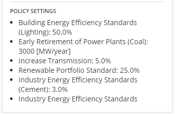

## Button Bar

The button bar is a blue strip that runs across the top of the window.  This section will include a picture of each element in the button bar followed by an explanation of what it does.

### New Scenario

The New Scenario button will create a new scenario with no policies enabled, just like the one that exists when you start the simulator for the first time.  The newly created scenario will be selected as the active scenario.  If you have an active scenario with unsaved changes, you will be prompted about whether to discard these changes before creating the new scenario.

### Save Scenario
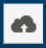

The Save Scenario button will allow you to save your scenario to your account on the Energy Policy Solutions server.  If you are not logged into an account, you will be prompted to sign in or to register an account before you may save your scenario.

If this is the first time you are saving this scenario, you will be prompted to enter a name for the scenario, as shown in the following screenshot:

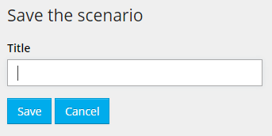

You may not choose any of the built-in scenario names (not case sensitive).  In the U.S. EPS, these are:

- Business as Usual
- U.S. NDC
- Net Zero Emissions
- New Scenario

When you save a scenario for the first time, the "New Scenario" name in the graph key will be replaced with the name you choose, and the saved scenario will be assigned a new line color.

If you choose the same name as a custom scenario that you previously saved, the simulator will ask whether you wish to replace the previously-saved custom scenario with this scenario.

If you have previously saved this scenario under a custom name, and you have since made changes (so the Policy Scenario Selector reads "_Your Scenario Name_ (unsaved changes)", then clicking the Save Scenario button will simply update that scenario without changing the name, removing the "(unsaved changes)" note from the Policy Scenario Selector.

### Save As

The Save As button will save a copy of the active scenario under a new name.  As in the case of the Save Scenario button, you cannot choose any of the built-in scenario names.  If you choose the same name as a custom scenario you have previously saved, the simulator will ask you whether you wish to overwrite that scenario.

### Rename

The Rename button will change the name of the current scenario, if it is a user-created scenario that you previously saved.  (The Rename button will generate an error message if you attempt to rename a scenario with one of the built-in names.)  You cannot rename a scenario to any of the built-in names, nor to a name already used by a custom scenario.  (If you wish to replace a different custom scenario with the current custom scenario, you may either use "Save As" and overwrite it, or you may delete the other custom scenario, then rename this scenario to the name formerly used by the deleted scenario.)

### Delete Scenario

The Delete Scenario button deletes the active scenario from your account on the EPS server.  You may not delete a scenario with one of the built-in names, such as "New Scenario" or "Net Zero Emissions."

### Revert

The Revert button will change the policy settings of the active scenario back to the values they had at the last time it was saved (or shared, in the case of a scenario accessed via a URL, as described in the "Sharing Scenarios" section).  If the active scenario is a New Scenario that has never been saved, the Revert button will remove all policy settings from the scenario.  The simulator will always prompt you to confirm that you really wish to revert before doing so.

### Download Data
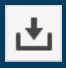

Clicking on the Download Data button will cause a .zip file to be downloaded to your computer.  The .zip file will contain two or three comma-separated values (`.csv`) files.  One file specifies the names of the policies that are enabled in the active scenario and their numerical settings (including policy implementation schedule data).  Another file provides the numerical values for the data shown on the currently-displayed output graph for the active scenario.

If you are currently displaying two output graphs (see the "Multiple Graph Display" section below for details), there will be a third comma-separated values file inside the .zip file containing the data shown on the additional output graph.

The Download button is useful if you have developed a scenario and wish to work with the output data in a spreadsheet program, to perform analysis or to create a graph with customized colors or other stylistic elements.

### Share Scenario

The Share Scenario button opens the sharing pane.  This pane provides several options by which you can share the active scenario: email, Facebook, Twitter, LinkedIn, or you can copy a URL to the clipboard, which you can paste into a program of your choice.

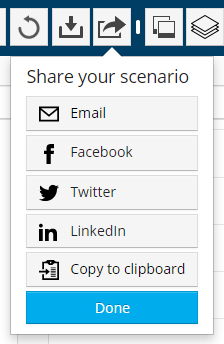

When sharing by Facebook, Twitter, or LinkedIn, the share message will come pre-populated with a picture and basic site information to make your post visually attractive and engaging.  You can always edit or remove the pre-populated text and/or add your own message.  As an example, the Facebook sharing pane is shown below.  (All three services have a preview in the sharing pane, but the preview does not always capture all of the content that will be in the final post.  Facebook's preview is more complete than that of Twitter or LinkedIn.)

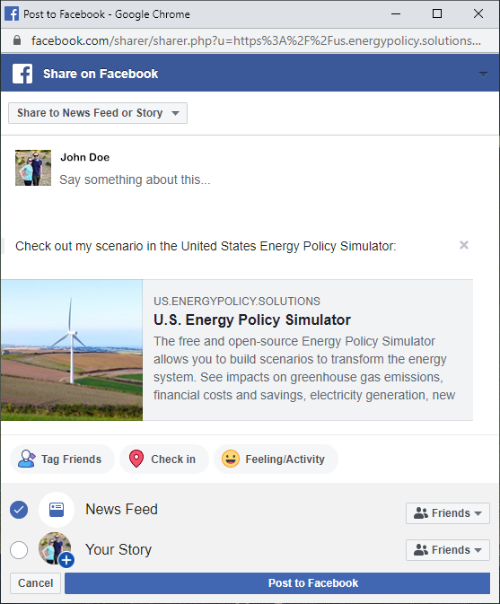

The email option brings up the email sharing pane:

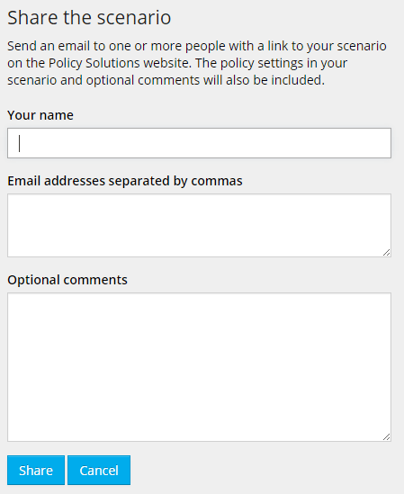

Enter your name in the top box.  In the second box, enter a list of email addresses (separated by commas) that you wish to receive the scenario.  Remember to include your own email address if you would like a copy of the message.  Finally, in the third box, you may enter additional text that you would like to appear in the email- for example, you might explain the goal of your scenario.  Click "Send" to send the email(s).

The email will include a special link that references your scenario.  When the recipient clicks the link, he/she will be taken to the Energy Policy Simulator, and all of the policy settings for the shared scenario will be set automatically.  The scenario will have the name you gave it.  Then, your recipient may view the scenario, may edit it, and may save a copy of it to his/her own account.

### Multiple Graph Display
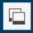

The Show Two Graphs / Show One Graph buttons toggle the output graph display between showing one large graph and two smaller graphs, stacked vertically.  When you click the Show Two Graphs button, a second graph with its own Output Graph Selector appears below the graph you were already viewing.  In the button bar, the Show Two Graphs button changes to the Show One Graph button.  Click this button to remove the lower graph.

### Comparisons Pane
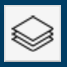

The Comparisons button opens the Comparisons pane, where you may select scenarios or targets to compare against the active scenario on the output graph.  The following screenshot shows the comparisons pane:

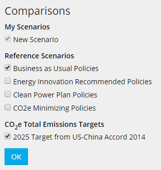

The Comparisons Pane lists the active scenario, any previously saved custom scenarios, the built-in Reference scenarios, and the announced U.S. 2025 emissions target.  Each of these elements has a check box next to it.  Generally, items that are checked are displayed on the output graph, while items that are not checked are hidden from the output graph.

The active scenario is always checked and is always shown on the output graph.  You are not able to clear the check box for the active scenario.  If you wish to remove it from the graph, first make a different scenario active.

If you are showing a multi-variable graph, such as electricity generation (disaggrated by power plant type), only one scenario can be shown on the graph at a time.  The scenario shown on a multi-variable graph is always the active scenario.

The U.S. 2025 emissions target can only be shown on the "CO2e Emissions (Total)" graph because the target pertains to total CO2e emissions from the United States.  If a different output graph is selected, the 2025 emissions target checkbox will be clear, and you will not be able to check the box.

When many scenarios are displayed, it can sometimes be confusing which scenario is the active scenario.  Remember that the name of the active scenario will always be displayed in the Policy Scenario Selector.

### Help

The Help button opens the Energy Policy Simulator documentation in a new browser tab.  It functions identially to the `Learn More` button on each regional EPS deployment's landing page, discussed above.

### Account

If you are not signed in, clicking the Account button will display a small pop-up box with `Sign in`, `Register`, and `Cancel` buttons.

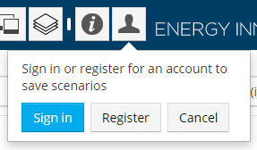

The `Sign in` and `Register` buttons will take you to the login page and the account registration page, respectively, while the `Cancel` button will close the small pop-up box.

Click "Register" if you wish to create an account.  This will take you to a page where you can fill in your name, organization, email address, and password, as shown below:

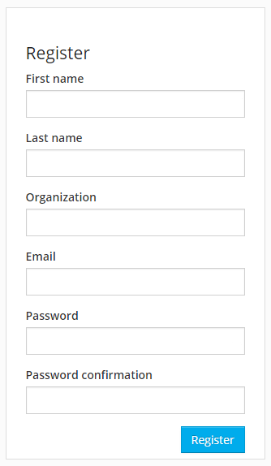

If you have already registered an account, click the "Sign in" button.  This will take you to a page that prompts you to fill in your email address and the password you created for your account, as shown below:

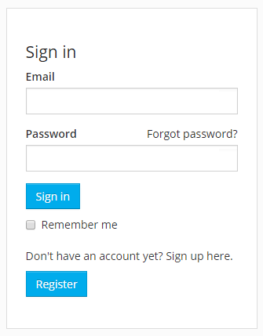

After you sign in, you will be taken to the simulator.  Your previously saved scenarios will be available in the Policy Scenario Selector and in the Comparisons pane.

If you are currently signed in, clicking the Account button will display a small pop-up box that informs you of the account under which you are currently signed-in and contains `Sign out` and `Cancel` buttons.

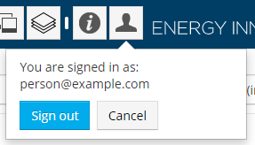

### Logos

Clicking on the "Energy Policy Solutions" logo on the left side of the header bar will open a browser tab showing the landing page for the regional EPS deployment you are using.

Clicking on the Energy Innovation logo on the right side of the header bar will open a browser tab showing the home page of Energy Innovation: Policy and Technology LLC, the organization that developed the Energy Policy Simulator.

### Version Number

Different EPS models may be on different versions of the core EPS software platform.  To the right of the Energy Innovation logo is the version number of the regional EPS deployment you are using.  Clicking the version number will open the [Version History](version-history.html) page in a new tab, allowing you to see what features your EPS deployment includes.

## Ideas for User Goals

The Energy Policy Simulator does not define a specific goal that users should be striving to achieve through their policy packages.  Nonetheless, even after learning how to operate the web application interface, some users may not know exactly how they wish to use it.  Therefore, we provide some ideas for goals that might be of interest to users:

* You may try to design a policy package that achieves the U.S. 2025 emissions target, either using your favorite policies or low-cost policies.
* You may look through the policies and enable your favorites at levels that seem wise to you.  Once your package has been fully constructed, you check several output variables to see how it performs (for example, in terms of emissions reductions, capital and operational costs/savings, electricity generation by type, etc.).
* You may choose a goal you care about, such as minimizing fine particulate (PM2.5) emissions or maximizing the amount of installed wind generation capacity.  You then switch to the relevant output graph and try to design a policy package that achieves your chosen goal.
* You may look for policies that have interesting, non-linear interactions.  For example, policies that promote wind generation become less effective if the electric grid becomes flexibility-constrained, so a policy like increased electrical transmission capacity (which provides flexibility) has different effects depending on whether or not there are other policies enabled that drive wind capacity growth.
