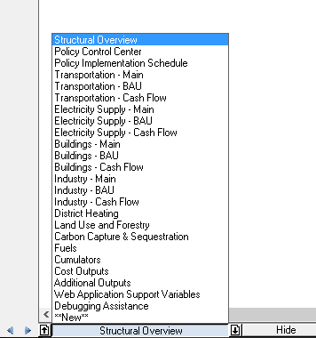
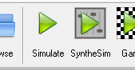
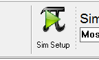
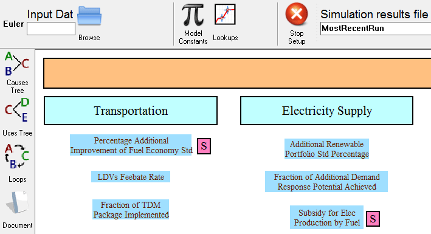
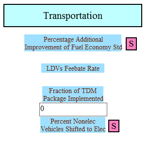
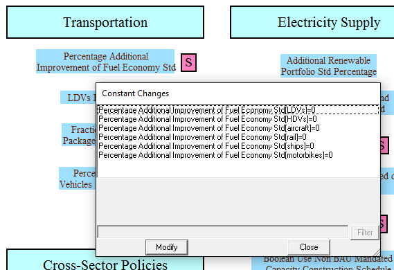
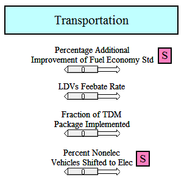
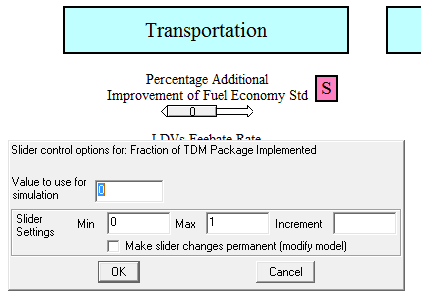
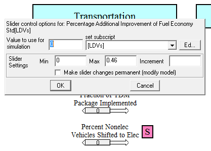
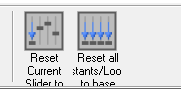

Open the packaged version of the EPS in Vensim model reader.  This is the version of the model with .vpm extension.

## Sheets

Variables, arrows, text boxes, and other elements of the model appear on different "sheets" in Vensim.  Sheets are a means of keeping model elements organized and visually clean- there is nothing preventing part of the model on one sheet from using a variable that is defined on a different sheet.  Sheets are navigated via a pull-up menu near the bottom left corner of the screen.  The name of the currently-active sheet will appear on the menu, and clicking on this name will display the selection of available sheets:

Use the sheet menu to navigate to the Policy Control Center, a sheet from which all policy levers in the model can be accessed.  You may navigate around the Policy Control Center page either by using the scroll bars or by pressing and holding your right mouse button and moving the mouse.  The policy levers are the variables with names in black text under the headers in blue boxes.  For example, the upper left policy is "Percentage Additional Improvement of Fuel Economy Std" and is in the "Transportation" section.

## Simulate vs. SyntheSim

There are two modes in Vensim Model Reader by which you might want to run the EPS.  They are invoked by two buttons near the top center of the screen: "Simulate" and "SyntheSim."

### Simulate and Sim Setup

Clicking the "Simulate" button will run the model once.  It will not give you a chance to alter the model's settings (for example, to enable any policies) before the simulation is performed.  After you click the "Simulate" button, data will appear on the graphs that are below the policy levers.  (If this is not your first time running the model, the graphs may already have been showing data from your previous model run.  These data will be overwritten by your new run, unless you change the run name.  This is discussed on the [Creating and Managing Scenarios](creating-and-managing-scenarios.html) page.)

If you wish to enable some policies, you must do this before clicking "Simulate" by clicking the "Sim Setup" button, which appears near the top of the screen, to the left of center.

After you click this button, you enter Sim Setup mode.  Where the "Sim Setup" button used to be there now appears a button called "Stop Setup."  Additionally, all of the policy levers are now surrounded by light blue boxes.  It should appear similar to the following screenshot:

Now that you are in Sim Setup mode, you may click on any one of the policy levers to set its value.  The policies with the letter "S" in a pink box next to them are subscripted.  This means that their values can be set separately for each element of the subscript(s) they have.  If you click on a policy that is not subscripted, a small box will appear, into which you can type a numerical value for the policy setting.  For example, the following screenshot shows what it looks like after you click on the "Fraction of TDM Package Implemented" policy (TDM stands for "Transportation Demand Management") while in Sim Setup mode:

You may now enter a value, such as 0.5 (meaning half of the TDM package will be implemented by the model's end year).  Either press "return" or click elsewhere in the Vensim window to confirm your entry.  If you click on "Fraction of TDM Package Implemented" again at this point, the text box that appears will already contain the value of 0.5 that you entered earlier.

If you click on a policy that is subscripted, a small "Constant Changes" window will appear that lists the subscript elements to which you may apply the policy.  For example, the following screenshot shows what it looks like after you click on the "Percentage Additional Improvement of Fuel Economy Std" policy (and resize the "Constant Changes" window so that the text inside is not cut off):

You may now change the policy settings for each subscripted element by double-clicking its row in the "Constant Changes" window.  For example, you may enter a value, such as 0.2, for LDVs (light-duty vehicles).  This will improve the fuel economy of LDVs by 20% but will leave the fuel economy of the other vehicle types unchanged.  To finish editing an entry, click elsewhere in the "Constant Changes" window or click the "Update" button.  You may set different or the same policy values for any or all of the subscripted elements, as desired for the policy scenario you are investigating.  When you are done setting values for this policy, click the "Close" button to close the "Constant Changes" window.

If you are uncertain what values would be reasonable, you may consider using SyntheSim mode (discussed below), which includes an upper bound on each policy setting.

After you have set values for any policies (both subscripted and non-subscripted policies) that you wish to enter, you are ready to run the simulation.  Click the "Simulate" button.  Vensim runs the model and the simulation is complete.  The graphs below the policy levers on the "Policy Control Center" sheet are updated.  For more advanced ways to access and visualize model results, see the [Visualizing Output](visualizing-output.html) page of this documentation.

If you decide that you don't want to run the simulation after all, you can instead click the "Stop Setup" button.  This will exit Sim Setup mode without running the model and without saving the policy setting changes you just made.

### SyntheSim Mode

SyntheSim mode is a way to run a model interactively in Vensim.  When running the EPS in SyntheSim mode, you do not need to set policy values beforehand using the Sim Setup mode.  Instead, you may begin by clicking the "SyntheSim" button to enter SyntheSim mode.  Now, each of the policies features a slider below its name, initially set to zero.  The following screenshot shows a portion of the Policy Control Center in SyntheSim mode:

For a policy that is not subscripted, you may simply left-click and hold your mouse on one of the sliders, then drag it right and left to set the policy to the desired value.  For greater numerical precision, you may click on the bar that forms a track for the slider.  This will open a small dialogue box in which you can type the desired value for the slider.  It also shows you the minimum and maximum recommended values for this slider, which are values determined via research during the process of creating the EPS.  While the slider will not exceed this recommended range, you may type a number that falls outside of the range, to test that setting, if desired.  Here is a screenshot of the dialogue box that appears after clicking on the track for the slider for the "Fraction of TDM Package Implemented" policy:

For a policy that is subscripted, it is not a good idea to simply drag the slider, because this will only change the policy value for the policy's first subscript element.  For example, dragging the slider for the "Percentage Additional Improvement of Fuel Economy Std" policy will only change the value of this policy for the LDVs element.  Instead, it is best to click on the track for that policy's slider.  A small dialogue box appears which allows you to set the policy value for each subscripted element separately by selecting the element from a drop-down menu and typing a number in the "Value to use for simulation" box:

It can be difficult to edit policy settings this way because the setting for only one element can be viewed at one time.  It may be better to click on the small "Ed..." button that appears to the right of the "set subscript" drop-down menu.  This will open the "Constant Changes" window, which was described above in the "Simulate and Sim Setup" section.  You may use this window to set values for any or all of the subscripted elements of the policy.

Every time you move a slider or type a policy value while in SyntheSim mode, the model is immediately re-run and the results are displayed on the graphs below the policy sliders.

If you wish to reset all of the levers to their default values (all policies turned off), you may click the "Reset all Constants/Lookups to base" button, near the top center of the screen.

You may exit SyntheSim mode by clicking the "Stop Setup" button.  The values of your policy settings and the model results will be remembered until you begin a new simulation or enter Sim Setup mode.