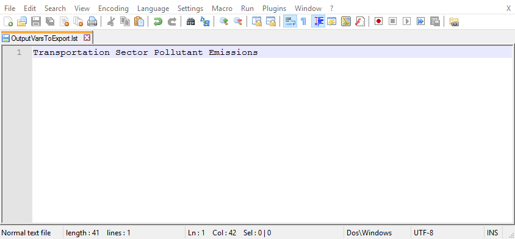
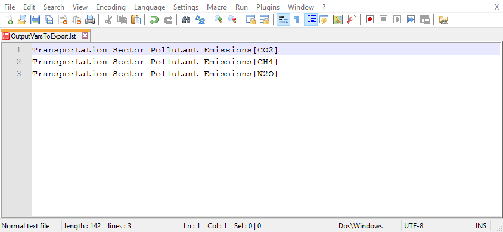

Three of the Python scripts included in the Energy Policy Simulator (EPS) model distribution rely on a text file called `OutputVarsToExport.lst` to determine which variables in the EPS the user wishes to have included in the output file(s).  Therefore, before using the Python scripts, it is best to set up the `OutputVarsToExport.lst` file so that all of the variables you are interested in will be included in the results.

(The `CreateCarbonCapToTaxScript.py` Python script, which simulates a carbon cap-and-trade policy, has its own output variable list, `OutputVarsForCarbonCapToTaxScript.lst`.  The directions on this documentation page assume you are using one of the other Python scripts and `OutputVarsToExport.lst`, but the procedure is the same if you are editing `OutputVarsForCarbonCapToTaxScript.lst`.)

Despite its unusual ".lst" extension, `OutputVarsToExport.lst` is an ordinary text file and can be opened in a text editor.  The file simply contains the names of variables (defined inside the EPS), listed one per line.  The `OutputVarsToExport.lst` file is distributed containing two variable names: specifically, the variables used to construct a GHG abatement cost curve diagram.  Unless you plan on creating this type of diagram, you may wish to delete the variable names that already exist in this file, to avoid cluttering up your run results file with output of variables in which you have no interest.

The best way to decide which variables to include in the `OutputVarsToExport.lst` file is to open the model in Vensim Model Reader and to locate the variables in which you are interested.  Then you simply copy each variable's name to a new line in the `OutputVarsToExport.lst` file.  For example, you might decide that you are interested in the `Transportation Sector Pollutant Emissions` variable from the "Transportation - Main" sheet.  If so, you simply add the text `Transportation Sector Pollutant Emissions` to a blank line in the `OuputVarsToExport.lst` file.  Below is a screenshot of the `OuputVarsToExport.lst` file, open in the Notepad++ text editor, after deleting the example variable entries and adding an entry for `Transportation Sector Pollutant Emissions`:

If you include the name of a subscripted variable in the `OutputVarsToExport.lst` file, the results file will include one entry for each subscripted element of that variable.  For example, the `Transportation Sector Pollutant Emissions` variable is subscripted by pollutant, and the "Pollutant" subscript has twelve entries (CO2, NOX, SOX, PM2.5, etc.).

To limit the output to certain elements of a subscripted variable, you can list those elements in square brackets after the name of the variable in the OutputVarsToExport.lst file.  Only one element may be specified per line, so you will need to repeat the variable name if you want to log the output of more than one element of the same variable.  For example, if you are interested in just the CO2, CH4, and N2O pollutants from the Transportation sector, your `OuputVarsToExport.lst` file would look like this:

For variables with more than one subscript, you must specify a value for every subscript if you wish to precisely identify a single element.  For example, the `Fleet Avg Fuel Economy` variable on the "Transportation - Main" page is subscripted by vehicle type, cargo type, and vehicle technology.  So, you want to log the average fuel economy of light-duty, gasoline-powered passenger vehicles, you would add the following line to the `OuputVarsToExport.lst` file:

`Fleet Avg Fuel Economy[LDVs,passengers,gasoline vehicle]`

If you are uncertain of the different values that a subscript may take, you can open the "Subscripts" control panel (using the button in the upper right) and click on the tab for the relevant subscript.  The possible values that subscript may take will be listed there.

## Note on Units

Pay attention to the units used by the variables you add to the output list.  Most variables in the EPS are in "working units" (such as grams or BTUs), which may not be convenient units for output or display.  However, the variables that appear on the "Web Application Support Variables" sheet whose names begin with the word "Output" use the proper display units for the modeled region.  These are the same variables that are used by the web application interface.  It is often best to primarily or exclusively use these "Output" variables in your `OuputVarsToExport.lst` file, and only use other variables from the EPS when you wish to analyze something that is not reported in any "Output" variable.

For more information on working units, display units, and unit conversion, see the [Notes on Unit Conversion](unit-conversion.html) documentation page.
