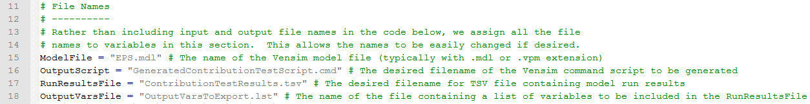
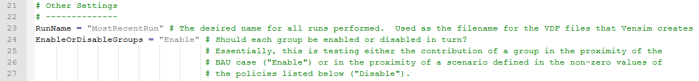
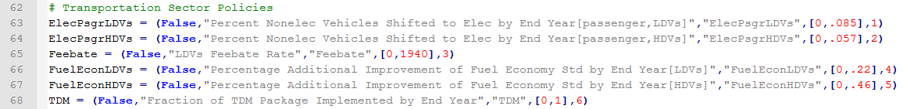
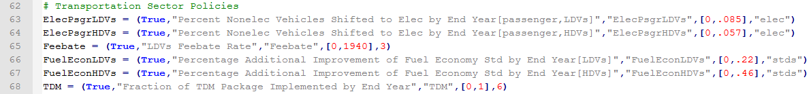

The "CreateContributionTextScript.py" python script is designed to perform simulations and record the data necessary to determine the contribution of any specific policy or user-defined group of policies to the results for any output variable.  The resulting data can be used to construct wedge diagrams (where each policy's contribution to a package's total CO2e abatement is shown as a colored wedge) and policy cost curves (where each policy is depicted as one or more stacked boxes, whose width equals achieved CO2e abatement and height above or below the X-axis equals the cost or savings per ton CO2e abated).  Before you begin to work with this script, ensure that your OuputVarsToExport.lst file is properly configured, as described in [Selecting Output Variables for Any Python Script](selecting-output-variables.html).

Open the "CreateContributionTestScript.py" file in a text editor such as Notepad++.  Lines 15-18 specify the filenames of various input or output files that will be used or created by the script.  This section is shown in the screenshot below:

If you plan on only using this script to test the contributions of policies to a single package (a single "run set"), you can leave these lines alone.  However, if you plan on doing more than one run set, you might wish to change the run results filename on line 17 for each version of the script, to avoid the possibility of the results from one set of runs overwriting the results from another run set.  To do this, change "ContributionTestResults.tsv" (in the double quotes, colored gray in the screenshot above) to some other filename ending in .tsv, such as "ContributionsToFirstPackage.tsv" (in one copy of the script), "ContributionsToSecondPackage.tsv" (in another copy of the script), etc.

Below the "File Names" section of the script is the "Other Settings" section, as shown in the following screenshot:

The first setting is for the run name.  This is used as the name for the .vdf (data) file that Vensim generates after each run.  This is not important because that .vdf file is over-written with every run that is part of a run set, so only the data from the final run of the run set will remain in that .vdf file after the script execution is complete.

The second setting is "EnableOrDisableGroups."  This setting defines whether you would like to test each policy (or policy group) in your policy package individually (e.g. determining the contribution of that piece of your policy package relative to BAU), or whether you would like to test what happens when each policy (or policy group) that is part of your package is disabled, leaving the rest of your package turned on (e.g. determining the contribution of that piece of your policy package relative to the scenario defined by the complete policy package).  The "Enable" setting tests against BAU (by enabling policies or groups one at a time), and the "Disable" setting tests against the package (by disabling policies or groups one at a time).

Both settings can be useful for different purposes, and the best way to choose between them may be to make a judgment about the political environment or policymaker at whom the results are directed.  If you have a preferred policy package that may consist of many policies, but you expect a policymaker to only be able to enact one or two policies (due to lack of political capital or other constraints), then it may be best to use the "Enable" setting.  This way, you will determine which parts of your package would perform best when used in isolation.  However, if you expect the policymaker to be able to enact the majority of the policies in your package, then testing with the "Disable" setting makes sense, since this will identify the policies that are most effective in the context of all of the other policies having successfully been enacted.

Finally, on lines 62-174, you are able to enable particular policies and adjust their settings.  For example, the following screenshot shows the transportation sector policies, which appear on lines 62-68:

Each policy has a list or properties in parentheses following the equals sign: whether the policy is enabled or disabled, the policy's variable name in Vensim (with subscript settings if applicable), the policy's short name in the Python script itself, a list of policy settings in square brackets, and a group designator (by default, a unique number for each policy).  A group designator may either be a number or a string surrounded by double quotes.  The only values you should edit are the enabled setting (changing "False" to "True"), the policy setting values (changing the non-zero value in the square brackets), and the group designator.  Any policy included in your package should be enabled, and the non-zero setting should match the value that policy has in your package.  If you wish to test multiple policies together (that is, enabling and disabling them together, as if they were one policy), then they must have the same group designator.  This is very commonly desired for subscripted elements of the same policy.  For example, the following screenshot shows all of the Transportation policies enabled, and the subscripted elements of the vehicle electrification policy and the fuel economy standards policy will each be enabled or disabled together, because they have a common group designator ("elec" for electrification policies and "stds" for fuel economy standards policies):

Not every possible policy, nor every possible subscript value for every policy, is included in the Python script.  For example, the Fuel Economy Standards policy is included, but only two vehicle types are available in the script (LDVs and HDVs), though the model includes six vehicle types (aircraft, rail, ships, and motorbikes being the other four).  You can test policies or policy subscript elements that are missing if you add lines to the Python script for the new policies or elements, mimicking the style used for the existing lines.  You will have to invent a short name (used only in the Python script) for your new entry.  This short name appears twice on the line you add to the script, and you will also need to add the short name to the "PotentialPolicies" list that appears on line 181.

Finally, save and run the Python script to generate a Vensim command script, then run the Vensim command script using Vensim DSS to perform the runs.  The procedure is the same as for the Data Logging script, [described here](logging-output.html).  There will only be a single tab-separated value results file, ContributionTestResults.tsv.  It will have one line per run for each variable (or each included element of a subscripted variable) in the "OutputVarsToExport.lst" file.  It will specify which group is enabled or disabled for each run and will list the policies contained within that group.

You may now generate a wedge diagram or cost curve using the output data.  Wedge diagrams can be made in Microsoft Excel or a similar spreadsheet program.  Cost curves can be generated using the program [think-cell chart](https://www.think-cell.com/en/products/chart/overview.shtml).

Since the Energy Policy Simulator (EPS) accounts for policy interactions, the sum of the effects of the individually-enabled or individually-disabled policies (or policy groups) is unlikely to equal the total effect of the package.  Therefore, when making a wedge diagram, it is necessary to divide up the total effects of the package in proportion to the strength of the different policies, rather than to sum those policies' individual effects.  For example, in 2030, if Policy A abates 3 tons (75%) and Policy B abates 1 ton (25%), and the two policies together abate 6 tons, then the wedge for Policy A in 2030 will have a thickness of 4.5 tons and Policy B will have a thickness of 1.5 tons.  When making a cost curve, it is similarly desirable to scale the boxes in the X-direction, so that you do not report a total abatement that is larger or smaller than the package's true total.  (Since the Y-axis is measured in dollars per ton abated, no scaling is necessary in the vertical direction.)