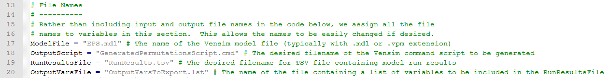
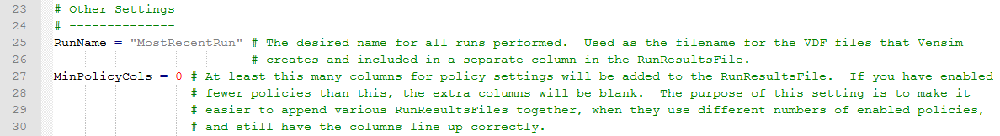

The "CreatePermutationsScript.py" python script is designed to enable you to perform simulations that test many different permutations of policy settings.  Before you begin to work with this script, ensure that your OuputVarsToExport.lst file is properly configured, as described in [Selecting Ouput Variables for Any Python Script](selecting-output-variables.html).

Open the "CreatePermutationsScript.py" file in a text editor such as Notepad++.  Lines 17-20 specify the filenames of various input or output files that will be used or created by the script.  This section is shown in the screenshot below:

If you plan on only using this script to perform one series of permuted runs (a "run set"), you can leave these lines alone.  However, if you plan on doing more than one run set, you might wish to change the run results filename on line 19 for each version of the script, to avoid the possibility of the results from one set of runs overwriting the results from another run set.  To do this, change "RunResults.tsv" (in the double quotes, colored gray in the screenshot above) to some other filename ending in .tsv, such as "FirstRunSet.tsv" (in one copy of the script), "SecondRunSet.tsv" (in another copy of the script), etc.

Below the "File Names" section of the script is the "Other Settings" section, as shown in the following screenshot:

The first setting is for the run name.  This is used as the name for the .vdf (data) file that Vensim generates after each run, but this is not important because that .vdf file is over-written with every run that is part of a run set, so only the data from the final run of the run set will remain in that .vdf file after the script execution is complete.  More important is that this value is included as a column in the output spreadsheet that contains results from all runs that are part of the run set.  Therefore, if you plan on doing more than one run set (with different versions of this script), it is good practice to pick a different run name for each run set.  For example, if you perform a run set where you test several different transportation sector policies, and another run set where you test several electricity sector policies, you could make the run names "Transportation Run Set" and "Electricity Run Set" respectively.

For every policy that is included in a run set, the output file will include a column specifying that policy setting for each run in the run set.  The "MinPolicyCols" setting forces Vensim to include at least the specified number of policy columns, even if a smaller number of policies were enabled for this run set.  The purpose of this setting is to allow all of the columns to line up correctly if you are performing multiple run sets that contain different numbers of enabled policies.  For example, suppose in the "Transporation Run Set" discussed above, you are testing three policies, but in the "Electricity Run Set," you are testing five policies.  In the python script that defines the Transportaton Run Set, you should change the value for "MinPolicyCols" to 5.  This will cause Vensim to add two blank columns to the policy section of the run results file for your Transportation Run Set.  Now, if you ever wish to compare the runs from your Transportation Run Set against the runs from your Electricity Run Set, all you need to do is append the two files (or copy and paste the contents of one below the contents of the other, in a text editor or in Excel).  If you do not use the MinPolicyCols setting, then the data columns would be off by two (such that year 2030 from the Transportation Run Set is in the same column as year 2028 from the Electricity Run Set).

Finally, on lines 60-172, you can enable particular policies and adjust their settings.  For example, the following screenshot shows the transportation sector policies, which appear on lines 60-66:

Each policy has a list of properties in parentheses following the equals sign: whether the policy is enabled ("True") or disabled ("False"), the policy's variable name in Vensim (with subscript settings if applicable), the policy's short name in the Python script itself, and a list of policy settings in square brackets.  The only values you should edit are the enabled setting (changing "False" to "True") and the policy setting values (changing or adding additional numbers to the set in square brackets).  Although each policy by default only has two values in the script (zero and a non-zero value), there is no limit to the number of non-zero values you may include in the list.  For example, to test five different settings for the "TDM" (transportation demand management) policy, change "False" to "True" and add the extra settings to the settings list for that policy, so line 66 in the Python script might look like:

TDM = (True,"Fraction of TDM Package Implemented by End Year","TDM",[0,0.25,0.5,0.75,1])

Not every possible policy, nor every possible subscript value for every policy, is included in the Python script.  For example, the Fuel Economy Standards policy is included, but only two vehicle types are available in the script (LDVs and HDVs), though the model includes six vehicle types (aircraft, rail, ships, and motorbikes being the other four).  You can test policies or policy subscript elements that are missing if you add lines to the Python script for the new policies or elements, mimicking the style used for the existing lines.  You will have to invent a short name (used only in the Python script) for your new entry.  This short name appears twice on the line you add to the script, and you will also need to add the short name to the "PotentialPolicies" list that appears on line 179.

**Caution:** Do not enable too many policies in a single permutation run set.  This will cause Vensim to attempt to perform so many runs that they will not be completed in a reasonable amount of time.  On a typical Windows computer, the model can complete several runs per second.  However, there are more than 100 listed policies (counting separate subscripted elements of a policy as their own policies) that appear in the Permutations Python script.  If you enable 60 policies, with 2 settings each (namely, zero and a non-zero value), you will be performing 2^60 runs.  If your computer completes 4 model runs each second, this will take over 9 billion years, roughly twice the age of the Earth.  Limiting your run sets to no more than 10 enabled policies is a good guideline.  (At 4 runs per second and 2 settings per policy, a run set with 10 enabled policies (2^10 or 1024 runs) would take a little over 4 minutes to complete.)

Finally, save and run the Python script to generate a Vensim command script, then run the Vensim command script using Vensim DSS to perform the runs.  The procedure is the same as for the Data Logging script, [described here](logging-output.html).  There will only be a single tab-separated value results file, RunResults.tsv.  It will have one line per run for each variable (or each included element of a subscripted variable) in the "OutputVarsToExport.lst" file.  It will assign a run number to each run (counting up from 1), specify the policy settings for each run, and include the data for the selected variables in each year.

You may now perform analysis on the resulting dataset in Excel or another program.  For example, you could eliminate all scenarios with CO2e emissions in excess of a certain value (a cap) you have in mind for 2030, then sort the rest from lowest to highest cost, to find the least-expensive way to comply with the carbon cap.