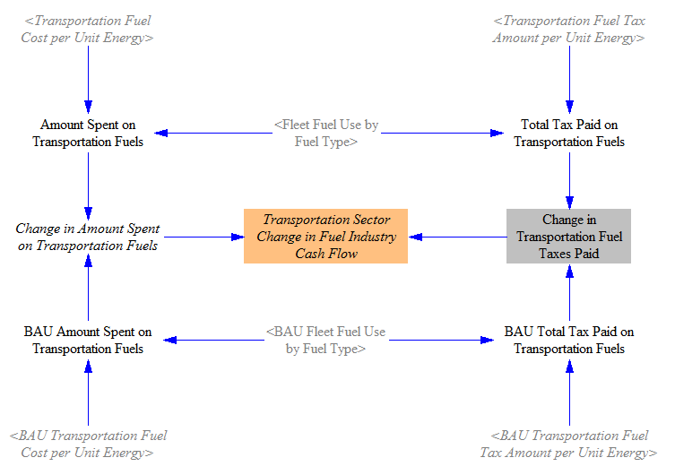
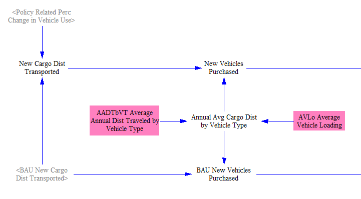
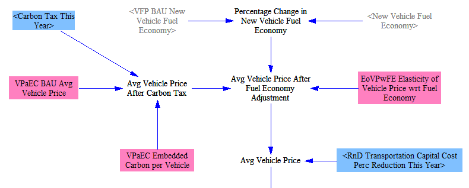
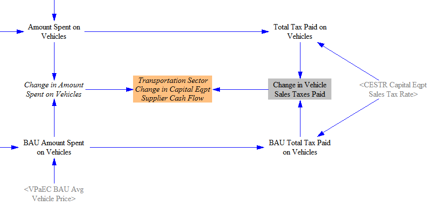
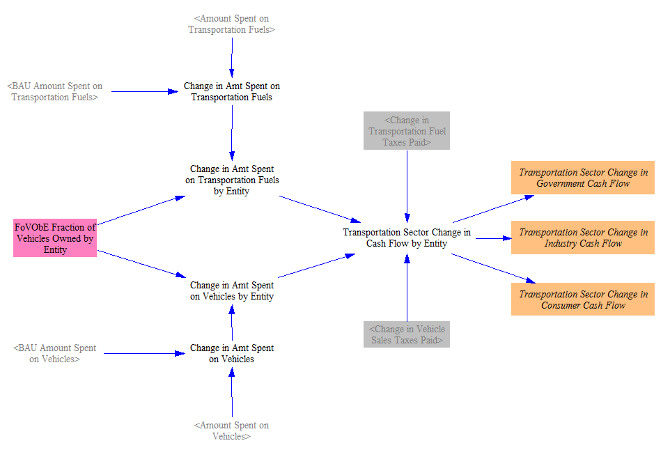

The "Transportation - Cash Flow" sheet calculates the changes in amount spent and received for transportation fuels and for vehicles.  Changes in price per unit fuel/vehicle and in quantity demanded are both taken into account.

## Change in Fuel Spending

The following screenshot shows the model structure used to calculate change in amount spent on fuel, including amount spent on fuel taxes:

The fleet fuel use by fuel type is multiplied by the fuel cost per unit energy (calculated on the [Fuels page](fuels.html)) to obtain the amount of money spent on transportation fuels.  This value is inclusive of tax.  We also multiply the quantity of fuel used by the amount of tax paid per unit energy to find the taxes paid on transportation fuels.  These steps are done both for the BAU and the policy cases.

We find the difference in the amount spent on fuel taxes, and we find the difference in the amount spent on fuels.  We subtract out the difference in taxes to find the cash flow change for the fuel industry (which is subscripted by fuel type).  That is, a reduction in fuel spending is a negative cash flow for the fuel industry, while an increase in fuel spending is a positive cash flow for the fuel industry.

## Change in Spending on Vehicles

Policy-related change in spending on vehicles requires a significant amount of additional input data to calculate.  These input data are only available for two vehicle types: passenger LDVs and freight HDVs.  Therefore, the model only calcualtes cash flow changes resulting from differences in spending on vehicles for these two vehicle types.  Fortunately, these are the two most important vehicle types, accounting for the vast majority of Transportation sector emissions and likely the vast majority of spending on vehicles each year.

### Estimating Number of Vehicles Purchased

Since the Transportation sector generally works in units of cargo*distance (passenger*miles or freight ton*miles), but vehicle-related cash flows are determined on the basis of number of vehicles, we must use the available data to estimate the number of vehicles that are purchased each year.  The following screenshot shows the model structure used for this purpose:

"BAU New Cargo Dist Transported" is taken from the "Transportation - Main" sheet.  We apply the policy-related changes in vehicle usage calculated on that sheet (based on fuel cost per unit cargo*distance transported and on the transportation demand management (TDM) policy lever) to find the "New Cargo Dist Transported" in the policy case.  To convert a quantity of cargo*distance to a number of vehicles, we need to know the average amount of cargo*distance that a new vehicle transports in its first year of service.  This is calculated based on the average annual distance traveled by vehicles of each type, as well as the average vehicle loading (typical, distance-weighted number of persons or freight tons carried).  This refers to the actual number of persons or freight*tons that were carried, not the vehicle's capacity.

### Calculating Average Vehicle Price

To convert the number of new vehicles to an amount spent on vehicles, we need to know the average vehicle price in the BAU and policy cases.  Average vehicle price in the BAU case is taken in as input data.  The screenshot below shows the structure used to estimate average vehicle price in the policy case, based on the BAU price and other data:

First, we adjust vehicle price upward if the carbon tax policy is enabled, based on the "embedded carbon" content of the vehicle.  This refers to the amount of carbon (or other GHGs) released "upstream," during the course of manufacture of the vehicle and its component parts.  Those producers had to pay those taxes and likely will pass some or all of the additional cost on to purchasers of those vehicles.  (In introductory economics, an individual producer is likely to pass on a fraction of a new tax that is based on the slope of the demand and supply curves for that good.  However, in the context of an economy-wide carbon tax- namely, one affecting all producers and all goods- it is likely that this would under-estimate the share of the tax that would be passed on to purchasers, since they would be seeing similar price increases for all goods in the economy, and so would have fewer substitutes or ways to avoid a passed-on tax.)  We model this simply as an increase in the cost of the vehicles- as if all of the additional tax were passed on.

We also adjust the price of new vehicles based on improvements made to their fuel economy.  A more efficient vehicle provides savings and uses more advanced technology than a similar but less-efficient vehicle, as indicated by the "Elasticity of Vehicle Price wrt Fuel Economy."  (This is a case where an analysis of raw sales data does not correctly reveal this trend, due to market segmentation.  Car manufacturers sell more expensive cars to wealthy consumers who are not price-sensitive, so they do not bother to make those cars more fuel efficient.  The best fuel efficiency is found in cars that are neither the most expensive nor the cheapest in their size class.  However, boosting the efficiency of all cars, rather than when manufacturers voluntarily make certain efficient models to target consumers interested in fuel economy, is more likely to add a cost to all vehicles of a given size class.  To estimate the elasticity, we rely on regulatory impact analyses of new fuel economy standards, which correctly provide positive costs for more efficient vehicles, rather than raw sales data, which are confounded by the presence of very expensive yet inefficient cars.)

Lastly, we apply the relevant R&D policy to reduce vehicle costs by a user-specified percentage.

### Taxes and Cash Flows for Vehicles

Finally, we consider the tax rate on capital equipment (which includes vehicles) and calculate the relevant cash flows, as shown in the following screenshot:

For each of the BAU and Policy cases, we multiple the average vehicle price by the number of vehicles sold to find the total amount spent on vehicles.  Based on the sales tax rate, we find the amount of taxes paid on vehicles.  We take the difference between the two cases to find the change in tax payments attributable to the policy package.  We similarly take the difference in overall spending on vehicles.  Then we subtract out the difference in sales taxes paid, to find the change in non-tax amount spent on vehicles.  This becomes the change in cash flow for vehicle suppliers.  That is, a reduction in the amount spent on vehicles is a negative cash flow for vehicle suppliers.

## Assigning Cash Flows by Actor

Lastly, having determined the change in the amount spent on fuels and on vehicles (and the portion of those changes that went into taxes), we assign the resulting cash flows to each actor, or cash flow entity, that buys vehicles (namely: government, industry, and consumers).  In other words, the calculations above determined who received the money (fuel suppliers, vehicle suppliers, and the government), and this section determines who spends the money.  The following screenshot shows the relevant piece of model structure:

Our guiding assumption here is that the fraction of the change in cash flow attributable to each actor is the same as the fraction of all vehicles owned by that actor, calculated separately for each vehicle type.  We find the total change in amount spent on fuels and on vehicles, and we divide up this change in spending by actor accordingly.  Finally, we add in the tax receipts to the "government" total, and we break out the final numbers into three variables for visual clarity and ease of reporting.
