## General Notes

The main sheet of the Transportation sector works in terms of several quantities, the most important of which are cargo-distance transported, number of vehicles, and amounts of fuel consumed.  There are two types of "cargo" in the Energy Policy Simulator (EPS): passengers and freight.  Thus, "cargo-distance" refers to passenger-miles and freight ton-miles transported.

### Vehicle Types

The model divides vehicles into 11 non-overlapping categories based on the type of cargo they typically carry (passengers or freight) and the basic type of vehicle involved (light-duty road vehicles, heavy-duty road vehicles, aircraft, rail, ships, and motorbikes).  Here is the specific meaning of each of the 11 categories:

* Passenger LDVs = most light-duty road vehicles (such as cars and SUVs)
* Freight LDVs = light commercial trucks
* Passenger HDVs = buses (including school, transit, and intercity buses)
* Freight HDVs = all other heavy road vehicles (mostly freight trucks)
* Passenger aircraft = commercial passenger flights (not general aviation)
* Freight aircraft = all other commercial flights (not general aviation)
* Passenger rail = intercity, transit, and commuter rail
* Freight rail = all other rail
* Passenger ships = recreational boats (not commercial passenger ferries)
* Freight ships = cargo ships
* Passenger motorbikes = registered motorcycles

This includes the vast majority of vehicle energy use and emissions.  Excluded vehicle types include general aviation aircraft, military vehicles, passenger ferry boats, non-truck construction vehicles, non-truck agricultural vehicles, and small electric craft such as scooters and golf carts.  (Note that in most non-U.S. adaptations of the Energy Policy Simulator, the "Passenger ships" category is used to represent passenger ferries, and recreational boats are excluded.)

### Vehicle Technologies

For on-road vehicles, the model also tracks vehicle technology, grouping vehicles into several technology categories.  The vehicle technology categories used in the EPS are:

* battery electric vehicle = electric, on-road vehicles that do not possess an internal combustion engine
* natural gas vehicle = on-road vehicles designed to burn natural gas, such as CNG or LNG
* gasoline vehicle = on-road vehicles designed to burn petroleum gasoline, biofuel gasoline, or a blend of the two (and cannot accept electricity from the electric grid)
* diesel vehicle = on-road vehicles designed to burn petroleum diesel, biodiesel, or a blend of the two (and cannot accept electricity from the electric grid)
* plug-in hybrid vehicle = on-road vehicles that possess both an internal combustion engine (for gasoline or diesel) and an electric motor, and which can be charged from the electric grid
* nonroad vehicle = a technology category assigned to all non-road vehicles (aircraft, rail, ships), as we do not track specific technology types for these vehicle types

## Calculating Cargo Distance Transported

The EPS begins by determining the demand for transportation services, which is measured in units of cargo-distance, separated by vehicle type.  BAU case transportation service demand is taken in as input data.  This demand is then modified by the transportation demand management (TDM) policy, as shown in the following screenshot:

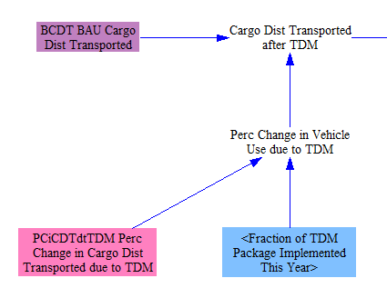

TDM refers to a spectrum of different policies that generally attempt to reduce passenger usage of light-duty vehicles.  These include improving public transit systems, zoning for higher density along transit corridors, zoning for mixed use neighborhoods and developments, building walking and biking paths, and congestion pricing and parking fees on light-duty vehicles.  All of these effects are geography-specific.  Rather than model each of these interventions separately, we rely on the results of a TDM-related modeling study done by the International Energy Agency, scaling in the mode shifts they obtained as the output of their model based on the user's setting for the TDM policy lever in our model.  The effect is to decrease passenger usage of LDVs, aircraft, and motorbikes, while increasing passenger usage of HDVs (buses) and rail.

A freight version of TDM, which represents mode shifting and logistics, can also be applied using this policy lever.  It decreases the freight ton-miles transported by HDVs (trucks) and increases the freight ton-miles transported by rail.

Next, we calculate how policy-driven changes in the cost of transportation services affects demand for those services.  In order to determine how the fuel cost of operating each type of vehicle affects vehicle use, we need to know not only how policies have affected the cost of fuel per unit energy but also how policies have affected the fleet average fuel economy, so we can calculate the fuel use per unit cargo-distance transported (Fuel Cost per Unit Cargo Dist).  At this stage, we calculate this separately for each vehicle type and vehicle technology (using a weighted average to eliminate the "fuel" subscript, as transportation service demand is not specific to fuel types at this stage).  The following screenshot shows the policy case version of these calculations; the BAU case calculations are identical.

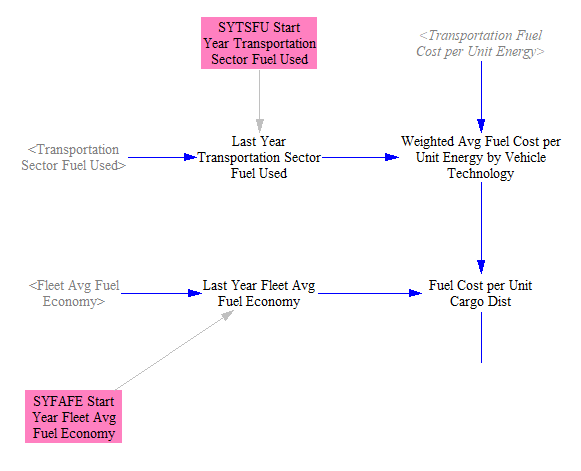

Next, we use a weighted average to remove the vehicle technology subscript, as the manner in which demand is satisfied by different vehicle techologies will be determined later, based on the composition of the existing fleet and the newly purchased vehicles in the current model year.  We compare this figure with its corresponding BAU variable to determine the percentage change in fuel cost per unit cargo-distance that is attributable to the policies.  Thus, policies that increase fuel cost will tend to make transporting cargo-distance more expensive, and policies that improve fuel economy will tend to make it less expensive.  Literature on fuel economy improvements often discusses a "rebound effect," referring to the tendency to increase driving in response to the fuel savings that come from increased fuel efficiency.  However, if increased fuel price is a driver of the increase in fuel economy, the "rebound" could be positive or negative, depending on whether the increased cost outweighs the increased efficiency, or vice versa.

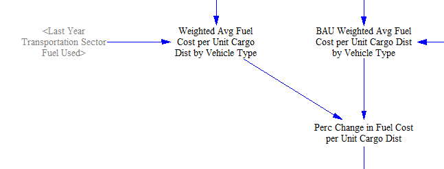

The "Elasticity of Demand for Vehicle Use wrt Fuel Cost" is multiplied by the percentage change in fuel cost per unit cargo-distance to determine whether usage is increased or decreased, and by how much, for each vehicle type.  We apply these changes to the the cargo distance after TDM effects to find the cargo distance transported in the policy case:

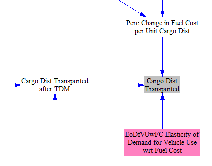

## Calculating New Cargo Distance Transported

Next, we must determine the share of the cargo distance transported that is attributable to new vehicles, meaning those purchased in the current model year.  (This includes vehicles purchased to replace older vehicles as well as vehicles purchased that do not replace older vehicles and thus increase the total fleet size.)  The cargo distance attributable to new vehicles sold in each year is seldom available as input data, and even in the cases where it is available, it does not always align precisely with the input data used to convert cargo distance to vehicles (average distance traveled and average passenger or freight loading).  Accordingly, we use an input variable to assign a specific share of cargo distance each year to new vehicles.  This value can be obtained roughly through input data sources or assumptions, but it needs to be calibrated, to prevent misalignment with other input data variables (as noted above) that can cause improper model behavior.  Calibration typically shifts the shares only very slightly and is well within the error bounds of numerous underlying input data variables, and it likely improves model accuracy.  For this variable, calibration is done by preventing sudden discontinuities in the numbers of retiring vehicles (of all technologies) at the model years that correspond to vehicle lifetimes:

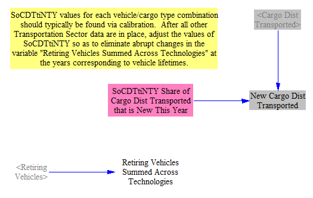

## Calculating New Vehicle Fuel Economy</a>

### Fuel Price Effects

The fuel economy of new (that is, newly sold) vehicles is modified based on four factors: fuel price, the R&D policy, the LDVs feebate policy, and the fuel economy standards policy.  The following screenshot shows the calculation of the percentage change in fuel economy due to policy-driven changes in fuel prices:

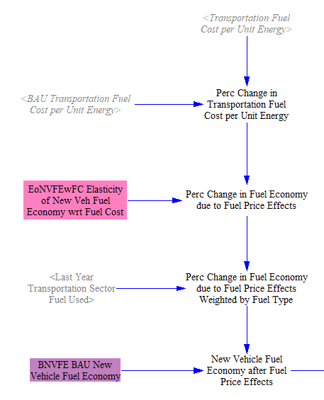

The cost of transportation fuels per unit energy is calculated on the "Fuels" sheet and referenced in the "Transportation - Main" sheet.  On the "Fuels" sheet, policies such as the carbon tax and fuel taxes can cause the fuel costs in the policy case to be higher than in the BAU case.  On the "Transportation - BAU" sheet, we perform a similar calculation to obtain a corresponding BAU value.  This allows us to compare the two values, obtaining a percentage change in fuel cost per unit energy due to our policy package.  This change is combined with an elasticity of new vehicle fuel economy with respect to fuel cost, which reflects the behavior of both manufacturers (who may choose to make more efficient vehicles in response to fuel price increases) and the behavior of consumers (who will select more efficient vehicles from the available options offered by manufacturers at a given time).

Vehicle fuel economies are differentiated by vehicle type and vehicle technology, but not by the fuel used in a given vehicle type/technology combination.  Accordingly, we obtain percent changes in fuel economy for each vehicle type/technology combination by weighting by fuel types used in each of these vehicles.

We then multiply these percent changes by the BAU new vehicle fuel economy (which is derived from input data).

### Feebate<a name="feebate">

The feebate policy, which only applies to LDVs, has a specific effect on new LDV fuel economy based on the results of a study.  We multiply the user's selected feebate setting by the effect of a feebate observed in that study to obtain the percent change in fuel economy due to the feebate, then apply that percent change to the new vehicle fuel economy:

### Fuel Economy Standards

The improvement caused by the fuel economy standards policy is implemented directly as an improvement to fuel economy for vehicles of the corresponding type, rather than through an intermediary variable that determines the effect of standards on new vehicle fuel economy.  This is because in the U.S., fuel economy standards (CAFE standards) refer to a production-weighted average, rather than to a minimum that must be met by all vehicles.  We assume that most vehicle manufacturers will not significantly exceed the standards, because they will balance the production of high-efficiency vehicles and low-efficiency vehicles, so as to remain just narrowly compliant with the standards (barring the effects of other policies like the LDVs feebate, R&D, and those that affect fuel prices).  We further assume that produced vehicles will ultimately be sold, so the production-weighted average is largely equivalent to a sales-weighted average.  Also, we are only calculating a percentage change in the standards, rather than using the standards directly to set new vehicle fuel economy.  This means that even if some manufacturers routinely exceed the standards by a certain percentage, so long as that percentage remains roughly the same as standards tighten, then the fact that some manufacturers may exceed the standards does not impact the results.

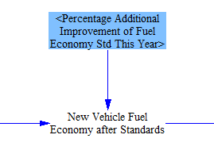

### R&D

All R&D policies are defined as being additional to any R&D required to comply with other policies, such as tighter fuel economy standards.  The user explicitly defines a desired improvement in fuel economy for new vehicles of each type when setting the R&D lever.

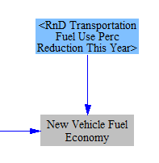

## Calculating NPV of Lifetime Vehicle Cost

In order to decide which vehicle technologies will be selected by purchasers to fill the need for new cargo-distance from a given vehicle type in the current year, the model needs to know the price of each vehicle technology as seen by purchasers.  There are two components to this price: the upfront cost of the vehicle and the lifetime cost of fuel for the vehicle (appropriately discounted).  This section of the model calculates these costs.

### NPV of Lifetime Fuel Expenditures

First, we take the average transporation fuel cost weighted by fuel type and multiply it by the technology-specific new vehicle fuel economy values we calcualted earlier, giving us the fuel cost per unit cargo distance transported by each vehicle type and technology.

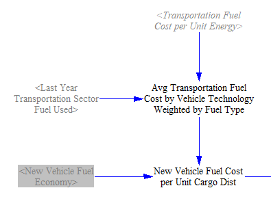

Next, we convert this to fuel cost per unit vehicle-distance (for example, vehicle miles traveled instead of passenger miles traveled) using the average loading level of each vehicle type.  We then multiply this by the average distance traveled by each vehicle type in a year to estimate the annual fuel expenditures to be expected for this newly sold vehicle in each year over the lifetime of the vehicle.  (This is based on current model year fuel prices, not projections of future fuel prices.  So in model year 2030, the fuel prices will be based on 2030 values, not on a series of values beginning in 2030 and ending in the last year of the vehicle's lifetime.  This better reflects the decision-making process of purchasers with limited information about futue prices.)

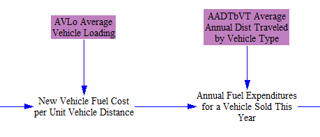

Finally, we convert this stream of expected fuel expenditures over the vehicle's lifetime into a net present value (NPV) value, using the vehicle lifetime and a discount rate adopted by vehicle buyers.  A high discount rate is generally appropriate here, as vehicle buyers tend to undervalue future fuel savings (or costs) in their calculus of what vehicle to buy today.  This is one of two factors that contributes to the NPV of Liftime Vehicle Cost:

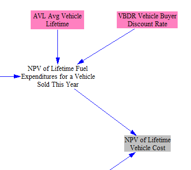

### New Vehicle Price

Prices for most vehicle technologies in future years are taken in as input data, in the "BAU New Vehicle Price" variable.  However, the model uses endogenous learning curves for battery electric vehicles.  This means their cost declines are linked to their cumulative deployment.  The first portion of the calculations in this section determine the cumulative deployment and the ratio of EV cost in the current model year to EV cost in the first model year.  This is based on the number of doublings of cumulative deployment and an estimated percent decline in EV price per doubling:

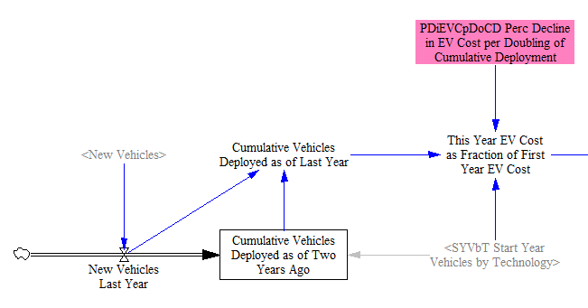

BAU new vehicle prices are used for all other vehicle types.  All vehicle prices are then modified based on differences in new vehicle fuel economy in the policy case relative to the BAU case, to account for the increase in price due to more efficient car components.  This is calculated separately for each vehicle type and technology, so we are comparing (for example) more vs. less efficient battery electric LDVs, not comparing battery electric and gasoline LDVs.

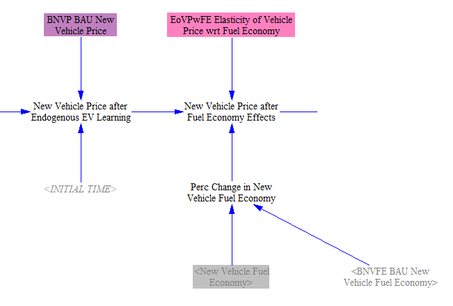

Next, we adjust the price of each vehicle technology for policy case R&D, if the model user has set one of these R&D levers to a non-zero value.  After that, we account for the effect of the carbon tax on the cost of the vehicle itself (due to the embedded carbon in the vehicle- that is, the carbon that was emitted due to its construction).

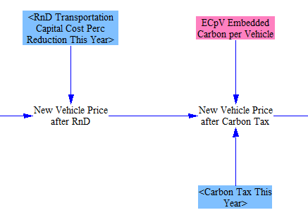

Finally, we adjust the vehicle price based on subsidies, including any BAU subsidies and any additional subsidies that may have been specified by the user for this model run.  This results in the final policy case new vehicle price, which is the other component (along with the NPV of lifetime fuel expenditures) that goes into the calculation of the NPV of Lifetime Vehicle Cost.

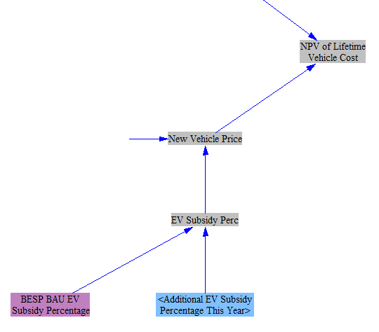

## Calculating Number of New Vehicles

Now that we know the NPV of Lifetime Vehicle Cost for each vehicle technology, we have the information we need to determine both the number of new vehicles and what technologies shall be selected.  We begin by converting new cargo-distance transported to new vehicles demanded, using vehicle loading and annual average distance traveled by vehicle type (which were also used earlier, to find annual fuel use per vehicle).

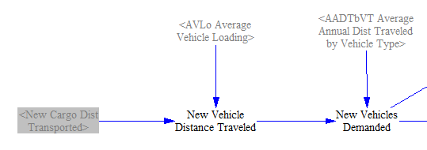

To determine what technologies of vehicle purchasers will by (e.g. how many of the new passenger LDVs will be battery electric, how many will use a gasoline engine, etc.), we must allocate the demand by technology.  In order to perform an allocation in Vensim, using Vensim’s ALLOCATE AVAILABLE function, we need to set up what is called a “Priority Profile.”  This tells the model how to decide what to build.  We determine priority based on cost: the lowest-cost type of vehicle technology is purchased first, then the next-lowest cost, and so on.  However, each vehicle technology does not have a single cost.  A vehicle technology is represented by a normal distribution (a bell curve) of costs.  This reflects the fact that in the real world, not all vehicles of the same type and technology (such as "battery electric passenger LDVs") have the exact same price.  Some cars will be more expensive than others, often because of features, brand, marketing, or performance characteristics.  By representing each vehicld technology's costs as a bell curve, we obtain much more realistic outputs than if we assumed the model sold only one type of vehicle technology to the maximum extent possible before selling any of the next-most-expensive vehicle technology.

To define the bell curves for Vensim, we need to specify the curve’s midpoint on the cost axis (the average cost of a vehicle technology), the standard deviation (the variability of costs for a given vehicle technology), and the volume under the curve (which reflects the maximum amount that could be feasibly sold in a year, given limits on manufacturing capacity, non-cost barriers to demand (such as availability of electric vehicle charging stations), etc.).  The standard deviation and the costs are factored into the “Priority Profile” and the volume under the curve is factored into the allocation separately. The allocation is actually performed in the “New Vehicles Allocated by Technology" variable. The following diagram is an illustration to help explain the allocation process in the model:

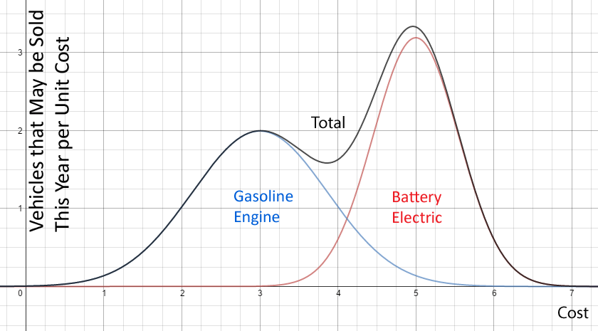

In this example, we only show two bell curves, though in the actual model, there is one bell curve for each of the vehicle technologies.  Each curve has its own unique midpoint on the cost axis (X-axis), its own standard deviation (curve width), and its own volume under the curve.  The Y-axis is the quantity of vehicles of a given technology that can be sold in this year at a given cost.  The volume inside these curves corresponds to a quantity of vehicles sold: cost (X) multiplied by quantity per unit cost (Y). We know the total amount of vehicles we need to sell, which is the volume under a portion of the black “Total” curve. Accordingly, the model goes from left to right on the cost axis, filling in the volume under each individual vehicle technology's bell curve, until a total amount of volume has been filled in equal to the quantity of new vehicles needed this year.  If this point is reached anywhere between the “3” and “6” numbers on the cost axis in the example diagram above, then a non-trivial number of gasoline engine vehicles and a non-trivial number of battery electric vehicles will be sold, and neither gasoline engine vehicles nor battery electric vehicles will be sold at the maximum possible rate this year.

The volume under each curve is determined by a share of the total demand for the year, so the maximum volume under a bell curve would encompass 100% of all vehicles to be sold in that year.  The shares in each year are taken in as time-series input data.

The following screenshot shows the allocation structure, including the priority profile and the maximum number of new vehicles by technology (i.e. the volumes under the bell curves):

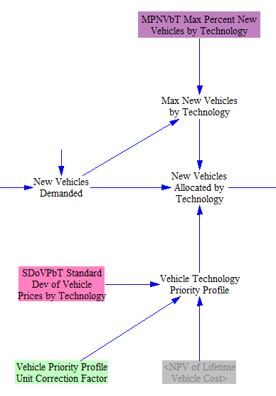

Two policies to promote electric vehicles operate via non-price mechanisms and adjust the results of the allocation.  The first is the "EV perks" policy, which represents benefits such as allowing EVs access to high-occupancy vehicle travel lanes on highways, robust public charging station deployment, and more.  This is a boolean policy whose effects are set based on study results.

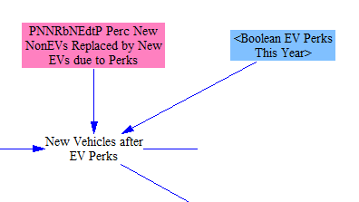

Finally, we check to see if the share of EVs meets the minimum required EV sales percentage, which can be increased through the EV mandate policy.  This policy represents government ordering vehicle manufacturers to sell at least a specified share of EVs.  (Vehicle manufacturers can comply with a mandate by more heavily marketing EVs, offering more attractive EVs, and/or discounting EVs until sales reach the required percentage.)  If the mandate would require additional EVs to be sold, the model adjusts the allocation at this step by shifting from all non-EV types to EV types proportionally.

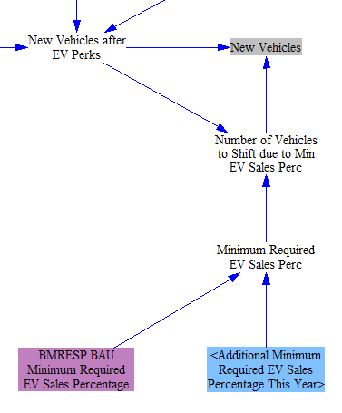

## Tracking the Vehicle Fleet

Now that we know the numbers, types, and technologies of new vehicles sold this year, we are able to update the composition of the vehicle fleet (the total set of vehicles in the modeled region).  The following screenshot shows the relevant structure:

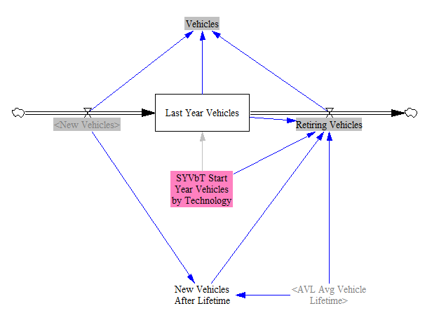

The composition of the vehicle fleet changes gradually over time, as more and more vehicles of various types and technologies are integrated into the fleet.  Therefore, we use a level variable (one whose value is remembered from timestep to timestep and is affected by inflows and outflows) to track these vehicles.  When vehicles retire (as their lifetimes are reached), they must be removed from the cumulative total.  Although we have data on the starting number of vehicles in the fleet, we do not have their preexisting age distribution.  Therefore, we assume that until the lifetime of a vehicle type is reached, the retiring fraction of the vehicles that existed before the first modeled year is one over the vehicle lifetime.  Once a full vehicle lifetime has elapsed, the retiring vehicles are simply the New Vehicles that we introduced earlier, delayed by a number of years equal to the vehicle lifetime.  This assumes that a vehicle's efficiency does not change significantly over the expected lifetime of the vehicle.  This is generally true for typical vehicle lifetimes- a vehicle kept far beyond its normal lifetime might experience more degradation, but such vehicles are uncommon and are counter-balanced by vehicles that are removed from service before their normal lifetimes are reached (due to accidents, etc.).

Vensim doesn't update level variables with the current year's inflows and outflows; the current year's flows affect the level variable in the next year.  We want to adhere to the user-defined policy implementation schedule without introducing a one-year delay.  (If the user wanted a one-year delay, he/she would have put it into the policy implementation schedule.)  Accordingly, we manually add the current year's inflows and outflows to the cumulative total to obtain the "Cumulative Potential Fuel Use Difference Relative to BAU."  We do something similar with all other level variables in the EPS.

## Tracking Fleet Average Fuel Economy

Just as we track vehicles using a level variable, we also do so for the fleet average fuel economy, which changes in response to the contributions of new vehicles and the removal of the contributions of retiring vehicles.  The relevant structure is in the following screenshot:

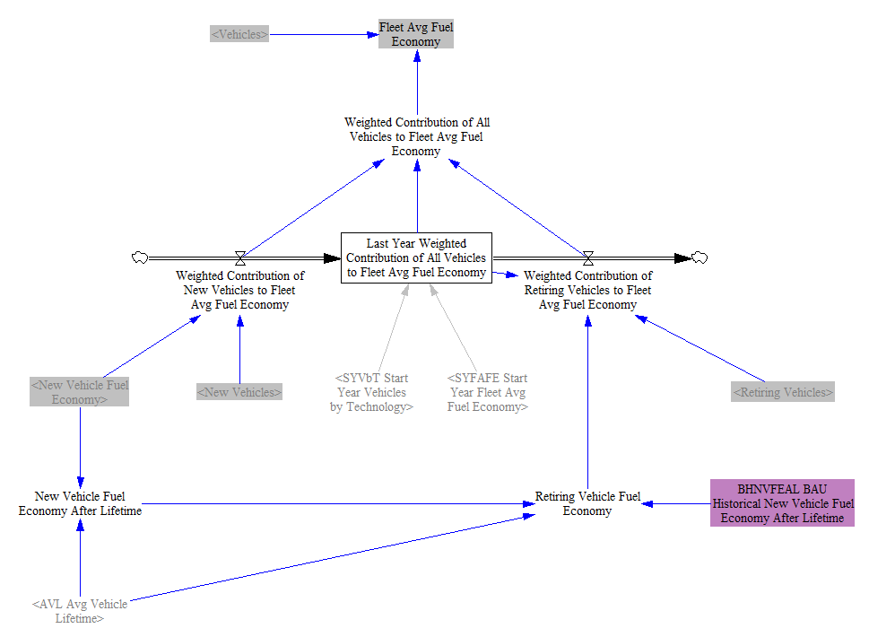

The quantity we actually track is not the "fleet average," but the "weighted contribution of vehicles to the fleet average," which simply means the fuel economy of a set of vehicles multiplied by the number of vehicles in that set.  This allows us to add and subtract values from the tracked quantity without needing to perform a conversion each time.  Only once we have determined the figure for the current year, after adding contributions from new vehicles and subtracting contributions from retiring vehicles, do we divide by the number of vehicles to convert the figure to fleet average fuel economy.

Before one vehicle lifetime has elapsed, retiring vehicle fuel economy is taken in from a time-series input data variable.  After one vehicle lifetime, the retiring vehicle fuel economy is simply the new vehicle fuel economy delayed by one vehicle lifetime.

## Calculating Fuel Shifts Caused by the Low Carbon Fuel Standard (LCFS)

The next, large piece of the model calculates how the fuel used by each vehicle type and technology is affected by the low carbon fuel standard (LCFS), both a BAU LCFS (if any) and a policy case LCFS setting.  There are multiple ways a LCFS policy could be defined, depending on how the policy is written.  For purposes of the Energy Policy Simulator, it defines the percentage of energy used by vehicles that is free of carbon emissions (carbon-free energy, CFE), after an adjustment for the increased efficiency of electricity relative to fuels that are combusted.  Biofuels' carbon emissions are lifecycle-based, and electricity has zero carbon emissions for purposes of the LCFS calculations (though the generation of electricity, which is handled in the Electricity Sector of the model, may result in carbon emissions there).  Fuels are compared to the "reference fuel" for their vehicle type.  For LDVs and motorbikes, the reference fuel is "petroleum gasoline," while for HDVs, it is "petroleum diesel."  For example, if a particular biofuel gasoline has 50% of the carbon intensity of petroleum gasoline, than half of the energy in that fuel would be considered CFE and half would not.

The first step is to determine the amount and types of fuel that would be used in the transportation sector in the absence of an LCFS policy.  We take in the percentages of fuel used by different vehicle technologies, which is only relevant for certain technologies.  Gasoline engine and diesel engine vehicles can burn either petroleum fuels or biofuels, while plug-in hybrids can consume electricity, a petroleum fuel, or a biofuel.  Other vehicle technologies only consume a single fuel type.  We multiply these percentages by the total cargo-distance transported by each vehicle type and technology, as well as by the fleet average fuel economy, to obtain total quantities of fuel.

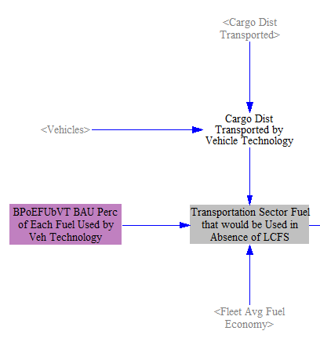

Next, we filter out vehicle types that are not regulated under the LCFS policy.  This can be customized through an input data variable.  For the U.S., we filter out the non-road vehicle types (aircraft, rail, ships), so that they neither are bound by nor contribute to satisfying the LCFS.  For visual clarity, the model separates regions of the structure that are subject to filtering by vehicle type behind blue bars.

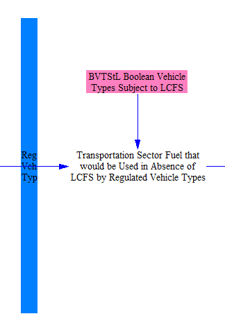

Next, we make an adjustment for the efficiency of electricity.  Electricity is converted into the mechanical motion of a car much more efficiently than combustible fuels are converted into motion.  If we don't account for this, the quantity of electricity used will be very small, making it hard to satisfy an LCFS requirement based on raw CFE.  Therefore, we work in units of electricity that have been adjusted to have the same efficiency as the combustible reference fuels (gasoline or diesel).  This allows us to calculate LCFS compliance more simply, and we undo the adjustment at the end of the calculations, so we ultimately demand the correct amount of electricity.  For visual clarity, the model separates regions of the structure that are subject to the electricity efficiency adjustment behind orange bars.

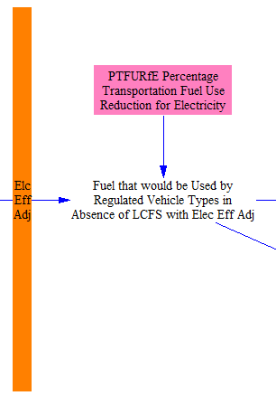

Next, the model converts fuel types to CFE.  Reference fuels (petroleum gasoline and petroleum diesel) have zero CFE.  Every other fuel has an amount of CFE equal to its carbon intensity ratio (relative to its reference fuel) multiplied by the amount of that fuel being used.  For visual clarity, the model separates regions of the structure that are working in CFE units behind green bars.

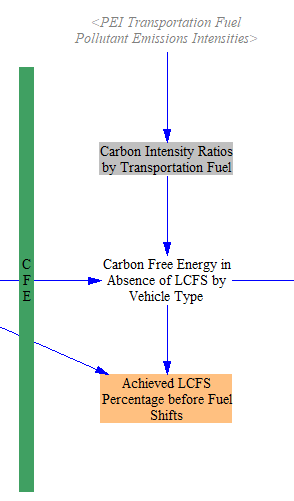

Next, we calculate the required increase in CFE by comparing the amount of CFE prior to application of the LCFS (as a fraction of the energy in fuel used by regulated vehicle types after electricity adjustment) with the required LCFS percentage.  The required percentage is the sum of any BAU LCFS percentage and any user-specified policy case LCFS percentage.

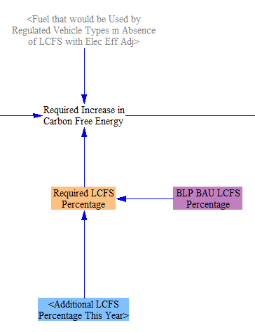

Next, we need to determine the quantity by which CFE may be increased from shifting to each eligible fuel for each vehicle type and vehicle technology.  To do this, we begin by taking in (as input data) the maximum percentage of each fuel that is usable by each vehicle technology.  We convert this to percentage points of fuel increase relative to the BAU percentages, then we apply the same three filters or conversions applied to the fuel that would have been used in the absence of an LCFS.  That is, we filter out non-regulated vehicle types, adjust for electricity efficiency, and convert to CFE.  We then use this quantity to divide, proportionally, the required increase in CFE by vehicle type and by fuel.  (We make a small adjustment to correct for the fact that plug-in hybrids could shift their petroleum fuel consumption to either electricity or biofuels, to avoid exceeding the total quantity of energy that may be shifted.)

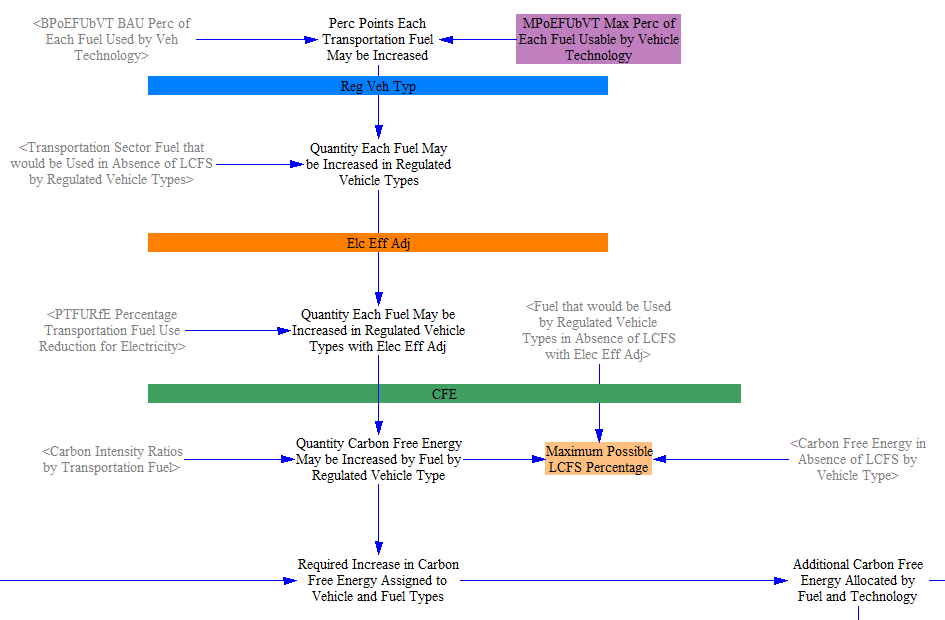

We then assign the CFE increases to vehicle technologies, which can be done explicitly based on the known fuel and vehicle types.

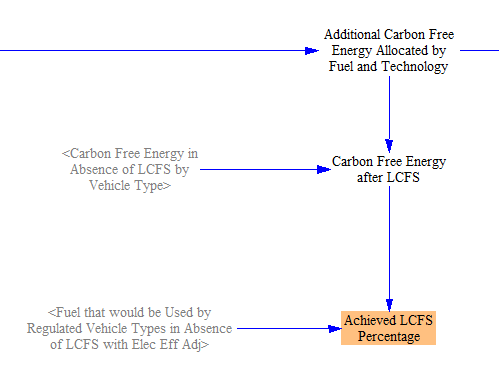

Finally, we sequentially reverse the three filters/adjustments undertaken earlier that allowed us to work in terms of the necessary quantities.  First, we convert back from CFE to energy, and we apply negative shifts to the reference fuels equal in magnitude to the positive shifts in the low-carbon fuels, to preserve the same quantity of energy use (keeping in mind that the electricity efficiency adjustment is still in effect, artificially making its efficiency equal to that of the other energy sources, so we can shift between them accurately).

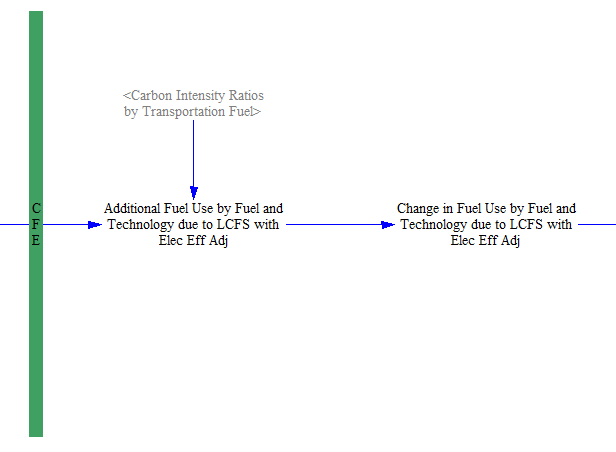

Next, we undo the electricity efficiency adjustment.  This reduces the quantity of electricity used back to its true value (after the LCFS effects).  Finally, we add in the fuels assigned to the non-regulated vehicle types (aircraft, rail, and ships in the U.S. model), which are part of the total fuel used in the transportation sector but were exempted from the entire LCFS calculation process.  This results in the final value of total fuel used.

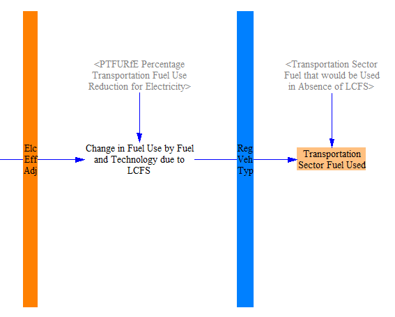

## Calculating Emissions and Electricity Use

We convert the fuel use of known fuel types into emissions, by applying Transportaton Sector emissions indices by fuel.  These are calculated on the Fuels sheet, which is covered on the [Fuels page](fuels.html) of the documentation.  Transportation sector electricity use is broken out separately and converted to MWh (no efficiency adjustment is needed here, because we are already working in units of electricity- this is a strict unit conversion from BTU to MWh).  This is summed with other sources of electricity demand to provide an input to the Electricity Sector.

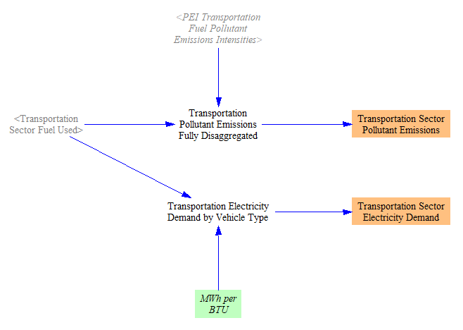

## LCFS Credit Estimates

Some jurisdictions, such as California, use the concept of an "LCFS credit" in their LCFS legislation.  The EPS does not work in this type of unit directly, preferring instead to use CFE and decarbonization percentages, as these units are more fundamental and related to physical quantities than LCFS credits.  However, to improve the utility of the model for regions that do use an LCFS credit methodology, this section performs some calculations that estimate some costs related to LCFS credits.

First, LCFS credits are defined on the basis of a quantity of CFE that provides one LCFS credit.  This is taken in as input data in a time-series variable.  It is a time-series variable because the quantity of CFE needed per credit can go up over time if a credit is calculated from a required LCFS percentage that becomes more stringent each year.  We then apply the carbon intensity ratios of each fuel (and the electricity efficiency adjustment) to determine the quantity of each fuel that would be needed to generate one LCFS credit.

Next, we use the cost of each fuel (fom the Fuels section of the model) to calculate the cost of the quantity of each fuel needed to generate one LCFS credit, as well as the quantity of the energy-equivalent amount of each fuel's reference fuel (that is, petroleum gasoline for biofuel gasoline, petroleum diesel for biofuel diesel, and either petroleum gasoline or petroleum diesel for electricity depending on vehicle type).  This includes the electricity efficiency adjustment.  We then subtract these quantities to get the incremental cost for the low-carbon fuels (the ones that generate LCFS credits) relative to the reference fuel, in quantities that would generate one LCFS credit.

The price of an amount of low-carbon fuel needed to generate one LCFS credit buys two things: the credit itself, plus the fuel (to do useful work).  The value of each low-carbon fuel is estimated via the value of the energy-equivalent amount of its corresponding reference fuel, as they can perform the same work.  Accordingly, the LCFS credit value is based on the increment between the costs of the low-carbon fuel and the energy equivalent amount of its reference fuel.  (Note that this involves a simplification, as the ease of using the underlying fuel in vehicles is not taken into account.  For example, it is easier to use diesel than an energy equivalent amount of natural gas due to the fact that most existing HDVs are designed to use diesel.)

Finally, some LCFS legislation may include a price cap.  We implement a simple, boolean flag that notifies the user of any years in which the estimated LCFS credit price derived from a given fuel type exceeds the cap.  (In practice, whether or not this would mean the cap is "reached" in that year would depend on whether or not there was potential in that year to obtain the required number of LCFS credits from the fuel types capable of generating these credits at a cost below the cap.)

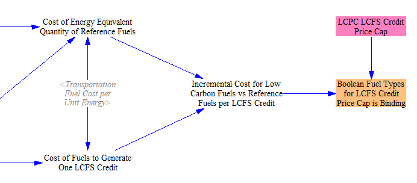