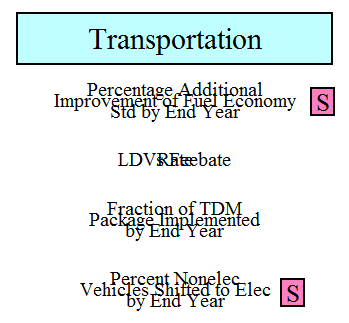
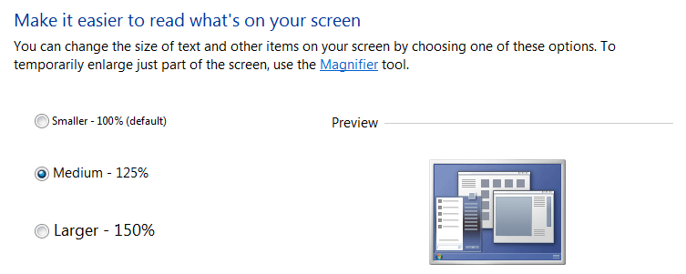
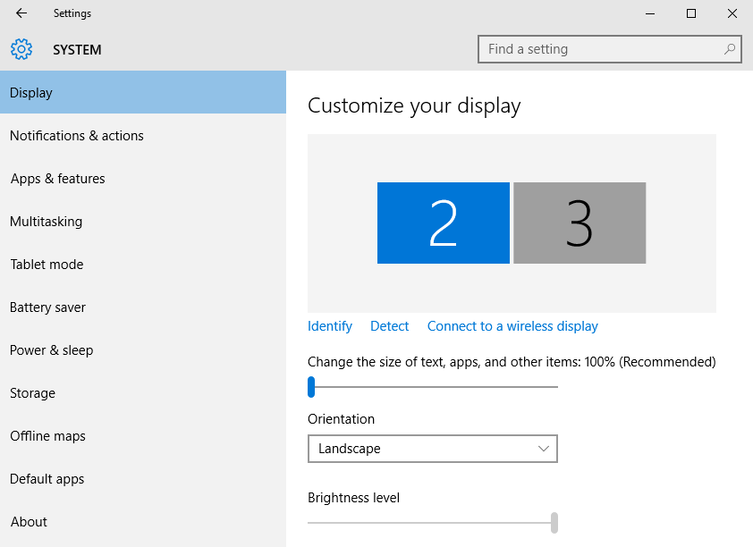

Providing a comprehensive guide to the use of Vensim Model Reader is beyond the scope of these help files.  Nonetheless, we provide detail about some problems that you might encounter here, which we expect will be helpful if you are experiencing one of these issues.  This section may be expanded as more issues are brought to our attention by users.

Note that you may also access [Vensim's help documentation](http://www.vensim.com/documentation/index.html?users_guide.htm) and the [Vensim User Forums](http://www.ventanasystems.co.uk/forum/viewforum.php?f=2) to obtain help.  Neither of these resources is specific to Vensim Model Reader; rather, they cover all different tiers of Vensim.

## Overlapping Text in Vensim

_Symptom:_ On your computer, when you open the model in Vensim Model Reader, text (variable names and comment boxes) often overlaps.  For example, on the "Policy Control Center" sheet, the names of the Transportation policies (in the upper left of the sheet) might look similar to the following screenshot:

This issue is caused by having your display scale in Windows set to a value other than 100%.  (This is separate from "screen resolution."  Adjusting your screen resolution will have no effect.)  To fix this issue, you must change your display scaling to 100%.

On Windows 7, you can adjust the scale in the "Display" control panel.  The correct control panel will look like the following screenshot.  Simply change the setting from "Medium - 125%" (or whatever your current setting is) to "Smaller - 100% (default)."  Click "Apply."  The change will not take effect until you log out (not switch users, but actually log out of the current user account) or restart the computer.

On Windows 10, in Display Settings, the scale control is a slider just below the area where you choose a display under the "Customize your display" header.  The following screenshot shows the "Display" control under Windows 10.  The scale slider is the uppermost slider in the right-hand panel.  (This screenshot shows two displays connected, but it should look similar if you have only a single display connected.)

If you have a version of Vensim capable of editing models (that is, all versions other than Model Reader), and you open the Energy Policy Simulator when your computer is set to a scaling factor different than 100%, the program may ask you whether you wish to rescale the variables in the model.  You may do this in lieu of changing your display scaling setting in Windows.  It will suggest a scaling factor, which is usually close to correct, but you may need to close the model (without saving), open it again, and try a slightly different scaling factor a few times, until you find one that makes the text line up nicely with no overlap on your screen.

## Error when Using SyntheSim Mode with Run Name of 3 Characters or Less

_Symptom:_ When you enter SyntheSim mode and the name inside the "Simulation results file name" box is 3 characters or less, you receive an error stating "ERROR: Unable to open the file C:\[path to your model folder]\[truncated folder name].vdf" and the .vdf file generated cannot be loaded by Vensim.  Also, while already in SyntheSim mode, if you change the "Simulation results file name" to a name that is 3 characters or less, the .vdf file for that run will not be able to be loaded by Vensim.

This issue is caused by a bug in Vensim when the folder enclosing the model has a name that ends with a period followed by any other character.  The bug is present in v6.4A of Vensim (all tiers: Model Reader, DSS, etc.) and has been reported to Ventana Systems.  In the meanwhile, you can work around the bug by either using a run name longer than 3 characters or renaming the folder enclosing the model so that it does not end with a period followed by another character (for example, by replacing the periods with dashes).